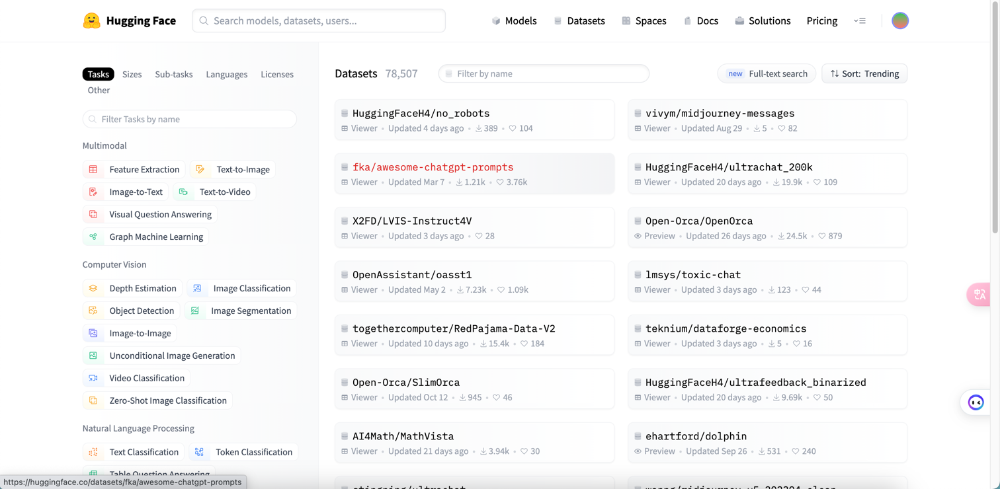
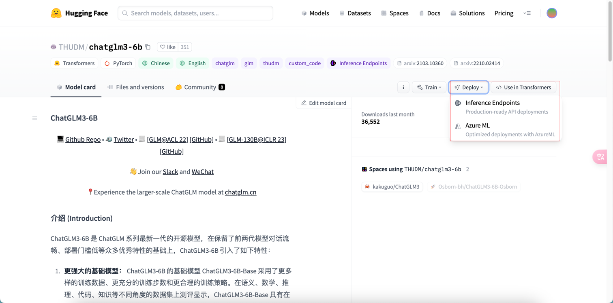
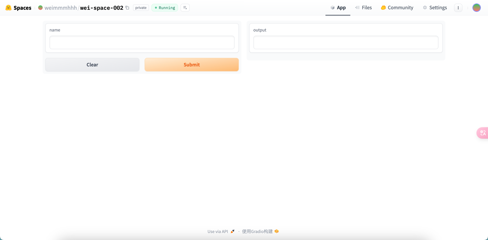
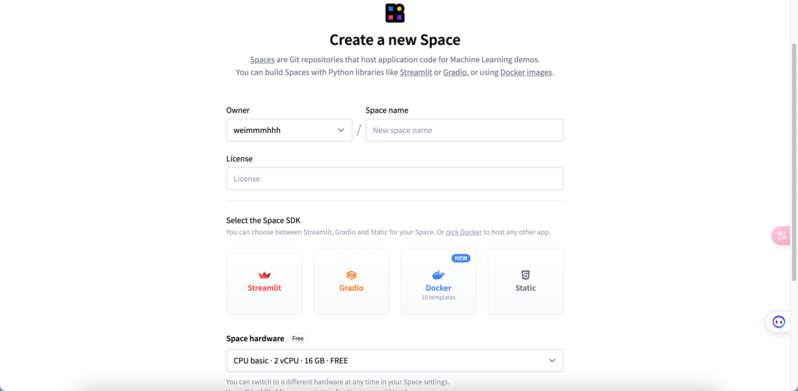
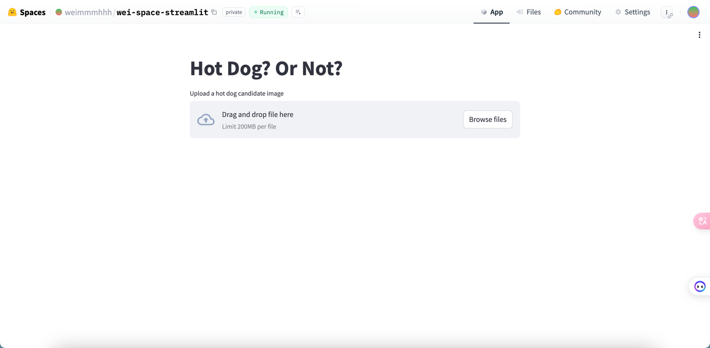
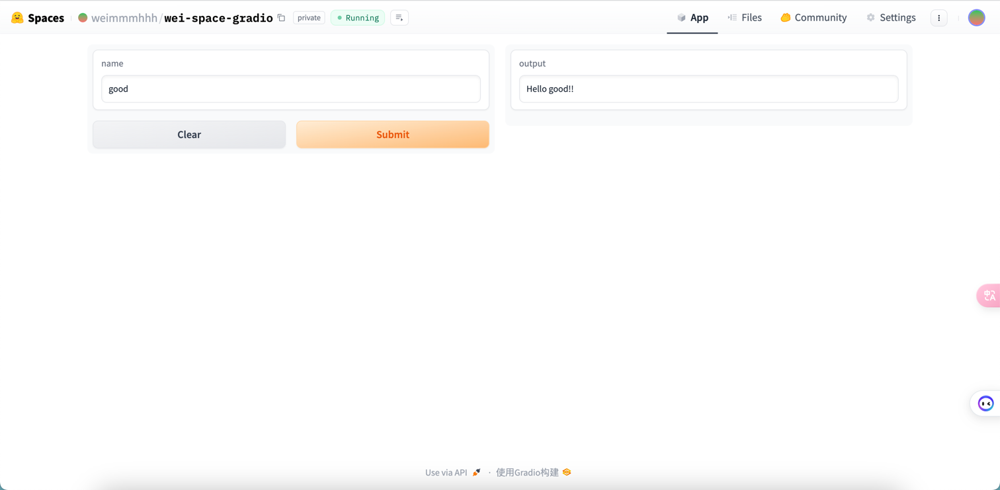
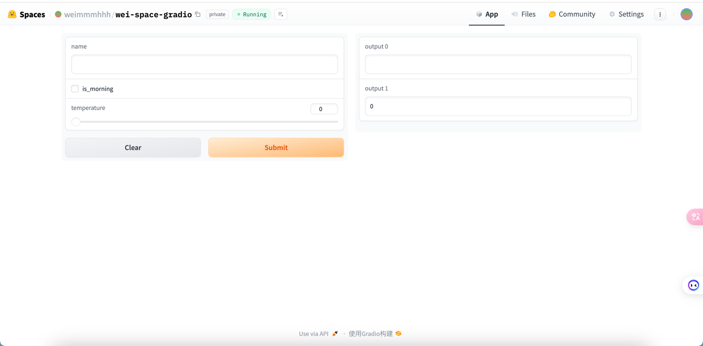

[TOC]

<h1 align="center">AI 产品</h1>

> By：weimenghua  
> Date：2023.08.13  
> Description：

**参考资料**  
[awesome-mlops](https://github.com/kelvins/awesome-mlops)


## 一、前言

### 1.1 AI 产品

- [MidJourney](https://www.midjourney.com/)，需要先注册 [Discord](https://discord.com/)，[MidJourney 官方使用手册](https://midjourney.gitbook.io/docs/)
- [GitHub Copilot](https://docs.github.com/zh/copilot/quickstart)
- [ChatGPT](https://chat.openai.com/)
- [Prompt](https://www.promptingguide.ai/zh)
- [Perplexity](https://www.perplexity.ai/)

### 1.2 模型托管

- [魔搭社区](https://www.modelscope.cn/home)
- [昇思大模型平台](https://xihe.mindspore.cn/)
- [TensorFlow Hub](https://tfhub.dev/)
- [Kaggle](https://www.kaggle.com/)
- [Swanhub](https://swanhub.co/)
- [Replicate](https://replicate.com/)

### 1.3 常见词汇

- 人工智能治理和控制  (AIGC，Artificial Intelligence Governance and Control)
- 人工智能生成内容（AIGC，AI Generated Content）
- 大语言模型 (LLM，Large Language Model)
- 强化学习 (RL)
- 反馈强化学习 (RLHF)
- 微调模型（fine-tuning）
- token 通常指的是一个离散的文本单元，它可以是单词、标点符号、数字或其他语言元素，这些元素被用作训练和生成文本的基本单位


## 二、Huggingface

**参考资料**

- [Huggingface 官网](https://huggingface.co/)
- [Huggingface github](https://github.com/huggingface)
- [HuggingFace 在线教程](https://huggingface.co/learn/nlp-course/chapter1/1)

### 2.1 基本介绍

Hugging Face是一个知名的开源社区和公司，专注于自然语言处理(NLP)和机器学习(ML)领域。

**Huggingface 模块**

- Models（模型），各种处理 CV 和 NLP 等任务的模型
- Datasets（数据集）
- Spaces（空间），社区空间分享
- Docs（文档），包括各种模型算法等说明使用文档
- Solutions（解决方案）
- Pricing（报价）


### 2.2 Models（模型）


**Huggingface 模型分类**

- Computer Vision(计算机视觉任务)：包括lmage Classification(图像分类)，lmage Segmentation(图像分割)、zero-Shot lmage Classification(零样本图像分类)、lmage-to-Image(图像到图像的任务)、Unconditional lmage Generation(无条件图像生成)、Object Detection(目标检测)、Video Classification(视频分类)、Depth Estimation(深度估计，估计拍摄者距离图像各处的距离)
- Natural Language Processing(自然语言处理)：包括Translation(机器翻译)、Fill-Mask(填充掩码，预测句子中被遮掩的词)、Token Classification(词分类)、Sentence Similarity(句子相似度)、Question Answering(问答系统)，Summarization(总结，缩句)、Zero-Shot Classification (零样本分类)、Text Classification(文本分类)、Text2Text(文本到文本的生成)、Text Generation(文本生成)、Conversational(聊天)、Table Question Answer(表问答，1.预测表格中被遮掩单词2.数字推理，判断句子是否被表格数据支持)
- Audio(语音)：Automatic Speech Recognition(语音识别)、Audio Classification(语音分类)、Text-to-Speech(文本到语音的生成)、Audio-to-Audio(语音到语音的生成)、Voice Activity Detection(声音检测、检测识别出需要的声音部分)
- Multimodal(多模态)：Feature Extraction(特征提取)、Text-to-Image(文本到图像)、Visual Question Answering(视觉问答)、Image2Text(图像到文本)、Document Question Answering(文档问答)
- Tabular(表格)：Tabular Classification(表分类)、Tabular Regression(表回归)
- Reinforcement Learning(强化学习)：Reinforcement Learning(强化学习)、Robotics(机器人)

### 2.3 Datasets（数据集）



**Huggingface 使用**

1. 克隆模型仓库

```
克隆模型仓库 https
git lfs install
git clone https://huggingface.co/weimmmhhh/wei-model-001

克隆模型仓库 ssh
git lfs install
git clone git@hf.co:weimmmhhh/wei-model-001

只下载模型实现
GIT_LFS_SKIP_SMUDGE=1 git clone https://huggingface.co/THUDM/chatglm-6b
```

2. 训练、部署



3. 创建应用

Space SDK 选择 [Gradio](https://www.gradio.app/)，详情可查看 [Gradio 帮助文档](https://www.gradio.app/docs/interface)

```
git clone git@hf.co:spaces/weimmmhhh/wei-space-002
cd wei-space-002

vim app.py 添加以下内容：
import gradio as gr

def greet(name):
    return "Hello " + name + "!!"

iface = gr.Interface(fn=greet, inputs="text", outputs="text")
iface.launch()

git add app.py
git commit -m "Add application file"
git push
```

4. 推送后即自动运行容器，进入应用页面可使用应用功能



### 2.4 Spaces（分享空间）

把模型和代码服务运行在 Hugging Face 提供的机器上，然后将生成的交互页面嵌套到 App 选项里，并且可以公开分享。[SpacesExamples](https://huggingface.co/SpacesExamples)


**Space SDK**



#### 2.4.1 Streamlit

[Streamlit](https://streamlit.io/)是个 Python 库，偏向于可视化数据展示，[帮助文档](https://docs.streamlit.io/)， [Streamlit 例子 1](https://huggingface.co/docs/hub/spaces-sdks-streamlit) 、[Streamlit 例子 2](https://docs.streamlit.io/library/get-started/main-concepts)。

例子

```
git lfs install
git clone https://huggingface.co/spaces/weimmmhhh/wei-space-streamlit
```

cd wei-space-streamlit && vim requirements.txt
```
transformers
torch
```

vim app.py
```
import streamlit as st
from transformers import pipeline
from PIL import Image

pipeline = pipeline(task="image-classification", model="julien-c/hotdog-not-hotdog")

st.title("Hot Dog? Or Not?")

file_name = st.file_uploader("Upload a hot dog candidate image")

if file_name is not None:
    col1, col2 = st.columns(2)

    image = Image.open(file_name)
    col1.image(image, use_column_width=True)
    predictions = pipeline(image)

    col2.header("Probabilities")
    for p in predictions:
        col2.subheader(f"{ p['label'] }: { round(p['score'] * 100, 1)}%")
```

推送代码

````
git add app.py
git commit -m "Add application file"
git push
````

运行程序

```
streamlit run app.py
```



#### 2.4.2 Gradio

[Gradio](https://huggingface.co/gradio) 是一个用于构建交互式界面的库，能够轻松地为的深度学习模型创建Web应用程序。[Gradio](https://huggingface.co/docs/hub/spaces-sdks-gradio) 提供了一个简单而强大的API，可以将模型与用户界面组件(如文本框、滑块、图像上传器等)相连接，从而实现模型的实时推理和可视化，参考[ Gradio 例子1](https://www.gradio.app/guides/quickstart)、[Gradio 例子2](https://www.gradio.app/docs/examples)。

克隆代码

```
git clone git@hf.co:spaces/weimmmhhh/wei-space-gradio
```

cd wei-space-gradio && vim app.py
```
import gradio as gr

def greet(name):
    return "Hello " + name + "!!"

iface = gr.Interface(fn=greet, inputs="text", outputs="text")
iface.launch()
```

推送代码
```
git add app.py
git commit -m "Add application file"
git push
```



```
import gradio as gr

def greet(name, is_morning, temperature):
    salutation = "Good morning" if is_morning else "Good evening"
    greeting = f"{salutation} {name}. It is {temperature} degrees today"
    celsius = (temperature - 32) * 5 / 9
    return greeting, round(celsius, 2)

demo = gr.Interface(
    fn=greet,
    inputs=["text", "checkbox", gr.Slider(0, 100)],
    outputs=["text", "number"],
)
demo.launch()
```



#### 2.4.3 Docker

[Docker](https://huggingface.co/docs/hub/spaces-sdks-docker-first-demo)

vim requirements.txt

```
fastapi==0.74.*
requests==2.27.*
sentencepiece==0.1.*
torch==1.11.*
transformers==4.*
uvicorn[standard]==0.17.*
```

vim app.py

```
from fastapi import FastAPI

app = FastAPI()

@app.get("/")
def read_root():
    return {"Hello": "World!"}
```

vim Dockerfile

```
FROM python:3.9

WORKDIR /code

COPY ./requirements.txt /code/requirements.txt

RUN pip install --no-cache-dir --upgrade -r /code/requirements.txt

COPY . .

CMD ["uvicorn", "main:app", "--host", "0.0.0.0", "--port", "7860"]
```

推送代码
```
git add Dockerfile
git commit -m "Add application file"
git push
```


#### 2.4.4 Static

新建 Space 后默认生成 [index.html](./file/index.html) 和 [style.css](./file/style.css)


### 2.5 AutoTrain（自动训练）

[AutoTrain](https://huggingface.co/docs/autotrain/index) 是一个用于自动化训练的库，旨在简化模型训练的过程。它提供了一种简单的方法来定义和训练深度学习模型，自动处理数据加载、批处理、优化器、损失函数等训练过程中的细节。

[Huggingface AutoTrain](https://huggingface.co/autotrain)，入口：Solutions > AutoTrain / 模型详情的 Train。

### 2.6 推理

- 推理 API

[推理 API](https://huggingface.co/docs/api-inference/) 是为推理组件提供动力的引擎。通过一个简单的 HTTP 请求，你可以加载 hub 上的任何模型，并在几秒钟内用它预测你的数据，只需要你提供模型的 URL 和一个有效的 hub token。注：前提是使用Hugging Face自己的一套逻辑训练的模型,参考文档：[推理组件](https://huggingface.co/docs/hub/models-widgets)。

用一行代码加载 `xlm-roberta-base` [模型](https://huggingface.co/xlm-roberta-base) 并进行数据预测的案例：

```
curl https://api-inference.huggingface.co/models/xlm-roberta-base \
    -X POST \
    -d '{"inputs": "The answer to the universe is <mask>."}' \
    -H "Authorization: Bearer HF_TOKEN"
```

[例子](https://huggingface.co/openchat/openchat_3.5)

- 推理 Endpoints

[推理 Endpoints](https://huggingface.co/inference-endpoints)

### 2.7 其它

**HG DOI**

Huggingface 提供了为您的模型或数据集生成 DOI 的可能性。DOI (数字对象标识符)是唯一标识数字对象的字符串，从文章到图形，包括数据集和模型。DOI 与对象元数据绑定，包括对象的 URL、版本、创建日期、描述等。它们是研究和学术界普遍接受的数字资源参考; 它们类似于一本书的 ISBN。

Hugging Face生态系统还包括用于其他任务的库，例如[数据集处理](https://zh.wikipedia.org/wiki/数据处理)（“Datasets”），模型评估（“Evaluate”），模拟（“Simulate”），以及机器学习演示（“Gradio”）。

**[HG Chart](https://huggingface.co/chat)**


## 三、语言模型

### 3.1 ChatGLB-6B

[ChatGLM-6B](https://huggingface.co/THUDM/chatglm-6b) 是一个开源的、支持中英双语问答的对话语言模型，[ChatGLM 官网](https://www.chatglm.cn/)。

### 3.2 ChatGPT

ChatGPT 是 OpenAI 公司推出的聊天机器人模型，**Chat**是聊天，GPT的全称：**“GenerativePre-trainedTransformer”**，翻译为中文为**“生成型预训练变换模型”**。


## 四、常用框架

Transformers 库及相关

- Transformers：核心库，模型加载、模型训练、流水线等
- Tokenizer：分词器，对数据进行预处理，文本到token序列的互相转换
- Datasets：数据集库，提供了数据集的加载、处理等方法
- Evaluate：评估函数，提供各种评价指标的计算函数
- PEFT：高效微调模型的库，提供了几种高效微调的方法，小参数量撬动大模型
- Accelerate：分布式训练，提供了分布式训练解决方案，包括大模型的加载与推理解决方案
- Optimum：优化加速库，支持多种后端，如Onnxruntime、Openvino等
- Gradio：可视化部署库，几行代码快速实现基于Web交互的算法演示系统
- PyTorch
- Diffusers

其它库

- [TensorFlow](https://www.tensorflow.org/?hl=zh-cn)
- [MindSpore](https://www.mindspore.cn/)
- Accelerate

### 4.1 Transformers

[Transformers 是由 Hugging Face 开发的一个 NLP 包](https://transformers.run/)

Transformers 库将目前的 NLP 任务归纳为几下几类：
- 文本分类：例如情感分析、句子对关系判断等；
- 对文本中的词语进行分类：例如词性标注 (POS)、命名实体识别 (NER) 等；
- 文本生成：例如填充预设的模板 (prompt)、预测文本中被遮掩掉 (masked) 的词语；
- 从文本中抽取答案：例如根据给定的问题从一段文本中抽取出对应的答案；
- 根据输入文本生成新的句子：例如文本翻译、自动摘要等。

pipeline 函数，它支持如下的任务：
- 情感分析(Sentiment analysis)：一段文本是正面还是负面的情感倾向
- 文本生成(Text generation)：给定一段文本，让模型补充后面的内容
- 命名实体识别(Name entity recognition)：识别文字中出现的人名地名的命名实体
- 问答(Question answering)：给定一段文本以及针对它的一个问题，从文本中抽取答案
- 填词(Filling masked text)：把一段文字的某些部分mask住，然后让模型填空
- 摘要(Summarization)：根据一段长文本中生成简短的摘要
- 翻译(Translation)：把一种语言的文字翻译成另一种语言
- 特征提取(Feature extraction)：把一段文字用一个向量来表示

安装

```
#安装transformers
pip install transformers

#安装datasets
pip install datasets
```

### 4.2 Datasets

```
import datasets

# 加载单个数据集
raw_datasets = datasets.load_dataset('squad')
# 加载多个数据集
raw_datasets = datasets.load_dataset('glue', 'mrpc')
```

数据集下载目录：`~/.cache/huggingface/datasets`

### 4.3 TensorFlow

.ckpt 文件通常是指 TensorFlow 深度学习框架中保存的模型检查点文件。这些文件包含了训练模型的权重、偏置、图结构以及其他相关信息。.ckpt 文件通常用于保存模型的中间状态，以便在训练过程中或者之后能够恢复模型的状态。


## 五、机器学习

### 5.1 序列标注

序列标注是一种用于自然语言处理和文本分析的技术，它主要用于从文本中识别和标注出特定的实体、词性、短语结构等信息。序列标注的目标是对输入的文本序列进行标注，使得每个词或符号都被赋予相应的标签，以表示其在特定语境下的语法、语义或其他语言学属性。

常见的序列标注任务包括命名实体识别（NER）、词性标注、句法分析等。下面是一些常见的序列标注任务及其解释：

1. 命名实体识别（NER）：识别文本中的命名实体，如人名、地名、组织机构名等，并将其标注为相应的类别。
2. 词性标注：为文本中的每个词赋予其在句子中的词性标签，如动词、名词、形容词等。
3. 词块分析（Chunking）：识别和标注出文本中的短语结构，如名词短语、动词短语等。
4. 句法分析：对句子的结构和语法关系进行分析，通常包括标注句子中的成分（如主语、谓语、宾语等）和句法依存关系。

在序列标注中，常用的技术包括隐马尔可夫模型（Hidden Markov Model, HMM）、条件随机场（Conditional Random Field, CRF）和递归神经网络（Recurrent Neural Network, RNN）等。这些技术可以根据不同的序列标注任务和数据特点来选择合适的模型和算法进行建模和训练。

总的来说，序列标注是一种重要的文本分析技术，它可以帮助计算机理解和处理自然语言文本，为各种NLP任务提供基础支持。

### 5.2 特征抽取

特征抽取是指从原始数据中提取出具有代表性和区分性的特征，以便用于机器学习、数据挖掘和模式识别等任务。特征抽取的目的是将原始数据转换成适合计算机处理的形式，以便进行后续的分析和建模。特征抽取通常涉及到对数据进行预处理、降维、选择和变换等操作，以便提取出最有用的信息。在机器学习领域，特征抽取是一个非常重要的步骤，它直接影响到模型的性能和效果。常见的特征抽取方法包括统计特征提取、频域特征提取、时域特征提取、图像特征提取等。


## 六、知识碎片

### 6.1 AI Agent

人工智能代理（Artificial Intelligence Agent），在LLM语境下，Agent 可以理解为某种能自主理解、规划决策、执行复杂任务的智能体。

**Agent = LLM+Planning+Feedback+Tool use**

### 6.2 [KServe ](https://www.kubeflow.org/)

[KServe 云原生模型推理服务框架](https://github.com/kserve/kserve) 提供 一个 Kubernetes 自定义资源定义，用于在任意框架上提供机器学习 (ML) 模型服务。 它旨在通过为常见的 ML 框架（如：Tensorflow、XGBoost、Scikit-Learn、PyTorch 和 ONNX）提供高性能、高度抽象的接口来解决生产模型服务场景。


### 6.3 其它

- [AI 指令](https://www.aishort.top/)
- [AI 工具集](https://ai-bot.cn/)
- [AI 导航](https://www.ainavpro.com/)
- [geekgpt](https://chat1.geekgpt.org/)
- [新一代 AI 搜索引擎](https://devv.ai/)
- [Cursor 编程辅助工具](https://cursor.sh/)
- [Pika](https://pika.art/waitlist)
- ChatGPT插件：Sider
- [文新一言](https://yiyan.baidu.com/)
- [通义千问](https://tongyi.aliyun.com/)
- [Kimi Chat](https://kimi.moonshot.cn/)
- [DreamStudio](https://beta.dreamstudio.ai/generate)
- [copilot.microsoft](https://copilot.microsoft.com/)

[SageMaker](https://www.amazonaws.cn/en/sagemaker/)


谷歌 Gemini 模型

A100 算力，[NVIDIA A100 Tensor Core GPU
