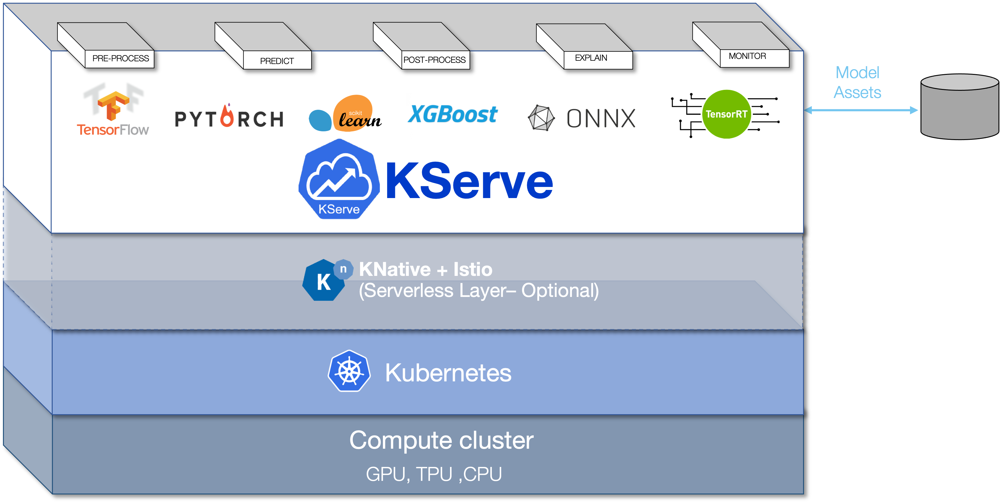

[TOC]

<h1 align="center">AI 产品</h1>

> By：weimenghua  
> Date：2023.08.13  
> Description：

**参考资料**  
[awesome-mlops](https://github.com/kelvins/awesome-mlops)


## 一、前言

待补充


## 二、模型托管

- [HuggingFace](https://huggingface.co/)
- [GiteeAI](https://ai.gitee.com/)
- [魔搭社区](https://www.modelscope.cn/home)
- [昇思大模型平台](https://xihe.mindspore.cn/)
- [百度千帆](https://cloud.baidu.com/product/wenxinworkshop)
- [始智模型](https://wisemodel.cn/models)
- [OpenCSG](https://portal.opencsg.com/models)
- [TensorFlow Hub](https://tfhub.dev/)
- [Kaggle](https://www.kaggle.com/)
- [Swanhub](https://swanhub.co/)
- [Replicate](https://replicate.com/)


## 三、语言模型

GPT 的实现原理

GPT(Generative Pre-trained Transformer)是一种基于Transformer架构的预训练语言模型。下面是GPT的主要实现原理：

1. **Transformer架构：** GPT基于Transformer模型，该模型由Vaswani等人于2017年提出。Transformer使用了注意力机制，可以在输入序列中捕捉全局依赖关系，而无需依赖循环神经网络(RNN)或卷积神经网络(CNN)。它包括编码器和解码器，但在GPT中主要使用了编码器部分。
2. **自注意力机制(Self-Attention)：** 这是Transformer的关键组件。自注意力机制允许模型在处理输入序列时关注输入中的不同位置，而不是像传统的固定窗口大小的滑动窗口一样。这有助于捕捉长距离的依赖关系。
3. **多头注意力(Multi-Head Attention)：** 为了增加模型的表达能力，多头注意力允许模型使用多个注意力头来学习不同的关注权重。
4. **位置编码：** 由于Transformer没有固有的序列顺序概念，位置编码被引入以为模型提供关于单词在序列中位置的信息。
5. **层标准化(Layer Normalization)：** 在每个子层输出后应用层标准化，有助于训练过程的稳定性。
6. **预训练和微调：** GPT是一个预训练语言模型。在预训练阶段，模型通过大规模的文本语料库学习语言的统计结构。在微调阶段，模型根据特定任务的标注数据进行微调，以适应具体应用领域的需求。
7. **层级结构：** GPT采用了多层的Transformer结构，通常包括数十甚至数百个Transformer层，使得模型可以学习复杂的语言表示。
8. **掩码机制：** 在预训练中，为了确保模型只能依赖之前的词来预测下一个词，使用了遮蔽机制，即将未来的词掩盖掉。
9. **位置嵌入：** 在输入词嵌入中加入位置嵌入，以区分不同位置的词。

总体而言，GPT通过Transformer的结构和预训练的方式，使得模型能够捕捉自然语言中的复杂语法和语义关系。这种通用的预训练框架使得GPT在各种自然语言处理任务中取得了良好的性能。

### 3.1 ChatGPT4

[gpt-4](https://openai.com/gpt-4)，[帮助文档](https://platform.openai.com/docs/overview)

### 3.2 ChatGPT

ChatGPT 是 OpenAI 公司推出的聊天机器人模型，**Chat**是聊天，GPT的全称：**“GenerativePre-trainedTransformer”**，翻译为中文为**“生成型预训练变换模型”**。

### 3.3 ChatGLB-6B

[ChatGLM-6B](https://huggingface.co/THUDM/chatglm-6b) 是一个开源的、支持中英双语问答的对话语言模型，[ChatGLM 官网](https://www.chatglm.cn/)。

### 3.4 Gemma

[谷歌 Gemma 模型](https://huggingface.co/google/gemma-7b)

### 3.5 其它

谷歌 Gemini 模型


## 四、常用框架

Transformers 库及相关

- Transformers：核心库，模型加载、模型训练、流水线等
- Tokenizer：分词器，对数据进行预处理，文本到token序列的互相转换
- Datasets：数据集库，提供了数据集的加载、处理等方法
- Evaluate：评估函数，提供各种评价指标的计算函数
- PEFT：高效微调模型的库，提供了几种高效微调的方法，小参数量撬动大模型
- Accelerate：分布式训练，提供了分布式训练解决方案，包括大模型的加载与推理解决方案
- Optimum：优化加速库，支持多种后端，如Onnxruntime、Openvino等
- Gradio：可视化部署库，几行代码快速实现基于Web交互的算法演示系统
- PyTorch
- Diffusers

其它库

- [TensorFlow](https://www.tensorflow.org/?hl=zh-cn)
- [MindSpore](https://www.mindspore.cn/)
- Accelerate

### 4.1 Transformers

[Transformers 是由 Hugging Face 开发的一个 NLP 包](https://transformers.run/)

Transformers 库将目前的 NLP 任务归纳为几下几类：
- 文本分类：例如情感分析、句子对关系判断等；
- 对文本中的词语进行分类：例如词性标注 (POS)、命名实体识别 (NER) 等；
- 文本生成：例如填充预设的模板 (prompt)、预测文本中被遮掩掉 (masked) 的词语；
- 从文本中抽取答案：例如根据给定的问题从一段文本中抽取出对应的答案；
- 根据输入文本生成新的句子：例如文本翻译、自动摘要等。

pipeline 函数，它支持如下的任务：
- 情感分析(Sentiment analysis)：一段文本是正面还是负面的情感倾向
- 文本生成(Text generation)：给定一段文本，让模型补充后面的内容
- 命名实体识别(Name entity recognition)：识别文字中出现的人名地名的命名实体
- 问答(Question answering)：给定一段文本以及针对它的一个问题，从文本中抽取答案
- 填词(Filling masked text)：把一段文字的某些部分mask住，然后让模型填空
- 摘要(Summarization)：根据一段长文本中生成简短的摘要
- 翻译(Translation)：把一种语言的文字翻译成另一种语言
- 特征提取(Feature extraction)：把一段文字用一个向量来表示

安装

```
#安装transformers
pip install transformers

#安装datasets
pip install datasets
```

### 4.2 Datasets

```
import datasets

# 加载单个数据集
raw_datasets = datasets.load_dataset('squad')
# 加载多个数据集
raw_datasets = datasets.load_dataset('glue'， 'mrpc')
```

数据集下载目录：`~/.cache/huggingface/datasets`

### 4.3 TensorFlow

[TensorFlow 官网](https://www.tensorflow.org/?hl=zh-cn)

.ckpt 文件通常是指 TensorFlow 深度学习框架中保存的模型检查点文件。这些文件包含了训练模型的权重、偏置、图结构以及其他相关信息。.ckpt 文件通常用于保存模型的中间状态，以便在训练过程中或者之后能够恢复模型的状态。

### 4.4 PyTorch

[PyTorch 官网](https://pytorch.org/)

### 4.5 Numpy

[Numpy 官网](https://numpy.org/)


## 五、机器学习

### 常见词汇

- 人工智能治理和控制  (AIGC，Artificial Intelligence Governance and Control)
- 人工智能生成内容 (AIGC，AI Generated Content)
- 大语言模型 (LLM，Large Language Model)
- 强化学习 (RL)
- 反馈强化学习 (RLHF)
- 微调模型 (fine-tuning)
- token 通常指的是一个离散的文本单元，它可以是单词、标点符号、数字或其他语言元素，这些元素被用作训练和生成文本的基本单位
- 生成式预训练 (Generative pre-training)
- 监督微调 (Supervised fine-tuning)

### Token

在自然语言处理中，Token是指文本的最小单元，可以是单词、字符或其他语言单位。在深度学习中，Token用于表示输入数据的基本元素，以便进行编码和处理。

### 预训练

“预训练“的做法一般是将大量低成本收集的训练数据放在一起，经过某种预训方法去学习其中的共性，然后将其中的共性“移植”到特定任务的模型中，再使用相关特定领域的少量标注数据进行“微调”，这样的话，模型只需要从”共性“出发，去“学习”该特定任务的“特殊”部分即可。

### 微调

微调(Fine-tuning)是一种机器学习技术，用于调整已预训练的模型以适应新的任务。预训练的模型是在大量数据集(如整个互联网的文本)上训练的，并且已经学习了该数据的许多基本模式。然后，这些模型可以被微调，即在更小、特定的数据集上进行额外的训练，以适应特定的任务。

### 自注意力机制

自注意力机制(Self-Attention Mechanism) ，也被称为自我注意力或者是转换模型(Transformers)中的注意力机制，是一种捕获序列数据中不同位置之间相互依赖性的技术。这种机制使得模型可以在处理一个元素(例如一个词)时，考虑到序列中其他元素的信息。

### 零样本学习

零样本学习(Zero-Shot Learning)是一种机器学习的范式，主要解决在训练阶段未出现但在测试阶段可能出现的类别的分类问题。这个概念通常用于视觉物体识别或自然语言处理等领域。在零样本学习中，模型需要能够理解和识别在训练数据中从未出现过的类别。

### 序列标注

序列标注是一种用于自然语言处理和文本分析的技术，它主要用于从文本中识别和标注出特定的实体、词性、短语结构等信息。序列标注的目标是对输入的文本序列进行标注，使得每个词或符号都被赋予相应的标签，以表示其在特定语境下的语法、语义或其他语言学属性。

常见的序列标注任务包括命名实体识别(NER)、词性标注、句法分析等。下面是一些常见的序列标注任务及其解释：

1. 命名实体识别(NER)：识别文本中的命名实体，如人名、地名、组织机构名等，并将其标注为相应的类别。
2. 词性标注：为文本中的每个词赋予其在句子中的词性标签，如动词、名词、形容词等。
3. 词块分析(Chunking)：识别和标注出文本中的短语结构，如名词短语、动词短语等。
4. 句法分析：对句子的结构和语法关系进行分析，通常包括标注句子中的成分(如主语、谓语、宾语等)和句法依存关系。

在序列标注中，常用的技术包括隐马尔可夫模型(Hidden Markov Model， HMM)、条件随机场(Conditional Random Field， CRF)和递归神经网络(Recurrent Neural Network， RNN)等。这些技术可以根据不同的序列标注任务和数据特点来选择合适的模型和算法进行建模和训练。

总的来说，序列标注是一种重要的文本分析技术，它可以帮助计算机理解和处理自然语言文本，为各种NLP任务提供基础支持。

### 特征抽取

特征抽取是指从原始数据中提取出具有代表性和区分性的特征，以便用于机器学习、数据挖掘和模式识别等任务。特征抽取的目的是将原始数据转换成适合计算机处理的形式，以便进行后续的分析和建模。特征抽取通常涉及到对数据进行预处理、降维、选择和变换等操作，以便提取出最有用的信息。在机器学习领域，特征抽取是一个非常重要的步骤，它直接影响到模型的性能和效果。常见的特征抽取方法包括统计特征提取、频域特征提取、时域特征提取、图像特征提取等。

### 多模态

什么叫做模态(Modality)呢？

每一种信息的来源或者形式，都可以称为一种模态。例如，人有触觉，听觉，视觉，嗅觉；信息的媒介，有语音、视频、文字等；多种多样的传感器，如雷达、红外、加速度计等。以上的每一种都可以称为一种模态。

多模态机器学习，英文全称 MultiModal Machine Learning (MMML)，旨在通过机器学习的方法实现处理和理解多源模态信息的能力。目前比较热门的研究方向是图像、视频、音频、语义之间的多模态学习。

### 检索增强生成

RAG(Retrieval-Augmented Generation)是一种模型架构，结合了检索和生成的技术，用于进行检索增强生成任务。它是基于GPT(生成模型)和BERT(检索模型)的结合，旨在通过检索阶段来引入更多的上下文信息，以提高生成结果的质量和相关性。

RAG模型的工作流程如下：

1. 检索阶段：使用BERT或其他检索模型来检索与给定查询相关的文档或文本片段。这些文档或片段被认为是生成阶段的上下文。
2. 编码阶段：将查询和检索得到的文档或片段输入到编码器中，生成一组表示隐藏向量。
3. 生成阶段：将编码阶段的隐藏向量输入到生成器(通常是GPT模型)中，生成与查询相关的响应或生成文本。


### 特征工程
 
特征工程是指在机器学习和数据分析任务中，对原始数据进行转换、提取和选择，以创建更有信息量和预测能力的特征集合的过程。

特征工程的目的是通过对数据进行适当的预处理和特征构建，使得机器学习算法能够更好地理解数据并提取出相关的模式和信息。好的特征工程可以帮助提高模型的性能、降低过拟合的风险，并提供更好的解释性。

特征工程的步骤通常包括以下几个方面：
- 数据清洗：处理缺失值、异常值、重复值和噪声等问题，确保数据的质量和一致性。
- 特征转换：对原始数据进行转换，使其符合模型的假设或要求。常见的转换包括对数变换、标准化、归一化和离散化等。
- 特征构建：根据领域知识和数据的特点，通过组合、衍生或交互等方式创建新的特征。这可以帮助模型更好地捕捉数据中的非线性关系和交互效应。
- 特征选择：从原始特征中选择最相关和最具有预测能力的特征，以减少维度和冗余，并提高模型的泛化能力。常用的特征选择方法包括统计方法、正则化和基于模型的方法等。
- 特征缩放：对特征进行缩放，使其具有相似的尺度和范围，以便模型能够更稳定地学习和进行预测。常见的缩放方法包括标准化和归一化。


## 六、知识碎片

### 6.1 AI 产品网址

AI 工具集

- [AI 工具集](https://ai-bot.cn/)
- [每日 AI 快讯热闻](https://ai-bot.cn/daily-ai-news/)
- [AI 导航](https://www.ainavpro.com/)
- [AI 产品库](https://top.aibase.com/)
- [AI 指令](https://www.aishort.top/)

AI 对话聊天

- [ChatGPT](https://chat.openai.com/)
- [GPTStore](https://gptstore.ai/)
- [Poe](https://poe.com/)
- [geekgpt](https://chat1.geekgpt.org/)
- [百度文心一言](https://yiyan.baidu.com/)
- [阿里通义千问](https://tongyi.aliyun.com/)
- [Moonshot Kimi](https://kimi.moonshot.cn/)
- [Gemini](https://gemini.google.com/app)
- [Coze](https://www.coze.cn/home)

AI 编程工具

- [GitHub Copilot](https://docs.github.com/zh/copilot/quickstart)
- [Cursor](https://cursor.sh/)
- [copilot.microsoft](https://copilot.microsoft.com/)

AI 搜素引擎

- [新一代 AI 搜索引擎](https://devv.ai/)

其它

- [MidJourney](https://www.midjourney.com/)，需要先注册 [Discord](https://discord.com/)，[MidJourney 官方使用手册](https://midjourney.gitbook.io/docs/)
- [Perplexity](https://www.perplexity.ai/)
- [Pika](https://pika.art/waitlist)
- [DreamStudio](https://beta.dreamstudio.ai/generate)
- [Prompt](https://www.promptingguide.ai/zh)
- [sora](https://openai.com/sora)
- ChatGPT插件：Sider、Glarity


### 6.2 AI Agent

人工智能代理(Artificial Intelligence Agent)，在LLM语境下，Agent 可以理解为某种能自主理解、规划决策、执行复杂任务的智能体。

**Agent = LLM+Planning+Feedback+Tool use**

### 6.3 [KServe ](https://www.kubeflow.org/)

[KServe 云原生模型推理服务框架](https://github.com/kserve/kserve) 提供 一个 Kubernetes 自定义资源定义，用于在任意框架上提供机器学习 (ML) 模型服务。 它旨在通过为常见的 ML 框架(如：Tensorflow、XGBoost、Scikit-Learn、PyTorch 和 ONNX)提供高性能、高度抽象的接口来解决生产模型服务场景。



KServe Control Plane：负责协调 InferenceService 自定义资源。 它为预测器、转换器、解释器创建了 Knative serverless 部署，以根据传入的请求工作负载启用自动缩放，包括在没有收到流量时缩小到零。启用原始部署模式后，控制平面会创建 Kubernetes 的 deployment， service， ingress、HPA 资源。

### 6.4 KNative

### 6.5 MLOps

MLOps 是机器学习和运营的复合词，它是数据科学家和运维专业人员之间协作和沟通的一种实践，以帮助管理生产机器学习(或深度学习)生命周期。与 DevOps 或 DataOps 方法类似，MLOps 希望提高自动化程度并提高生产 ML 的质量，同时还关注业务和监管要求。

### 6.6 知识碎片

[SageMaker](https://www.amazonaws.cn/en/sagemaker/)

[MLReef](https://github.com/MLReef/mlreef)

A100 算力，[NVIDIA A100 Tensor Core GPU
