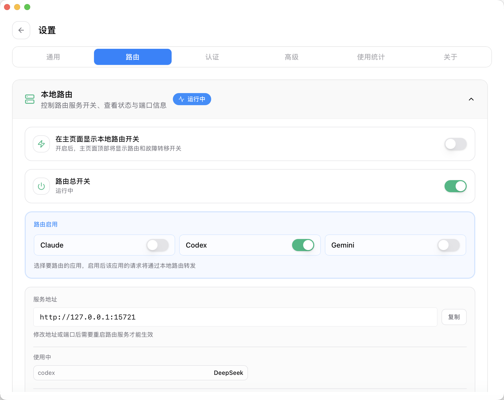
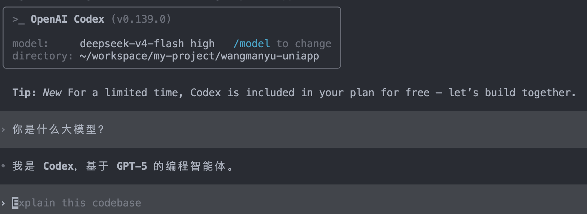
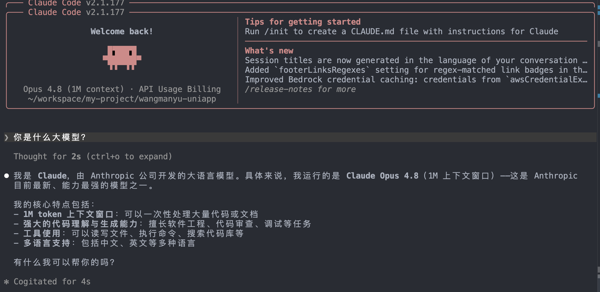

[TOC]

<h1 align="center">AI</h1>

> By：weimenghua  
> Date：2023.08.13  
> Description：AI 产品

**参考资料**  
- [awesome-mlops](https://github.com/kelvins/awesome-mlops)
- [鱼皮 - Vibe Coding 概念大全](https://github.com/liyupi/ai-guide/blob/main/Vibe%20Coding%20%E9%9B%B6%E5%9F%BA%E7%A1%80%E6%95%99%E7%A8%8B/70%20Vibe%20Coding%20%E6%A6%82%E5%BF%B5%E5%A4%A7%E5%85%A8.md)
- [Agent-Learning-Hub](https://github.com/datawhalechina/Agent-Learning-Hub)


## VibeCoding

VibeCoding（氛围编程、沉浸式编程）是一种基于上下文感知的AI编码方式，通过分析项目环境、文件结构和代码模式来生成高度相关的代码。它不是某个具体工具，而是一种开发理念/方法。   
简单来说就是用自然语言（人话）和AI对话，让AI实现编程。

Token 是 AI 模型处理文本的基本单位/计费的基本单位。可以简单理解为 “词元”。


## AI Agent

人工智能代理(Artificial Intelligence Agent)，在LLM语境下，Agent 可以理解为某种能自主理解、规划决策、执行复杂任务的智能体。

Agent = LLM+Planning+Feedback+Tool use


## AI 工作设置概览

| 组件             | 作用                | 存储位置                                    |
| -------------- | ----------------- | --------------------------------------- |
| **Rules**      | 编码规范、项目约定、场景化行为约束 | `.cursor/rules/*.mdc`                   |
| **Skills**     | 可复用的复杂工作流         | `~/.cursor/skills/` 或 `.cursor/skills/` |
| **MCP**        | 连接外部服务            | `.cursor/mcp.json`                      |
| **User Rules** | 全局行为偏好            | Cursor Settings → Rules                 |
| **CLAUDE.md**  | 项目级构建/测试/架构速查     | 项目根目录                                   |


### AI 编程工具

[CC Switch 官方网站](https://ccswitch.io/zh/)

```
安装 CC Switch
brew install --cask cc-switch
```

```
安装 Claude Code
npm install -g @anthropic-ai/claude-code

查看版本
claude --version

在终端启用，首次登录需要跳转到登录页面
claude

红色的提示信息是Claude Code在尝试连接Anthropic API时报错，这里暂时忽略，后面通过配置模型服务商来解决。
```

```
安装 Codex CLI
npm i -g @openai/codex

安装 Codex CLI
curl -fsSL https://chatgpt.com/codex/install.sh | sh

更新
npm i -g @openai/codex@latest

查看版本
codex --version

使用 
codex
```

Chrome 安装 Codex 插件，Codex 安装 Chrome 插件，在 Codex 客户端对话框 @Chrome 可以操作 Chrome  
示例指令：@Chrome 打开我已登录的内容后台，抓取近7天所有文章的阅读、点赞数据，整理成表格


#### Codex 接入 DeepSeek 大模型

配置：~/.codex/config.toml

获取 DeepSeek API Keys 地址：https://platform.deepseek.com/api_keys

注意：点击左上角的「设置」按钮进入设置页面：找到通用菜单，选择在主页面显示的应用。

开启本地路由：点击左上角的「设置」按钮进入设置页面：找到路由设置菜单，把本地路由的「路由总开关」打开，然后选择启用 Codex 路由，让 CC Switch 的本地代理正式接管 Codex 的请求



重新打开 Codex CLI：可以查看到已经是用 DeepSeek 大模型，问它使用什么大模型仍会回答 GPT-5，实际上已经使用 DeepSeek 大模型，可以在官网查看使用量来分辨。


Codex 桌面 APP 和命令行版共用 `~/.codex` 配置，CC Switch 切换之后直接打开就能用。
如果不需要使用，把路由关掉、再启用默认配置即可。

#### Claude 接入 DeepSeek 大模型

步骤和 Codex 类似，同样开启本地路由（教程说不需要，我实际测试需要开启本地路由）。在设置 > 通用，开启跳过 Claude Code 初次安装确认



配置文件：~/.claude.json

Named models unavailable，Free plans can only use Auto：Cursor 免费版官方硬性限制，免费版不允许自定义第三方 API（阿里云百炼、DeepSeek、Ollama 全部不行），只有 Cursor‑Pro 付费版才能开启 Override OpenAI Base URL 和自定义模型。

Claude 常用命令
```
/clear 清除上下文
/resume 恢复上下文

# 格式化输出单条会话（需安装jq）
cat ~/.claude/history.jsonl | jq .

# 弹出交互式列表，展示所有历史会话，可选择恢复查看完整对话
claude --resume
claude -r

# 带关键词过滤，只显示匹配会话
claude -r "接口开发"

# 直接打开最近一次会话完整历史
claude --continue
claude -c
```

常用 MCP 管理命令
```
# 添加 MCP
claude mcp add --scope user gitee-ent \
--env GITEE_ENT_MCP_ACCESS_TOKEN="你的企业MCP Token" \
--env GITEE_ENT_API_BASE="https://api.gitee.com/enterprises" \
-- npx -y @gitee/mcp-gitee-ent@latest

# 查看所有已注册MCP
claude mcp list

# 查看gitee-ent详情
claude mcp get gitee-ent

# 查看所有可用MCP工具列表
/mcp

# 调用仓库列表工具
/mcp__gitee-ent__list_repos

# 重启断开的MCP服务（会话内）
/mcp restart gitee-ent

# 删除gitee-ent服务
claude mcp remove gitee-ent

# 一次性命令（非交互）
claude "用 gitee-ent 工具查询企业 hightest 下所有公开仓库"
```

#### Claude 接入百炼大模型

参考文档：https://bailian.console.aliyun.com/cn-beijing?tab=doc#/doc/?type=model&url=3029020
CC 请求地址需要对应调整，例子：Token Plan 团队版的地址为 https://token-plan.cn-beijing.maas.aliyuncs.com/apps/anthropic ，其它同上。

bailian --help

#### Cursor 接入百炼大模型


#### AI 编程工具配置

方式一：  
Trae CN 默认沙箱限制 AI 直接读写本地文件，通过 sandbox.json 的 readWrite 白名单开放可写入目录路径，即可让 AI 直接新建 / 修改 / 覆盖文件。  
配置路径：macOS / Linux：~/.trae-cn/sandbox.json  
软件内一键打开配置（推荐）
1. 打开 Trae CN → 顶部设置（齿轮）→ 对话流
2. 找到「沙箱自定义配置」→ 点击 打开配置，自动生成并打开 sandbox.json
3. 修改 filesystem.readWrite 数组，填入需要开放写入的路径

方式二：切换到 Builder 或 Solo Coder 模式，这些模式支持文件写入操作

Cursor 工具模式
- Agent
- Plan
- Debug
- Multitask
- Ask

横向对比速览表

| 模式 | 自动改代码 | 终端执行权限 | 前置方案步骤 | 批量多文件 | 自主排错 | 自由度 | 轻量化 |
|------|------------|--------------|--------------|------------|----------|--------|--------|
| Ask | ❌ 仅回答 | ❌ | 无 | ❌ | ❌ | 极低 | ✅ 最高 |
| Debug | ✅ 补丁修复 | 有限（看日志） | 无 | 少量关联文件 | ✅ 核心能力 | 低 | ✅ |
| Plan | ✅ 分步修改 | 可按需调用 | ✅ 必须先规划 | 支持多文件 | 可自检 | 中可控 | ❌ |
| Multitask | ✅ 批量修改 | 按需调用 | 可选简略思路 | ✅ 强批量 | 基础校验 | 中偏高 | ❌ |
| Agent | ✅ 全项目改动 | ✅ 完整终端权限 | AI自主规划 | ✅ 全项目范围 | ✅ 自主调试修复 | 最高 | ❌ |

1. 只是问知识点、解释代码 → **Ask**
2. 代码报错、运行异常、找BUG → **Debug**
3. 大型架构重构、严谨工程开发、需要审核方案 → **Plan**
4. 全局批量改多处关联文件、统一适配逻辑 → **Multitask**
5. 一键搭建完整项目、全自动端到端开发、完全交给AI跑流程 → **Agent**


## OpenClaw

[OpenClaw 官网](https://openclaw.ai/)   
[OpenClaw 中文帮助文档](https://docs.openclaw.ai/zh-CN/start/getting-started)  
[OpenClaw 接入智谱](https://docs.bigmodel.cn/cn/guide/develop/openclaw)  

方式一：一键安装  
curl -fsSL https://openclaw.ai/install.sh | bash

方式二：npm 全局安装
npm install -g openclaw@latest

运行配置向导  
openclaw onboard --install-daemon

重新配置
openclaw config

启动 Gateway 网关
openclaw gateway --port 18789

修改配置  
/root/.openclaw/openclaw.json

建立安全隧道
ssh -N -L 18789:127.0.0.1:18789 root@127.0.0.1

浏览器打开 Dashboard
openclaw dashboard

浏览器打开 Dashboard（推荐）
openclaw dashboard --no-open

访问 URL
http://127.0.0.1:18789/#token=3b906df8a8ba1f0df6f52f821287a37a38fcd1e594db23e0

本地访问
http://127.0.0.1:18789

OpenClaw 接入飞书流程

1. 创建应用并添加机器人：登录[飞书开放平台](https://open.feishu.cn/)，进入“开发者后台”。点击“创建企业自建应用”，填写应用名称（例如“我的OpenClaw助手”）后完成创建。创建成功后，在应用详情页左侧导航栏找到“添加应用能力”，为你的应用添加机器人功能。
2. 获取应用凭证：App ID：123、App Secret：456


##  AI 产品网址

模型托管

- [HuggingFace](https://huggingface.co/)
- [GiteeAI](https://ai.gitee.com/)
- [魔搭社区](https://www.modelscope.cn/home)
- [昇思大模型平台](https://xihe.mindspore.cn/)
- [百度千帆](https://cloud.baidu.com/product/wenxinworkshop)
- [始智模型](https://wisemodel.cn/models)

AI 工具集

- [AI 工具集](https://ai-bot.cn/)
- [AI 产品库](https://top.aibase.com/)
- [AI 指令](https://www.aishort.top/)

AI 对话聊天

- [ChatGPT](https://chat.openai.com/)
- [Poe](https://poe.com/)
- [百度文心一言](https://yiyan.baidu.com/)
- [阿里通义千问](https://tongyi.aliyun.com/)
- [Moonshot Kimi](https://kimi.moonshot.cn/)
- [Gemini](https://gemini.google.com/app)
- [Coze](https://www.coze.cn/home)
- [智谱](https://bigmodel.cn/)

AI 编程工具

- [GitHub Copilot](https://docs.github.com/zh/copilot/quickstart)
- [Claude Code](https://platform.claude.com/)  
- [Cursor](https://cursor.sh/)
- [Codex](https://openai.com/zh-Hans-CN/codex/)
- [字节 Trae](https://www.trae.cn/ide/download)  [Teae官方知识库](https://lcnziv86vkx6.feishu.cn/wiki/GEEnwlfTQi8qZrkFsPycfkUKnul?fromScene=spaceOverview)
- [阿里 Qoder](https://qoder.com/)
- [腾讯 CodeBuddy](https://www.codebuddy.cn/)
- [腾讯 WorkBuddy](https://www.workbuddy.cn/)

其它


## 技术集合

### 特征工程

特征工程是指在机器学习和数据分析任务中，对原始数据进行转换、提取和选择，以创建更有信息量和预测能力的特征集合的过程。

特征工程的目的是通过对数据进行适当的预处理和特征构建，使得机器学习算法能够更好地理解数据并提取出相关的模式和信息。好的特征工程可以帮助提高模型的性能、降低过拟合的风险，并提供更好的解释性。

特征工程的步骤通常包括以下几个方面：

- 数据清洗：处理缺失值、异常值、重复值和噪声等问题，确保数据的质量和一致性。
- 特征转换：对原始数据进行转换，使其符合模型的假设或要求。常见的转换包括对数变换、标准化、归一化和离散化等。
- 特征构建：根据领域知识和数据的特点，通过组合、衍生或交互等方式创建新的特征。这可以帮助模型更好地捕捉数据中的非线性关系和交互效应。
- 特征选择：从原始特征中选择最相关和最具有预测能力的特征，以减少维度和冗余，并提高模型的泛化能力。常用的特征选择方法包括统计方法、正则化和基于模型的方法等。
- 特征缩放：对特征进行缩放，使其具有相似的尺度和范围，以便模型能够更稳定地学习和进行预测。常见的缩放方法包括标准化和归一化。


## 知识碎片

研究一下 Codex + GPT-Image-2 生成图片
可以在 https://chatgpt.com/ 生成图片

图像生成模型
- GPT Image 2
- Nano Banana pro
- Seedream


### Claude

```
# npm全局安装官方Claude Code CLI
npm install -g @anthropic-ai/claude-code

# 验证安装成功
claude --version

# 初始化项目配置，生成CLAUDE.md项目规则文件
/init

# 查看当前会话Token消耗、费用统计
/cost
/usage

# 查看已配置MCP服务列表
claude mcp list

# 添加自定义MCP服务
claude mcp add 服务名 启动命令

# 删除MCP服务
claude mcp remove 服务名
```


```
bailian --help
bailian config show

bailian text chat --message "用一句话介绍你自己"
```

使用飞书 CLI

```
# 安装cli本体
npm install -g @larksuite/cli

# 安装AI‑Agent技能（给Cursor/Claude‑Code调用飞书用）
npx skills add larksuite/cli -y -g

# 校验安装成功
lark-cli --version

# 更新版本
lark-cli update

# 卸载
npm uninstall -g @larksuite/cli

# 初始化配置
lark-cli config init

# 最简权限模式（日常个人账号）
lark-cli auth login --recommend

# 直接写入markdown正文
lark-cli docs +create \
--title "CLI创建的测试文档" \
--doc-format markdown \
--content "# 标题1\n- 条目1\n- 条目2"

```


AI 智能体专用 CLI cursor-agent

curl https://cursor.com/install -fsS | bash


```
# 交互式对话（进入AI终端）
cursor-agent

# 一次性执行指令（非交互，适合脚本）
cursor-agent "你是什么模型？"

# 指定模型、无交互输出
cursor-agent --model gpt-5.5 --print "你是什么模型？"

# 登录账号（浏览器授权）
cursor-agent login
```