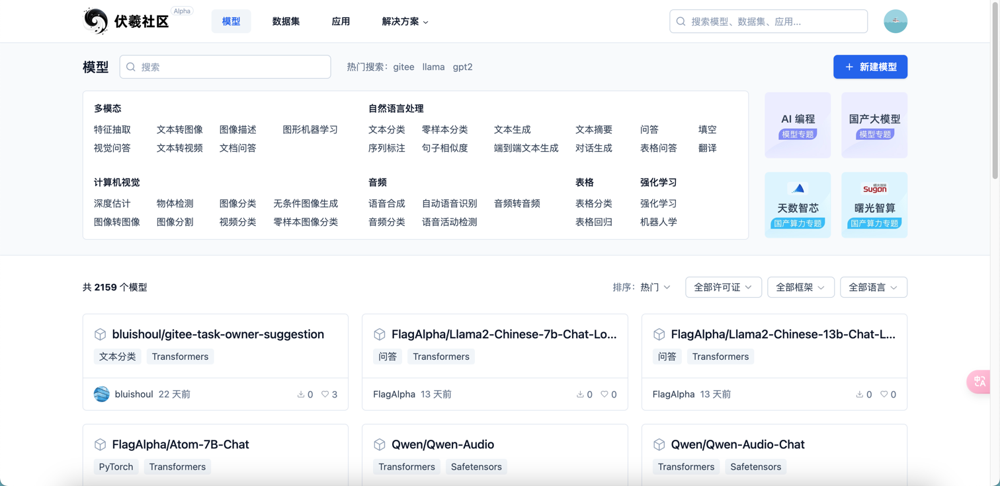
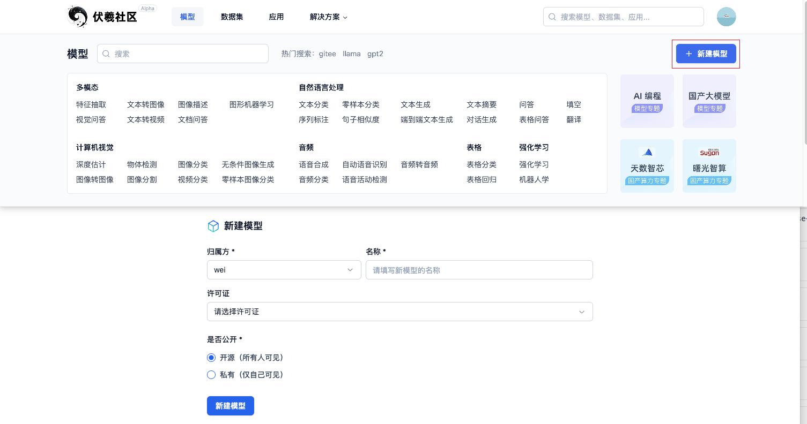
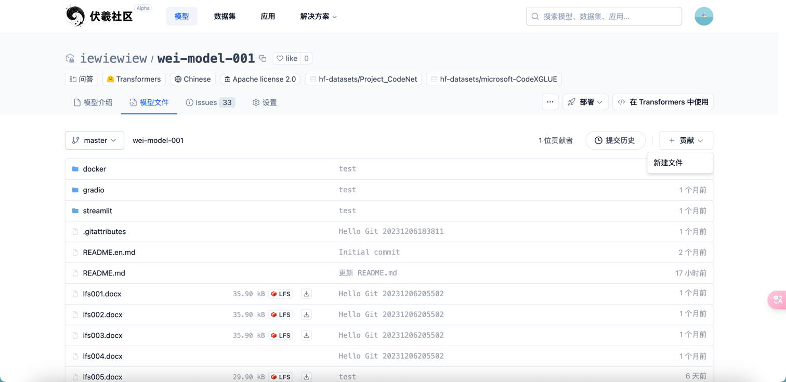
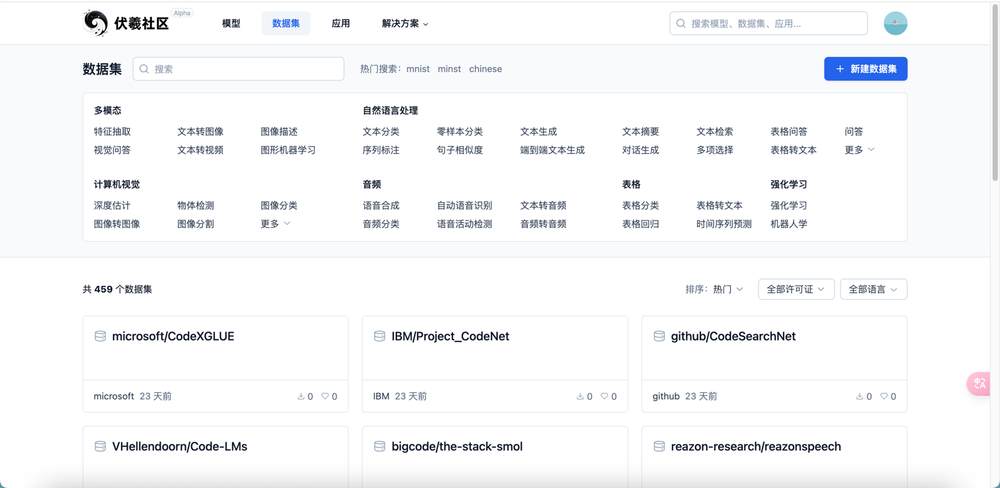
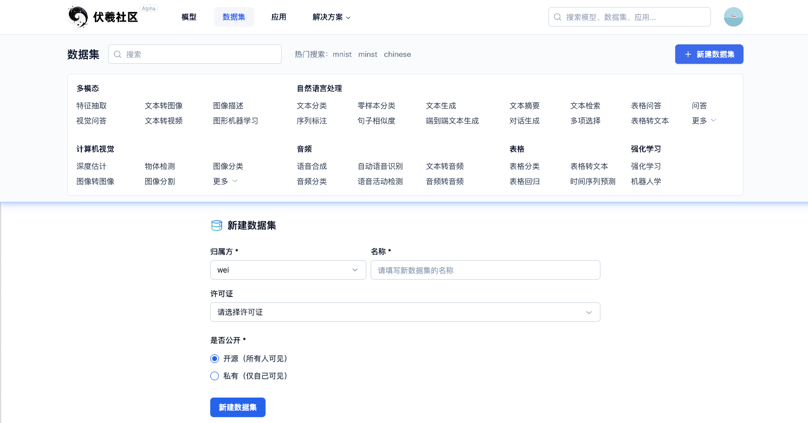
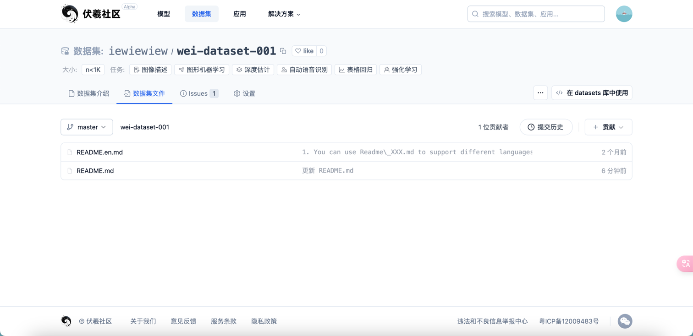
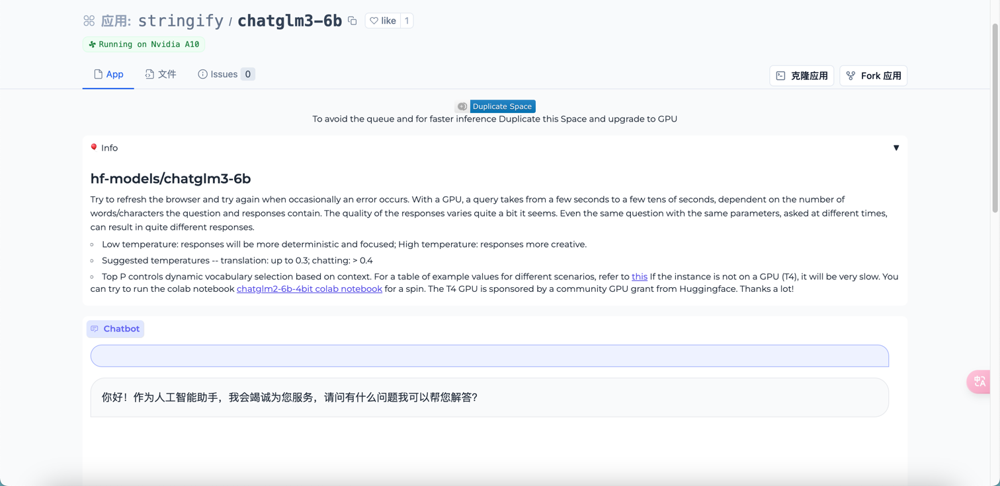
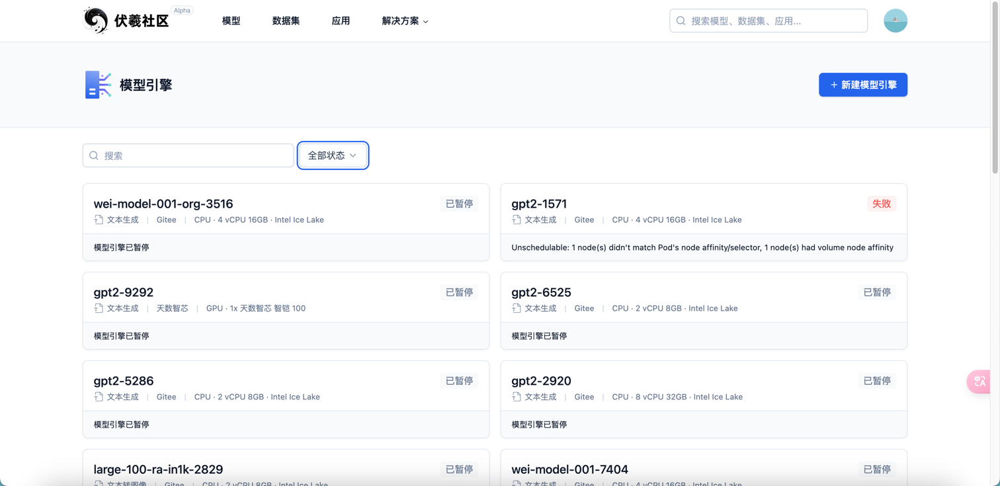
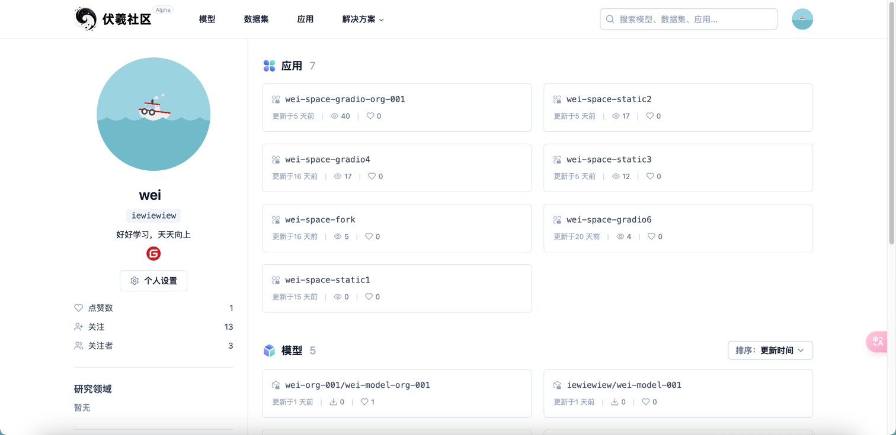
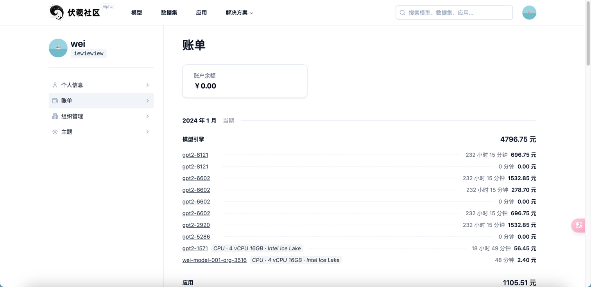

[TOC]

<h1 align="center">GiteeAI</h1>

> By：weimenghua  
> Date：2023.12.04  
> Decription：

**参考资料**  
[GiteeAI 地址](https://ai.gitee.com/)

## 一、GiteeAI 简介

GiteeAI 是由 Gitee 出品的一款大模型托管产品，汇聚最新最热 AI 模型和数据集等。主要模块有：模型、数据集、应用、模型引擎、应用引擎、自动训练。

## 二、GiteeAI 核心功能

### 2.1 模型

模型列表：展示所有公开模型，可根据模型的任务类型、许可证、框架、语言进行筛选。

新建模型：归属方选择个人空间/组织空间（如果有），填写模型名称，许可证可选，选择开源所有人可见，选择私有仅自己可见。

模型详情：在模型文件页面可新建文件、下载 LFS 文件、查看提交历史。

### 2.2 数据集

数据集列表：展示所有公开数据集，可根据数据集的任务类型、许可证、语言进行筛选。

新建数据集：归属方选择个人空间/组织空间（如果有），填写数据集名称，许可证可选，选择开源所有人可见，选择私有仅自己可见。

数据集详情：在数据集文件页面可新建文件、下载 LFS 文件、查看提交历史。

### 2.3 应用

应用列表：展示所有公开应用。

应用体验：可以在线体验应用。

### 2.4 模型引擎

模型引擎列表：展示当前账号下所有模型引擎。

新建模型引擎：填写模型仓库地址，例如 [gpt2](https://ai.gitee.com/hf-models/gpt2)、模型引擎名称，选择实例配置，点击新建模型引擎之后跳转到模型详情页。

### 2.5 个人主页

[账单](https://ai.gitee.com/settings/billing)

## 三、常见问题

应用 - 重启应用：

应用 - 出厂重启：（buildkit）删除应用重建