[TOC]

<h1 align="center">HugginFace</h1>

> By：weimenghua  
> Date：2023.08.13  
> Description：

**参考资料**  
- [Huggingface 官网](https://huggingface.co/)
- [Huggingface github](https://github.com/huggingface)
- [HuggingFace 在线教程](https://huggingface.co/learn/nlp-course/chapter1/1)

  

## 一、基本介绍

Hugging Face是一个知名的开源社区和公司，专注于自然语言处理(NLP)和机器学习(ML)领域。

**Huggingface 模块**

- Models（模型），各种处理 CV 和 NLP 等任务的模型
- Datasets（数据集）
- Spaces（空间），社区空间分享
- Docs（文档），包括各种模型算法等说明使用文档
- Solutions（解决方案）
- Pricing（报价）

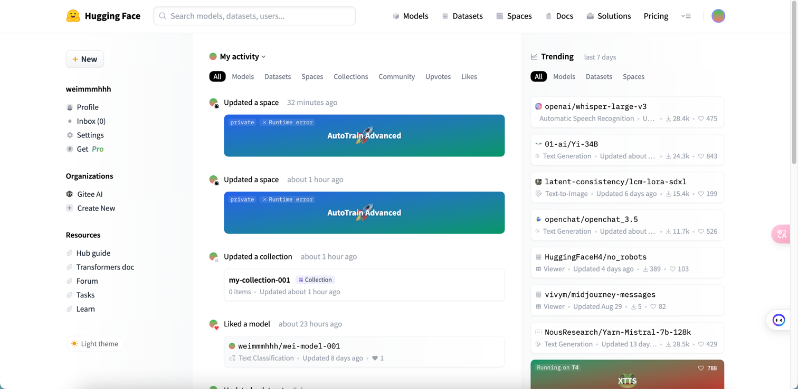


## 二、Models（模型）

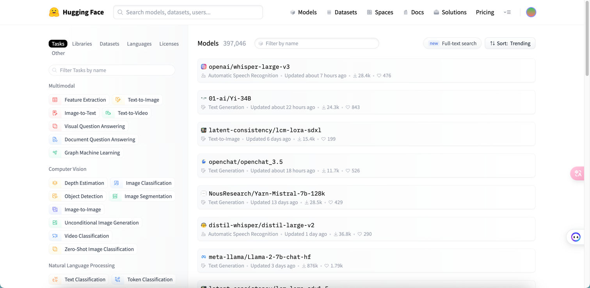

**Huggingface 模型分类**

- Computer Vision(计算机视觉任务)：包括lmage Classification(图像分类)，lmage Segmentation(图像分割)、zero-Shot lmage Classification(零样本图像分类)、lmage-to-Image(图像到图像的任务)、Unconditional lmage Generation(无条件图像生成)、Object Detection(目标检测)、Video Classification(视频分类)、Depth Estimation(深度估计，估计拍摄者距离图像各处的距离)
- Natural Language Processing(自然语言处理)：包括Translation(机器翻译)、Fill-Mask(填充掩码，预测句子中被遮掩的词)、Token Classification(词分类)、Sentence Similarity(句子相似度)、Question Answering(问答系统)，Summarization(总结，缩句)、Zero-Shot Classification (零样本分类)、Text Classification(文本分类)、Text2Text(文本到文本的生成)、Text Generation(文本生成)、Conversational(聊天)、Table Question Answer(表问答，1.预测表格中被遮掩单词2.数字推理，判断句子是否被表格数据支持)
- Audio(语音)：Automatic Speech Recognition(语音识别)、Audio Classification(语音分类)、Text-to-Speech(文本到语音的生成)、Audio-to-Audio(语音到语音的生成)、Voice Activity Detection(声音检测、检测识别出需要的声音部分)
- Multimodal(多模态)：Feature Extraction(特征提取)、Text-to-Image(文本到图像)、Visual Question Answering(视觉问答)、Image2Text(图像到文本)、Document Question Answering(文档问答)
- Tabular(表格)：Tabular Classification(表分类)、Tabular Regression(表回归)
- Reinforcement Learning(强化学习)：Reinforcement Learning(强化学习)、Robotics(机器人)


## 三、Datasets（数据集）

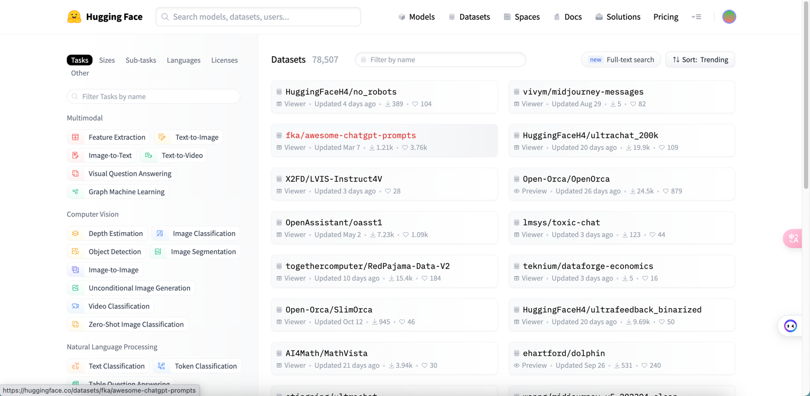

**Huggingface 使用**

1. 克隆模型仓库

```
克隆模型仓库 https
git lfs install
git clone https://huggingface.co/weimmmhhh/wei-model-001

克隆模型仓库 ssh
git lfs install
git clone git@hf.co:weimmmhhh/wei-model-001

只下载模型实现
GIT_LFS_SKIP_SMUDGE=1 git clone https://huggingface.co/THUDM/chatglm-6b
```

2. 训练、部署

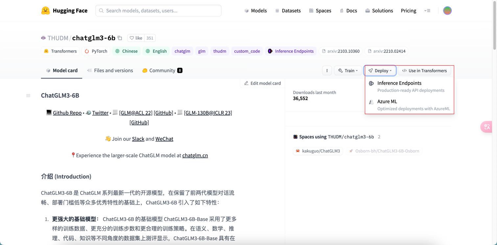

3. 创建应用

Space SDK 选择 [Gradio](https://www.gradio.app/)，详情可查看 [Gradio 帮助文档](https://www.gradio.app/docs/interface)

```
git clone git@hf.co:spaces/weimmmhhh/wei-space-002
cd wei-space-002

vim app.py 添加以下内容：
import gradio as gr

def greet(name):
    return "Hello " + name + "!!"

iface = gr.Interface(fn=greet, inputs="text", outputs="text")
iface.launch()

git add app.py
git commit -m "Add application file"
git push
```

4. 推送后即自动运行容器，进入应用页面可使用应用功能

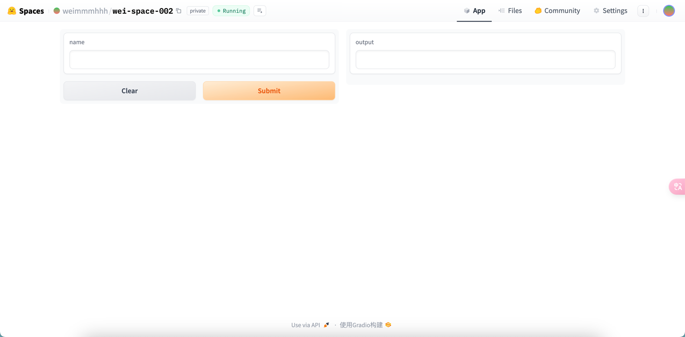


## 四、Spaces（分享空间）

Hugging Face Spaces 提供了一种简单的方法，可以直接在您的个人资料或组织的个人资料中托管 ML 演示应用程序。这使您可以创建自己的 ML 投资组合，在会议上或向利益相关者展示您的项目，并与 ML 生态系统中的其他人协作。

[SpacesExamples](https://huggingface.co/SpacesExamples)

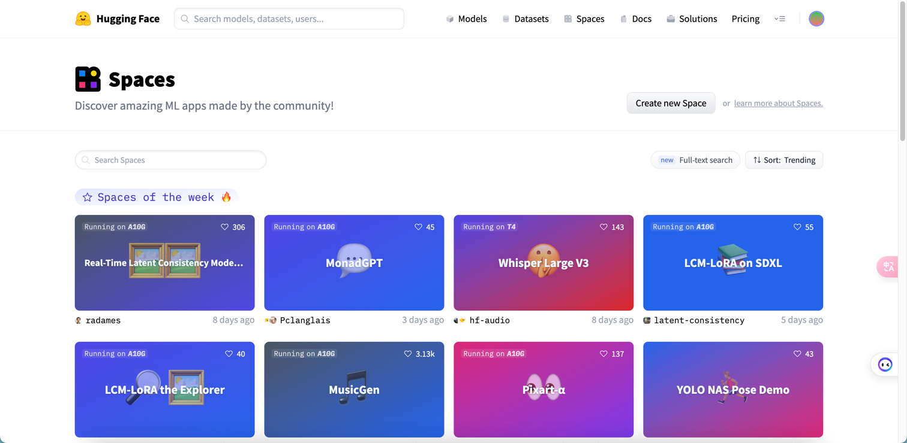

**Space SDK**

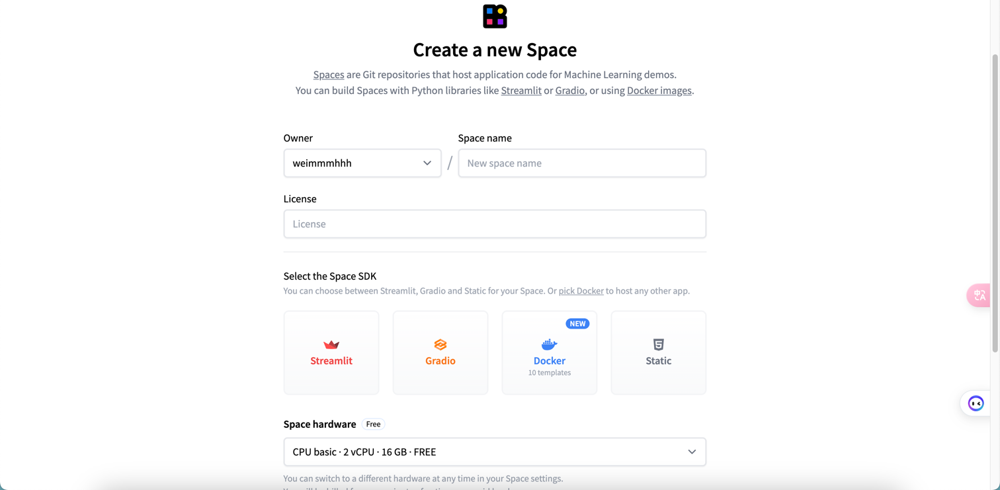

### Streamlit

[Streamlit](https://streamlit.io/)是个 Python 库，偏向于可视化数据展示，[帮助文档](https://docs.streamlit.io/)， [Streamlit 例子 1](https://huggingface.co/docs/hub/spaces-sdks-streamlit) 、[Streamlit 例子 2](https://docs.streamlit.io/library/get-started/main-concepts)。

例子

```
git lfs install
git clone https://huggingface.co/spaces/weimmmhhh/wei-space-streamlit
```

cd wei-space-streamlit && vim requirements.txt
```
transformers
torch
```

vim app.py
```
import streamlit as st
from transformers import pipeline
from PIL import Image

pipeline = pipeline(task="image-classification", model="julien-c/hotdog-not-hotdog")

st.title("Hot Dog? Or Not?")

file_name = st.file_uploader("Upload a hot dog candidate image")

if file_name is not None:
    col1, col2 = st.columns(2)

    image = Image.open(file_name)
    col1.image(image, use_column_width=True)
    predictions = pipeline(image)

    col2.header("Probabilities")
    for p in predictions:
        col2.subheader(f"{ p['label'] }: { round(p['score'] * 100, 1)}%")
```

推送代码

````
git add app.py
git commit -m "Add application file"
git push
````

运行程序

```
streamlit run app.py
```

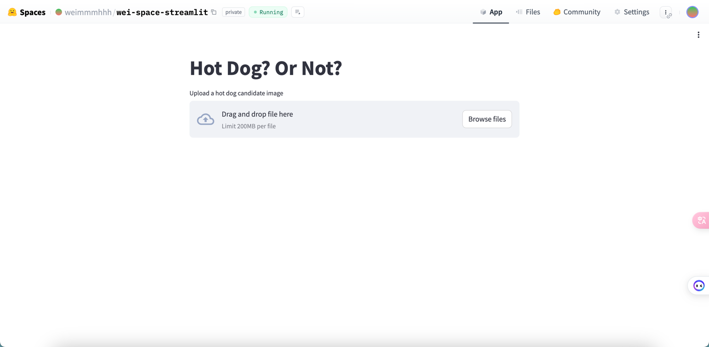

### Gradio

[Gradio](https://huggingface.co/gradio) 是一个用于构建交互式界面的库，能够轻松地为的深度学习模型创建Web应用程序。[Gradio](https://huggingface.co/docs/hub/spaces-sdks-gradio) 提供了一个简单而强大的API，可以将模型与用户界面组件(如文本框、滑块、图像上传器等)相连接，从而实现模型的实时推理和可视化，参考[ Gradio 例子1](https://www.gradio.app/guides/quickstart)、[Gradio 例子2](https://www.gradio.app/docs/examples)。

克隆代码

```
git clone git@hf.co:spaces/weimmmhhh/wei-space-gradio
```

cd wei-space-gradio && vim app.py
```
import gradio as gr

def greet(name):
    return "Hello " + name + "!!"

iface = gr.Interface(fn=greet, inputs="text", outputs="text")
iface.launch()
```

推送代码
```
git add app.py
git commit -m "Add application file"
git push
```

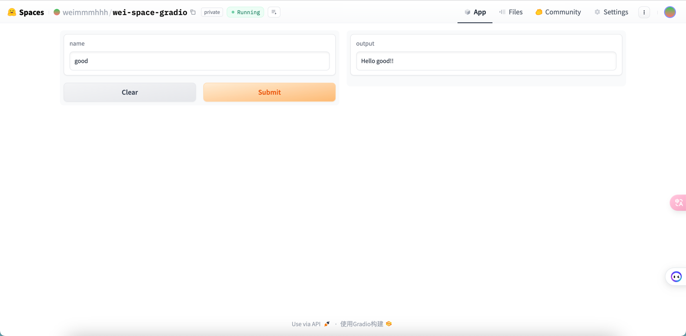

```
import gradio as gr

def greet(name, is_morning, temperature):
    salutation = "Good morning" if is_morning else "Good evening"
    greeting = f"{salutation} {name}. It is {temperature} degrees today"
    celsius = (temperature - 32) * 5 / 9
    return greeting, round(celsius, 2)

demo = gr.Interface(
    fn=greet,
    inputs=["text", "checkbox", gr.Slider(0, 100)],
    outputs=["text", "number"],
)
demo.launch()
```

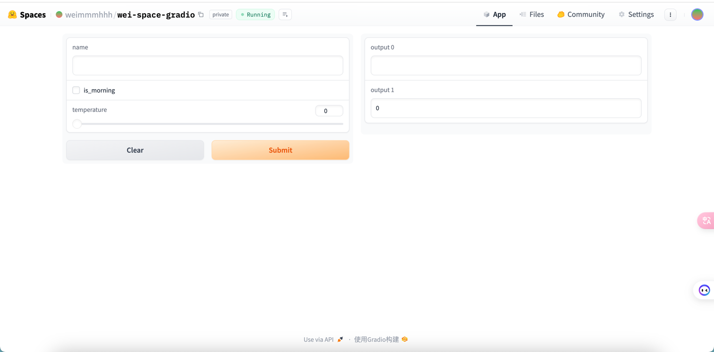

### Docker

[Docker](https://huggingface.co/docs/hub/spaces-sdks-docker-first-demo)

vim requirements.txt

```
fastapi==0.74.*
requests==2.27.*
sentencepiece==0.1.*
torch==1.11.*
transformers==4.*
uvicorn[standard]==0.17.*
```

vim app.py

```
from fastapi import FastAPI

app = FastAPI()

@app.get("/")
def read_root():
    return {"Hello": "World!"}
```

vim Dockerfile

```
FROM python:3.9

WORKDIR /code

COPY ./requirements.txt /code/requirements.txt

RUN pip install --no-cache-dir --upgrade -r /code/requirements.txt

COPY . .

CMD ["uvicorn", "main:app", "--host", "0.0.0.0", "--port", "7860"]
```

推送代码
```
git add Dockerfile
git commit -m "Add application file"
git push
```

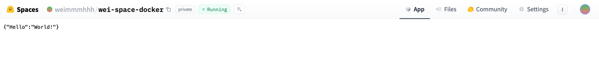

### Static

新建 Space 后默认生成 [index.html](./file/index.html) 和 [style.css](./file/style.css)

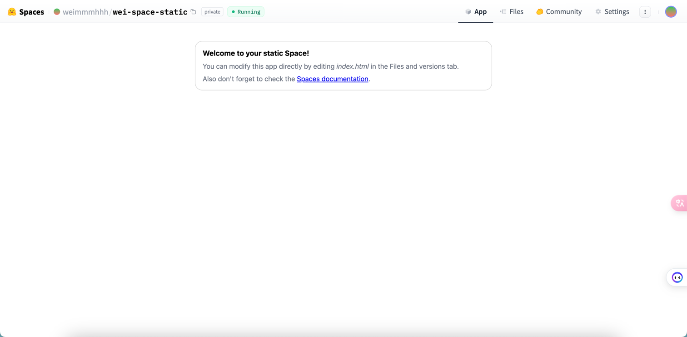


## 五、AutoTrain（自动训练）

[AutoTrain](https://huggingface.co/docs/autotrain/index) 是一个用于自动化训练的库，旨在简化模型训练的过程。它提供了一种简单的方法来定义和训练深度学习模型，自动处理数据加载、批处理、优化器、损失函数等训练过程中的细节。

[Huggingface AutoTrain](https://huggingface.co/autotrain)，入口：Solutions > AutoTrain / 模型详情的 Train。


## 六、推理

- 推理 API

[推理(Inference) API](https://huggingface.co/docs/api-inference/) 是为推理组件提供动力的引擎。通过一个简单的 HTTP 请求，你可以加载 hub 上的任何模型，并在几秒钟内用它预测你的数据，只需要你提供模型的 URL 和一个有效的 hub token。注：前提是使用Hugging Face自己的一套逻辑训练的模型,参考文档：[推理组件](https://huggingface.co/docs/hub/models-widgets)。

用一行代码加载 `xlm-roberta-base` [模型](https://huggingface.co/xlm-roberta-base) 并进行数据预测的案例：

```
curl https://api-inference.huggingface.co/models/xlm-roberta-base \
    -X POST \
    -d '{"inputs": "The answer to the universe is <mask>."}' \
    -H "Authorization: Bearer HF_TOKEN"
```

[例子](https://huggingface.co/openchat/openchat_3.5)

- 推理 Endpoints

[推理 Endpoints](https://huggingface.co/inference-endpoints)


## 七、其它

[HuggingFace 接口](https://api.endpoints.huggingface.cloud/#/)

**著名模型**

[gemma-7b](https://huggingface.co/google/gemma-7b)

**HG DOI**

Huggingface 提供了为您的模型或数据集生成 DOI 的可能性。DOI (数字对象标识符)是唯一标识数字对象的字符串，从文章到图形，包括数据集和模型。DOI 与对象元数据绑定，包括对象的 URL、版本、创建日期、描述等。它们是研究和学术界普遍接受的数字资源参考; 它们类似于一本书的 ISBN。

Hugging Face生态系统还包括用于其他任务的库，例如[数据集处理](https://zh.wikipedia.org/wiki/数据处理)（“Datasets”），模型评估（“Evaluate”），模拟（“Simulate”），以及机器学习演示（“Gradio”）。

**[HG Chart](https://huggingface.co/chat)**

[HuggingFace 最大的数据集 cosmopedia](https://huggingface.co/datasets/HuggingFaceTB/cosmopedia)

TPU（Tensor Processing Unit, 张量处理器）就是谷歌专门为加速深层神经网络运算能力而研发的一款芯片

NPU （NeuralNetworks Process Units）神经网络处理单元。NPU工作原理是在电路层模拟人类神经元和突触，并且用深度学习指令集直接处理大规模的神经元和突触，一条指令完成一组神经元的处理。相比于CPU和GPU，NPU通过突出权重实现存储和计算一体化，从而提高运行效率。

FPGA（Field－Programmable Gate Array）称为现场可编程门阵列，用户可以根据自身的需求进行重复编程。与 CPU、GPU 相比，具有性能高、功耗低、可硬件编程的特点。

FPGA基本原理是在芯片内集成大量的数字电路基本门电路以及存储器，而用户可以通过烧入FPGA 配置文件来定义这些门电路以及存储器之间的连线。这种烧入不是一次性的，可重复编写定义，重复配置。