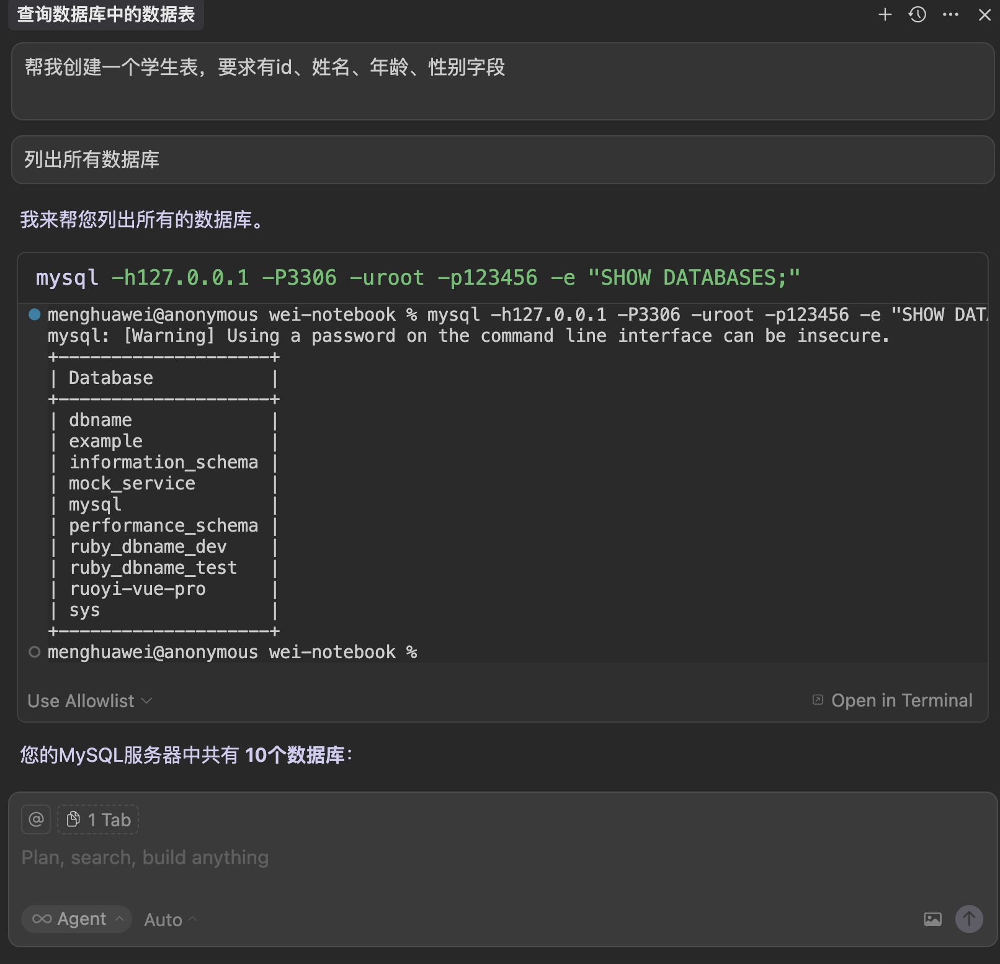

[TOC]

<h1 align="center">MCP</h1>

> By：weimenghua  
> Date：2025.08.17  
> Description：


## MCP 简介

[MCP（Model Context Protocol，模型上下文协议）](https://modelcontextprotocol.io/introduction)  
mcp 由三部分组成，mcp host、mcp client（mcp 会话管理）、mcp server（api 接口）

[MCP 插件市场 mcp.so](https://mcp.so/)  
[MCP 插件市场 smithery.ai](https://smithery.ai/)  
[MCP 插件市场 modelcontextprotocol](https://github.com/modelcontextprotocol/servers)    
[MCP 插件市场 awesome-mcp-servers](https://github.com/punkpeye/awesome-mcp-servers)  
[Gitee MCP Server](https://gitee.com/oschina/mcp-gitee)  


## MCP 配置

[Cursor](https://cursor.sh/)，[MCP 配置](mcp.json)，系统路径：[~/.cursor/mcp.json]( ~/.cursor/mcp.json)，MCP 配置地址：https://docs.cursor.com/tools/mcp


## MCP 常用

### mysql-mcp-server

示例：
1. 列出所有数据库
2. 查询数据库有哪些数据表
3. 创建一个学生表，要求有id、姓名、年龄、性别字段




### excel-mcp-server

示例：
1. 读取 /Users/menghuawei/IdeaProjects/my-project/gitee-work/02.需求测试/公有云/测试用例/测试用例导入样例-项目初始化数据.csv，根据示例数据的要求，在同级别目录下生成包含 1000 条数据的 测试用例导入样例-1000条.csv 文件，要求：模块名称随机为：项目管理、问题管理、文档管理、代码管理、目录1/目录2/目录3，用户名随机为：git、admin、gitee、gitqa，根据模块名称生成符合规范的用例名称（把用例名称的必填项改为具体的用例名称，例如：代码管理 - 用例 01 - 新建工作项）、步骤描述、预期结果，如果文件存在则直接覆盖
2. 把 测试用例导入样例-1000条.csv 转换为 测试用例导入样例-1000条.xlsx


### playwright-mcp-server

[playwright-mcp](https://github.com/microsoft/playwright-mcp)

示例：代码托管测试
1. 访问 gitee.com 输入账号：gitee5566，密码：gitee5566 登录首页
2. 点击【我的】下拉框选择【高级测试版】进入企业工作台
3. 切换到【代码】，新建仓库，名称为 仓库-playwright-mcp-{当前时间}，并初始化 README.md 文件
4. 进入仓库代码页，进入分支页面，新建分支，名称为 branch-playwright-mcp-{当前时间}
5. 进入仓库代码页，进入标签页面，新建标签，名称为 tag-playwright-mcp-{当前时间}
6. 切换到【工作项】，新建工作项，名称为 工作项-playwright-mcp-{当前时间}
7. 切换到【项目】，新建项目，名称为 项目-playwright-mcp-{当前时间}

使用 playwright-mcp-server 运行
并将代码写到 /Users/menghuawei/IdeaProjects/my-project/wei-notebook/a_tmp/tmp 目录下
并将代码写到 /Users/menghuawei/PycharmProjects/my-project/api-autotest/testcase/ui_testcase 目录下


### redis-mcp-server

示例：
1. 创建一些 key-value 示例
2. 查看所有 key


### Apifox MCP Server

[Apifox MCP Server](https://docs.apifox.com/apifox-mcp-server)，可以将 Apifox 的接口文档提供给 Cursor 等支持 AI 编程的 IDE，或其他支持 MCP 的 AI 工具。 有了 Apifox MCP Server，开发者就可以通过 AI 助手完成以下工作：根据接口文档生成或修改代码、搜索接口文档内容等等。[帮助文档](https://apifox.com/apiskills/cursor-apifox-mcp-server/)

将下面 JSON 配置添加到 IDE 对应的 MCP 配置( ~/.cursor/mcp.json)文件里：

```JSON
{
  "mcpServers": {
    "API 文档": {
      "command": "npx",
      "args": [
        "-y",
        "apifox-mcp-server@latest",
        "--oas=<oas-url-or-path>"
      ]
    }
  }
}
```

其中 `<oas-url-or-path>` 可以是:  
远程 URL，如：https://petstore.swagger.io/v2/swagger.json  
本地文件路径，如：`~/data/petstore/swagger.json`

Cursor 集成 MCP 读取 [Gitee API](https://gitee.com/api/v5/swagger#/getV5ReposOwnerRepoSubscribers?ex=no)  
在线接口地址：https://gitee.com/api/v5/swagger_doc.json  
本地接口地址：/Users/menghuawei/PycharmProjects/my-project/api-autotest/file/gitee-apiv5.json

测试案例：
1. 通过 MCP 获取 API 文档，并告诉我项目中有几个接口
2. 通过 MCP 获取 API 文档，生成关于仓库有哪些接口
3. 通过 MCP 获取 API 文档，生成创建一个仓库接口的 CURL 示例
4. 通过 MCP 获取 API 文档，使用 Python+ Flask 生成新建仓库接口的 Mock Server
