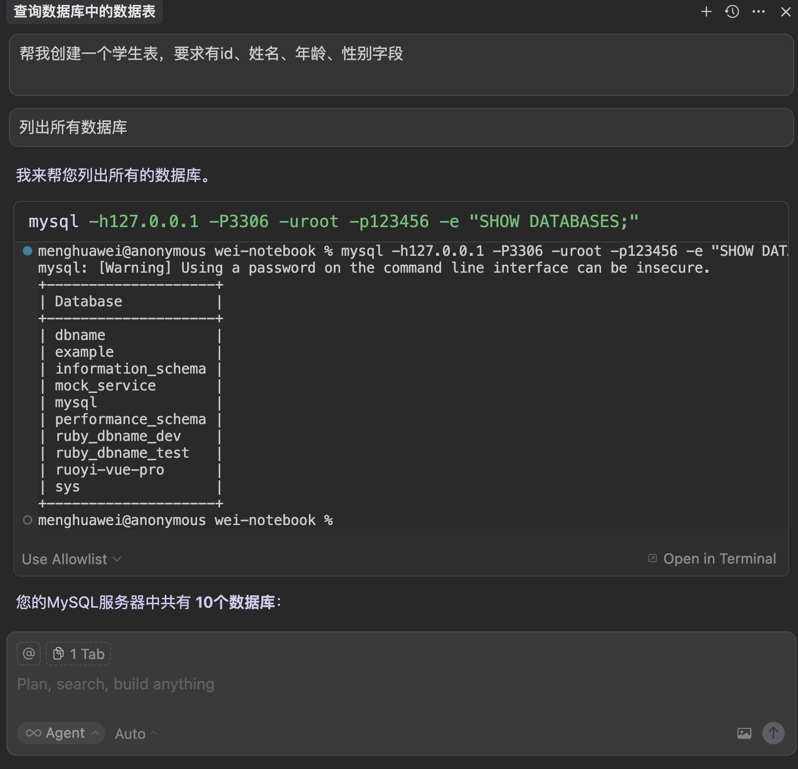

[TOC]

<h1 align="center">MCP</h1>

> By：weimenghua  
> Date：2025.08.17  
> Description：

## MCP 简介

[MCP（Model Context Protocol，模型上下文协议）](https://modelcontextprotocol.io/introduction)  
mcp 由三部分组成，mcp host、mcp client（mcp 会话管理）、mcp server（api 接口）

MCP 插件市场 
- [mcp.so](https://mcp.so/)  
- [smithery.ai](https://smithery.ai/)  
- [modelcontextprotocol](https://github.com/modelcontextprotocol/servers)    
- [awesome-mcp-servers](https://github.com/punkpeye/awesome-mcp-servers)  

## MCP 配置

以 [Cursor ](https://cursor.com) 为示例，[MCP 配置](完整AI工作流配置/cursor/mcp.json)，系统路径：[~/.cursor/mcp.json]( ~/.cursor/mcp.json)

## MCP 常用

### gitee

- 社区版：https://gitee.com/oschina/mcp-gitee  
- 企业版：https://gitee.com/oschina/mcp-gitee-ent

### mysql-mcp-server

示例：
1. 列出所有数据库
2. 查询数据库有哪些数据表
3. 创建一个学生表，要求有id、姓名、年龄、性别字段

### excel-mcp-server

示例：
1. 读取 /Users/menghuawei/workspace/my-project/gitee-work/02.需求测试/公有云/测试用例/测试用例导入样例-项目初始化数据.csv，根据示例数据的要求，在同级别目录下生成包含 1000 条数据的 测试用例导入样例-1000条.csv 文件，要求：模块名称随机为：项目管理、问题管理、文档管理、代码管理、目录1/目录2/目录3，用户名随机为：git、admin、gitee、gitqa，根据模块名称生成符合规范的用例名称（把用例名称的必填项改为具体的用例名称，例如：代码管理 - 用例 01 - 新建工作项）、步骤描述、预期结果，如果文件存在则直接覆盖
2. 把 测试用例导入样例-1000条.csv 转换为 测试用例导入样例-1000条.xlsx

### playwright-mcp-server

[playwright-mcp](https://github.com/microsoft/playwright-mcp)

示例：代码托管测试
1. 访问 gitee.com 输入账号：admin，密码：123456 登录首页
2. 点击【我的】下拉框选择【高级测试版】进入企业工作台
3. 切换到【代码】，新建仓库，名称为 仓库-playwright-mcp-{当前时间}，并初始化 README.md 文件
4. 进入仓库代码页，进入分支页面，新建分支，名称为 branch-playwright-mcp-{当前时间}
5. 进入仓库代码页，进入标签页面，新建标签，名称为 tag-playwright-mcp-{当前时间}
6. 切换到【工作项】，新建工作项，名称为 工作项-playwright-mcp-{当前时间}
7. 切换到【项目】，新建项目，名称为 项目-playwright-mcp-{当前时间}

### redis-mcp-server

示例：
1. 创建一些 key-value 示例
2. 查看所有 key

## 如何实现 MCP 工具

## 知识碎片

