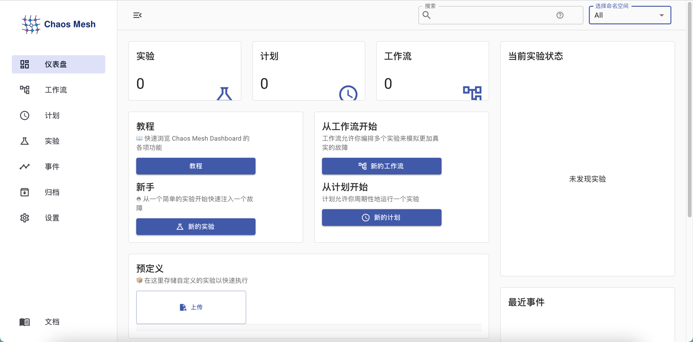

[TOC]

---

<h1 align="center">ChaosMesh</h1>

> By：weimenghua  
> Date：2023.04.08  
> Description：ChaosMesh 混沌工程实验工具

**参考资料**  
[ChaosMesh 官网](https://chaos-mesh.org/zh/)    
[ChaosMesh 源码](https://github.com/chaos-mesh)


## 一、Chaos Mesh 简介

Chaos Mesh 是一个开源的云原生混沌工程平台，提供丰富的故障模拟类型，具有强大的故障场景编排能力，方便用户在开发测试中以及生产环境中模拟现实世界中可能出现的各类异常，帮助用户发现系统潜在的问题。Chaos Mesh 提供完善的可视化操作，旨在降低用户进行混沌工程的门槛。用户可以方便地在 Web UI 界面上设计自己的混沌场景，以及监控混沌实验的运行状态。


## 二、Chaos Mesh 搭建

### 2.1 kubertnetes 安装

[快速试用](https://chaos-mesh.org/zh/docs/quick-start/)

参考 [k3s 搭建](../Kubernetes/K3S.md)

```
快速试用 k3s
curl -sSL https://mirrors.chaos-mesh.org/v2.6.0/install.sh | bash -s -- --k3s

查看 Chaos Mesh 的运行情况
kubectl get po -n chaos-mesh

查看混沌实验相关的对象
for i in $(kubectl api-resources | grep chaos-mesh | awk '{print $1}'); do kubectl get $i -A; done

卸载 Chaos Mesh
curl -sSL https://mirrors.chaos-mesh.org/v2.6.0/install.sh | bash -s -- --template | kubectl delete -f -
或者
kubectl delete ns chaos-mesh --force --grace-period=0
```

**Chaos Mesh 仪表盘**

```
查看 chaos-dashboard 的端口
kubectl get svc -n chaos-mesh |grep chaos-dashboard

在主机上开放 chaos-dashboard 的端口，访问地址：
http://127.0.0.1:31903
```



### 2.2 主机安装

```
设置变量
export CHAOSD_VERSION=latest

下载安装包
curl -fsSLO https://mirrors.chaos-mesh.org/chaosd-$CHAOSD_VERSION-linux-amd64.tar.gz

解压安装包并复制到 /usr/local 目录下
tar zxvf chaosd-$CHAOSD_VERSION-linux-amd64.tar.gz && sudo mv chaosd-$CHAOSD_VERSION-linux-amd64 /usr/local/

设置环境变量
export PATH=/usr/local/chaosd-$CHAOSD_VERSION-linux-amd64:$PATH

注：重启后环境变量会失效，重新执行命令或者写到环境变量配置中
```


## 三、Chaos Mesh 实验

### 3.1 物理机

模拟磁盘故障

```
chaosd attack disk add-payload write -s 2G -n 8

在 chaosd 目录下生成一个大文件 example4134043762

检查
du -sh * | sort -n
```

