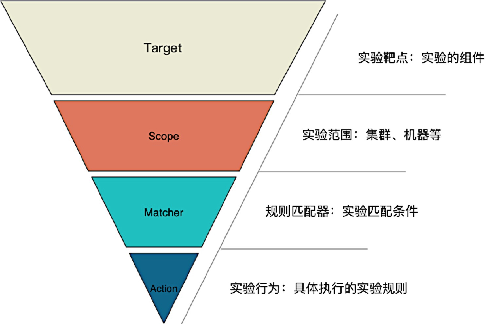

[TOC]

---

<h1 align="center">混沌工程</h1>

> By：weimenghua  
> Date：2022.11.20    
> Description：混沌工程

**参考资料**  
[awesome-chaos-engineering](https://github.com/dastergon/awesome-chaos-engineering)  
[awesome-chaosblade](https://github.com/chaosblade-io/awesome-chaosblade)  
[ChaosBlade 官网](https://chaosblade.io/)  
[ChaosBlade 文档](https://chaosblade-io.gitbook.io/chaosblade-help-zh-cn/)  
[ChaosBlade 源码](https://github.com/chaosblade-io)

## 一、混沌工程
**参考资料**
[混沌工程介绍与实践](https://github.com/chaosblade-io/awesome-chaosblade/blob/master/articles/%E6%B7%B7%E6%B2%8C%E5%B7%A5%E7%A8%8B%E4%BB%8B%E7%BB%8D%E4%B8%8E%E5%AE%9E%E8%B7%B5.md)

### 1、定义
混沌工程不是无目的地随机注入故障而是通过精心计划的实验在受控环境中注入故障，以建立对应用程序和工具的信心，以承受动荡的条件。

### 2、目的
混沌工程的目的是给复杂的分布式系统引入扰动，并观察系统行为，借此发现系统弱点。  
混沌工程进行的是探索系统复杂性的开放实验，目的是改善原有的系统架构和运维模式，加强业务服务的健壮性。

### 3、过程
1、通过创建破坏性事件（例如服务器中断或 API 限制）来对测试或生产环境中的应用程序施加压力  
2、观察系统如何响应  
3、实施改进

### 4、意义
让我们对未知做好了准备：
1、提高了系统弹性
2、暴露监控、可观察性和警报盲点
3、提高恢复时间和操作技能

### 5、模型
**混沌工程实验模型**

**混沌工程实验：一个持续性迭代的闭环体系**  
> 架构抵御故障的能力：通过对实验对象的架构高可用性的分析和评估，找出潜在的系统单点风险，确定合理的实验范围。  
> 实验指标设计：评估目前实验对象判定业务正常运行所需的业务指标、应用健康状况指标和其他系统指标。  
> 实验环境选择：选择实验对象可以应用的实验环境：开发、测试、预生产、生产。  
> 实验工具使用：评估目前实验对象对实验工具的熟悉程度。  
> 故障注入场景及爆炸半径：讨论和选择可行的故障注入场景，并评估每个场景的爆炸半径。  
> 实验自动化能力：衡量目前实验对象的平台自动化实施能力。  
> 环境恢复能力：根据选定的故障注入场景，评估实验对象对环境的清理和恢复能力。  
> 实验结果整理：根据实验需求，讨论确定实验结果和解读分析报告的内容项。  
> 故障注入测试：故障注入测试是从系统的故障状态开始，测试系统在发生故障后的运行规律。  

## 二、故障类型
### 1、系统故障
1. cpu 负载高
2. 内存负载高
3. 磁盘负载高
4. 集群重启

### 2、中间件故障
1. 主备切换
2. 数据库-连接数满

### 2、应用故障
1. 服务重启

## 三、可用性测试场景
[在线链接](https://www.processon.com/mindmap/64d4b12c4e65c16610356c4e)

