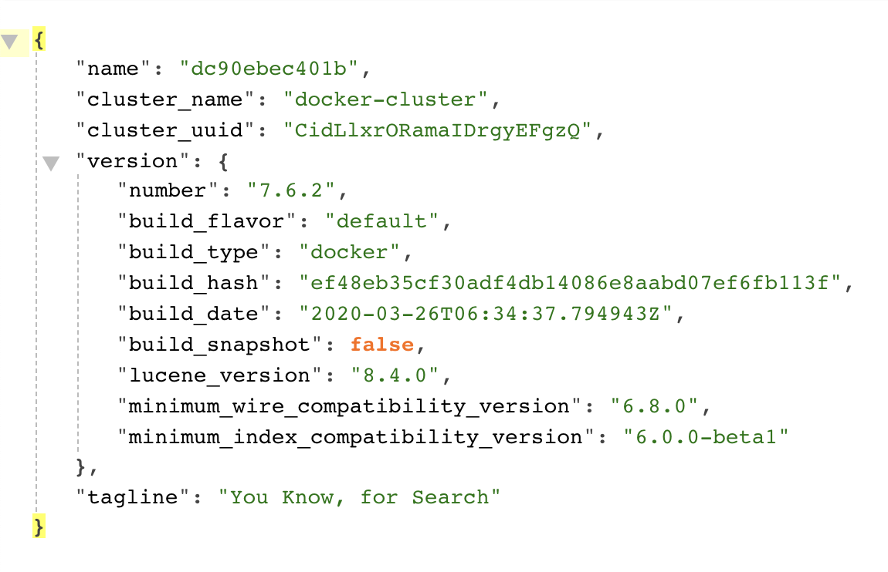

[TOC]

<h1 align="center">Elasticsearch 全文检索引擎</h1>

> By：weimenghua  
> Date：2023.09.02  
> Description：


## 一、Elasticsearch 简介

### ELK

The Elastic Stack, 包括 Elasticsearch、Kibana、Beats和Logstash（也称为 ELK Stack）。能够安全可靠地获取任何来源、任何格式的数据，然后实时地对数据进行搜索、分析和可视化。Elaticsearch，简称为 ES，ES 是一个开源的高扩展的分布式全文搜索引擎，是整个 Elastic Stack 技术栈的核心。它可以近乎实时的存储、检索数据；本身扩展性很好，可以扩展到上百台服务器，处理PB级别的数据。


### 基本概念

| cluster  | 整个elasticsearch 默认就是集群状态，整个集群是一份完整、互备的数据 |
| -------- | ------------------------------------------------------------ |
| node     | 集群中的一个节点，一般只一个进程就是一个node                 |
| shard    | 分片，即使是一个节点中的数据也会通过hash算法，分成多个片存放，默认是5片 |
| index    | 相当于rdbms的database, 对于用户来说是一个逻辑数据库，虽然物理上会被分多个shard存放，也可能存放在多个node中 |
| type     | 类似于rdbms的table，但是与其说像table，其实更像面向对象中的class , 同一Json的格式的数据集合 |
| document | 类似于rdbms的 row、面向对象里的object                        |
| field    | 相当于字段、属性                                             |

Elasticsearch比传统关系型数据库如下：
> Relational DB ‐> Databases ‐> Tables ‐> Rows ‐> Columns
> Elasticsearch ‐> Indices ‐> Types ‐> Documents ‐> Fields


## 二、Elasticsearch 环境搭建

[Elasticsearch 下载地址](https://www.elastic.co/cn/downloads/elasticsearch)

### Docker

启动 Elasticsearch 容器
```
docker network create my-network

docker run -d \
--name elasticsearch \
--network my-network \
-p 9200:9200 \
-e "discovery.type=single-node" \
elasticsearch:7.6.2
```

访问地址
`http://127.0.0.1:9200/`



启动 Elasticsearch-head 容器
```
docker run -d \
--name elasticsearch-head \
-p 9100:9100 \
mobz/elasticsearch-head:5
```

访问地址
`http://127.0.0.1:9200/`


修改 conf\jvm.option 文件
将#-Xms2g                                  
#-Xmx2g修改成为：
```
-Xms340m
-Xmx340m
```
否则因为虚拟机内存不够无法启动

config\elasticsearch.yml 中末尾加入：
```
http.cors.enabled: true
http.cors.allow-origin: "*"
network.host: 127.0.0.1
```
目的是使ES支持跨域请求


## 三、Elasticsearch 基本操作

### 索引操作

1. API 检测集群是否健康
方法：get
请求：http://127.0.0.1:9200/_cat/health?v
响应：


2. 获取集群的节点列表
方法：get
请求：http://127.0.0.1:9200/_cat/nodes?v
响应：


3. 创建索引
方法：put
请求：http://127.0.0.1:9200/person
请求体：
注意：默认情况下，创建的索引分片数量是 5 个，副本数量是 1 个。可以通过如下方式修改默认值：
number_of_shards 分片
number_of_replicas 备份

```
{
    "settings": {
        "number_of_shards": 6,
        "number_of_replicas": 2
    }
}
```

响应：
`{'acknowledged': True, 'shards_acknowledged': True, 'index': 'person'}`


4. 查看所有索引
方法：get
请求：http://127.0.0.1:9200/_cat/indices?v
响应：


| 响应字段       | 说明                                                         |
| -------------- | ------------------------------------------------------------ |
| health         | green(集群完整) yellow(单点正常、集群不完整) red(单点不正常) |
| status         | 是否能使用                                                   |
| index          | 索引名                                                       |
| uuid           | 索引统一编号                                                 |
| pri            | 主节点几个                                                   |
| rep            | 从节点几个                                                   |
| docs.count     | 文档数                                                       |
| docs.deleted   | 文档被删了多少                                               |
| store.size     | 整体占空间大小                                               |
| pri.store.size | 主节点占空间                                                 |


5. 查看单个索引
方法：get
请求：http://127.0.0.1:9200/person
响应：


6. 删除索引
方法：delete
请求：http://127.0.0.1:9200/person
响应：
`{'acknowledged': True}`


### 文档操作

文档：即索引库中某个类型下的数据，类比做数据库中的每一行数据。

1. 创建文档
方法：post
请求：http://127.0.0.1:9200/person/_doc/1
```
{
   "name":"wei",
   "age":30
}
```
响应：  
```
{'_index': 'person', '_type': '_doc', '_id': '1', '_version': 1, 'result': 'created', '_shards': {'total': 2, 'successful': 1, 'failed': 0}, '_seq_no': 0, '_primary_term': 1}
```

说明：此处发送请求的方式必须为 post，不能是 put，否则会发生错误。这里是因为put是一个幂等的请求，post生成的id是随机的。使用JMeter创建文档时注意设置编码：utf-8，否则中文会变成???


2. 查看单个文档
方法：get
请求：http://127.0.0.1:9200/person/_doc/1
响应：


说明：查看文档时，需要指明文档的唯一性标识，类似于 MySQL 中数据的主键查询


3. 查看多个文档
方法：get
请求：http://127.0.0.1:9200/person/_search // <index_name>/_search
响应：


4. 修改文档
方法：post
请求：http://127.0.0.1:9200/person/_doc/1
{
"name":"weiwei",
"age":18
}
响应：  
```
{'_index': 'person', '_type': '_doc', '_id': '1', '_version': 2, 'result': 'updated', '_shards': {'total': 2, 'successful': 1, 'failed': 0}, '_seq_no': 1, '_primary_term': 1}
```


5. 删除文档
方法：delete
请求：http://127.0.0.1:9200/person/_doc/1
响应：  
```
{'_index': 'person', '_type': '_doc', '_id': '1', '_version': 3, 'result': 'deleted', '_shards': {'total': 2, 'successful': 1, 'failed': 0}, '_seq_no': 2, '_primary_term': 1}
```


### curl 操作索引和文档
```
创建索引
curl -XPUT "http://127.0.0.1:9200/<index_name>"

查看所有索引
curl -XGET "http://127.0.0.1:9200/_cat/indices/?v&pretty&h=index,pri,rep,docs.count,docs.deleted,store.size,pri.store.size"

查看索引内的前 n 个文档
curl -XGET "http://127.0.0.1:9200/<index_name>/_search?size=10"

删除索引
curl -XDELETE "http://127.0.0.1:9200/<index_name>"

创建文档
curl -XPUT "http://127.0.0.1:9200/<index_name>/_doc/<document_id>" -d '{"field1": "value1", "field2": "value2"}'

更新文档
curl -XPOST "http://127.0.0.1:9200/<index_name>/_update/<document_id>" -d '{"doc": {"field1": "new_value"}}'

查看单个文档(文档id根据 <查看索引内的前 n 个文档> 接口获取)
curl -XGET "http://127.0.0.1:9200/<index_name>/_doc/<document_id>"

搜索文档
curl -XPOST "http://127.0.0.1:9200/<index_name>/_search" -d '{"query": {"match": {"field": "value"}}}'

聚合查询
curl -XPOST "http://127.0.0.1:9200/<index_name>/_search" -d '{"aggs": {"agg_name": {"aggregation_type": {"field": "field_name"}}}}'

删除文档
curl -XDELETE "http://127.0.0.1:9200/<index_name>/_doc/<document_id>"
```


### 其它
k8s endpoint
```
username:password@elasticsearch-client.comm.svc.cluster.local:9200
```