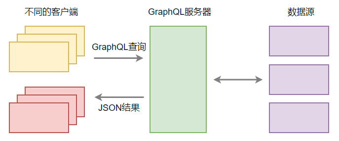

[TOC]

<h1 align="center">GraphQL</h1>

> By：weimenghua  
> Date：2023.01.30  
> Descrition：GraphQL  

**参考资料**  
[Graphql 官网](https://graphql.org/)  
[Graphql 源码](https://github.com/graphql)  
[神秘的 GraphQL-介绍篇](https://mp.weixin.qq.com/s/ToTWIObU68FefrauZmyVkw)

### 一、什么是 GraqhQL？

简单的说，GraphQL 查询是一段字符串，发送给服务器进行解析和执行，然后以将 JSON 返回给调用方。

### 二、了解 GrapQL 规范

- 字段（Fields）
在 GraphQL 的查询中，请求结构中包含了所预期结果的结构，这个就是字段。并且响应的结构和请求结构基本一致，这是 GraphQL 的一个特性，这样就可以让请求发起者很清楚的知道自己想要什么。
- 参数（Arguments）
在查询数据时，离不开传递参数，在 GraphQL 的查询中，也是可以传递参数的，语法∶(参数名:参数值)
- 别名（Aliases）
如果一次查询多个相同对象，但是值不同，这个时候就需要起别名了，否则 json 的语法就不能通过了。
- 片段（Fragments）
片段使你能够组织一组字段，然后在需要它们的地方引入。
- [Schema 和类型](https://graphql.cn/learn/schema/)[Schema](https://so.csdn.net/so/search?q=Schema&spm=1001.2101.3001.7020) 是用于定义数据结构的，比如说，User 对象中有哪些属性，对象与对象之间是什么关系等。
- 接口（Interfaces）
跟许多类型系统一样，GraphQL 支持接口。一个接口是一个抽象类型，它包含某些字段，而对象类型必须包含这些字段，才能算实现了这个接口。