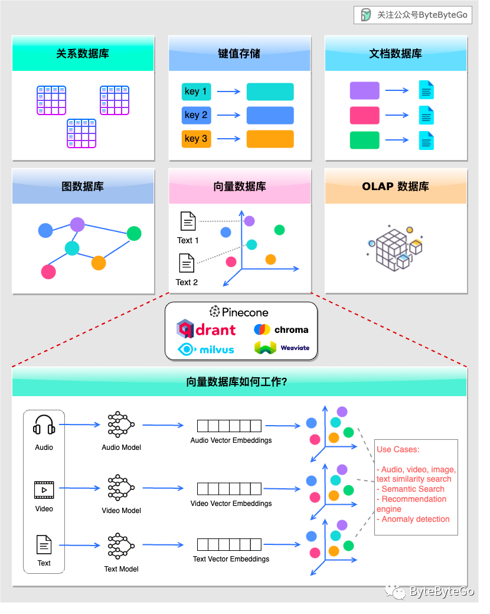

[TOC]

<h1 align="center">向量数据库</h1>

> By：weimenghua  
> Date：2023.12.03  
> Description：  


### 1. 向量数据库简介

[什么是向量数据库？](https://aws.amazon.com/cn/what-is/vector-databases/)

向量数据库（Vector Database）是一种存储和管理非结构化数据（如文本、图像或音频）的数据库，它使用向量嵌入（高维向量）来快速查找和检索相似的对象。

向量数据库的应用场景非常广泛，包括：推荐系统、图像检索、自然语言处理、人脸识别和图像搜索、音频识别、实时数据分析、物联网以及生物信息学等。

关系型数据库和向量数据库之间的区别是什么？  
关系型数据库和向量数据库的主要区别在于它们存储的数据类型。关系型数据库设计用于存储适应表格形式的结构化数据，而向量数据库则适用于非结构化数据，例如文本或图像。  
存储的数据类型也影响着数据的检索方式：在关系型数据库中，查询结果基于对特定关键词的匹配。而在向量数据库中，查询结果基于相似性。  

- Embedding 将非结构化数据转换为向量数据
embedding 中文翻译是“嵌入”，在⾃然语⾔处理和机器学习领域，"embeddings"是指将单词、短语或⽂本等离散变量转换成连续向量空间的过程。这个向量空间通常被称为嵌⼊空间（embedding space），⽽⽣成的向量则称为嵌⼊向量（embedding vector）或向量嵌⼊（vector embedding）。
- Token 是指文本数据处理的基本单元

常见向量数据库
- [Milvus](https://milvus.io/)
- Pipecone
- Chroma
- Weaviate
- pgvector


### 2. 向量数据库使用场景

向量数据库在许多领域都有重要的使用场景，特别是在处理大规模、复杂的向量数据时，它们能够发挥出很大的优势。以下是一些向量数据库的使用场景：

1. 图像搜索与识别：向量数据库可以用于存储和查询大量的图像向量，通过相似度计算来实现图像搜索和识别功能，例如人脸识别、图像相似搜索等。
2. 自然语言处理：在文本数据处理中，向量数据库可用于存储和查询词向量、句向量等，以实现文本相似度计算、关键词提取、语义匹配等应用。
3. 推荐系统：向量数据库可以存储用户和商品向量，通过计算用户与商品之间的相似度来实现个性化推荐功能。
4. 机器学习模型存储：向量数据库可以用于存储训练好的机器学习模型的向量表示，方便模型的快速查询和部署。
5. 医学图像处理：在医学图像处理中，向量数据库可以存储医学图像的特征向量，用于快速检索和匹配。
6. 智能物联网：在物联网领域，向量数据库可用于存储传感器数据的向量表示，用于设备状态监测和分析。
7. 视频检索：向量数据库可以用于存储视频特征向量，实现视频检索和相似视频推荐。
8. 广告定向投放：向量数据库可用于存储用户的兴趣向量和广告的属性向量，实现更精准的广告定向投放。
9. 金融风控：向量数据库可用于存储用户的行为向量和交易特征向量，用于金融风控和反欺诈。

参考文档 [向量数据库有什么用？](https://mp.weixin.qq.com/s/uptD2quyMzS03NUqp7rdsw)




### 3. 腾讯云向量数据库

[腾讯云向量数据库](https://cloud.tencent.com/product/vdb)， 详细可查看[帮助文档](https://cloud.tencent.com/document/product/1709/94945)。

[连接并写入向量数据](https://cloud.tencent.com/document/product/1709/95102)

使用 /database/create 创建名为db_test 的数据库
```
curl -i -X POST \
 -H 'Content-Type: application/json' \
 -H 'Authorization: Bearer account=root&api_key=A5VOgsMpGWJhUI0WmUbY********************' \
http://127.0.0.1:80/database/create \
 -d '{
 "database": "db-test"
 }'
```
