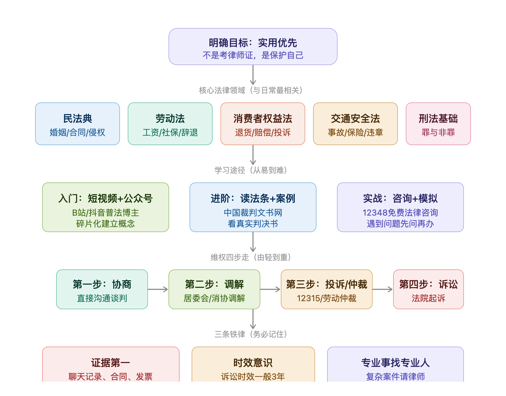

# 普通人学法维权：从入门到实战

## 一、先摆正心态

学法律不是为了背法条、考律师证，而是**知道自己的权利边界在哪，被侵犯了该怎么反应**。普通人需要的是"法律直觉"，不是法律专业知识体系。

## 二、核心法律领域（优先学这5个）

这五个领域覆盖了普通人 90% 以上的法律需求：

### 1. 民法典

万法之母。婚姻家庭（结婚离婚财产分割）、合同纠纷（租房、买卖、借款）、侵权责任（被伤害怎么赔）、物权（房子车子归谁）。2021年生效的《民法典》把原来散落的法律整合在一起了，是目前最该了解的一部法。

### 2. 劳动法 / 劳动合同法

打工人必备。试用期规定、加班费计算、违法解除劳动合同的赔偿金（2N）、社保缴纳义务、工伤认定。这些知识在你和公司产生矛盾时，直接关系到真金白银。

### 3. 消费者权益保护法

买买买必备。七天无理由退货、三倍赔偿（欺诈）、十倍赔偿（食品安全）、格式条款无效情形。知道这些，网购维权心里有底。

### 4. 道路交通安全法

出行必备。事故责任划分、保险理赔流程、酒驾醉驾的法律后果。尤其是出了事故后第一时间该做什么、不该说什么。

### 5. 刑法基础

不是为了打官司，是为了**不踩线**。知道哪些行为可能构成犯罪（比如帮人转账可能构成帮信罪），关键时刻能保自己。

## 三、学习途径（由浅入深三层）

### 第一层：建立概念（碎片时间即可）

- B站、抖音上有很多靠谱的普法博主，搜"民法典解读""劳动法科普"
- 关注"最高人民法院""司法部"的公众号，会有典型案例发布
- 这个阶段的目标：听到法律术语不陌生，知道大概是什么意思

### 第二层：深入理解（需要专门时间）

- 去 **国家法律法规数据库**（flk.npc.gov.cn）读原文法条，不用全读，遇到问题查对应条款
- 去 **中国裁判文书网**（wenshu.court.gov.cn）搜类似案例，看法院怎么判的、引用了哪些法条
- 看判决书是最高效的学习方式——一个真实案例胜过十篇普法文章

### 第三层：实战演练

- 遇到问题先打 **12348** 免费法律咨询热线，把情况说清楚，让专业人士给你方向
- 各地都有**法律援助中心**，经济困难可以申请免费律师
- 复杂案件不要自己硬上，该请律师就请律师，律师费在很多案件中可以要求对方承担

## 四、维权四步走

遇到权益被侵犯，按这个顺序来，不要一上来就打官司：

| 步骤 | 方式 | 适用场景 | 成本 |
|------|------|----------|------|
| 第一步 | **协商** | 对方愿意沟通的情况 | 零成本，最快 |
| 第二步 | **调解** | 协商不成但不想撕破脸 | 居委会/消协/人民调解委员会，免费 |
| 第三步 | **投诉/仲裁** | 调解无效 | 12315投诉或劳动仲裁，免费或低成本 |
| 第四步 | **诉讼** | 以上全部走不通 | 需要交诉讼费，可请律师 |

> 劳动纠纷比较特殊：必须先走**劳动仲裁**才能起诉法院，这叫"仲裁前置"，直接去法院不受理。

## 五、三条铁律（最重要）

### 1. 证据第一

没有证据，法律也帮不了你。日常生活中养成留存证据的习惯：

- 签合同一定要留原件或拍照
- 微信聊天记录不要删，关键对话可以录屏
- 大额交易保留转账记录和发票
- 遇到纠纷第一时间录音（合法的，你自己参与的对话可以录）

### 2. 时效意识

法律不保护躺在权利上睡觉的人：

- 民事诉讼时效一般 **3年**（从知道权利被侵害之日起算）
- 劳动仲裁申请时效 **1年**
- 超过时效再主张，对方可以合法拒绝

### 3. 专业事找专业人

法律知识让你有判断力，但真正打官司还是需要专业人士。尤其是涉及较大金额或复杂法律关系的案件，律师的价值远超律师费。经济困难可以申请法律援助。

## 六、常用维权资源（建议保存）

| 热线/平台 | 用途 |
|-----------|------|
| **12315** | 消费者投诉举报（购物、餐饮、服务纠纷） |
| **12348** | 免费法律咨询热线（司法部公共法律服务） |
| **12333** | 人社热线（劳动纠纷、社保、工资拖欠） |
| **12345** | 政务服务便民热线（综合投诉，可转各部门） |
| **中国裁判文书网** | wenshu.court.gov.cn 查真实判决案例 |
| **国家法律法规数据库** | flk.npc.gov.cn 查法条原文 |
| **12348中国法网** | 12348.gov.cn 在线法律咨询 |

## 总结

普通人学法的核心不是"学会打官司"，而是"养成法律思维"——遇事知道有没有理、该找谁、怎么留证据、在什么时效内行动。真正到了诉讼阶段，把专业的事交给专业的人。

