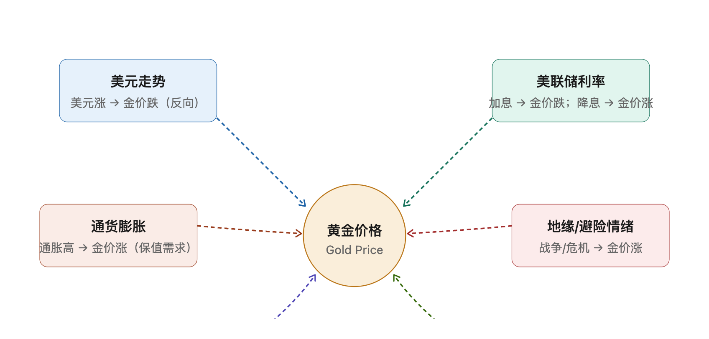

[TOC]

<h1 align="center">黄金</h1>

> By: weimenghua  
> Date: 2024.08.17   
> Description: 

## 黄金分类
- 普通黄金
- 3D硬金
- 5D硬金
- 5G黄金
- 古法黄金
- 珐琅烧蓝

## 黄金纯度
- 足金
- 99%
- K金
- 9k
- 14k
- 18k
- 24k

## 黄金工艺
- 3D硬金
- 5D硬金
- 5G黄金
- 古法黄金

## 影响黄金价格的核心因素

六大核心因素，一句话总结：**美元和利率是定价锚，避险和通胀是催化剂，央行和供需是长期支撑。**

### 1. 美元走势（反向关系）

黄金以美元计价。美元走强 → 金价下跌；美元走弱 → 金价上涨。两者通常呈反向走势。

### 2. 美联储利率（核心定价锚）

加息 → 持有黄金的机会成本上升（黄金不生息）→ 金价跌。降息 → 持有黄金成本下降 → 金价涨。**这是影响金价最直接的因素。**

### 3. 通货膨胀（保值需求）

通胀高企时货币购买力下降，黄金作为传统保值工具需求上升 → 金价涨。

### 4. 地缘政治 / 避险情绪

战争、冲突、金融危机等不确定性事件 → 资金涌入避险资产 → 金价涨。这类事件往往是金价短期暴涨的直接推手。

### 5. 央行买卖

各国央行是黄金最大持有者。近年新兴市场央行（中国、印度、俄罗斯等）持续增持黄金储备 → 为金价提供长期支撑。

### 6. 供需关系

矿产产量下降、首饰/工业需求增长 → 供不应求推高金价。不过供需对短期金价影响相对较小，更多影响长期趋势。

> 看金价走势，先盯美联储和美元，再看有没有避险事件催化。

