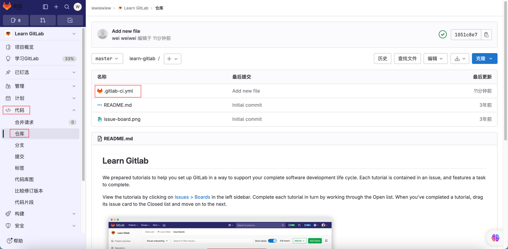
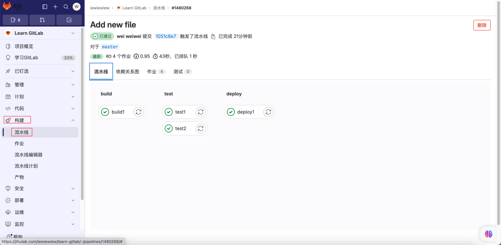

[TOC]

<h1 align="center">GitLab 代码托管</h1>

> By：weimenghua  
> Date：2023.08.14  
> Description：

**参考资料**  
[安装 Gitlab Runner](../Docker/Docker%20安装软件.md)  
[设置 Gitlab Runner](https://jihulab.com/iewiewiew/learn-gitlab/-/settings/ci_cd)

@todo：使用 Docker 部署 JavaWeb

### GitLab Runner

1、进入 GitLab 的仓库 > 设置 > CI/CD > Runner，新建项目 Runner，注册 GitLab Runner，执行 `gitlab-runner register  --url https://jihulab.com  --token <token>`


输入Gitlab实例的地址
输入token
输入Runner的描述
输入与Runner关联的标签
输入Runner的执行器
设置执行器的版本，alpine:latest

2、进入 GitLab 的仓库 > 代码，在项目根目录添加 `.gitlab-ci.yml`，可以选择模板，详细可参考 [gitlab-ci](https://docs.gitlab.cn/jh/ci/yaml/index.html)



此处选择 Bash 模板，模板内容如下：

```
image: busybox:latest

before_script:
- echo "Before script section"
- echo "For example you might run an update here or install a build dependency"
- echo "Or perhaps you might print out some debugging details"

after_script:
- echo "After script section"
- echo "For example you might do some cleanup here"

build1:
stage: build
script:
- echo "Do your build here"

test1:
stage: test
script:
- echo "Do a test here"
- echo "For example run a test suite"

test2:
stage: test
script:
- echo "Do another parallel test here"
- echo "For example run a lint test"

deploy1:
stage: deploy
script:
- echo "Do your deploy here"
environment: production
```

3、进入 GitLab 的构建 > 流水线，查看流水线构建情况


