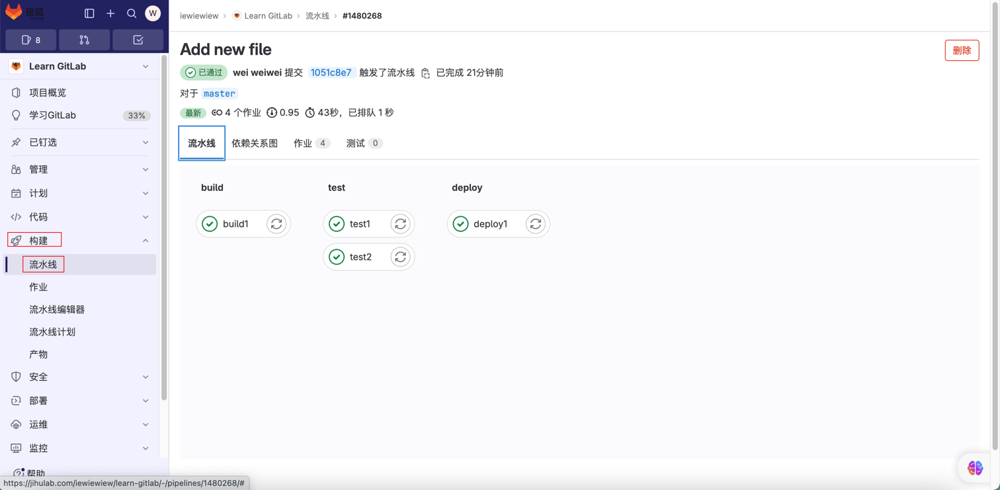

[TOC]

<h1 align = "center">代码托管平台</h1>

> By: weimenghua  
> Date: 2022.07.04  
> Description:

### 1. GitHub

[GitHub Packages](https://docs.github.com/en/packages)  
[GitHub 的镜像仓库地址](https://ghcr.io)

```text
docker login ghcr.io -u USERNAME -p TOKEN

docker tag IMAGE_NAME:TAG ghcr.io/USERNAME/REPO_NAME:TAG

docker push ghcr.io/USERNAME/REPO_NAME:TAG

docker pull ghcr.io/USERNAME/REPO_NAME:TAG
```

DIY Github 首页  
新建一个仓库名和自己 Github 用户名相同的仓库并且添加一个 README.md。 参考资料：[awesome-github-profile-readme](https://github.com/abhisheknaiidu/awesome-github-profile-readme)

[Github 搜索资料文档](https://docs.github.com/zh/search-github/searching-on-github/searching-issues-and-pull-requests#search-by-the-title-body-or-comments)

Github 搜索技巧  

- 搜索项目名称里面包含Text的项目 ， star数大于3000，fork数 大于 600，约束语言为Python，格式：`in:name Text stars:>3000 forks:>600 language:python
- 通过 readme 来搜索，格式： in:readme Text stars:>3000 forks:>600 language:python
- 按照 descriptin 的方式来搜索，格式：in:description stars:>3000 轮播 language:iOS
- 约束项目的提交时间，格式：in:description 微服务 language:python pushed:>2020-02-05

总结：
- in:name xxx //项目名搜索
- in:readme xxx //按照README搜索
- in:description xxx //按照description搜索
- stars:>xxx // tars数大于xxx
- forks:>xxx //forks数大于xxx
- language:xxx //编程语言是xxx
- pushed:>YYYY-MM-DD //最后更新时间大于YYYY-MM-DD

### 2. GitLab

[安装 Gitlab Runner](../DevOps/Docker/Docker%20安装软件.md)  
[设置 Gitlab Runner](https://jihulab.com/iewiewiew/learn-gitlab/-/settings/ci_cd)

**GitLab Runner**

1、进入 GitLab 的仓库 > 设置 > CI/CD > Runner，新建项目 Runner，注册 GitLab Runner，执行 `gitlab-runner register  --url https://jihulab.com  --token <token>`


输入Gitlab实例的地址
输入token
输入Runner的描述
输入与Runner关联的标签
输入Runner的执行器
设置执行器的版本，alpine:latest

2、进入 GitLab 的仓库 > 代码，在项目根目录添加 `.gitlab-ci.yml`，可以选择模板，详细可参考 [gitlab-ci](https://docs.gitlab.cn/jh/ci/yaml/index.html)


此处选择 Bash 模板，模板内容如下：

```
image: busybox:latest

before_script:
- echo "Before script section"
- echo "For example you might run an update here or install a build dependency"
- echo "Or perhaps you might print out some debugging details"

after_script:
- echo "After script section"
- echo "For example you might do some cleanup here"

build1:
stage: build
script:
- echo "Do your build here"

test1:
stage: test
script:
- echo "Do a test here"
- echo "For example run a test suite"

test2:
stage: test
script:
- echo "Do another parallel test here"
- echo "For example run a lint test"

deploy1:
stage: deploy
script:
- echo "Do your deploy here"
environment: production
```

3、进入 GitLab 的构建 > 流水线，查看流水线构建情况



### 3. Gitea

[gitea 官网](https://gitea.com/)  
[gitea 官方文档](https://docs.gitea.com/zh-cn/)  

### 4. CodeArt

[华为云](https://www.huaweicloud.com/)   
[华为云代码托管](https://devcloud.cn-north-4.huaweicloud.com/codehub/home/repository?tab=involved)  

### 5. 阿里云效

[阿里云效](https://codeup.aliyun.com/)

### 6. gitcode

[gitcode](https://gitcode.com/)

### 7. 知识碎片

1. 在项目页面，按 `。` 进入在线编辑器，举例：https://github.dev/iewiewiew/Learn-Java
2. 在 github 后加1s，举例：https://github1s.com/iewiewiew/wei-notebook
3. 在具体页面，按 `L` 输入行号跳转到对应行
4. 按 `ctrl + k` 快速查看内容
5. 在项目地址前加上 `gitpod.io` 可在线运行项目，举例：https://gitpod.io/github.com/iewiewiew/Learn-Java
6. 树状查看 github 插件：Octotree
7. 树状查看 gitee 插件：GitCodeTree
8. 查看 github 仓库大小：https://github.com/settings/repositories

**Gitaly 简介**

**参考资料**  
[Gitaly 文档](https://docs.gitlab.com/ee/administration/gitaly/)

Gitaly 提供对 Git 存储库的高级 RPC 访问。 GitLab 使用它来读取和写入 Git 数据。 Gitaly 存在于每个 GitLab 安装中，并协调 Git 存储库的存储和检索。 Gitaly 可以是：在单个实例上运行的后台服务 Omnibus GitLab（一台机器上的所有 GitLab）。 根据扩展和可用性要求，分离到自己的实例并配置为完整的集群配置。
在 Gitaly 文档中：

- Gitaly 服务器是指任何本身运行 Gitaly 的节点.
- Gitaly 客户端指的是任何运行向 Gitaly 服务器发出请求的进程的节点. 流程包括但不限于：
- GitLab Rails 应用程序 .
- GitLab 外壳 .
- 亚搏体育 app Labhorse .
  GitLab 最终用户无法直接访问 Gitaly. Gitaly 仅管理 GitLab 的 Git 存储库访问. 其他类型的 GitLab 数据无法使用 Gitaly 访问.

[Git 客户端](https://github.com/gitbutlerapp/gitbutler)
