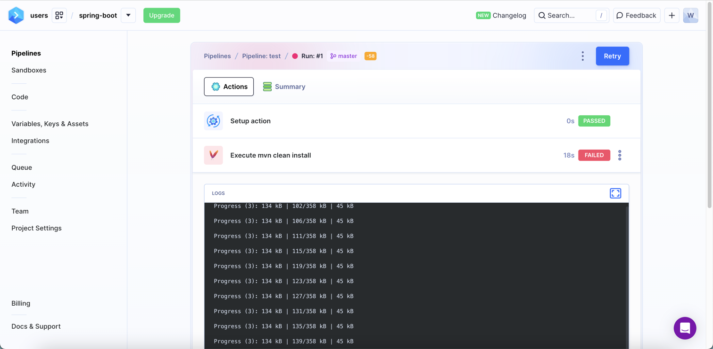

[TOC]

<h1 align="center">CICD_Tool</h1>

> By：weimenghua. 
> Date：2023.10.17. 
> Description：  


### 一、GiteeGo

**镜像构建**  
- 仓库地址：docker.io (用户名：wwweeeiii)
- 镜像 Tag：wwweeeiii/images_demo:v1.${GITEE_PIPELINE_BUILD_NUMBER}  注：如果在仓库地址没有拼接用户名，则在镜像 Tag 进行拼接
- Dockerfile 路径：./Dockerfile
- [DockerHub-wwweeeiii 仓库](https://hub.docker.com/repository/docker/wwweeeiii/)

完整命令
docker login -uwwweeeiii -ppassword docker.io

Dockerfile 例子
```
FROM alpine:latest

RUN bash -c 'ls -l'

ARG TEST1
ARG TEST2

RUN echo "${TEST1}"
RUN echo "${TEST2}"
```

**K8S 部署**
- 添加 KubeConfig：cat ~/.kube/config
- 命名空间：自定义，默认 default
- YAML 路径：./deployment.yaml
- 勾选使用Replace模式 / 有时候会出现错误，需要去掉勾选
- 勾选跳过 TLS 校验

deployment.yaml 例子
```
apiVersion: apps/v1
kind: Deployment
metadata:
  name: nginx-deployment
  labels:
    app: nginx
spec:
  replicas: 3
  selector:
    matchLabels:
      app: nginx
  template:
    metadata:
      labels:
        app: nginx
    spec:
      containers:
      - name: nginx
        image: nginx:1.14.2
        ports:
        - containerPort: 80
```

**Helm Chart部署**
- 命名空间：自定义，默认 default
- 应用名：自定义
- Chart 文件目录：[.nginx](./nginx)
- 指定values.yaml：values.yaml


### 二、TeamCity

注：未实践成功  
[TeamCity 下载](https://www.jetbrains.com/teamcity/)   
[TeamCity 教程](https://www.jetbrains.com/zh-cn/teamcity/learn/)

```
docker run --name teamcity-server-instance \
-v <path to data directory>:/data/teamcity_server/datadir \
-v <path to logs directory>:/opt/teamcity/logs \
-p <port on host>:8111 \
jetbrains/teamcity-server
```


### 三、Buddy

[Buddy](https://buddy.works/)

