[TOC]

---

<h1 align="center">Jenkins 持续集成工具</h1>

> By：weimenghua  
> Date：2022.11.11  
> Description：Jenkins

**参考资料**  
[Jenkins 官网](https://www.jenkins.io/)  
[Jenkins 图谱](https://www.processon.com/mindmap/6479bee1e840aa69e0ec8790)


## 一、Jenkins 介绍

Jenkins 是一个流行的开源自动化服务器，可用于自动构建、测试和部署软件。它支持许多不同的插件和集成，可以与其他工具和平台集成，例如 Git、Docker、Kubernetes 和 AWS 等。Jenkins 具有广泛的应用场景，并且被广泛用于 DevOps 实践中。

**Jenkins 原理**

1、构建前（也可以理解为构建时），jenkins 为每个 job 创建单独工作空间目录，每次构建通过 git 将代码拉取当前工作空间目录（workspace）。  
2、构建时，jenkins 执行 build 脚本，脚本一般拉取代码，前端打包，后端打包，将打包后的文件发送到目标机器，重启应用。  
3、构建后，发送邮件给触发者或者生成测试报告。


## 二、Jenkins 搭建

### Docker 安装
```
下载脚本
wget https://raw.githubusercontent.com/iewiewiew/wei-notebook/master/Docker/script/install_software.sh

执行脚本
chmod u+x 777 install_software.sh && sh install_software.sh jenkins
```

获取初始化密码

```
进入容器查看初始化密码
docker exec -it jenkins bash -c 'cat /var/jenkins_home/secrets/initialAdminPassword'

如做目录挂载，直接在宿主机执行
cat /var/jenkins_home/secrets/initialAdminPassword
```

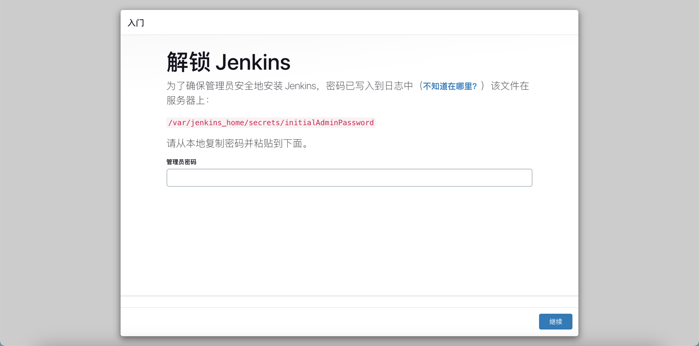

可以选择【安装推荐的插件】，后续需要添加插件话可在【插件管理】进行添加


安装插件 ing

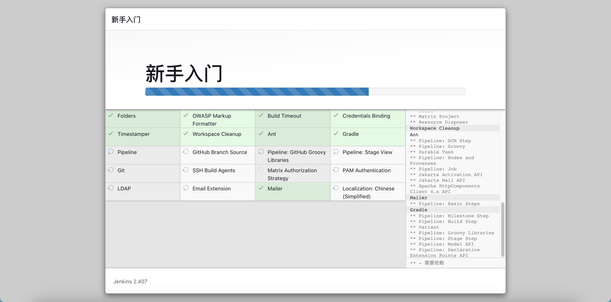

创建第一个管理员用户，这里账号密码设置为 admin/admin

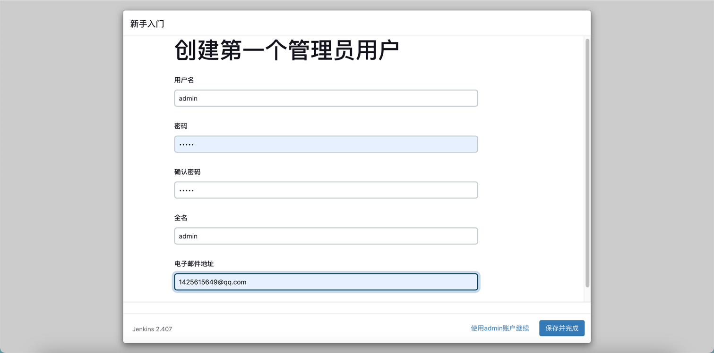

默认使用实例配置

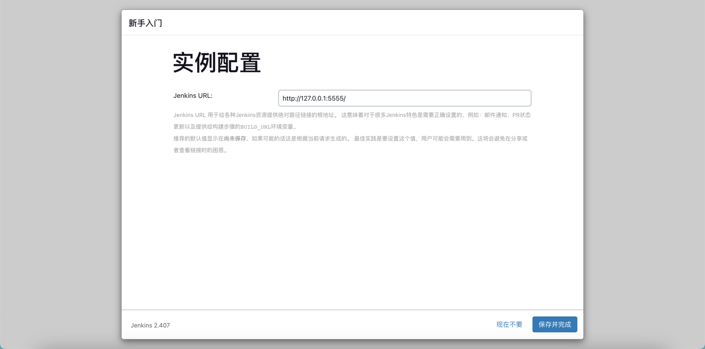

进入  Jenkins 工作台

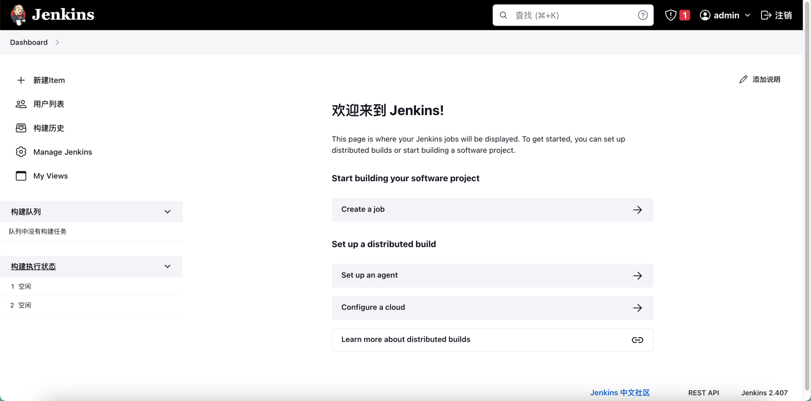

### Linux war 包安装
[Jenkins war 包下载地址](http://updates.jenkins-ci.org/download/war/)  
[Jenkins msi 包下载地址](https://www.jenkins.io/download/thank-you-downloading-windows-installer-stable)  

**启动 Jenkins**
`nohup java -Xmx3072m -Xms3072m -Xmn768m -XX:PermSize=128m -XX:MaxPermSize=256M -Xss512k -jar jenkins.war &`

**JVM 参数含义如下**
```
-Xms: 使用的最小堆内存大小
-Xmx: 使用的最大堆内存大小
-XX:PermSize: 内存的永久保存区域大小
-XX:MaxPermSize: 最大内存的永久保存区域大小
```

**验证 Jenkins**
访问地址：http://127.0.0.1:8080/  

### Windows war 包安装

**启动 Jenkins**
`java -jar jenkins.war`
注：如果 Jenkins 给提示的路径不对，可用 everything 直接搜索 initialAdminPassword
路径1：C:\Windows\SysWOW64\config\systemprofile\AppData\Local\Jenkins\.jenkins\secrets\initialAdminPassword
路径2：C:\Users\user\.jenkins\secrets\initialAdminPassword

**验证 Jenkins**
访问地址：http://127.0.0.1:8080/  


### Jenkins 服务常用操作

**windows**

- 停止服务：`jenkins.exe stop`
- 启动服务：`jenkins.exe start`
- 重启服务：`jenkins.exe restart`

**windows 和 Linux**

- 关闭 jenkins 服务：`http://localhost:8080/exit`
- 重新启动 jenkins 服务器：`http://localhost:8080/restart`
- 重新加载配置信息：`http://localhost:8080/reload`

**curl 调用 Jenkins 接口**  
格式：`curl -X POST http://{JekinsUrl} --user username:APItoken`  
例子：`curl -X POST http://localhost:8080 --user admin:1167fe0098226d9f8fc89e74b235d4bf65`


## 三、Jenkins 教程

### 创建 job 的完整流程

点击【新建 Item】> 输入一个任务名称，如：job-demo > 选择【流水线】> 点击【确定】


进入 job 配置页面，选择【Pipeline script】，选择【try sample Pipeline】，点击【保存】

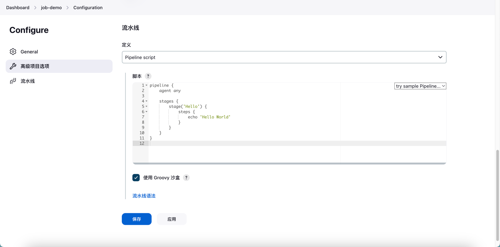

创建 job 后点击【立即构建】即可运行 job


点击日志 ID，如：#1，进入控制台查看日志


### Jenkins 凭据管理

从工作台进入系统管理 > 凭据 > 系统 > 全局凭据，可以查看 Jenkins 凭据类型有：

1. 用户名和密码（Username with password）：最基本的凭据类型，包含用户名和密码。
2. GitHub 凭据（GitHub App）：用于访问 GitHub 应用程序的凭据类型。
3. SSH 用户名和私钥（SSH Username with private key）：用于 SSH 访问的凭据类型，包含用户名和私钥。
4. 密钥对（Secret file）：包含机密信息或密码等敏感数据的文件。
5. 令牌（Secret text）：包含单个机密字符串的凭据类型。
6. 证书（Certificate）：用于在 Jenkins 中与其他系统或服务进行安全通信。它通常包含一个公钥和一个私钥，用于加密和解密数据。。

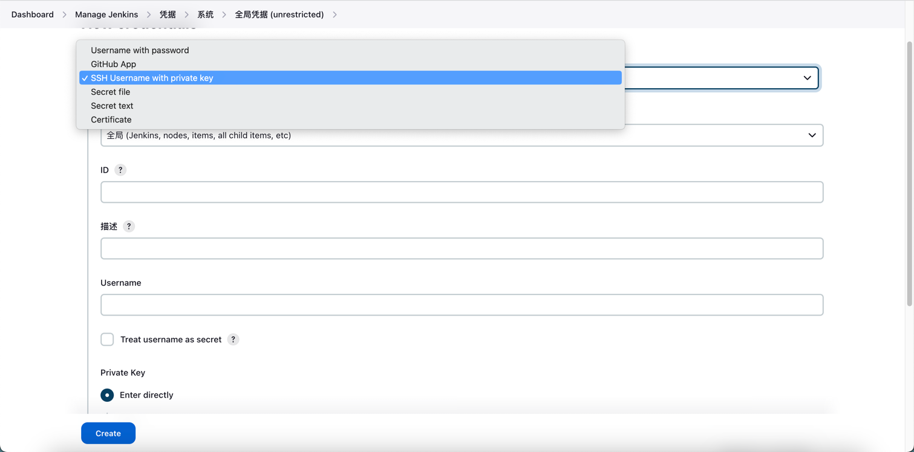

新建一个 SSH Username with private key 凭据

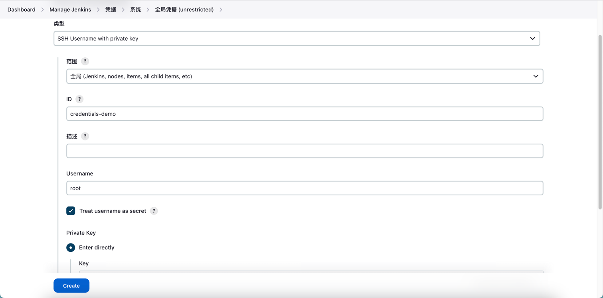


### Jenkins 用户管理

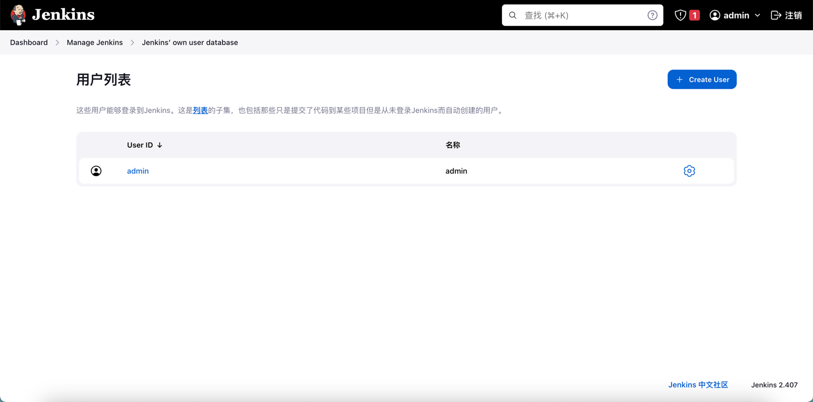


###  Jenkins 权限控制

1、Jenkins 权限  
以 dev_base 开头：dev_base.*  

2、Jenkins 视图过滤  
以 common 开头且不包含 pro：^common((?!pro).)*  
以 dev_common 开头：^(dev_common).*  
以 sonar_fb 或者 sonar_jly 开头：^(sonar_fb|sonar_jly).*  


### Jenkins 系统配置

 **Jenkins 配置文件**

默认配置文件路径：/var/jenkins_home/config.xml
job 配置文件路径：/var/jenkins_home/jobs/*/config.xml
修改该文件后需重启 jenkins 才能生效

**更改 Jenkins 工作目录**

停止 Jenkins 服务：注：restart 重启无效的话，kill -9 结束进程再启动

```
vim /etc/profile，添加：
export JENKINS_HOME=/data/.jenkins

cd /etc && source profile
```
查看配置变更：Jenkins > 系统设置：主目录 已变更为新的目录

将原有工作空相关内容拷贝到新的工作空间

#### 邮件通知


### Jenkins 插件管理

从工作台进入系统管理 > 插件管理，在 Avaliable plugins 搜索插件并进行安装，安装完成后需重启 Jenkins 才会生效。

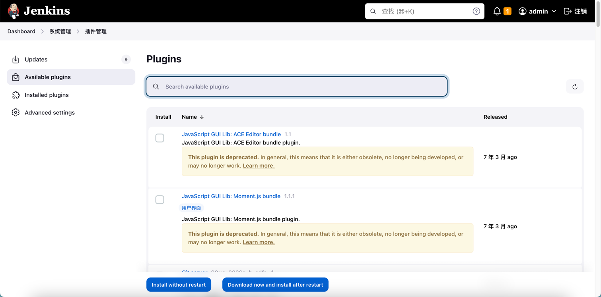

#### **Publish Over SSH**

从工作台进入系统管理 > 系统，找到 Publish Over SSH，填写密码/公钥、名称、主机 IP、用户名、远程机器可访问的目录，点击【Test Configuration】进行测试，返回 success 表示连接成功，点击【保存】


#### **Maven Integration**


#### **Blue Ocean**

[Blue Ocean 帮助文档](https://www.jenkins.io/zh/doc/book/blueocean/)

进入工作台，展示 Blue Ocean 的入口


进入 Blue Ocean 页面


### Jenkins 集成 Sonar

### Jenkins 集成 Pytest + Allure

1、安装 Allure 插件

2、从工作台进入系统管理 > 全局工具配置，可选择手动安装或者自动安装，此处使用自动安装。


3、

4、进入 job 的配置页，在【构建后操作】选择 Allure Report


### Jenkins 集成 JMeter + Ant


## 四、Jenkins 示例

### Java Maven 项目构建

1、新建 Maven 项目


2、源码管理

配置源码，填写仓库地址 [simple-java-maven-app](https://github.com/jenkins-docs/simple-java-maven-app)，如果访问 github 失败可切换 gitee，使用 [spring-boot](https://gitee.com/gitee-go/spring-boot) 如果是私有仓库需要配置凭证，此处是开源仓库，无需配置凭证。

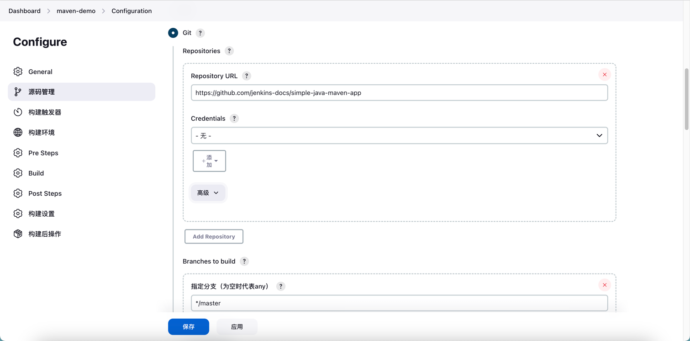

3、配置 Maven

进入系统管理 > 全局工作配置，安装 Maven


配置 pom.xml


4、构建后操作

增减构建后操作步骤，选择 Send build artifacts over SSH，选择 服务器名称

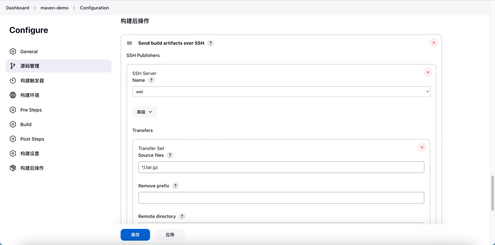

5、查看控制台输出

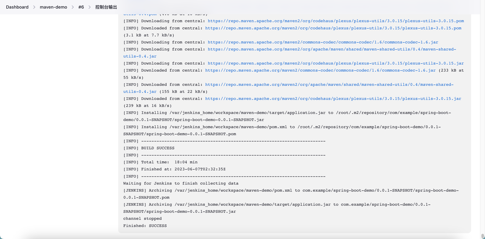


## 五、Jenkins API

查看 api
```
格式：http://<Jenkins-Server-Address>/api
举例：http://127.0.0.1:5555/api

获取 job 信息
格式：http://<Jenkins-Server-Address>/job/<Job-Name>/api/
举例：http://127.0.0.1:5555/job/test-demo/api

查看 Jenkins
格式：curl -X POST http://<Jenkins-Server-Address> --user <username>:<token>
举例：curl -X POST http://127.0.0.1:5555 --user admin:119d5182970d1ea6610d3590a07d131b39

查看 Job 列表
格式：curl -u <用户名>:<密码> -g "http://127.0.0.1:5555/api/json?pretty=true&tree=jobs[name]"
举例：curl -u admin:admin -g "http://127.0.0.1:5555/api/json?pretty=true&tree=jobs[name]"
获取 Crumb Data
方式一：
http://127.0.0.1:5555/crumbIssuer/api/xml?tree=crumb#
方式二：
curl -u admin:admin "http://127.0.0.1:5555/crumbIssuer/api/xml?xpath=concat(//crumbRequestField,%22:%22,//crumb)"
方式三：
curl -u admin:119d5182970d1ea6610d3590a07d131b39 "http://127.0.0.1:5555/crumbIssuer/api/xml?xpath=concat(//crumbRequestField,%22:%22,//crumb)"

启动不带参数的 job
crumb=$(curl -u admin:119d5182970d1ea6610d3590a07d131b39 "http://127.0.0.1:5555/crumbIssuer/api/xml?xpath=concat(//crumbRequestField,%22:%22,//crumb)")
curl -H ${crumb} http://127.0.0.1:5555/job/test-demo/build --user admin:119d5182970d1ea6610d3590a07d131b39
curl -H ${crumb} -u admin:admin -X POST "http://127.0.0.1:5555/job/test-demo/build"

启动带参数的 job
curl -X post http://127.0.0.1:5555/job/test-demo-param2/buildWithParameters?token=119d5182970d1ea6610d3590a07d131b39
```


## 六、知识碎片

**IDEA 集成 Jenkins**

```
1. IDEA 安装 Jenkins Control 插件：File > Settings > Plugins
2. IDEA 设置 Jenkins 服务器信息：File > Settings > Tools > Jenkins Plugin
- Server Address：ip+端口：http://localhost:8080 或者 域名：https://jenkins.xxx.com。注：使用 ip+端口还是域名取决于 Manage Jenkins > Configuration System  > Jenkins Location 的设置，一定要和 Jenkins URL 的设置保持一致。
- Username：admin。
- Password：在 Jenkins > 用户名 > 设置 > 获取 API Token。
- Crumb Data：访问 http://localhost:8080/crumbIssuer/api/xml?tree=crumb# 获取 Crumb Data。
```

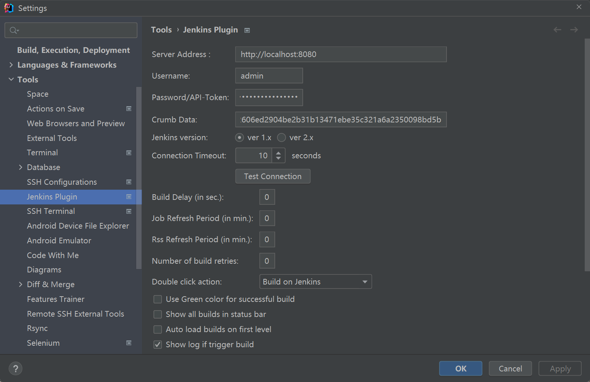

**Docker 容器中高版本 Jenkins 关闭跨站请求伪造保护**

```
方式一：
关闭 系统管理->全局安全配置->跨站请求伪造保护 选项（注：高版本无）
设置 系统管理->系统设置->Jenkins Location 的 URL 和 Jenkins 访问地址保持一致

方式二：
进入 系统管理 > 脚本控制台，执行：
新版 Jenkins 关闭 CSRF
hudson.security.csrf.GlobalCrumbIssuerConfiguration.DISABLE_CSRF_PROTECTION = true
新版 Jenkins 打开 CSRF
hudson.security.csrf.GlobalCrumbIssuerConfiguration.DISABLE_CSRF_PROTECTION = false

方式三：
1、将 jenkins.sh 复制到宿主机
docker cp jenkins:/usr/local/bin/jenkins.sh /tmp

2、修改 jenkins.sh，在 exec java -Duser.home="$JENKINS_HOME" 加上：
-Dhudson.security.csrf.GlobalCrumbIssuerConfiguration.DISABLE_CSRF_PROTECTION=true
结果：
exec java -Duser.home="$JENKINS_HOME" 
"-Dhudson.security.csrf.GlobalCrumbIssuerConfiguration.DISABLE_CSRF_PROTECTION=true 
${java_opts_array[@]}" -jar ${JENKINS_WAR} "${jenkins_opts_array[@]}" "$@"

3、将 jenkins.sh 复制到容器中
docker cp /tmp/jenkins.sh jenkins:/usr/local/bin/jenkins.sh

4、重启 jenkins
docker restart jenkins

5、检查
docker exec -it jenkins bash -c 'cat /usr/local/bin/jenkins.sh'
```

**Jenkins 构建时间和服务器时间不一致**

```
进入 系统管理 > 脚本命令行，执行：
System.setProperty('org.apache.commons.jelly.tags.fmt.timeZone','Asia/Shanghai')
```

Jenkins SSH 超时，在高级设置超时时间

构建后操作 SSH 打印出脚本日志  
在 SSH Publishers 高级勾选 Verbose output in console 

