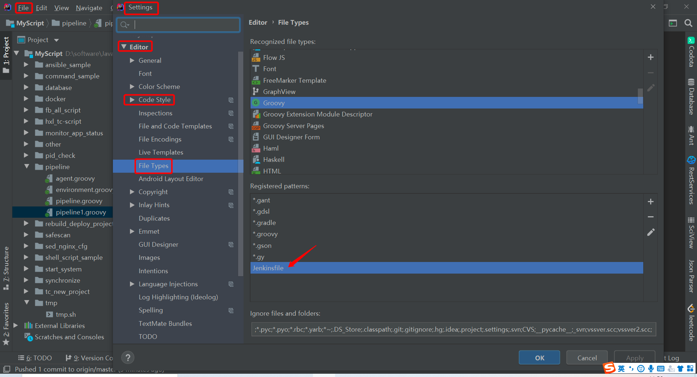

[TOC]

<h1 align="center">Pipeline</h1>

> By：weimenghua  
> Date：2022.05.25  
> Description：Pipeline 流水线

**参考资料**    
[JenkinsPipeline 语法概要](https://mp.weixin.qq.com/s/iaNlN01KLgljMSScx-Z4SA)    
[Jenkins Pipeline 环境变量使用指南](https://mp.weixin.qq.com/s/359q18BOjVtlzHpTLqpTiQ)  


## 一、Pipeline 简介

实现 Pipeline 功能的脚本语言叫做 Jenkinsfile，由 Groovy 语言实现。Jenkinsfile 一般是放在项目根目录，随项目一起受源代码管理软件控制，无需像创建"自由风格\"项目一样，每次可能需要拷贝很多设置到新项目，提供了一些直接的好处：
- Pipeline 上的代码审查/迭代
- Pipeline 的审计跟踪
- Pipeline 的唯一真实来源，可以由项目的多个成员查看和编辑  
Pipeline 支持：Declarative（在 Pipeline 2.5 中引入）和 Scripted Pipeline 两种格式。两者都支持建立 Pipeline，两者都可以用于在 Web UI 中定义一个流水线 Jenkinsfile，将 Jenkinsfile 文件创建并检查到源代码控制库中通常被认为是最佳做法。


## 二、Pipeline 踩坑

1、pipeline 首次构建无法拉取 git 分支，需要直接构建，直接构建之后才能拉取 git 分支。  


## 三、知识碎片

在Jenkins中，failFast是Jenkinsfile中的一个选项，可用于控制构建过程中的错误处理行为。当设置failFast为true时，如果在构建过程中遇到错误，Jenkins将立即停止构建并将其标记为失败，而不会继续执行后续的步骤。

在Jenkins Pipeline中，disableResume()是Pipeline DSL中的一个方法，用于禁用流水线的恢复功能。当调用disableResume()方法后，如果流水线在中断或失败时被中止，它将无法通过Jenkins的恢复功能重新启动。

在Jenkins Pipeline中，skipDefaultCheckout()是Pipeline DSL中的一个方法，用于跳过默认的代码检出步骤。默认情况下，Jenkins Pipeline会在流水线执行之前自动执行代码检出操作，以获取源代码并将其放置在工作目录中。然而，通过调用skipDefaultCheckout()方法，您可以禁用这个默认的代码检出步骤。

在Jenkins Pipeline中，quietPeriod()是Pipeline DSL中的一个方法，用于设置流水线项目的安静期。安静期是指在构建完成后，在启动下一次构建之前的等待时间。通过设置安静期，可以控制流水线项目之间的延迟时间。

例子
```
pipeline {
    agent any
    options {
        failFast true
        skipDefaultCheckout() // 跳过默认的代码检出
        quietPeriod(5) // 设置安静期为5秒，控制流水线项目之间的延迟时间
        buildDiscarder(logRotator(numToKeepStr: '100')) // 保留100个构建日志
        timeout(time: 60, unit: 'MINUTES') // 在60分钟的时间限制内执行步骤，如果超过时间限制，将中断步骤的执行            
    }
    stages {
        stage('Build') {
            steps {
                // 构建步骤
            }
        }
        stage('Test') {
            steps {
                // 测试步骤
            }
        }
        stage('Deploy') {
            steps {
                // 部署步骤
            }
        }
    }
    post {
        always {
            script {
                disableResume()
            }
        }
    }
}
```


@Library('your_project') _
//调用方法库文件
def tools = new org.tools()

IDEA集成groovy
File -->Settings-->Editor-->File Types-->Groovy：添加Jenkinsfile



创建groovy文件，添加Groovy Library

[groovy下载地址](http://groovy-lang.org/download.html)

环境变量系统设置
```
GROOVY_HOME：D:\software\apache-groovy-sdk-2.4.20\groovy-2.4.20
Path：%GROOVY_HOME%\bin
```

cmd查看是否安装成功
`groovy -version`