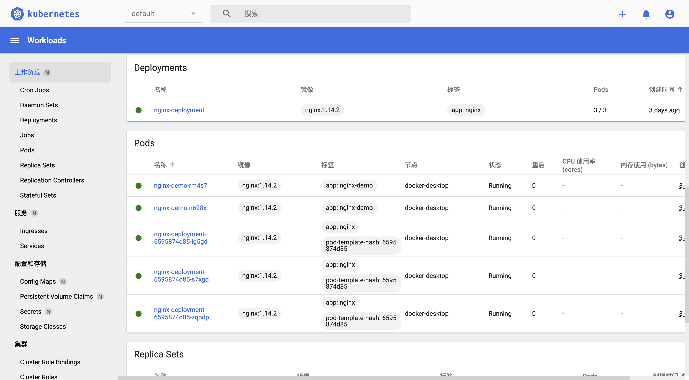
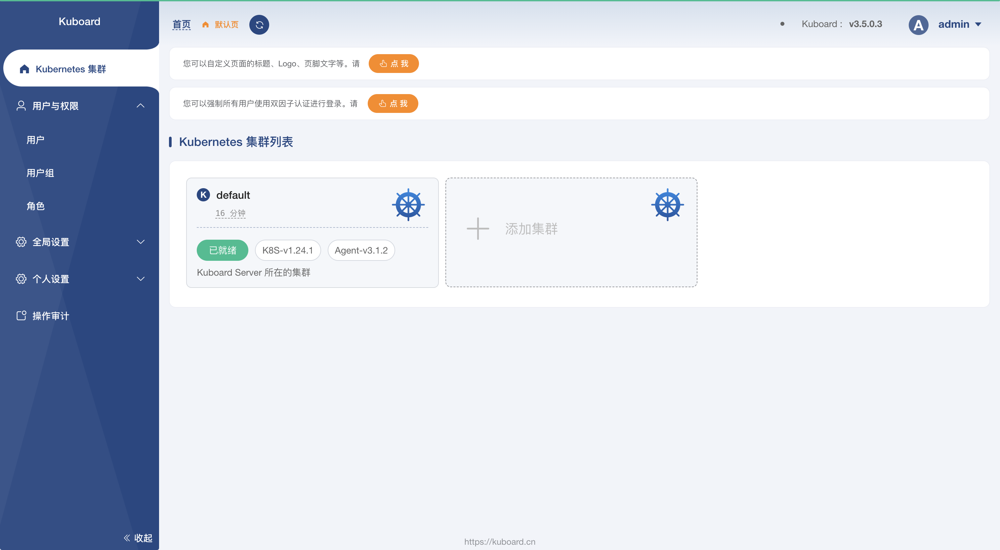
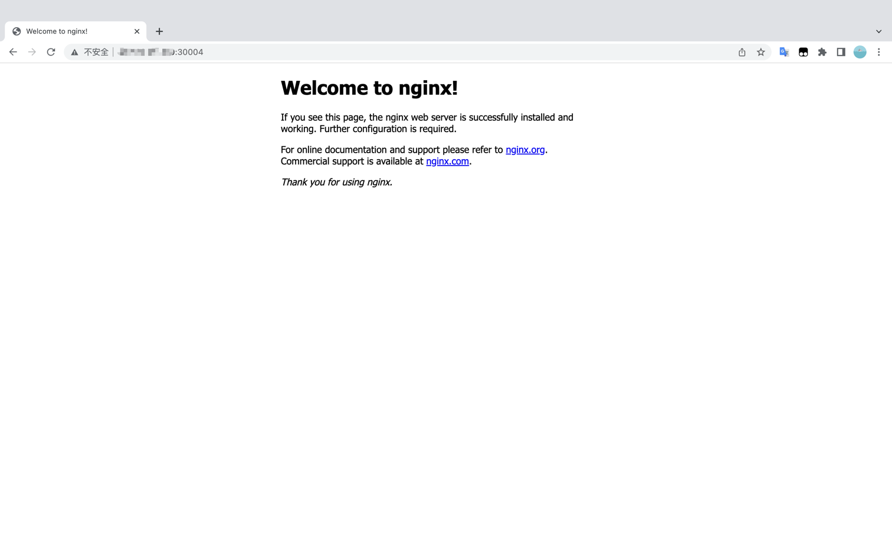
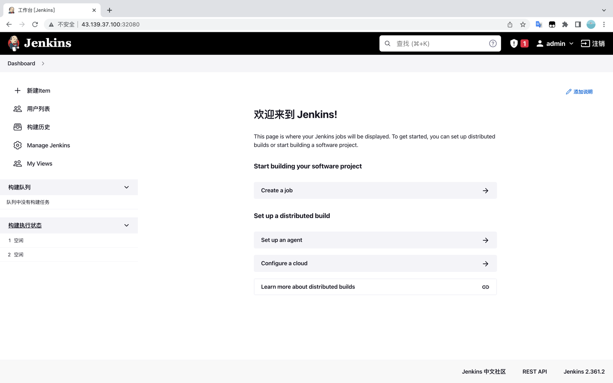

[TOC]

<h1 align="center">Kubernetes 安装软件</h1>

> By：weimenghua  
> Date：2022.10.01   
> Description：Kubernetes

**参考资料**

[kubebiz 软件列表](https://www.kubebiz.com/)


### 1、Dashboard

**Dashboard UI 仪表板**
仪表板是基于 Web 的Kubernetes 用户界面。

**Dashboard 安装教程**

```
下载 recommended.yaml
wget https://raw.githubusercontent.com/kubernetes/dashboard/v2.5.0/aio/deploy/recommended.yaml

下载 recommended.yaml 并重命名为 dashboard.yaml
wget https://raw.githubusercontent.com/kubernetes/dashboard/v2.5.0/aio/deploy/recommended.yaml -O dashboard.yaml

安装 k8s Dashboard
kubectl apply -f https://raw.githubusercontent.com/kubernetes/dashboard/v2.5.0/aio/deploy/recommended.yaml

开启本机访问代理（注意不要关闭 ，关闭了下一步就打不开页面了，安装好后访问：127.0.0.1:8001）
kubectl proxy

访问
http://localhost:8001/api/v1/namespaces/kubernetes-dashboard/services/https:kubernetes-dashboard:/proxy/#/service/default/kubernetes?namespace=default

创建账户
vim admin-user-dashboard.yaml

apiVersion: v1
kind: ServiceAccount
metadata:
  name: admin-user
  namespace: kubernetes-dashboard
  
kubectl apply -f admin-user-dashboard.yaml

创建角色
vim admin-user-role-binding.yaml

apiVersion: rbac.authorization.k8s.io/v1
kind: ClusterRoleBinding
metadata:
  name: admin-user
roleRef:
  apiGroup: rbac.authorization.k8s.io
  kind: ClusterRole
  name: cluster-admin
subjects:
- kind: ServiceAccount
  name: admin-user
  namespace: kubernetes-dashboard
  
kubectl apply -f admin-user-role-binding.yaml

创建 token，拿到 token 之后填入第3步访问的网址，即可成功登陆 k8s Dashboard
kubectl -n kubernetes-dashboard create token admin-user
```

证书配置（以上教程没用上证书）
```
1、创建命名空间
kubectl create namespace kubernetes-dashboard

2、创建 key 文件
openssl genrsa -out dashboard.key 2048

3、证书请求
openssl req -days 36000 -new -out dashboard.csr -key dashboard.key -subj '/CN=dashboard-cert'

4、自签证书
openssl x509 -req -in dashboard.csr -signkey dashboard.key -out dashboard.crt

5、创建 kubernetes-dashboard-certs 对象
kubectl create secret generic kubernetes-dashboard-certs --from-file=dashboard.key --from-file=dashboard.crt -n kubernetes-dashboard
```

**Dashboard 安装教程2**

```
下载
wget https://raw.githubusercontent.com/kubernetes/dashboard/v2.5.0/aio/deploy/recommended.yaml -O dashboard.yaml

修改配置，添加 type: NodePort 和 nodePort: 31001
vim dashboard.yaml

kind: Service
apiVersion: v1
metadata:
  labels:
    k8s-app: kubernetes-dashboard
  name: kubernetes-dashboard
  namespace: kubernetes-dashboard
spec:
  type: NodePort
  ports:
    - port: 443
      targetPort: 8443
      nodePort: 31001
  selector:
    k8s-app: kubernetes-dashboard
    
dashborad-admin-rabc.yaml 内容如下：

apiVersion: v1
kind: ServiceAccount
metadata:
  name: admin-user
  namespace: kubernetes-dashboard
---
apiVersion: rbac.authorization.k8s.io/v1
kind: ClusterRoleBinding
metadata:
  name: admin-user
roleRef:
  apiGroup: rbac.authorization.k8s.io
  kind: ClusterRole
  name: cluster-admin
subjects:
- kind: ServiceAccount
  name: admin-user
  namespace: kubernetes-dashboard

创建 pod
kubectl apply -f dashboard.yaml
kubectl apply -f dashborad-admin-rabc.yaml

访问地址
https://127.0.0.1:31001/#/login

创建 token
k3s kubectl -n kubernetes-dashboard create token admin-user
```

进入 dashboard 的 deployment 菜单，编辑 kubernetes-dashboard，在`- '--auto-generate-certificates'`
下增加一行 `- '--token-ttl=43200'`


**Dashboard 页面**



**Dashboard 删除**

```
1、查询 pod 
kubectl get pods --all-namespaces | grep "dashboard"

2、删除 pod
kubectl delete deployment kubernetes-dashboard  --namespace=kubernetes-dashboard
kubectl delete deployment dashboard-metrics-scraper --namespace=kubernetes-dashboard

3、查询 service
kubectl get service -A

4、删除 service
kubectl delete service kubernetes-dashboard  --namespace=kubernetes-dashboard
kubectl delete service dashboard-metrics-scraper  --namespace=kubernetes-dashboard

5、删除账户和密钥
kubectl delete sa kubernetes-dashboard --namespace=kubernetes-dashboard
kubectl delete secret kubernetes-dashboard-certs --namespace=kubernetes-dashboard
kubectl delete secret kubernetes-dashboard-key-holder --namespace=kubernetes-dashboard
```


### 2、Kuboard

**Kuboard 图形化管理工具**
[Kuboard 简介](https://kuboard.cn/overview/)
Kuboard，是一款免费的 Kubernetes 图形化管理工具，Kuboard 力图帮助用户快速在 Kubernetes 上落地微服务。提供了丰富的功能，结合已有或新建的代码仓库、镜像仓库、CI/CD 工具等，可以便捷的搭建一个生产可用的 Kubernetes 容器云平台，轻松管理和运行云原生应用。
样例：https://demo.kuboard.cn  
用 户：demo  
密 码：demo123

**Kuboard 安装教程**
[Kuboard 安装教程](https://kuboard.cn/install/v3/install-in-k8s.html#%E5%AE%89%E8%A3%85)

```
1、安装 Kuboard
kubectl apply -f https://addons.kuboard.cn/kuboard/kuboard-v3.yaml

2、访问 Kuboard
在浏览器中打开链接 http://127.0.0.1:30080, 输入初始用户名和密码，并登录
用户名： admin
密码： Kuboard123

3、踩坑
执行 kubectl get pods -n kuboard，如果结果中没有出现 kuboard-etcd-xxxxx 的容器, 就执行：kubectl label nodes docker-desktop k8s.kuboard.cn/role=etcd 

4、创建集群
curl -k 'http://127.0.0.1:30080/kuboard-api/cluster/default/kind/KubernetesCluster/default/resource/installAgentToKubernetes?token=0vPAhlKn6zIcNfvDsUBKX7t64yV4R46d' > kuboard-agent.yaml

kubectl apply -f ./kuboard-agent.yaml
```

**Kuboard 页面**



**Kuboard 删除**

```
1、查询 pod
kubectl get pods -n kuboard
kubectl get pods --all-namespaces | grep "kuboard"

2、删除 pod
kubectl delete pods kuboard-etcd-lmtz8 --namespace=kuboard

3、查询 service
kubectl get service -A

4、删除 service
kubectl delete service kuboard --namespace=kube-system

5、卸载 kuboard
kubectl delete -f https://addons.kuboard.cn/kuboard/kuboard-v3.yaml

6、删除 namespace 下所有资源
kubectl delete ns kuboard --force --grace-period=0

kubectl get ns kuboard -o json > kuboard.json，将 finalizers 字段去掉

kubectl proxy --port=8002

curl -k -H "Content-Type: application/json" -X PUT --data-binary @kuboard.json http://127.0.0.1:8002/api/v1/namespaces/kuboard/finalize
```


### 3、Nginx

```
方式一
1、创建资源
kubectl apply -f NginxDemo.yml

2、查看资源
kubectl get pod,svc,deploy -n my-space |grep nginx

3、验证
http://127.0.0.1:30004

5、进入容器
kubectl exec -it pod/nginx-deployment-9456bbbf9-9g8zn -n my-space -- bash

6、删除资源
kubectl delete -f NginxDemo.yml


方式二
1、创建一个 nginx 服务
kubectl create deployment nginx  --image=nginx:1.14-alpine

2、暴露端口
kubectl expose deploy nginx  --port=80 --target-port=80  --type=NodePort

3、查看服务（拿到对外访问的端口）
kubectl get pod,svc

4、在浏览器访问
http://127.0.0.1:30319/
```

**NginxDemo.yml**

```
apiVersion: apps/v1
kind: Deployment
metadata:
  name: nginx-deployment
  namespace: my-space
  labels:
    app: nginx
spec:
  replicas: 3
  selector:
    matchLabels:
      app: nginx
  template:
    metadata:
      labels:
        app: nginx
    spec:
      containers:
        - name: nginx
          image: nginx:1.14.2
          ports:
            - containerPort: 80

---

apiVersion: v1
kind: Service
metadata:
  name: nginx-service
  namespace: my-space
spec:
  selector:
    app: nginx
  ports:
    - protocol: TCP
      port: 80
      targetPort: 80
      nodePort: 30004
  type: NodePort
```

**Nginx 视图**




### 4、Redis

[Redis yml](https://www.kubebiz.com/KubeBiz/redis)

```
1、创建资源（修改 Service.yml 暴露端口）
kubectl apply -f RedisDemo.yml

2、查看资源
kubectl get pod,deploy,svc -n my-space |grep redis

3、查看 Redis pod 的容器
kubectl get pod redis -o jsonpath="{.spec['containers','initContainers'][*].name}" -n my-space

4、进入容器
kubectl exec -it pod/redis -n my-space -- bash
需要密码
kubectl --insecure-skip-tls-verify exec -it -n my-space redis --container redis -- bash
redis-cli -a <password> <command>  # <command> 为 INFO、KEYS * ...
合并为一行
kubectl --insecure-skip-tls-verify exec -it -n my-space redis --container redis -- redis-cli -a <password>


5、验证
redis-cli
set name zhangsan
get name

6、删除 Redis
kubectl delete -f RedisDemo.yml

7、踩坑
报错：Warning  FailedScheduling  54s   default-scheduler  0/1 nodes are available: 1 node(s) had taint {node-role.kubernetes.io/master: }, that the pod didn't tolerate
原因：使用 kubeadm 初始化的集群，出于安全考虑 Pod 不会被调度到 Master Node 上，不参与工作负载，允许 master 节点部署 pod 即可解决问题
解决：kubectl taint nodes --all node-role.kubernetes.io/master-

查看是否为 master
kubectl -n my-space exec -it pod/redis-master-0 -- redis-cli
info replication
```

**RedisDemo.yml**

```
apiVersion: v1
kind: ConfigMap
metadata:
  name: example-redis-config
  namespace: my-space
data:
  redis-config: |
    maxmemory 2mb
    maxmemory-policy allkeys-lru
    dir /data
    appendonly yes
    save 900 1
    save 300 10
    save 60 10000

---

apiVersion: v1
kind: Service
metadata:
  name: redis-master
  namespace: my-space
  labels:
    app: redis
spec:
  selector:
    app: redis
  ports:
    - port: 6379
      nodePort: 30000
      targetPort: 6379
  type: NodePort

---

apiVersion: v1
kind: Pod
metadata:
  name: redis
  namespace: my-space
  labels:
    app: redis
spec:
  containers:
    - name: redis
      image: 'redis:6.2.5'
      command:
        - redis-server
        - /redis-conf/redis.conf
      env:
        - name: MASTER
          value: 'true'
      ports:
        - containerPort: 6379
      resources:
        limits:
          cpu: '0.1'
      volumeMounts:
        - mountPath: /data
          name: data
        - mountPath: /redis-conf
          name: config
  volumes:
    - name: data
      emptyDir: {}
    - name: config
      configMap:
        name: example-redis-config
        items:
          - key: redis-config
            path: redis.conf
```


### 5、Zookeeper

[zookeeper yml](https://www.kubebiz.com/KubeBiz/zookeeper)

```
1、创建资源
kubectl apply -f ZookeeperDemo.yml

2、查看资源
kubectl get pod,svc -n my-space

3、进入容器
kubectl exec -it pod/<pod_name> -n my-space -- bash

4、启动客户端
cd bin/ && ./zkCli.sh (sh zkCli.sh 会报错，不明白为啥)
zookeeper 常用命令
列出 zookeeper 根节点：ls /
列出 zookeeper dubbo 节点：ls /dubbo
获取节点信息：get /dubbo  
查看某个接口服务：ls /dubbo/com.demo.service.DemoService 
查看节点状态：stat /dubbo
创建节点：create /tmp 123（注：节点后面得有值，如：123，节点值就是123，可设置""）  
退出 zkCli：quit

5、删除资源
kubectl delete -f ZookeeperDemo.yml
```

**ZookeeperDemo.yml**

```
apiVersion: apps/v1
kind: Deployment
metadata:
  name: zookeeper
  namespace: my-space
  labels:
    app: zk
spec:
  selector:
    matchLabels:
      app: zk
  template:
    metadata:
      labels:
        app: zk
    spec:
      nodeName: k8s-master
      containers:
        - name: zk
          image: zookeeper
          imagePullPolicy: IfNotPresent
          ports:
            - containerPort: 2181
              name: zk
          resources:
            requests:
              cpu: "0.1"
              memory: "500Mi"
            limits:
              cpu: "0.1"
              memory: "500Mi"

---
apiVersion: v1
kind: Service
metadata:
  labels:
    app: zk
  name: zk-svc
  namespace: my-space
spec:
  ports:
    - port: 2181
      nodePort: 30002
      targetPort: 2181
  selector:
    app: zk
  type: NodePort
```


### 6、PostgreSQL(未安装成功)

[PostgreSQL yml](https://www.kubebiz.com/KubeBiz/PostgreSQL)

```
1、创建资源
kubectl apply -f PersistentVolumeClaim.yml
kubectl apply -f Service.yml
kubectl apply -f Deployment.yml
kubectl apply -f PostgrepSQL.yml

2、删除资源
kubectl delete -f PersistentVolumeClaim.yml
kubectl delete -f Service.yml
kubectl delete -f Deployment.yml
kubectl delete -f PostgrepSQL.yml

进入容器
kubectl --insecure-skip-tls-verify exec -it -n <namespace> <pod-name> --container <container-name> -- bash

获取 PostgreSQL 服务的集群 IP 地址和端口号
kubectl get svc <postgresql-service-name> -n <namespace>

使用 psql 命令连接到 PostgreSQL 数据库，执行命令后输入密码
psql -h <postgresql-service-ip> -p <postgresql-service-port> -d <database-name> -U <username> -W
```


### 7、Minio

[Minio yml](https://www.kubebiz.com/KubeBiz/minio)

```
1、创建资源
kubectl apply -f MinioDemo.yml

2、查看资源
kubectl get pod,deploy,svc -n my-space |grep minio

3、访问地址
http://127.0.0.1:32075 minoadmin/minoadmin

4、删除资源
kubectl delete -f MinioDemo.yml

5、进入 pod
kubectl exec -it minio-0 -n my-space -- /bin/sh
```

**MinioDemo.yml**

```
apiVersion: apps/v1
kind: Deployment
metadata:
  name: minio
  namespace: my-space
spec:
  replicas: 1
  selector:
    matchLabels:
      app: minio
  template:
    metadata:
      labels:
        app: minio
    spec:
      containers:
        - name: minio
          env:
            - name: MINIO_ROOT_USER
              value: "minioadmin"
            - name: MINIO_ROOT_PASSWORD
              value: "minioadmin"
          image: minio/minio:latest
          imagePullPolicy: IfNotPresent
          command:
            - /bin/sh
            - -c
            - minio server /data --console-address ":5000"
          ports:
            - name: data
              containerPort: 9000
              protocol: "TCP"
            - name: console
              containerPort: 5000
              protocol: "TCP"

---

apiVersion: v1
kind: Service
metadata:
  name: minio
  namespace: my-space
spec:
  ports:
    - name: data
      port: 9000
      targetPort: 9000
      protocol: TCP
    - name: console
      port: 5000
      targetPort: 5000
      nodePort: 32075
      protocol: TCP
  selector:
    app: minio
  type: NodePort
```


### 8、Jenkins

```
1、创建资源
kubectl apply -f JenkinsDemo.yml

2、查看资源
kubectl get pod,svc,deploy -n my-space |grep jenkins
kubectl get pod,svc,deploy -A |grep jenkins

3、验证
http://127.0.0.1:32080

4、进入容器
kubectl exec -it pod/jenkins-789c9b6b84-9drmq -n my-space -- bash 
执行：cat /var/jenkins_home/secrets/initialAdminPassword

kubectl exec -it pod/jenkins-789c9b6b84-9drmq -n my-space -- cat /var/jenkins_home/secrets/initialAdminPassword

5、删除资源
kubectl delete -f JenkinsDemo.yml
```

**JenkinsDemo.yml**

```
apiVersion: apps/v1
kind: Deployment
metadata:
  name: jenkins
  namespace: my-space
spec:
  replicas: 1
  selector:
    matchLabels:
      app: jenkins
  template:
    metadata:
      labels:
        app: jenkins
    spec:
      containers:
        - name: jenkins
          image: jenkins/jenkins:lts-jdk11
          ports:
            - containerPort: 8080
          volumeMounts:
            - name: jenkins-home
              mountPath: /var/jenkins_home
      volumes:
        - name: jenkins-home
          emptyDir: { }

---

apiVersion: v1
kind: Service
metadata:
  name: jenkins-export
  namespace: my-space
spec:
  selector:
    app: jenkins
  type: NodePort
  ports:
    - name: http
      port: 8080
      targetPort: 8080
      nodePort: 32080
```

**Jenkins 视图**




### 9、Prometheus

```
kubectl create ns kube-ops

kubectl apply -f prom-configmap.yaml
kubectl get configmap -n kube-ops

kubectl apply -f prom-pvc.yaml
kubectl get pvc -n kube-ops

kubectl apply -f prom-rbac.yaml
kubectl get sa -n kube-ops

kubectl apply -f prom-deploy.yaml
kubectl get deploy -n kube-ops

kubctl apply -f prom-service.yaml
kubectl get svc -n kube-ops

访问地址
http://127.0.0.1:31966

curl 127.0.0.1:8080/metrics
```


### 9、Grafana

```
kubectl apply -f grafana-deploy.yaml
kubectl get deploy -n kube-ops

kubectl apply -f grafana-volume.yaml
kubectl get pvc -n kube-ops

kubectl apply -f grafana-svc.yaml
kubectl get svc -n kube-ops

kubectl apply -f grafana-chown-job.yaml

访问地址
http://127.0.0.1:32204
```


### 10、Kafka

```
kubectl exec <kafka_pod_name> --cd kafka-topics --zookeeper <zookeeper_host>:<zookeeper_port> --list
```

