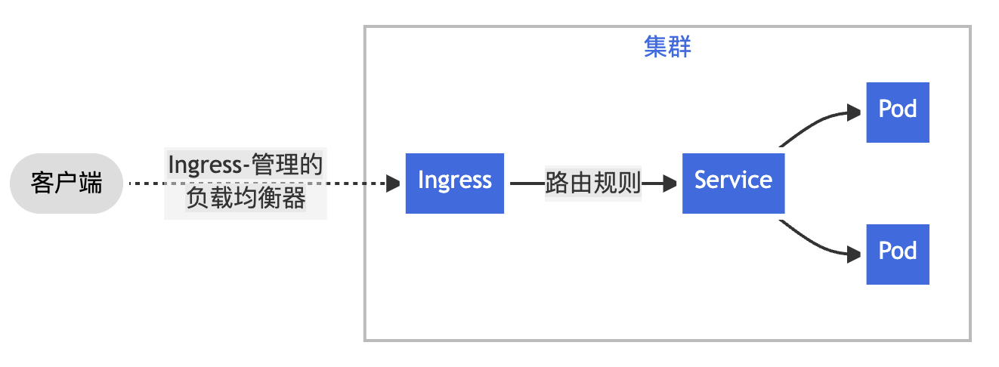

[TOC]

<h1 align="center">Kubernetes</h1>

> By：weimenghua  
> Date：2022.10.01   
> Description：Kubernetes 容器编排

**参考资料**  
[Kubernetes 中文社区](https://www.kubernetes.org.cn/)  
[Kubernetes 中文文档](http://docs.kubernetes.org.cn/)  
[Kubernetes 官方教程](https://kubernetes.io/zh-cn/docs/tutorials/)  
[Kubernetes 详细教程](https://gitee.com/yooome/golang)  
[kuboard 教程](https://kuboard.cn/learning/)  
[kubebiz 软件列表](https://www.kubebiz.com/)  
[阿里云官方镜像站](https://developer.aliyun.com/mirror/)   
[kubernetes 语雀](https://www.yuque.com/coolops/kubernetes)


# 1、Kubernetes 入门

## 1.1、Kubernetes 简介

**1.1.1、简介**

Kubernetes 是容器集群管理系统，是一个开源的平台，可以实现容器集群的自动化部署、自动扩缩容、维护等功能。

通过 Kubernetes 可以：
- 快速部署应用
- 快速扩展应用
- 无缝对接新的应用功能
- 节省资源，优化硬件资源的使用

Kubernetes 的全生命周期管理：创建集群，部署应用，发布应用，扩展应用，更新应用。
Kubernetes 是Google 2014年创建管理的，是 Google 10多年大规模容器管理技术 Borg 的开源版本。

**1.1.2、特点**

- 可移植: 支持公有云，私有云，混合云，多重云（multi-cloud）
- 可扩展: 模块化, 插件化，可挂载，可组合
- 自动化: 自动部署，自动重启，自动复制，自动伸缩/扩展

**1.1.3、优势**

容器优势总结：

- 快速创建/部署应用：与 VM 虚拟机相比，容器镜像的创建更加容易。
- 持续开发、集成和部署：提供可靠且频繁的容器镜像构建/部署，并使用快速和简单的回滚(由于镜像不可变性)。
- 开发和运行相分离：在 build 或者 release 阶段创建容器镜像，使得应用和基础设施解耦。
- 开发，测试和生产环境一致性：在本地或外网（生产环境）运行的一致性。
- 云平台或其他操作系统：可以在 Ubuntu、RHEL、 CoreOS、on-prem、Google Container Engine 或其它任何环境中运行。
- Loosely coupled，分布式，弹性，微服务化：应用程序分为更小的、独立的部件，可以动态部署和管理。
- 资源隔离。
- 资源利用：更高效。


## 1.2、Kubernetes 组件

**1.2.1、组件**
一个 Kubernetes 集群包含两种类型的资源:

- Master 负责管理整个集群。 Master 协调集群中的所有活动，例如调度应用、维护应用的所需状态、应用扩容以及推出新的更新。
- Node 负责运行应用。是一个虚拟机或者物理机，它在 Kubernetes 集群中充当工作机器的角色 每个 Node 都有 Kubelet , 它管理 Node，而且是 Node 与 Master 通信的代理。 Node 还应该具有用于处理容器操作的工具，例如 Docker 或 rkt 。处理生产级流量的 Kubernetes 集群至少应具有三个 Node，因为如果一个 Node 出现故障其对应的 etcd 成员和控制平面实例都会丢失，并且冗余会受到影响。 你可以通过添加更多控制平面节点来降低这种风险。
1. kubectl：客户端命令行工具，作为整个系统的操作入口。
2. kube-apiserver：以 REST API 服务形式提供接口，作为整个系统的控制入口。
3. kube-controller-manager：执行整个系统的后台任务，包括节点状态状况、Pod 个数、Pods 和Service 的关联等。
4. kube-scheduler：负责节点资源管理，接收来自 kube-apiserver 创建 Pods 任务，并分配到某个节点。
5. etcd：负责节点间的服务发现和配置共享。
6. kube-proxy：运行在每个计算节点上，负责 Pod 网络代理。定时从 etcd 获取到 service 信息来做相应的策略。
7. kubelet：运行在每个计算节点上，作为 agent，接收分配该节点的 Pods 任务及管理容器，周期性获取容器状态，反馈给 kube-apiserver。
8. DNS：一个可选的 DNS 服务，用于为每个 Service 对象创建 DNS 记录，这样所有的 Pod 就可以通过 DNS 访问服务了。

**1.2.2、源码**
[kubernetes 源码](https://github.com/kubernetes/kubernetes)  
- 文档类（api、docs、logo）  
- 工具类（build、cluster、Godeps、hack、staging、translations）     
- 代码类（cmd、pkg、plugin、test、third_party）        


# 2、Kubernetes 搭建
## 2.1、Kubernetes 搭建（Mac）

```
1、下载 Docker Desktop
https://www.docker.com/products/docker-desktop/

2、下载 Kubernetes-docker-desktop-for-mac
git clone https://github.com/gotoKubernetes/Kubernetes-docker-desktop-for-mac.git

3、进入 Kubernetes-docker-desktop-for-mac 项目，拉取镜像
./load_images.sh

4、打开 Docker Desktop 配置页面，勾选 enable Kubernetes（时间有点长）

5、在命令终端输入如下命令，验证是否安装成功
kubectl cluster-info
```


## 2.2、Kubernetes 搭建（Linux）

部署 Kubernetes 集群主要有两种方式：
**kubeadm**
[Kubeadm](https://kubernetes.io/docs/reference/setup-tools/kubeadm/) 是官方社区推出的一个用于快速部署 kubernetes 集群的工具，提供 kubeadm init 和 kubeadm join，用于快速部署 Kubernetes 集群。
**二进制包**
从 github 下载发行版的二进制包，手动部署每个组件，组成 Kubernetes 集群。
以下是通过 kubeadm 安装 Kubernetes 的教程。

**2.2.1 初始化环境**
```
1、查看操作系统版本
命令：cat /etc/centos-release

2、关闭防火墙
作用：kubernetes 和docker 在运行的中会产生大量的 iptables 规则，为了不让系统规则跟它们混淆，直接关闭系统的规则。
命令：
systemctl stop firewalld    //暂时关闭防火墙
systemctl disable firewalld //永久关闭防火墙
检查：firewall-cmd --state

命令：
systemctl stop iptables    //暂时关闭 iptables
systemctl disable iptables //永久关闭 iptables
检查：systemctl status iptables / iptables -L

3、禁用 selinux
命令：sed -i 's/enforcing/disabled/' /etc/selinux/config
检查：cat /etc/selinux/config

4、关闭 swap
作用：swap 分区指的是虚拟内存分区，它的作用是物理内存使用完，之后将磁盘空间虚拟成内存来使用，启用 swap 设备会对系统的性能产生非常负面的影响，因此 kubernetes 要求每个节点都要禁用 swap 设备，但是如果因为某些原因确实不能关闭 swap 分区，就需要在集群安装过程中通过明确的参数进行配置说明。
命令：
swapoff -a                          //暂时关闭 swap
sed -ri 's/.*swap.*/#&/' /etc/fstab //永久关闭 swap
检查：cat /etc/fstab 或者 free -m

5、时间同步（未操作）
作用：kubernetes 要求集群中的节点时间必须精确一直，这里使用 chronyd 服务从网络同步时间。
命令：
systemctl start chronyd
systemctl enable chronyd
检查：date

6、配置内核参数
作用：将桥接的 IPv4流量传递到 iptables 的链。
命令：
cat >> /etc/sysctl.d/Kubernetes.conf <<EOF
net.bridge.bridge-nf-call-ip6tables = 1
net.bridge.bridge-nf-call-iptables = 1
EOF
刷新配置：sysctl --system
检查：cat /etc/sysctl.d/Kubernetes.conf

7、添加阿里源
命令：
mv /etc/yum.repos.d/CentOS-Base.repo /etc/yum.repos.d/CentOS-Base.repo.backup 或者 rm -rfv /etc/yum.repos.d/*
curl -o /etc/yum.repos.d/CentOS-Base.repo http://mirrors.aliyun.com/repo/Centos-7.repo # 根据系统版本选择
wget -O /etc/yum.repos.d/CentOS-Base.repo https://mirrors.aliyun.com/repo/Centos-7.repo
检查：cat /etc/yum.repos.d/CentOS-Base.repo

8、配置主机名（替换为主机 ip）
作用：为了方便集群节点间的直接调用
命令：
cat >> /etc/hosts << EOF
127.0.0.1 k8s-master
127.0.0.2 k8s-node1
127.0.0.3 k8s-node2
EOF
检查：cat /etc/hosts

9、其它
查看本机 ip：ifconfig
修改主机名：hostnamectl set-hostname k8s-master
重启主机：reboot
```

**2.2.2、安装常用包**
```
1、安装常用包
yum install -y vim bash-completion net-tools gcc

2、使用阿里云源安装 docker-ce（跳过，如果本地没有 Docker 则需执行）
yum install -y yum-utils device-mapper-persistent-data lvm2
yum-config-manager --add-repo https://mirrors.aliyun.com/docker-ce/linux/centos/docker-ce.repo
yum install -y docker-ce

cat >> /etc/docker/daemon.json << EOF
{
    "registry-mirrors": [
        "https://mirror.ccs.tencentyun.com"
    ],
    "exec-opts": [
        "native.cgroupdriver=systemd"
    ]
}
EOF
检查：cat /etc/docker/daemon.json  注：追加写入，注意检查下是否有重复
```

**2.2.3、安装 kubectl、kubelet、kubeadm**
Kubelet 是负责与其他节点集群通信，并进行本节点 Pod 和容器生命周期的管理。  
Kubeadm 是 Kubernetes 的自动化部署工具，降低了部署难度，提高效率。  
Kubectl 是 Kubernetes 集群管理工具。  

```
1、添加阿里云 kubernetes 源
命令：
cat >> /etc/yum.repos.d/kubernetes.repo << EOF
[kubernetes]
name=Kubernetes
baseurl=https://mirrors.aliyun.com/kubernetes/yum/repos/kubernetes-el7-x86_64/
enabled=1
gpgcheck=1
repo_gpgcheck=1
gpgkey=https://mirrors.aliyun.com/kubernetes/yum/doc/yum-key.gpg https://mirrors.aliyun.com/kubernetes/yum/doc/rpm-package-key.gpg
EOF
检查：cat /etc/yum.repos.d/kubernetes.repo

踩坑：如果无法下载 kubectl、kubelet、kubeadm，修改 /etc/yum.repos.d/kubernetes.repo
如果设置 gpgcheck=0 和 repo_gpgcheck=0，则表示禁用了 YUM 对软件包签名的验证，YUM 将不会对软件包的完整性进行验证
gpgcheck=0
repo_gpgcheck=0

2、安装 kubectl、kubelet、kubeadm（踩坑：指定合适的版本，各组件版本一致，以下使用1.23.5版本）
命令：
yum install -y kubectl kubelet kubeadm
yum install -y kubectl-1.23.5 kubelet-1.23.5 kubeadm-1.23.5

3、开机自启 docker+开机自启 kubelet
命令：systemctl daemon-reload && systemctl enable kubelet && systemctl start kubelet

4、配置 kubelet 的cgroup
命令：
cat >> /etc/sysconfig/kubelet << EOF
KUBELET_CGROUP_ARGS="--cgroup-driver=systemd"
KUBE_PROXY_MODE="ipvs"
EOF
检查：cat /etc/sysconfig/kubelet  注：追加写入，注意检查下是否有重复

5、查看版本
命令：
kubectl version
kubelet --version
kubeadm version
查看 kubeadm 的版本
yum list --showduplicates kubeadm --disableexcludes=kubernetes
升级 kubeadm
yum install -y kubeadm-1.18.9-0 --disableexcludes=kubernetes

6、查看镜像
命令：kubeadm config images list

7、查看 kubelet 配置
cat /var/lib/kubelet/config.yaml |grep group

8、重启 kubelet
命令：systemctl restart kubelet

9、配置 k8s 环境变量
echo "export KUBECONFIG=/etc/kubernetes/admin.conf" >> ~/.bash_profile
source ~/.bash_profile
cat ~/.bash_profile

10、卸载 kubectl、kubelet、kubeadm
命令：yum remove -y kubectl kubelet kubeadm

11、踩坑
问题1：kubectl 启动不了？
解决1：
修改 Docker 配置
vim /etc/docker/daemon.json
添加
"exec-opts": [
        "native.cgroupdriver=systemd"
    ],
重启 Docker
systemctl restart docker  # 即使已经配置也要重启一下
```

**2.2.4、初始化 Kubernetes 单节点/集群**

```
1、初始化 Kubernetes 单节点 
踩坑：只有单节点，参数无需添加(10.0.12.14 内网 ip) --apiserver-advertise-address=10.0.12.14   \
kubeadm init --kubernetes-version=v1.23.5 \
--image-repository registry.aliyuncs.com/google_containers  \
--service-cidr=10.10.0.0/16 --pod-network-cidr=10.122.0.0/16

2、初始化 Kubernetes 集群
命令：
kubeadm init --kubernetes-version=v1.23.5 \
--apiserver-advertise-address=10.0.12.14   \
--image-repository registry.aliyuncs.com/google_containers  \
--service-cidr=10.10.0.0/16 --pod-network-cidr=10.122.0.0/16
说明：
–kubernetes-version: 用于指定 Kubernetes 版本(kubeadm config images list 查看的)
–apiserver-advertise-address：用于指定 kube-apiserver 监听的 ip 地址，就是 master 本机 IP 地址
–pod-network-cidr：用于指定 Pod 的网络范围：10.244.0.0/16
–service-cidr：用于指定 SVC 的网络范围
–image-repository: 指定阿里云镜像仓库地址

查看日志：
systemctl status kubelet
journalctl -xeu kubectl
journalctl -u kubelet --no-pager
journalctl -f -u kubelet.service

初始化 Kubernetes 之后在/etc/kubernetes 目录下生成配置文件

杀掉原进程：
命令：ps -ef|grep process_name|grep -v grep|awk '{print "kill -9 "$2}'

kill -9 `lsof -i:10250 |awk '{print $2}' |grep -v PID`
kill -9 `lsof -i:2379 |awk '{print $2}' |grep -v PID`
kill -9 `lsof -i:2380 |awk '{print $2}' |grep -v PID`

lsof -i:6443 |grep -v grep |grep -v PID |awk '{print "kill -9 "$2}' |sh
lsof -i:2379 |grep -v grep |grep -v PID |awk '{print "kill -9 "$2}' |sh

删除配置文件：
rm -rf /etc/kubernetes/manifests
rm -rf /etc/kubernetes
rm -rf /var/lib/etcd

3、创建 kubectl
mkdir -p $HOME/.kube
cp -i /etc/kubernetes/admin.conf $HOME/.kube/config
chown $(id -u):$(id -g) $HOME/.kube/config
cat $HOME/.kube/config

4、使 kubectl 可以自动补充
source <(kubectl completion bash)

5、查看节点
kubectl get node

6、node 节点为 NotReady，因为 corednspod 没有启动，缺少网络 pod，安装 calico 网络
kubectl apply -f https://docs.projectcalico.org/manifests/calico.yaml

7、重置配置
踩坑：如果修改配置重启后不生效，就重置再安装
kubeadm reset
```

**2.2.5、添加 node 节点**
Node 是Kubernetes 中的工作节点，最开始被称为 minion。一个 Node 可以是 VM 或物理机。每个 Node（节点）具有运行 pod 的一些必要服务，并由 Master 组件进行管理，Node 节点上的服务包括 Docker、kubelet 和kube-proxy。
```
1、添加新节点需要在原 master 节点获取 token 和hash 值
获取 token（在 master 节点执行），有效期24小时
命令：kubeadm token create

生成永久 token 命令
命令：
kubeadm token create --ttl 0
kubeadm token create --ttl 0 --print-join-command

查看 token
命令：kubeadm token list

2、获取 hash 值（在 master 节点执行）
命令：openssl x509 -pubkey -in /etc/kubernetes/pki/ca.crt | openssl rsa -pubin -outform der 2>/dev/null | openssl dgst -sha256 -hex | sed 's/^.* //'

3、加入集群（在新节点机器上执行）
命令：kubeadm join $ip:$port --token $token_value --discovery-token-ca-cert-hash  sha256:$hash_value
说明：
ip 为 master 节点 ip 地址
port 为 Kubernetes 端口号，通常为6443
token_value 为上面生成的 token 值
hash_value 为上面生成的 hash 值
举例：kubeadm join 10.0.12.14:6443 --token l8l9n0.85tm5t1it9g3wrlj \
        --discovery-token-ca-cert-hash sha256:8b290723e39c959a899ca6fc532a8a25f80473bbd735c6aab001185ac9caa5f2

4、安装网络插件，只在 master 节点操作即可
wget https://raw.githubusercontent.com/coreos/flannel/master/Documentation/kube-flannel.yml
使用配置文件启动 fannel：
kubectl apply -f kube-flannel.yml
```

**2.2.5.1、查看 node**
```
1、查看 node
命令：kubectl get node

2、查看 node 详细信息
命令：kubectl get node -o wide

3、查看 node 标签
命令：kubectl get node --show-labels

4、查看 node 详情
命令：kubectl describe node

5、查看资源占用情况
命令：kubectl top node
```

**2.2.5.2、启 NotReady 节点**
```
1、master 节点直接在对应节点重启 kubelet 服务
命令：systemctl restart kubelet

2、slave 节点
设置节点为不可调度状态（在 master 节点执行），停止节点后，上面已经运行的工作负载（Pod）不会受到影响，新的工作负载不会调度到该节点上
命令：kubectl cordon <node 节点名称>

3、驱逐节点上 pod（在 master 节点执行）
命令：kubectl drain <node 节点名称> --delete-local-data --force --ignore-daemonsets
参数说明：
–delete-local-data: 即使 pod 使用了 emptyDir 也删除
–ignore-daemonsets: 忽略 deamonset 控制器的 pod，如果不忽略，deamonset 控制器控制的 pod 被删除后可能马上又在此节点上启动起来,会成为死循环；
–force: 不加 force 参数只会删除该 NODE 上由 ReplicationController, ReplicaSet, DaemonSet,StatefulSet or Job 创建的 Pod，加了后还会删除’裸奔的 pod’(没有绑定到任何 replication controller)

4、停止 Master 节点
注意顺序
systemctl stop kubelet 
systemctl stop etcd 
systemctl stop docker

5、如果不想恢复使用，删除节点并确认节点信息
kubectl delete node <node 节点名称>
kubectl get node

6、恢复 Master 节点
注意顺序
systemctl start docker
systemctl start etcd
systemctl start kubelet
systemctl status docker etcd kubelet

7、重启服务(在对应节点机器上执行)
命令：systemctl restart kubelet

8、恢复节点为可调度状态（在 master 节点执行）
命令：kubectl uncordon <node 节点名称>
```

**2.2.5.3、删除节点**
```
1、驱逐要删除节点上的 pods（master 节点执行）
命令：kubectl drain <node 节点名称> --delete-local-data --force --ignore-daemonsets

2、执行删除（master 节点执行）
命令：kubectl delete node <node 节点名称>

3、在删除的节点机器上执行
命令：kubeadm reset

4、清除目录、删除网络设备
ifconfig cni0 down
ip link delete cni0
ifconfig flannel.1 down
ip link delete flannel.1
rm /var/lib/cni/ -rf
rm /etc/kubernetes/ -rf
rm /var/lib/kubelet/ -rf

5、使用 kubeadm reset 重置集群
在 master 节点之外的节点进行操作
kubeadm reset
systemctl stop kubelet
systemctl stop docker
rm -rf /var/lib/cni/
rm -rf /var/lib/kubelet/*
rm -rf /etc/cni/
ifconfig cni0 down
ifconfig flannel.1 down
ifconfig docker0 down
ip link delete cni0
ip link delete flannel.1

重启 kubelet
systemctl restart kubelet

重启 docker
systemctl restart docker
```

**2.2.6、重启集群**

```
查看信息
kubectl get node
停止 Master 节点调度，停止后，上面已经运行的工作负载（Pod）不会受到影响，新的工作负载不会调度到该节点上
kubectl cordon k8s-master
再次查看信息
kubectl get node

驱逐 Master 节点上的工作负载
--ignore-daemonsets 驱逐 pod 时忽略 daemonset
--delete-local-data 驱逐 pod 时删除 pod 的临时数据
kubectl drain k8s-master --delete-local-data --ignore-daemonsets --force

查看节点上是否还有业务 pod
kubectl get pod -A -o wide |grep k8s-master

停止 Master 节点, 注意顺序
systemctl stop kubelet 
systemctl stop etcd 
systemctl stop docker

如果不想恢复使用，删除节点并确认节点信息
kubectl delete node k8s-master
kubectl get node

恢复 Master 节点, 注意顺序
systemctl start docker
systemctl start etcd
systemctl start kubelet
systemctl status docker etcd kubelet

允许 Master 节点调度, 取消不可调度
kubectl uncordon k8s-master

待定
swapoff -a
setenforce 0
systemctl daemon-reload
systemctl restart kubelet
```

**2.2.7、知识碎片**

设置别名

```
cat >> ~/.bashrc << EOF
alias k='kubectl'
alias h='helm'
EOF

source ~/.bashrc
cat ~/.bashrc
```


# 3、Kubernetes 资源
## 3.1、资源配置

```
1、查看某种资源可以配置的一级属性
命令：kubectl explain 资源类型
举例：kubectl explain pod

2、查看属性的子属性
命令：kubectl explain 资源类型.属性
举例：kubectl explain pod.spec
```

## 3.2、资源管理

```
1、命令式对象管理：直接使用命令去操作 kubernetes 资源
kubectl run nginx-pod --image=nginx:1.17.1 --port=80

2、命令式对象配置：通过命令配置和配置文件去操作 kubernetes 资源
kubectl create/patch -f nginx-pod.yaml

3、声明式对象配置：通过 apply 命令和配置文件去操作 kubernetes 资源
kubectl apply -f nginx-pod.yaml
```

## 3.3、资源类型

kubernetes 中所有的内容都抽象为资源，查看资源类型：kubectl api-resources。
| 资源分类      | 资源名称                 | 缩写    | 资源作用        |
| ------------- | ------------------------ | ------- | --------------- |
| 集群级别资源  | nodes                    | no      | 集群组成部分    |
| namespaces    | ns                       | 隔离 Pod |                 |
| pod 资源       | pods                     | po      | 装载容器        |
| pod 资源控制器 | replicationcontrollers   | rc      | 控制 pod 资源     |
|               | replicasets              | rs      | 控制 pod 资源     |
|               | deployments              | deploy  | 控制 pod 资源     |
|               | daemonsets               | ds      | 控制 pod 资源     |
|               | jobs                     |         | 控制 pod 资源     |
|               | cronjobs                 | cj      | 控制 pod 资源     |
|               | horizontalpodautoscalers | hpa     | 控制 pod 资源     |
|               | statefulsets             | sts     | 控制 pod 资源     |
| 服务发现资源  | services                 | svc     | 统一 pod 对外接口 |
|               | ingress                  | ing     | 统一 pod 对外接口 |
| 存储资源      | volumeattachments        |         | 存储            |
|               | persistentvolumes        | pv      | 存储            |
|               | persistentvolumeclaims   | pvc     | 存储            |
| 配置资源      | configmaps               | cm      | 配置            |
|               | secrets                  |         | 配置            |


# 4、Kubernetes 资源

## kubectl

kubectl 是和 Kubernetes API 交互的命令行程序。使用 kubectl 来管理 Kubernetes 集群。  
Kubectl 是一个命令行工具，可以使用该工具控制 Kubernetes 集群管理器，如检查群集资源，创建、删除和更新组件，查看应用程序。

**kubectl 语法**

```
语法：kubectl [command] [type] [name] [flags]
comand：指定要对资源执行的操作，例如 create、get、delete
type：指定资源类型，比如 deployment、pod、service
name：指定资源的名称，名称大小写敏感
flags：指定额外的可选参数
```

**kubectl 基本命令**

```
1、查看帮助
kubectl --help

2、查看版本
kubectl version    

3、查看版本(简单)
kubectl version --short=true

4、查看 api 版本
kubectl api-versions

5、查看集群状态
kubectl cluster-info

6、使用安全连接：查看组件信息
kubectl -s https://10.0.12.14:6443 get componentstatuses

7、查看 kubelet 二进制文件的路径
which kubelet
```

**kubectl 配置**

```
1、查看配置(kubectl 配置位于~/.kube/config)
kubectl config view    

2、查看下有哪些集群上下文
kubectl config get-contexts              

3、获取当前 context
kubectl config current-context

4、切换集群
kubectl config use-context <集群名称>

5、修改集群名称
kubectl config rename-context <old-context-name> <new-context-name>

6、--field-selector 参数用于根据字段选择器对资源进行筛选和过滤
kubectl get services --all-namespace --field-seletor metadata.namespace != default
```

**kubectl 使用方式**

```
1、get                                     //显示一个或多个资源
2、describe                                //显示资源详情
3、create                                  //从文件或标准输入创建资源
4、update                                  //从文件或标准输入更新资源
5、delete                                  //通过文件名、标准输入、资源名或者 label selector 删除资源
6、log                                     //输出 pod 中一个容器的日志
7、rolling-update                          //对指定的 replication controller 执行滚动升级
8、exec                                    //在容器内部执行命令
9、port-forward                            //将本地端口转发到 Pod
10、proxy                                  //为 Kubernetes API server 启动代理服务器
11、run                                    //在集群中使用指定镜像启动容器
12、expose                                //将 replication controller service 或 pod 暴露为新的 kubernetes service
13、label                                  //更新资源的 label
14、config                                 //修改 kubernetes 配置文件
15、cluster-info                           //显示集群信息
16、api-versions                           //以 "组/版本" 的格式输出服务端支持的 API 版本
17、version                                //输出服务端和客户端的版本信息
18、help                                   //显示各个命令的帮助信息
```

**复制文件**

```
1、复制本地文件到 pod
命令：kubectl cp <本地文件路径> <pod 名称>:<目录> 
举例：kubectl cp /root/tmp/gor_1.3_RC1_x64.tar.gz nginx-deployment-9456bbbf9-9g8zn:/ -n my-space

2、复制 pod 文件到本地
命令：kubectl cp <pod 名称>:<文件/目录> <本地文件路径> -n <ns 名称>
举例：kubectl cp nginx-deployment-9456bbbf9-9g8zn:/gor_1.3_RC1_x64.tar.gz /root/tmp/test.tar.gz -n my-space
```

**其它**

```
查看 ns 下所有资源
kubectl api-resources --verbs=list --namespaced -o name | xargs -n 1 kubectl get --show-kind --ignore-not-found -n my-space

删除 ns 下某个服务的所有 pod
kubectl get pod -n my-space |grep sentry |awk '{print $1}'|xargs kubectl delete pod -n my-space

通过--dry-run 来得到 yaml
kubectl create deployment goweb --image=192.168.11.253/library/goweb:latest --port=80 -r 3 -n goweb-namespace --dry-run=client -o yaml

--dry-run 的两个常用选项：
--dry-run=client -o yaml 将在本地模拟执行命令，并将模拟执行结果以 YAML 格式输出。
--dry-run=server -o yaml 将命令请求发送到服务器，并由服务器模拟执行命令，返回经过服务器验证的 YAML 格式的资源定义。
```

## Namespace

使用 ns 创建多个虚拟集群。
注意：操作命令需指定 -n <ns 名称>，否则会使用默认的 ns 名称 default。
namespace 可简写为 ns。

**4.2.1、查看 ns**

```
1、查看 ns
命令：kubectl get ns
NAME              STATUS   AGE	   //kubernetes 在集群启动之后，会默认创建几个 ns
default           Active   45h     //所有未指定 ns 的对象都会被分配在 defaultns 名称
kube-node-lease   Active   45h     //集群节点之间的心跳维护，v1.13开始引入
kube-public       Active   45h     //此 ns 名称下的资源可以被所有人访问（包括未认证用户）
kube-system       Active   45h     //所有由 Kubernetes 系统创建的资源都处于这个 ns 名称

2、输出 ns 指定格式
命令：kubectl get ns -o yaml 或者 kubectl get ns <ns 名称> -o yaml
kubectl get ns -o yaml 或者 kubectl get ns default -o yaml

3、查看 ns 下的所有组件运行情况
命令：kubectl get all -n <ns 名称>
kubectl get all -n default

4、查看 ns 详情
命令：kubectl describe ns <ns 名称>
kubectl describe ns default
```

**4.2.2、操作 ns**

```
1、创建 ns
命令：kubectl create ns <ns 名称>
举例：kubectl create ns demo-ns

2、通过文件创建 ns
命令：kubectl create -f <yaml 文件名称>.yaml    
举例：kubectl create -f demo-ns.yaml    

demo-ns.yaml 内容如下：
apiVersion: v1
kind: ns
metadata:
   name: demo-ns

3、删除 ns
命令：kubectl delete namespaces <ns 名称>
举例：kubectl delete ns demo-ns 

4、通过文件删除 ns
命令：kubectl delete -f <yaml 文件名称>.yaml    
举例：kubectl delete -f demo-ns.yaml    

5、切换到 ns
命令：kubectl config set-context $(kubectl config current-context) --ns=<ns 名称> 
举例：kubectl config set-context $(kubectl config current-context) --ns=demo-ns
```

## pod 资源

### Pods

Pod 是Kubernetes 创建或部署的最小/最简单的基本单位，一个 Pod 代表集群上正在运行的一个进程。
Pod 是一组一个或多个应用程序容器（例如 Docker），包括共享存储（卷)，IP 地址和有关如何运行它们的信息。

一个 Pod 可以容纳一个或多个紧密相关的容器，这些容器共享相同的网络命名空间和存储卷，容器之间可以通过本地主机网络进行通信，也可以通过共享的存储卷进行数据交换。它们共享相同的 IP 地址和端口空间，并且可以通过 localhost 相互访问。

注：操作命令需指定 -n <ns 名称>，否则会使用默认的 ns 名称 default。
注：pods 可简写为 pod。

**4.3.1、查看 pod**

```
1、查看 pod
命令：kubectl get pod
READY 2/2 表示 pod 下两个容器都运行成功，在 yaml 里面定义多个 pod

2、查看 pod 详细信息
命令：kubectl get pod -o wide

3、查看所有 pod
命令：kubectl get pod --all-namespaces 或者 kubectl get pod -A

4、查看 pod 标签
命令：kubectl get pod --show-labels

5、指定 ns 查看 pod，默认 default，default 下面可能无 pod
命令：kubectl get pod -n <ns 名称>
举例：kubectl get pod -n kube-system

6、查看某个 pod, 以 yaml 格式展示结果
命令：kubectl get pod <pod 名称> -n <ns 名称> -o yaml
举例：kubectl get pod kube-apiserver-wwweeeiii -n kube-system -o yaml

7、查看 pod 详情
命令：kubectl describe pod <pod 名称> -n <ns 名称>
举例：kubectl describe pod kube-apiserver-wwweeeiii -n kube-system

8、查看 pod 的容器
命令：kubectl get pod <pod 名称> -n <ns 名称> -o jsonpath={.spec.containers[*].name}
举例：kubectl get pod my-pod -n my-space -o jsonpath={.spec.containers[*].name}

8、查看资源的 cpu，内存磁盘等资源的使用率
命令：kubectl top pod --all-namespaces

9、查看 pod 中的容器
命令：kubectl get pod <pod 名称> -o jsonpath="{.spec['containers','initContainers'][*].name}" -n <ns 名称>
举例：kubectl get pod redis -o jsonpath="{.spec['containers','initContainers'][*].name}" -n my-space
```

**4.3.2、查看日志**

```
1、实时打印容器中日志信息
命令：kubectl logs <pod 名称> -f -n <ns 名称>
举例：kubectl logs kube-apiserver-wwweeeiii -f -n kube-system

2、实时打印容器中最新 N条日志信息
命令：kubectl logs <pod 名称> -f --tail=N
举例：kubectl logs kube-apiserver-wwweeeiii -f --tail=20 -n kube-system

3、指定 pod 中的容器
命令：kubectl logs <pod 名称> -c <容器名称> -n <ns 名称>
举例：kubectl logs kube-apiserver-wwweeeiii -c kube-apiserver -n kube-system
```

**4.3.3、操作 pod**

```
1、进入 pod
命令：kubectl exec -it <pod 名称> -- sh
举例：kubectl exec -it nginx-7cbb8cd5d8-qfzsx -- sh
踩坑：无法执行 kube-apiserver-wwweeeiii，于是我换了一个自定义的容器

2、进入 pod 中的容器
命令：kubectl exec -it <pod 名称>  --container <容器名称>  sh

3、在 pod 中执行命令
命令：kubectl exec <pod 名称> date
举例：kubectl exec -it nginx-7cbb8cd5d8-qfzsx -- date

4、重启 pod
命令：kubectl get pod <pod 名称> -n <ns 名称> -o yaml | kubectl replace --force -f -
举例：kubectl get pod nginx-7cbb8cd5d8-qfzsx -n default -o yaml | kubectl replace --force -f -

5、删除 pod --force：强制删除
命令：kubectl delete pod <pod 名称> -n <ns 名称> --grace-period=0
举例：kubectl delete pod nginx -n demo --grace-period=0
举例：kubectl delete pod nginx -n demo --force --grace-period=0

6、无法强制删除 pod
kubectl describe pod -n <ns 名称>，查看 pod 对应的控制器，比如 pod 对应的控制器是 Replication Controller，
执行：kubectl get rc -A，先删除 rc：kubectl delete rc -n <ns 名称>，pod 自然就被删除
```

**4.3.4、pod 驱逐**

pod 驱逐：k8s 的业务节点在某些资源(磁盘空间，内存)快要耗尽时提前按照服务优先级驱逐某些 pod 以达到释放相关资源保证集群稳定性的目的。
驱逐条件：不可压缩资源(内存,磁盘等) 使用到达 kubelet 规定的阈值时。
驱逐流程：kubelet 的eviction 模块从本机的 cgroup 或者 cadvisor 中去捞相关使用资源数据，然后跟设置的驱逐阈值对比(例如 memory.available 等)，然后根据集群使用的驱逐策略(软硬驱逐策略) 去干掉低优先级的 pod 释放出紧缺的资源，保证节点的可用性。

```
手动驱逐 pod，当我们需要对一个节点进行维护，或者删除这个节点的时候，需要手动将布置在上面的 Pod 主动驱逐出来，以便不影响业务的连续性

驱动 node 节点上的 Pod（先设置 node 为cordon 不可调度状态，然后驱逐 Pod）
命令：kubectl drain <node name>

维护完后需要将节点设置为可调度
命令：ubectl uncordon <node name>
```

**4.3.5、pod 状态说明**

```
1、Pending                                    //等待中
2、Running                                    //运行中
3、Succeeded                                  //正常终止
4、Failed                                     //异常停止
5、Unkonwn                                    //未知状态
```

**4.3.6、pod 详细状态说明**

```
1、Completed                                   //job 资源正常启动
2、CrashLoopBackOff                            //容器退出，kubelet 正在将它重启
3、InvalidImageName                            //无法解析镜像名称
4、ImageInspectError                           //无法校验镜像
5、ErrImageNeverPull                           //策略禁止拉取镜像
6、ImagePullBackOff                            //正在重试拉取
7、RegistryUnavailable                         //连接不到镜像中心
8、ErrImagePull                                //通用的拉取镜像出错
9、CreateContainerConfigError                  //不能创建 kubelet 使用的容器配置
10、CreateContainerError                        //创建容器失败
11、m.internalLifecycle.PreStart                //Container 执行 hook 报错
12、RunContainerError                           //启动容器失败
13、PostStartHookError                          //执行 hook 报错
14、ContainersNotInitialized                    //容器没有初始化完毕
15、ContainersNotRead                           //容器没有准备完毕
16、ContainerCreating                           //容器创建中
17、PodInitializing pod                         //初始化中
18、DockerDaemonNotReady                        //docker 还没有完全启动
19、NetworkPluginNotReady                       //网络插件还没有完全启动
```

**4.3.7、pod nodeSelector**

在 Kubernetes 中，`nodeSelector` 是一种机制，用于将 Pod 调度到具有特定标签的节点上。NodeSelector 允许您将 Pod 调度到特定的节点上，这些节点必须包含与 Pod 上定义的选择器匹配的标签。

举例：在这个例子中，`nodeSelector` 指定了 `env: production`，这意味着该 Pod 将仅在具有 `env: production` 标签的节点上运行。

```
apiVersion: v1
kind: Pod
metadata:
  name: my-pod
spec:
  nodeSelector:
    env: production
  containers:
  - name: my-container
    image: nginx
    ports:
    - containerPort: 80
```

查看节点标签 `kubectl get nodes --show-labels` 或者 `kubectl describe node <node-name>`

给节点添加标签 `kubectl label nodes <node-name> <label-key>=<label-value>`

举例 `kubectl label nodes vm-12-14-centos env=production`

**4.3.8 pod nodeName**

在 Kubernetes 的 Pod 配置中，`nodeName` 是一个可选字段，用于指定 Pod 调度到的节点的名称。当想要将 Pod 调度到特定节点上时，可以使用 `nodeName` 字段来指定。

举例：在这个例子中，`nodeName` 设置为 `node-1`，这意味着该 Pod 将调度到名为 `node-1` 的节点上。如果没有名为 `node-1` 的节点可用，Pod 将无法被调度。

```
apiVersion: v1
kind: Pod
metadata:
  name: my-pod
spec:
  nodeName: node-1
  containers:
  - name: my-container
    image: nginx
    ports:
    - containerPort: 80
```

**4.3.9 pod HostAliases**

在 Kubernetes 中，`HostAliases` 是一种 Pod 配置字段，允许在 Pod 内部定义主机名和 IP 地址的别名。这些别名将被添加到 Pod 的 hosts 文件中，从而使 Pod 内的应用程序可以使用这些别名来访问其他容器或主机。

定义 Pod 的hosts 文件里的内容，也就是/etc/hosts 里的内容。用法如下：

```
apiVersion: v1
kind: Pod
metadata:
  name: my-pod
  namespace: my-space
spec:
  hostAliases:
    - ip: "11.22.33.44"
      hostnames:
        - "foo.joker.com"
  containers:
    - name: container-1
      image: nginx
      ports:
        - containerPort: 80
    - name: container-2
      image: busybox
      command: ['sh', '-c', 'echo Hello from container-2! && sleep 3600']
```

进入 pod `kubectl exec -it my-pod -n my-space -- bash`  执行 `cat /etc/hosts` 可查看内容 `11.22.33.44 foo.joker.com `

**4.3.10 pod LivenessProbe**

在 Kubernetes 中，`LivenessProbe` 是一种 Pod 配置字段，用于确定容器是否正在运行正常。`LivenessProbe` 可以检测容器中的故障，并在发现故障时采取适当的行动，例如重启容器。

`LivenessProbe` 可以使用以下三种方式进行检测：

1. **HTTP 探针**：发送 HTTP 请求并检查响应代码。
2. **TCP 探针**：尝试建立 TCP 连接。
3. **执行探针**：在容器内执行命令，并检查返回代码或输出。

以下是一个包含 `LivenessProbe` 字段的 Pod 配置示例：

```
apiVersion: v1
kind: Pod
metadata:
  name: my-pod
spec:
  containers:
  - name: my-container
    image: nginx
    ports:
    - containerPort: 80
    livenessProbe:
      httpGet:
        path: /healthz
        port: 80
      initialDelaySeconds: 30
      periodSeconds: 10
```

`initialDelaySeconds` 参数为 30，这意味着在容器启动后等待 30 秒后才开始进行探测

`periodSeconds` 参数为 10，这意味着每 10 秒将进行一次探测

## pod 资源控制器

### Deployment

Deployment 是pod 的控制器之一。为了实现在 Kubernetes 集群上部署容器化应用程序。需要创建一个 Kubernetes  **[Deployment](http://docs.kubernetes.org.cn/317.html)，**Deployment 负责创建和更新应用。创建 Deployment 后，Kubernetes master 会将 Deployment 创建好的应用实例调度到集群中的各个节点。
应用实例创建完成后，Kubernetes Deployment Controller 会持续监视这些实例。如果管理实例的节点被关闭或删除，那么 Deployment Controller 将会替换它们，实现自我修复能力。
注：deployment 可简写为 deploy。

**4.查看 deployment**

```
1、查看 deployment
命令：kubectl get deploy -A
说明：
READY：用户期望的 Pod 个数
UP-TO-DATE：成功升级的副本数量
AVAILABLE：可用副本的数量

2、查看 deployment 详细信息
命令：kubectl get deploy -A -o wide

3、查看 deployment 详情
命令：kubectl describe deploy <deploy 名称> -n <ns 名称>
举例：kubectl describe deploy nginx -n default
```

**4.4.2、操作 deployment**

```
1、创建 deployment
命令：kubectl create deploy <deploy 名称> [参数]
说明：
--image  指定 pod 的镜像
--port   指定端口
--replicas  指定创建 pod 数量
--ns  指定 ns
举例：kubectl run nginx --image=nginx:latest --port=80 --replicas=3 -n demo（没成功）

kubectl apply -f nginx-deployment.yaml --record
在创建的命令上加一个--record，它的作用是记录每次我们操作所执行的命令，方便后面操作。

2、手动扩容
命令：kubectl scale deployment <deploy 名称> --replicas 副本数
举例：kubectl scale deployment nginx --replicas 8

3、手动缩容
命令：kubectl scale deployment <deploy 名称> --replicasa=<副本数>
举例：kubectl scale deployment nginx --replicas=2

4、自动扩容
命令：kubectl autoscale deployment <deploy 名称> --min=<最小副本数> --max=<最大副本数> --cpu-percent=<cpu 占用百分比>
举例：kubectl autoscale deployment nginx --min=1 --max=10 --cpu-percent=10

5、自动缩容

6、删除 deployment
命令：kubectl delete <deploy 名称> -n <ns 名称>
举例：kubectl delete nginx -n demo

7、修改副本数 replicas
命令：kubectl edit deployment/<deploy 名称> -n <ns 名称>
举例：kubectl edit deployment/nfs-subdir-external-provisioner -n my-space

直接回滚到上一个版本
kubectl rollout undo deployment/nginx-deployment

查看历史版本
kubectl rollout history deployment/nginx-deployment

回滚到指定的历史版本
kubectl rollout history deployment/nginx-deployment --revision=2

重新启动一个正在运行的 Kubernetes 部署（Deployment），它会触发一个滚动更新，以重新创建部署的所有Pod实例
kubectl rollout restart deployment/[DEPLOYMENT_NAME]
kubectl rollout restart deployment/[DEPLOYMENT_NAME] --namespace=[NAMESPACE]
```

**4.4.3、查看 deployment 组成**

kubectl explain deployment
```
KIND:     Deployment
VERSION:  apps/v1
DESCRIPTION:
     Deployment enables declarative updates for Pods and ReplicaSets.
FIELDS:
   apiVersion <string>      //该资源使用的 api 版本
   kind <string>            //创建的资源是什么？
   metadata <Object>        //元数据，包括资源的名字和名称空间
   spec <Object>            //定义容器的
   status <Object>          //状态，不可以修改
```

**4.4.4、查看 deployment 下的 spec 字段**

kubectl explain deployment.spec
```
KIND:     Deployment
VERSION:  apps/v1
RESOURCE: spec <Object>
DESCRIPTION:
     Specification of the desired behavior of the Deployment.
     DeploymentSpec is the specification of the desired behavior of the
     Deployment.
FIELDS:
    minReadySeconds <integer>         //默认单位秒，Kubernetes 在等待设置的时间后才进行升级，如果没有设置该值，Kubernetes 会假设该容器启动起来后就提供服务了
    paused <boolean>           				//暂停，当我们更新的时候创建 pod 先暂停，不是立即更新
    progressDeadlineSeconds <integer> //默认单位秒，Kubernetes 在升级过程中有可能由于各种原因升级卡住（这个时候还没有明确的升级失败），比如在拉取被墙的镜像，权限不够等错误。那么这个时候就需要有个 deadline ，在 deadline 之内如果还卡着，那么就上报这个情况，这个时候这个 Deployment 状态就被标记为 False，并且注明原因。但是它并不会阻止 Deployment 继续进行卡住后面的操作。完全由用户进行控制。
    replicas <integer>             		//副本数
    revisionHistoryLimit <integer>    //保留的历史版本，默认是10
    selector <Object> -required-      //标签选择器，选择它关联的 pod
    strategy <Object>                 //更新策略
    template <Object> -required       //定义的 pod 模板，几乎和 Replicaset 控制器的 template 字段相同
```

**4.4.5、查看 deployment 下的 spec.strategy 字段**

kubectl explain deploy.spec.strategy
```
KIND:     Deployment
VERSION:  apps/v1
RESOURCE: strategy <Object>
DESCRIPTION:
     The deployment strategy to use to replace existing pods with new ones.
     DeploymentStrategy describes how to replace existing pods with new ones.
FIELDS:
   rollingUpdate <Object>
   type <string>
     Type of deployment. Can be "Recreate" or "RollingUpdate". Default is
     RollingUpdate.
  支持两种更新，Recreate 和RollingUpdate
  Recreate 是重建式更新，删除一个更新一个
  RollingUpdate 滚动更新，定义滚动更新方式，也就是 pod 能多几个，少几个
```

**4.4.6、查看 deployment 下的 spec.strategy.rollingUpdate 字段**

kubectl explain deploy.spec.strategy.rollingUpdate
```
KIND:     Deployment
VERSION:  apps/v1
RESOURCE: rollingUpdate <Object>
DESCRIPTION:
     Rolling update config params. Present only if DeploymentStrategyType =
     RollingUpdate.
     Spec to control the desired behavior of rolling update.
FIELDS:
   maxSurge <string>
我们更新的过程当中最多允许超出的指定的目标副本数有几个； 
它有两种取值方式，第一种直接给定数量，第二种根据百分比，百分比表示原本是5个，最多可以超出20%，那就允许多一个，最多可以超过40%，那就允许多两个。
   maxUnavailable <string>
最多允许几个不可用
假设有5个副本，最多一个不可用，就表示最少有4个可用
```


### Replication Controller

应用托管在 Kubernetes 之后，Kubernetes 需要保证应用能够持续运行，这是 RC 的工作内容，它会确保任何时间 Kubernetes 中都有指定数量的 Pod 在运行。在此基础上，RC 还提供了一些更高级的特性，比如滚动升级、升级回滚等。
注：replication controller 可简写为 rc。

**4.7.1、查看 rc**


```
1、查看所有 rc
命令：kubectl get rc -A
```

**4.7.2、操作 rc**

```
1、创建 rc
命令：kubectl create -f <rc 文件名称>
举例：kubectl create -f nginx-demo.yaml
```

[nginx-demo.yaml](./yml 集合/Nginx/nginx-demo.yml)

RC 的作用就是时刻保证我们配置副本数在 Kubernetes 上健壮的运行，当检测到一个副本容器关闭后，会立刻在启动一个副本的容器。下面测试下他是否能保证我们创建的2个副本容器始终在运行。

```
删除 rc 下运行的一个 pod，自动创建了一个新的 pod
kubectl delete pod nginx-demo-55s9d
```

**RC 与pod 关联关系**

RC 是如何判断哪些 pod 是由它来管理，就是通过 rc 配置文件中的 label 标签，只要和 rc 标签一样的 pod，都会被这个 rc 管理。

**RC 的升级**
滚动升级是一种平滑过渡的升级方式，通过逐步替换的策略，保证整体系统的稳定，在初始升级的时候就可以及时发现、调整问题，以保证问题影响度不会扩大。
升级开始后，首先依据提供的定义文件创建 V2版本的 RC，然后每隔10s（–update-period=10s）逐步的增加 V2版本的 Pod 副本数，逐步减少 V1版本 Pod 的副本数。升级完成之后，删除 V1版本的 RC，保留 V2版本的 RC，及实现滚动升级。
升级过程中，发生了错误中途退出时，可以选择继续升级。Kubernetes 能够智能的判断升级中断之前的状态，然后紧接着继续执行升级。当然，也可以进行回退。

```
kubectl rolling-update nginx-demo -f nginx-demo2.yaml --update-period=10s
nginx-demo2.yaml 文件把原先 nginx-demo 改为 nginx-demo2

回滚命令说明
nginx-demo：被升级的 RC 名称
update-period=30s：新创建的容器存活30秒后删除之前版本的容器，再启动下个副本
```

**RC 回滚**

```
kubectl rolling-update nginx-demo2 -f nginx-demo.yaml --update-period=1s

回滚命令说明
nginx-demo2：被回滚的 RC 名称
nginx-demo.yaml：回滚到具体版本的 RC 文件
```

### ReplicaSet

RS 和RC 的功能基本一致，目前唯一的一个区别就是 RC 只支持基于等式的 selector（env=dev 或environment!=qa）

```

```


### StatefulSet

[StatefulSet 文档1](http://docs.kubernetes.org.cn/443.html)
[StatefulSet 文档2](https://kubernetes.io/zh-cn/docs/concepts/workloads/controllers/statefulset/)

StatefulSet 是用来管理有状态应用的工作负载 API 对象。
StatefulSet 用来管理某 [Pod](https://kubernetes.io/zh-cn/docs/concepts/workloads/pods/) 集合的部署和扩缩， 并为这些 Pod 提供持久存储和持久标识符。
和 [Deployment](https://kubernetes.io/zh-cn/docs/concepts/workloads/controllers/deployment/) 类似， StatefulSet 管理基于相同容器规约的一组 Pod。但和 Deployment 不同的是， StatefulSet 为它们的每个 Pod 维护了一个有粘性的 ID。这些 Pod 是基于相同的规约来创建的，但是不能相互替换：无论怎么调度，每个 Pod 都有一个永久不变的 ID。
如果希望使用存储卷为工作负载提供持久存储，可以使用 StatefulSet 作为解决方案的一部分。 尽管 StatefulSet 中的单个 Pod 仍可能出现故障， 但持久的 Pod 标识符使得将现有卷与替换已失败 Pod 的新 Pod 相匹配变得更加容易。


### DaemonSet

[DaemonSet](https://kubernetes.io/zh-cn/docs/concepts/workloads/controllers/daemonset/)

**DaemonSet** 确保全部（或者某些）节点上运行一个 Pod 的副本。 当有节点加入集群时， 也会为他们新增一个 Pod 。 当有节点从集群移除时，这些 Pod 也会被回收。删除 DaemonSet 将会删除它创建的所有 Pod。

DaemonSet 的一些典型用法：

- 在每个节点上运行集群守护进程
- 在每个节点上运行日志收集守护进程
- 在每个节点上运行监控守护进程

一种简单的用法是为每种类型的守护进程在所有的节点上都启动一个 DaemonSet。 一个稍微复杂的用法是为同一种守护进程部署多个 DaemonSet；每个具有不同的标志， 并且对不同硬件类型具有不同的内存、CPU 要求。

下面是常用的使用案例：

- 集群守护进程，如`Kured`、`node-problem-detector`
- 日志收集守护进程，如`fluentd`、`logstash`
- 监控守护进程，如`promethues`、 `node-exporter`
- 网络插件的 Agent 组件，都必须运行在每一个节点上，用来处理这个节点上的容器网络。
- 存储插件的 Agent 组件，也必须运行在每一个节点上，用来在这个节点上挂载远程存储目录，操作容器的 Volume 目录，比如：glusterd、ceph。

**通过创建 DaemonSet 可以确保 守护进程 pod 被调度到每个可用节点上运行。**

[daemonset-demo.yaml](./yml 集合/daemonset-demo.yaml)  

```
kubectl apply -f daemonset-demo.yaml

kubectl get daemonset / kubectl get ds

kubectl get pod
```


## 服务发现资源

### Service

Service 可以看作是一组同类 Pod 对外的访问接口。借助 Service，应用可以方便地实现服务发现和负载均衡。
注：service 可简写为 svc。

**4.5.1、查看 service**

```
1、查看 service
命令：kubectl get svc -A

2、查看 service 详细信息
命令：kubectl get svc -A -o wide

3、查看 service 详情
命令：kubectl describe svc <svc 名称> -n <ns 名称>
举例：kubectl describe svc kube-dns -n kube-system
```

**4.5.2、操作 service**

```
1、创建集群内部可访问的 service
命令：kubectl expose deploy <deploy 名称> --name=<svc 名称> --type=ClusterIP --port=80 --target-port=80 -n <ns 名称>
说明：这里产生了一个 CLUSTER-IP，这就是 service 的IP，在 Service 的生命周期中，这个地址是不会变动的，可以通过这个 IP 访问当前 service 对应的 POD。
举例：kubectl expose deploy nginx --name=svc-nginx1 --type=ClusterIP --port=80 --target-port=80 -n demo

2、创建集群外部也可访问的 Service
命令：kubectl expose deploy <deploy 名称> --name=<svc 名称> --type=NodePort --port=80 --target-port=80 -n <ns 名称>
说明：上面创建的 Service 的type 类型为 ClusterIP，这个 ip 地址只用集群内部可访问，如果需要创建外部也可以访问的 Service，需要修改 type 为NodePort。
在的电脑主机上通过浏览器访问下面的地址：http://127.0.0.1:<端口号>/
举例：kubectl expose deploy nginx --name=svc-nginx2 --type=NodePort --port=80 --target-port=80 -n demo
service/svc-nginx2 exposed

注：在Kubernetes中，默认的端口范围是从30000到32767。这个范围被称为"NodePort"服务的默认端口范围。

3、删除 service
命令：kubectl delete svc <svc 名称> -n <ns 名称>
举例：kubectl delete svc svc-nginx-1 -n demo
```


### Ingress

在 Kubernetes 中，`ingress` 是一种用于将外部流量路由到 Kubernetes 集群中的服务的机制。它允许你在集群外部暴露 HTTP 和 HTTPS 服务，并提供了路由、负载均衡、TLS 终止等功能。

[Ingress 文档](https://kubernetes.io/zh-cn/docs/concepts/services-networking/ingress/)

Ingress 是对集群中服务的外部访问进行管理的 API 对象，典型的访问方式是 HTTP。

Ingress 可以提供负载均衡、SSL 终结和基于名称的虚拟托管。

注：ingress 可简写为 ing。




**查看 ingress**

```
1、查看所有 ingress
命令：kubectl get ing -A
```

**操作 ingress**

```
1、创建 ingress
命令：kubectl create -f <ingress 文件名称>
举例：kubectl create -f ingress-demo.yaml

2、安装 ingress-nginx
命令：
helm upgrade --install ingress-nginx ingress-nginx \
--repo https://kubernetes.github.io/ingress-nginx \
--ns ingress-nginx --create-ns
命令：
kubectl apply -f https://raw.githubusercontent.com/kubernetes/ingress-nginx/controller-v1.4.0/deploy/static/provider/cloud/deploy.yaml

3、查看 pod
命令：kubectl get pods --ns=ingress-nginx
```


## 存储资源

### PersistentVolume

**存储**

[存储文档1](https://kubernetes.io/zh-cn/docs/concepts/storage/)
[存储文档2](https://kuboard.cn/learning/k8s-intermediate/persistent/volume.html)

**持久卷（PersistentVolume，PV）** 是集群中的一块存储，可以由管理员事先制备， 或者使用[存储类（Storage Class）](https://kubernetes.io/zh-cn/docs/concepts/storage/storage-classes/)来动态制备。 持久卷是集群资源，就像节点也是集群资源一样。PV 持久卷和普通的 Volume 一样， 也是使用卷插件来实现的，只是它们拥有独立于任何使用 PV 的 Pod 的生命周期。 此 API 对象中记述了存储的实现细节，无论其背后是 nfs、iSCSI 还是特定于云平台的存储系统。

**持久卷申领（PersistentVolumeClaim，PVC）** 表达的是用户对存储的请求。概念上与 Pod 类似。 Pod 会耗用节点资源，而 PVC 申领会耗用 PV 资源。Pod 可以请求特定数量的资源（CPU 和内存）；同样 PVC 申领也可以请求特定的大小和访问模式 （例如，可以要求 PV 卷能够以 ReadWriteOnce、ReadOnlyMany 或 ReadWriteMany 模式之一来挂载，参见[访问模式](https://kubernetes.io/zh-cn/docs/concepts/storage/persistent-volumes/#access-modes)）。

```
1、查看 PersistentVolumeClaim
kubectl get pvc

2、删除 PersistentVolumeClaim
kubectl delete pvc <pvc 名称>
```

在 Kubernetes 中，PVC（Persistent Volume Claim）和 PV（Persistent Volume）是用于实现持久化存储的两个核心概念。它们的主要区别如下：

1. PV 是底层存储资源，而 PVC 是对 PV 的请求。PV 是一个抽象的存储卷，它表示实际的存储资源，可以是物理存储设备、网络存储、云存储等。而 PVC 是对 PV 的请求，它定义了需要的存储资源的类型、大小和访问模式等。

2. PV 是管理员创建的资源，而 PVC 是应用程序开发人员创建的资源。管理员通过创建 PV 来提供存储资源，而开发人员可以通过创建 PVC 来请求存储资源。

3. PV 和 PVC 之间存在一对一或多对一的关系。一个 PV 可以被多个 PVC 使用，但一个 PVC 只能绑定一个 PV。

4. PV 和 PVC 之间可以通过不同的方式进行绑定。静态绑定是管理员手动将 PV 和 PVC 绑定在一起，而动态绑定是 Kubernetes 自动将 PVC 与可用的 PV 进行绑定。

5. PV 可以独立于应用程序而存在，而 PVC 是应用程序的一部分。当应用程序被删除时，PVC 也会被删除。

   PVC 和 PV 是 Kubernetes 中持久化存储的两个核心概念，它们的关系类似于文件系统中的文件和磁盘。


### storageclass

注：storageclass 可简写为 sc。

**搭建 nfs 服务端**

```
前提
systemctl stop firewalld && systemctl disable firewalld

1、下载安装
yum install nfs-utils rpcbind -y

2、创建共享目录
mkdir -p /root/nfs/tmp

3、修改权限
chmod -R 777 /root/nfs/tmp

4、修改配置文件
vim /etc/exports
前面是共享目录，后面星代表所有 ip，fsid、anonuid、anongid 是给从节点写入权限，0代表 root 用户
echo "/root/nfs/tmp *(rw,sync,fsid=0,anonuid=0,anongid=0)" >> /etc/exports
echo "/data/k8s/prometheus *(rw,sync,fsid=0,anonuid=0,anongid=0)" >> /etc/exports
echo "/data/k8s/grafana *(rw,sync,fsid=0,anonuid=0,anongid=0)" >> /etc/exports
cat /etc/exports

常用选项：
ro：客户端挂载后，其权限为只读，默认选项；
rw:读写权限；
sync：同时将数据写入到内存与硬盘中；
async：异步，优先将数据保存到内存，然后再写入硬盘；
Secure：要求请求源的端口小于1024
用户映射：
root_squash:当 NFS 客户端使用 root 用户访问时，映射到 NFS 服务器的匿名用户；
no_root_squash:当 NFS 客户端使用 root 用户访问时，映射到 NFS 服务器的 root 用户；
all_squash:全部用户都映射为服务器端的匿名用户；
anonuid=UID：将客户端登录用户映射为此处指定的用户 uid；
anongid=GID：将客户端登录用户映射为此处指定的用户 gid

配置生效
exportfs -r
	
查看生效
exportfs

启动 rpcbind、nfs 服务
systemctl restart rpcbind && systemctl enable rpcbind
systemctl restart nfs-server && systemctl enable nfs-server

查看 nfs 服务
systemctl status nfs-server
```

**搭建 nfs 客户端**

```
1、下载安装
yum install nfs-utils rpcbind -y

2、启动 rpc
systemctl restart rpcbind && systemctl enable rpcbind
	
3、查看共享目录
showmount -e 127.0.0.1
结果
Export list for 127.0.0.1:
/root/nfs/tmp     *

4、创建目录
mkdir -p /root/nfs/tmp2

5、挂载
mount -t nfs 127.0.0.1:/root/nfs/tmp /root/nfs/tmp2

如果想要开机自动将共享目录挂载到本地,往/etc/fstab 中追加：
echo "127.0.0.1:/root/nfs/tmp /root/nfs/tmp2 nfs defaults 0 0" >> /etc/fstab

查看目录挂载
df -h

测试（好像没用）
mkdir /tmp/testnfs \
&& mount -t nfs : /tmp/testnfs \
&& echo "hello nfs" >> /tmp/testnfs/test.txt \
&& cat /tmp/testnfs/test.txt
```

**NFS-Subdir-External-Provisioner**

```
存储组件 NFS subdir external provisioner 是一个存储资源自动调配器，它可用将现有的 NFS 服务器通过持久卷声明来支持 Kubernetes 持久卷的动态分配。自动新建的文件夹将被命名为 𝑛𝑎𝑚𝑒𝑠𝑝𝑎𝑐𝑒−{pvcName}-${pvName}，由三个资源名称拼合而成。

此组件是对 nfs-client-provisioner 的扩展，nfs-client-provisioner 已经不提供更新，且 nfs-client-provisioner 的 Github 仓库已经迁移到 NFS-Subdir-External-Provisioner 的仓库。
```

**k8s 创建 storageclass**

```
1、创建资源
kubectl apply -f storageclass-nfs.yml

storageclass-nfs.yml
apiVersion: storage.k8s.io/v1
kind: StorageClass
metadata:
  name: my-nfs
  namespace: my-space
provisioner: storage.pri/nfs
reclaimPolicy: Delete
allowVolumeExpansion: True  #允许 pvc 创建后扩容

2、查看资源
kubectl get storageclass -n my-space

3、设置设置为默认存储类
kubectl patch storageclass my-nfs -p '{"metadata": {"annotations":{"storageclass.kubernetes.io/is-default-class":"true"}}}'
```

**k8s 创建 pvc**

```
1、创建资源
kubectl apply -f pvc-test.yml

pvc-test.yml
kind: PersistentVolumeClaim
apiVersion: v1
metadata:
  name: my-pvc
  namespace: my-space
  annotations:
    volume.beta.kubernetes.io/storage-class: "my-nfs"   #与 storageclass-nfs.yml metadata.name 保持一致
spec:
  accessModes:
    - ReadWriteMany
  resources:
    requests:
      storage: 1Mi
      
2、查看资源
kubectl get pvc -n my-space

3、删除资源
kubectl delete -f pvc-test.yml
```


## 配置资源

### ConfigMap

[ConfigMap 文档](https://kubernetes.io/zh-cn/docs/concepts/configuration/configmap/)

ConfigMap 是一种 API 对象，用来将非机密性的数据保存到键值对中。使用时， [Pods](https://kubernetes.io/zh-cn/docs/concepts/workloads/pods/) 可以将其用作环境变量、命令行参数或者存储卷中的配置文件。
ConfigMap 将你的环境配置信息和 [容器镜像](https://kubernetes.io/zh-cn/docs/reference/glossary/?all=true#term-image) 解耦，便于应用配置的修改。
注意：ConfigMap 并不提供保密或者加密功能。 如果你想存储的数据是机密的，请使用 [Secret](https://kubernetes.io/zh-cn/docs/concepts/configuration/secret/)， 或者使用其他第三方工具来保证你的数据的私密性，而不是用 ConfigMap。
注：ConfigMap 可简写为 cm。

**查看 configmap**

```
1、查看 configmap
kubectl get cm

2、查看 configmap 详细信息
kubectl describe cm <configmap 命令>
kubectl describe cm kube-root-ca.crt
```

**操作 configmap**

```
1、通过键值对创建 configmap
kubectl create cm my-config --from-literal=key1=hello --from-literal=key2=world
kubectl describe cm my-config

2、kubctl create -f confi.yaml
vim config.yaml
apiVersion: v1
kind: ConfigMap
metadata:
 name: my-config
data:
 key1: hello
 key2: world
```

### Secret

通过文件生成 secret 对象

```
kubectl create secret generic <secretname> --from-file=./<filename>
kubectl create secret generic demo --from-file=./demo.txt
```

通过 YAML 方式生成

```
apiVersion: v1
kind: Secret
metadata:
  name: my-secret-volume
type: Opaque
data:
  user: cm9vdA==
  password: UEBzc1cwcmQ=
```

base64转码： echo -n "root" | base64


## 其它

### PodDisruptionBudget

主动销毁 Pod 的时候，为了避免一次性销毁太多 Pod，Kubernetes 引用 PodDisruptionBudget（PDB）控制器，用来控制集群中 Pod 的运行个数。

在 PDB 中，主要通过两个参数来控制 Pod 的数量：

- minAvailable：表示最小可用 Pod 数，表示在 Pod 集群中处于运行状态的最小 Pod 数或者是运行状态的 Pod 数和总数的百分比；
- maxUnavailable：表示最大不可用 Pod 数，表示 Pod 集群中处于不可用状态的最大 Pod 数或者不可用状态 Pod 数和总数的百分比；

注意：minAvailable 和maxUnavailable 是互斥了，也就是说两者同一时刻只能出现一种。

```
kubectl get pdb
```


### PodSecurityPolicy

PodSecurityPolicy 是集群级别的 Pod 安全策略，自动为集群中的 Pod 和Volume 设置 Security Context。

```
SA 指定了哪个控制器可以解析哪些策略
kubectl get serviceaccount -n kube-system | egrep -o '[A-Za-z0-9-]+-controller'
```


### Label

Label 作用就是在资源上添加标识，用来对它们进行区分和选择。

```
1、查看标签
命令：kubectl get pod <pod 名称>  -n <ns 名称> --show-labels
举例：kubectl get pod kube-apiserver-wwweeeiii -n kube-system --show-labels

2、为 pod 资源打标签
命令：kubectl label pod <pod 名称> <key>=<value> -n <ns 名称>
举例：kubectl label pod nginx version=lable_test -n demo

3、为 pod 资源更新标签
命令：kubectl label pod <pod 名称> <key>=<value> -n <ns 名称> --overwrite
举例：kubectl label pod nginx version=lable_test_update -n demo --overwrite

4、筛选标签
命令：kubectl get pod -n <ns 名称> -l <key>=<value>  --show-labels
举例：kubectl get pod -n demo -l version=lable_test_update --show-labels
举例：kubectl get pod -n demo -l version!=lable_test_update --show-labels

5、删除标签（注意：key 后面有个-）
命令：kubectl label pod <pod 名称> <key>- -n <ns 名称>
举例：kubectl label pod nginx version- -n demo

6、给节点打标签
kubectl label node 127.0.0.1 daemon=need
```


### Job

[Job](https://kubernetes.io/zh-cn/docs/concepts/workloads/controllers/job/)

Job 会创建一个或者多个 Pod，并将继续重试 Pod 的执行，直到指定数量的 Pod 成功终止。 随着 Pod 成功结束，Job 跟踪记录成功完成的 Pod 个数。 当数量达到指定的成功个数阈值时，任务（即 Job）结束。 删除 Job 的操作会清除所创建的全部 Pod。 挂起 Job 的操作会删除 Job 的所有活跃 Pod，直到 Job 被再次恢复执行。

```
kubectl apply -f https://kubernetes.io/examples/controllers/job.yaml

kubectl logs jobs/pi

kubectl get job
```

### Event

Kubernetes 事件是一个对象，它显示了集群、节点、pod 或容器中正在发生的事情。这些对象通常是根据 K8s 系统中发生的更改而生成的。Kubernetes API Server 允许所有核心组件创建这些事件。

```
1、查看事件
命令：kubectl get event

2、以 json 格式查看事件
命令：kubectl get events -o json
```

### metrics-server

metrics 是一个监控系统资源使用的插件，可以监控 node 节点上的 CPU、内存的使用率，或 pod 对资源的占用率。

文件：/etc/kubernetes/manifests/kube-apiserver.yaml

```
kubectl get APIService

https://github.com/kubernetes-sigs/metrics-server/releases/latest/download/components.yaml
修改：
- --kubelet-insecure-tls 
image: registry.cn-hangzhou.aliyuncs.com/google_containers/metrics-server:v0.6.1

kubectl apply -f components.yaml

kubectl get pod -n kube-system|grep metrics-server

kubectl top node

kubectl top pod -n my-space
```

### CRD

CRD 全称是 Custom Resource Definition，本身是一种 Kubernetes 内置的资源类型，即自定义资源的定义，它的定义主要有 apiVersion，kind，metadata，spec 和status。

```
kubectl get crd

kubectl explain crd
```

### Scheduler

1. 首先用户通过 Kubernetes 客户端 Kubectl 提交创建 Pod 的 Yaml 的文件，向 Kubernetes 系统发起资源请求，该资源请求被提交到
2. Kubernetes 系统中，用户通过命令行工具 Kubectl 向 Kubernetes 集群即 APIServer 用 的方式发送“POST”请求，即创建 Pod 的请求。
3. APIServer 接收到请求后把创建 Pod 的信息存储到 Etcd 中，从集群运行那一刻起，资源调度系统 Scheduler 就会定时去监控 APIServer。
4. 通过 APIServer 得到创建 Pod 的信息，Scheduler 采用 watch 机制，一旦 Etcd 存储 Pod 信息成功便会立即通知 APIServer。
5. APIServer 会立即把 Pod 创建的消息通知 Scheduler，Scheduler 发现 Pod 的属性中 Dest Node 为空时（Dest Node=””）便会立即触发调度流程进行调度。
6. 而这一个创建 Pod 对象，在调度的过程当中有3个阶段：节点预选、节点优选、节点选定，从而筛选出最佳的节点。

- 节点预选：基于一系列的预选规则对每个节点进行检查，将那些不符合条件的节点过滤，从而完成节点的预选
- 节点优选：对预选出的节点进行优先级排序，以便选出最合适运行 Pod 对象的节点
- 节点选定：从优先级排序结果中挑选出优先级最高的节点运行 Pod，当这类节点多于1个时，则进行随机选择

### Etcd

```
连接 kubernetes 的etcd 方式

查询 etcd pod 名称
kubectl get po --namespace=kube-system

进入 pod 执行 sh 命令框
kubectl --namespace=kube-system exec -it etcd-k8s-master sh

拼接命令 
获取 etcd 证书参数
ps -ef | grep etcd

拼接好证书后简单进行查询 key 为/开头
etcdctl --endpoints https://192.168.137.156:2379 --cert /etc/kubernetes/pki/etcd/server.crt --key /etc/kubernetes/pki/etcd/server.key --cacert /etc/kubernetes/pki/etcd/ca.crt get --prefix / --keys-only  

查询成员对象
etcdctl --endpoints https://192.168.137.156:2379 --cert /etc/kubernetes/pki/etcd/server.crt --key /etc/kubernetes/pki/etcd/server.key --cacert /etc/kubernetes/pki/etcd/ca.crt member list 

查询 key 为/registry/services/specs/default/kubernetes 对应的值
etcdctl --endpoints https://192.168.137.156:2379 --cert /etc/kubernetes/pki/etcd/server.crt --key /etc/kubernetes/pki/etcd/server.key --cacert /etc/kubernetes/pki/etcd/ca.crt get /registry/services/specs/default/kubernetes
```

### Pull Secret

在Kubernetes中，Pull Secret是一种用于从私有容器镜像仓库中拉取镜像的凭证。私有容器镜像仓库通常需要用户名和密码等凭证来访问，而Pull Secret就是用来存储这些凭证信息的Kubernetes对象。

当您在Kubernetes集群中部署应用程序时，如果您的应用程序需要从私有的容器镜像仓库中拉取镜像，您就需要创建一个Pull Secret对象并将其关联到相应的Pod或ServiceAccount中。这样，Kubernetes就可以使用Pull Secret中存储的凭证信息来从私有镜像仓库中拉取镜像。

要创建Pull Secret，您可以使用`kubectl create secret`命令，并指定`docker-registry`类型。在创建Pull Secret时，您需要提供私有镜像仓库的地址、用户名和密码等信息。例如：

```bash
kubectl create secret docker-registry my-pull-secret --docker-server=REGISTRY_SERVER --docker-username=USERNAME --docker-password=PASSWORD --docker-email=EMAIL
```

在创建Pull Secret之后，您可以在Pod的spec中通过`imagePullSecrets`字段将Pull Secret关联到Pod中，以便Pod可以使用Pull Secret中的凭证信息来拉取镜像。

总的来说，Pull Secret是用来存储私有容器镜像仓库凭证信息的Kubernetes对象，它允许Kubernetes集群中的应用程序访问私有镜像仓库中的镜像。

### cAdvisor

cAdvisor (Container Advisor，容器监控)是 Google 开发的用于分析运行中容器的资源占用和性能指标的开源工具。cAdvisor 是一个运行时的守护进程，负责收集、聚合、处理和输出运行中容器的信息。  
[Github-cAdvisor 代码仓库](http://github.com/google/cadvisor)
[Gitee-cAdvisor 代码仓库](https://gitee.com/mirrors/cadvisor)  

cAdvisor 安装  
cAdvisor 官方提供了 Docker 镜像，拉取镜像并且启动即可。   

```
docker run --volume=/:/rootfs:ro --volume=/var/run:/var/run:rw --volume=/sys:/sys:ro --volume=/var/lib/docker/:/var/lib/docker:ro --volume=/dev/disk/:/dev/disk:ro --publish=8080:8080 --detach=true --name=cadvisor --privileged --device=/dev/kmsg lagoudocker/cadvisor:v0.37.0
```

访问 http:localhost:8080/containers/，在首页可以查看到主机的资源使用情况，包括 CPU、内存、文件系统、网络等。

# 6、相关概念

## 亲和性和反亲和性

使用背景和场景
业务中的某个关键服务，配置了多个 replica，结果在部署时，发现多个相同的副本同时部署在同一个主机上，结果主机故障时，所有副本同时漂移了，导致服务间断性中断。

基于以上背景，实现一个服务的多个副本分散到不同的主机上，使每个主机有且只能运行服务的一个副本，这里用到的是 Pod anti-affinity 属性，即 pod 反亲和性，特性是根据已经运行在 node 上的 pod 的label，不再将相同 label 的pod 也调度到该 node，实现每个 node 上只运行一个副本的 pod。

亲和性调度是指通过配置的形式，实现优先选择满足条件的 Node 进行调度，如果没有，也可以调度到不满足条件的节点上，使调度更加灵活。  

**亲和性（Affinity）主要分为三类**
节点亲和性（nodeAffinity）：以 node 为目标，解决 pod 可以调度到哪些 node 的问题。  
pod 亲和性（podAffinity）：以 pod 为目标，解决 pod 可以和哪些已经存在 pod 部署到同一个拓扑域中的问题。  
pod 反亲和性（podAntiAffinity）：以 pod 为目标，解决 pod 不能和哪些已存在的 pod 部署在统一个拓扑域中的问题。  

**亲和性和反亲和性说明**
亲和性：如果两个应用频繁交互，那就有必要利用亲和性让两个应用尽可能靠近，这样可以减少因网络通信而带来的性能损耗。  
反亲和性：当应用采用多副本部署时，有必要采用反亲和性让各个应用实例分布在各个 node 节点上，这样可以提高服务的高可用性。 

反亲和性分软性要求和硬性要求
requiredDuringSchedulingIgnoredDuringExecution：硬性要求，必须满足条件，保证分散部署的效果最好使用用此方式
preferredDuringSchedulingIgnoredDuringExecution：软性要求，可以不完全满足，即有可能同一 node 上可以跑多个副本

```
配置如下，只需要修改 label 的配置，即 matchExpressions 中的 key 和values 的值
 
硬性要求
如果节点上的 pod 标签存在满足 app=nginx，则不能部署到节点上
    spec:
      affinity:
        podAntiAffinity:
          requiredDuringSchedulingIgnoredDuringExecution:
          - labelSelector:
              matchExpressions:
              - key: app
                operator: In
                values:
                - nginx
            topologyKey: "kubernetes.io/hostname"
 
软性要求
如果节点上的 pod 标签存在满足 app=nginx，也可以部署到节点上，尽可能先部署到其它节点，如果没有满足也可以部署到此节点（大概是这么理解吧）
    spec:
      affinity:
        podAntiAffinity:
          preferredDuringSchedulingIgnoredDuringExecution:
          - weight: 100
            podAffinityTerm:
            - labelSelector:
                matchExpressions:
                - key: app
                  operator: In
                  values:
                  - nginx
              topologyKey: "kubernetes.io/hostname"
```

```
查看 pod 在哪个 node
kubectl get pods -o wide -n test-namespace

kubectl get pod -n test-namespace

踩坑
Warning  FailedScheduling  83s   default-scheduler  0/21 nodes are available: 1 node(s) didn't match pod affinity rules, 1 node(s) had taint {GiteeCronOnly: yes}, that the pod didn't tolerate, 1 node(s) had taint {Prometheus: Grafana}, that the pod didn't tolerate, 2 node(s) had taint {GiteeFrontendOnly: yes}, that the pod didn't tolerate, 2 node(s) had taint {GiteeInternalOnly: yes}, that the pod didn't tolerate, 3 node(s) didn't satisfy existing pods anti-affinity rules, 3 node(s) had taint {GiteePraefectOnly: yes}, that the pod didn't tolerate, 3 node(s) had taint {node-role.kubernetes.io/master: }, that the pod didn't tolerate, 4 node(s) didn't match pod affinity/anti-affinity, 5 node(s) had taint {GiteeRubyOnly: yes}, that the pod didn't tolerate.

这个警告消息表示，没有可用的节点来调度 Pod。这可能是由于以下原因之一：
Pod 反亲和性规则不允许 Pod 与现有 Pod 共存。您可以检查 Pod 反亲和性规则是否正确设置，并确保已经部署的 Pod 没有占满可用节点。
节点存在污点（taint）并且 Pod 没有设置相应的容忍度（toleration）。在这种情况下，您可以尝试在 Pod 的规范中添加 tolerations 字段，以容忍节点的污点。
Pod 亲和性规则不允许 Pod 与现有节点共存。您可以检查 Pod 亲和性规则是否正确设置，并确保可用节点符合规则。
可用节点数量不足。您可以检查集群的资源状况，以确保有足够的节点可用。
```


## 有状态服务和无状态服务

**5.2.1、有状态服务**
有状态服务的工作负载： StatefulSet。
有状态服务可以说是需要数据存储功能的服务、或者指多线程类型的服务，队列等。（mysql 数据库、kafka、zookeeper 等）每个实例都需要有自己独立的持久化存储，并且在 k8s 中是通过申明模板来进行定义。持久卷申明模板在创建 pod 之前创建，绑定到 pod 中，模板可以定义多个。  
唯一性: 每个 Pod 会被分配一个唯一序号。  
顺序性: Pod 启动，更新，销毁是按顺序进行。  
稳定的网络标识: Pod 主机名，DNS 地址不会随着 Pod 被重新调度而发生变化。  
稳定的持久化存储: Pod 被重新调度后，仍然能挂载原有的 PV，从而保证了数据的完整性和一致性。  
总结：Stateful 有状态服务，每个 Pod 有独立的 PVC/PV 存储组件。  

**5.2.2、无状态服务**
无状态控制器：ReplicaSet、ReplicationController、Deployment。  
无状态服务内的多个 Pod 创建的顺序是没有顺序的。创建的 pod 序号都是随机值。并且在缩容的时候并不会明确缩容某一个 pod，而是随机的，因为所有实例得到的返回值都是一样，所以缩容任何一个 pod 都可以。  
无状态服务内的多个 Pod 的名称是随机的，pod 被重新启动调度后，它的名称与 IP 都会发生变化。  
无状态服务内的多个 Pod 背后是共享存储的，该服务运行的实例不会在本地存储需要持久化的数据。（有冲突？）  
多个实例对于同一个请求响应的结果是完全一致的。

## 重启策略

在 k8s 集群中有如下三种重启策略：
Always：当容器终止退出后，总是重启容器，默认策略。
OnFailure：当容器异常退出（退出状态码非0）时，重启容器。
Never：当容器终止退出，从不重启容器。
重启策略适用于 pod 对象中的所有容器，首次需要重启的容器，将在其需要时立即进行重启，随后再次需要重启的操作将由 kubelet 延迟一段时间后进行，且反复的重启操作的延迟时长为10s，20s，40s，80s，160s，300s，300s 是最大延迟时长。
重启策略设置建议：
因为重启策略默认的是 Always，这也是合理的，因此在一般情况下，重启策略不需要设置，这里仅仅是作为知识点拿出来展示一下，在实际使用中，在大多数情况下都不需要进行重启策略配置。

## 污点和容忍度

[污点和容忍度文档](https://kubernetes.io/zh-cn/docs/concepts/scheduling-eviction/taint-and-toleration/)

[节点亲和性](https://kubernetes.io/zh-cn/docs/concepts/scheduling-eviction/assign-pod-node/#affinity-and-anti-affinity) 是 [Pod](https://kubernetes.io/zh-cn/docs/concepts/workloads/pods/) 的一种属性，它使 Pod 被吸引到一类特定的[节点](https://kubernetes.io/zh-cn/docs/concepts/architecture/nodes/) （这可能出于一种偏好，也可能是硬性要求）。 **污点（Taint）** 则相反——它使节点能够排斥一类特定的 Pod。
**容忍度（Toleration）** 是应用于 Pod 上的。容忍度允许调度器调度带有对应污点的 Pod。 容忍度允许调度但并不保证调度：作为其功能的一部分， 调度器也会[评估其他参数](https://kubernetes.io/zh-cn/docs/concepts/scheduling-eviction/pod-priority-preemption/)。
污点和容忍度（Toleration）相互配合，可以用来避免 Pod 被分配到不合适的节点上。 每个节点上都可以应用一个或多个污点，这表示对于那些不能容忍这些污点的 Pod， 是不会被该节点接受的。

```
1、查看集群中所有节点的污点信息
kubectl describe nodes | grep -E "Name:|Taints"

2、查看污点
命令：kubectl describe nodes <node 节点名称> |grep Taints
举例：kubectl describe nodes k8s-master |grep Taints
结果：Taints: node-role.kubernetes.io/master:NoSchedule

3、设置污点 effect=NoSchedule/PreferNoSchedule/NoExecute
命令：kubectl taint nodes <node 节点名称> key=value:effect
举例：kubectl taint nodes <k8s-master> key1=value1:NoSchedule

4、删除污点
命令：kubectl taint node <node 节点名称> <污点名称>- （注：在污点名称后面加上减号）
举例：kubectl taint node k8s-master gameble-

5、在 Pod 的规范中添加容忍度
apiVersion: v1
kind: Pod
metadata:
  name: nginx
spec:
  containers:
  - name: nginx
    image: nginx
  tolerations:
  - key: "key"
    operator: "Equal"
    value: "value"
    effect: "NoSchedule"

6、部署时忽略节点的污点
kubectl create deployment nginx --image=nginx --ignore-preflight-errors=All


踩坑：
报错1:  Warning  FailedScheduling  32s (x7 over 6m41s)  default-scheduler  0/1 nodes are available: 1 node(s) had taint {node-role.kubernetes.io/master: }, that the pod didn't tolerate.
解决1:
查看污点：kubectl describe nodes k8s-master |grep Taints
删除污点：kubectl taint nodes --all node-role.kubernetes.io/master:NoSchedule-
```

## 故障类型

k8s 之连接异常（集群故障）
k8s 之通信异常（网络故障）
k8s 之内部异常（节点异常）
k8s 之应用故障（应用异常）

## Pod 和 Deployment 区别

pod 是单一亦或一组容器的合集。
deployment 是 pod 版本管理的工具，用来区分不同版本的 pod。
单独创建 pod 的时候就不会有 deployment 出现，但是创建 deployment 的时候一定会创建 pod,因为 pod 是一个基础的单位。任何的控制器单位的具体实现必须落到 pod 去实现。

# 7、知识碎片

**网络诊断：**

1. 显示命名空间中 Pod 的 IP 地址：`kubectl get pods -n <namespace> -o custom-columns=POD:metadata.name,IP:status.podIP --no-headers`
2. 列出命名空间中的所有网络策略：`kubectl get networkpolicies -n <namespace>`
3. 查看一个网络策略详情：`kubectl describe networkpolicy <network-policy-name> -n <namespace>`

**节点诊断：**

1. 获取特定节点上运行的 Pod 列表：`kubectl get pods --field-selector spec.nodeName=<node-name> -n <namespace>`

**资源配额和限制：**

1. 列出命名空间中的资源配额：`kubectl get resourcequotas -n <namespace>`
2. 查看一个资源配额详情：`kubectl describe resourcequota <resource-quota-name> -n <namespace>`

利用存储的本证书生成 tls 证书 secret：
`kubectl create secret tls secret(自定义名字) --key /tmp/nginx.key --cert /tmp/nginx.crt --namespace=my-space`

创建 pod 时候不写 namespace 会报错，暂未找到原因，可以在命令后加 `--namespace=<namespace 名称>`

举例：`kubectl run my-pod --image=nginx --namespace=my-namespace`

设置别名：
```
[ ! -f ~/.kube/aliases.sh ] && curl -fsSL "https://raw.githubusercontent.com/ahmetb/kubectl-aliases/master/.kubectl_aliases" > ~/.kube/aliases.sh && sed -i -e 's/kubectl/kctl/g' ~/.kube/aliases.sh
source ~/.kube/aliases.sh
```

如何验证两个 Pod 的服务是否联通？  
进入其中一个 Pod 的容器内部:  
`kubectl exec -it <pod_name> -- /bin/sh`

在容器内部尝试访问另一个 Pod 的服务:  
`curl http://<other_pod_service_name>:<port>`