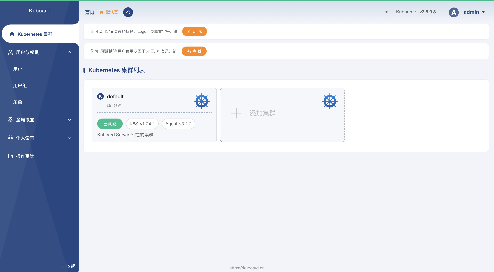

[TOC]

<h1 align="center">Kubernetes_Other</h1>

> By：weimenghua  
> Date：2022.10.01   
> Description：

**参考资料**  
[Rancher 官网](https://www.rancher.cn/)  
[Rancher 文档](http://docs.rancher.cn/)  


## Kuboard

### Kuboard 简介
[Kuboard 简介](https://kuboard.cn/overview/)*
Kuboard，是一款免费的 Kubernetes 图形化管理工具，Kuboard 力图帮助用户快速在 Kubernetes 上落地微服务。提供了丰富的功能，结合已有或新建的代码仓库、镜像仓库、CI/CD 工具等，可以便捷的搭建一个生产可用的 Kubernetes 容器云平台，轻松管理和运行云原生应用。
样例：https://demo.kuboard.cn  
用 户：demo  
密 码：demo123




## Kuboard 搭建
[Kuboard 安装教程](https://kuboard.cn/install/v3/install-in-k8s.html#%E5%AE%89%E8%A3%85)

```
1、安装 Kuboard
kubectl apply -f https://addons.kuboard.cn/kuboard/kuboard-v3.yaml

2、访问 Kuboard
在浏览器中打开链接 http://127.0.0.1:30080, 输入初始用户名和密码，并登录
用户名： admin
密码： Kuboard123

3、踩坑
执行：kubectl get pods -n kuboard
如果结果中没有出现 kuboard-etcd-xxxxx 的容器, 就执行：kubectl label nodes docker-desktop k8s.kuboard.cn/role=etcd 

4、创建集群，登陆 kuboard 拿到如下命令
curl -k 'http://127.0.0.1:30080/kuboard-api/cluster/default/kind/KubernetesCluster/default/resource/installAgentToKubernetes?token=0vPAhlKn6zIcNfvDsUBKX7t64yV4R46d' > kuboard-agent.yaml

kubectl apply -f ./kuboard-agent.yaml
```

**2.3.3、Kuboard 删除**

```
1、查询 pod
kubectl get pods -n kuboard
kubectl get pods --all-namespaces | grep "kuboard"

2、删除 pod
kubectl delete pods kuboard-etcd-lmtz8 --ns=kuboard

3、查询 service
kubectl get service -A

4、删除 service
kubectl delete service kuboard --ns=kube-system

5、卸载 kuboard
kubectl delete -f https://addons.kuboard.cn/kuboard/kuboard-v3.yaml

6、删除 ns 下所有资源
kubectl delete ns kuboard --force --grace-period=0
kubectl get ns kuboard -o json > kuboard.json，将 finalizers 字段去掉
kubectl proxy --port=8002
curl -k -H "Content-Type: application/json" -X PUT --data-binary @kuboard.json http://127.0.0.1:8002/api/v1/namespaces/kuboard/finalize
```


## Rancher

### Rancher 简介
Rancher 是一个 Kubernetes 管理工具，让你能在任何地方和任何提供商上部署和运行集群。


### Rancher 搭建

#### Docker 安装

```
运行容器
docker run --privileged \
--name rancher \
-d --restart=unless-stopped \
-p 8080:80 \
-p 8443:443 \
-v $HOME/docker/rancher:/var/lib/rancher \
rancher/rancher

访问地址
http://127.0.0.1:8080
https://127.0.0.1:8443/dashboard/auth/login

查看密码 注：如果无法查看密码，可以选择重置密码
docker logs  <容器 ID>  2>&1 | grep "Bootstrap Password:"

重置密码 密码：123456
docker exec -it <容器 ID> reset-password <password>
```

#### Helm 安装（待实践）

```
helm repo add rancher-stable https://releases.rancher.com/server-charts/stable

kubectl create namespace cattle-system

helm install rancher ./rancher-2.7.0.tgz --namespace cattle-system  --set hostname=vms81.liruilongs.github.io --set ingress.tls.source=secret  --set useBundledSystemChart=true
```


## kubeval yaml 检查工具

**参考资料**  
[kubeval](https://kubeval.instrumenta.dev/)

### 安装
```
wget https://github.com/instrumenta/kubeval/releases/latest/download/kubeval-linux-amd64.tar.gz
tar xf kubeval-linux-amd64.tar.gz
sudo cp kubeval /usr/local/bin
```

```
docker run -it -v `pwd`/fixtures:/fixtures garethr/kubeval fixtures/*

fixtures/* 为 yaml 文件路径
```
