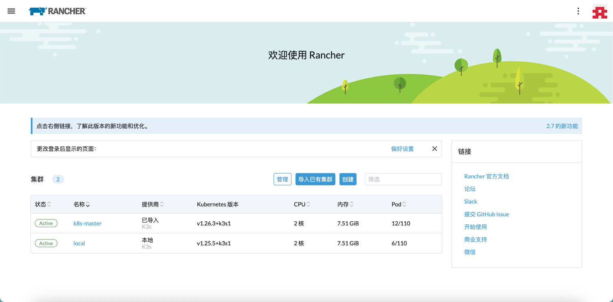

[TOC]

<h1 align="center">Rancher Kubernetes 管理工具</h1>

> By：weimenghua  
> Date：2022.10.01   
> Description：Rancher

**参考资料**  
[Rancher 官网](https://www.rancher.cn/)  
[Rancher 文档](http://docs.rancher.cn/)  


### 一、Rancher 简介
Rancher 是一个 Kubernetes 管理工具，让你能在任何地方和任何提供商上部署和运行集群。


### 二、Rancher 搭建

#### Docker 安装

```
运行容器
docker run --privileged \
--name rancher \
-d --restart=unless-stopped \
-p 8080:80 \
-p 8443:443 \
-v $HOME/docker/rancher:/var/lib/rancher \
rancher/rancher

访问地址
http://127.0.0.1:8080
https://127.0.0.1:8443/dashboard/auth/login

查看密码 注：如果无法查看密码，可以选择重置密码
docker logs  <容器 ID>  2>&1 | grep "Bootstrap Password:"

重置密码 密码：123456
docker exec -it <容器 ID> reset-password <password>
```

#### Helm 安装（待实践）

```
helm repo add rancher-stable https://releases.rancher.com/server-charts/stable

kubectl create namespace cattle-system

helm install rancher ./rancher-2.7.0.tgz --namespace cattle-system  --set hostname=vms81.liruilongs.github.io --set ingress.tls.source=secret  --set useBundledSystemChart=true
```



