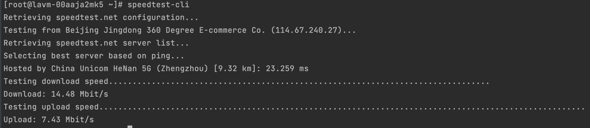

[TOC]

<h1 align="center">Linux</h1>

> By：weimenghua  
> Date：2022.05.14  
> Description：Linux 操作系统


### 环境变量

基本提示符，对于 root 用户是#，对于普通用户是$
1. 使用 echo 命令查看单个环境变量。例如：echo $PATH
2. 使用 env 查看所有环境变量。例如：env
3. 使用 set 查看所有本地定义的环境变量。

常用的环境变量：
1. PATH      决定了 shell 将到哪些目录中寻找命令或程序
2. HOME      当前用户主目录
3. USER      当前用户
4. HISTSIZE　历史记录数
5. LOGNAME   当前用户的登录名
6. HOSTNAME　指主机的名称
7. SHELL    当前用户 Shell 类型
8. LANGUGE  语言相关的环境变量，多语言可以修改此环境变量
9. MAIL　    当前用户的邮件存放目录


### Linux 下获取当前的目录

Linux 下获取当前的目录：$(cd `dirname $0`;pwd)  
dirname $0，取得当前执行的脚本文件的父目录  
cd `dirname $0`，进入这个目录(切换当前工作目录)  
pwd，显示当前工作目录(cd 执行后的)  
在使用的过程中需注意此事项：命令中“`”不是英文的单引号，而是英文输入法下的“~”同一个按键下面的那个符号。


### Linux 设置开机自启

/etc/rc.local 映射文件是/etc/rc.d/rc.local。(前提：chmod +x /etc/rc.d/rc.local)  
在/etc/rc.local 或者/etc/rc.d/rc.local 添加执行脚本语句, 举例：sh /tmp/demo.sh。


### Linux 查看防火墙状态

1. getenforce
2. /usr/sbin/sestatus -v
SELinux 有三种工作模式，分别是：  
1. enforcing：强制模式。违反 SELinux 规则的行为将被阻止并记录到日志中
2. permissive：宽容模式。违反 SELinux 规则的行为只会记录到日志中，一般为调试用
3. disabled：关闭 SELinux
SELinux 工作模式可以在 /etc/selinux/config 中设定, 如果想从 disabled 切换到 enforcing 或者 permissive 的话，需要重启系统，反过来也一样, enforcing 和 permissive 模式可以通过 setenforce 1|0 命令快速切换


### Linux 修改主机名

1. vim /etc/hostname（ubuntu） 或者 /etc/sysconfig/network（RHEL、CentOS 和 Fedora）, 添加：HOSTNAME=主机名, hostname 新主机名, 然后用 ssh 重新登录，就会显示新的主机名。
2. hostnamectl set-hostname 新主机名, 重启：reboot。


### Linux 字体颜色

1. 浅蓝色：表示链接文件
2. 灰色：表示其他文件
3. 绿色：表示可执行文件
4. 红色：表示压缩文件
5. 蓝色：表示目录
6. 红色闪烁：表示链接的文件有问题了
7. 黄色：表示设备文件，包括 block，char，fifo


### 清除缓存 buff 或者 cache

通过 free -m 查看到 buff/cache 的值比较大，通过下面的命令，清除缓存。
```
echo 1 > /proc/sys/vm/drop_caches
echo 2 > /proc/sys/vm/drop_caches
echo 3 > /proc/sys/vm/drop_caches
```

### 常见服务对应的端口

查看远端的服务是否开通：tcp 8000 端口，比如查看 baidu.com 是否开通：telnet baidu.com 8000。
1. 21 FTP
2. 22 SSH
3. 25 SMTP
4. 3306 MYSQL
5. 873 rsync
6. 161 snmp
7. 111 rpc
8. 3389 RPC
9. 80 HTTP
10. 443 HTTPS
11. 110 POP3
12. 53 DNS
13. 514 syslog


### Linux 开放端口

```
$ iptables -I INPUT -p tcp --dport 80 -j DROP
$ iptables -I INPUT -p tcp -s 1.2.3.4 --dport 80 -j ACCEPT
```
这里仅允许 1.2.3.4 访问本地主机的 80 端口。

对于类似 docker run -d -p 80:80 shaowenchen/demo-whoami 运行的服务，上面的方法无效，需要在 DOCKER-USER 链中添加规则。
Docker 会将 iptables 规则添加到 DOCKER 链中，如果需要在 Docker 之前添加规则需要添加到 DOCKER-USER 链中
`$ iptables -I DOCKER-USER -i ens192 ! -s 1.2.3.4 -p tcp --dport 80 -j DROP`
ens192 是本地的网卡，这里仅允许 1.2.3.4 访问本地主机的 80 端口。
```
$ yum install -y iptables-services
$ systemctl restart iptables.service
```

如果需要在主机重启之后 iptables 设置，依然有效，需要安装 iptables-services 并保存
```
$ yum install -y iptables-services
$ service iptables save
```

查看 Linux 服务有哪些开放端口
```
netstat -tuln
ss -tuln
lsof -i -P -n
iptables -L -n -v
```


### 安装 Centos 系统常用工具

yum install -y git
yum install -y jq
yum install -y sysstat
yum install -y telnet.*
yum install -y mysql
yum install -y python-pip
yum install -y epel-release
yum install -y lsof
yum install -y python3


### 设置 SSH 会话时长

vim /etc/ssh/sshd_config

- 设置 ClientAliveInterval 参数为一个较小的值，例如 300（表示 300 秒）。
- 设置 ClientAliveCountMax 参数为一个较大的值，例如 0（表示没有限制）。
保存并关闭配置文件。  
重新加载 SSH 服务器配置，以使更改生效，可以使用 service ssh reload 或 systemctl reload sshd 命令。

- ClientAliveInterval：指定服务器向客户端发送保持活动消息的时间间隔。如果在指定的时间内没有活动，服务器将向客户端发送一个保持活动的消息。
- ClientAliveCountMax：指定服务器在关闭连接之前允许客户端没有响应的次数。设置为 0 表示没有限制。


### rsync+inotify-tools 实时同步数据

```
安装 raync
yum install rsync -y

同步整个目录A到目录B
rsync -avz  本地目录A   本地目录B
只同步目录A下的数据到目录B
rsync -avz  本地目录A/  本地目录B

安装 gcc 依赖
yum install gcc* -y

下载 inotify-tools
wget https://sourceforge.net/projects/inotify-tools/files/inotify-tools/3.13/inotify-tools-3.13.tar.gz

解压 inotify-tools
tar -zxvf inotify-tools-3.13.tar.gz

--prefix 指定安装目录
cd inotify-tools
./configure --prefix=/usr/local/inotify && make && make install

设置软连接
ln -s /usr/local/inotify/bin/inotifywait /usr/sbin/
ln -s /usr/local/inotify/bin/inotifywatch /usr/sbin/

编写同步脚本
cat >> rsync.sh << EOF
#!/bin/bash

while true
do
inotifywait -rq -e  modify,create,delete /root/tmp
rsync -avz --delete /root/tmp/ /root/tmp2
done

EOF

执行脚本
chmod u+x rsync.sh
sh rsync.sh

测试
在 tmp 新增文件/文件夹，进入 tmp2 目录查看是否增加文件，如增加则验证成功
```


### Trickle 带宽控制供给

```
yum install trickle

trickle -V

trickle -d <download-rate> -u <upload-rate> <command>  // 1000 KB/s
trickle -d 1000 wget http://10.0.1.25/iso/centos/CentOS-7.7-x86_64-Minimal-1908.iso

trickled 配置：cat /etc/trickled.conf
```


### speedtest 测速工具

```
安装
sudo yum install speedtest-cli

测速
speedtest-cli

有教程用这个命令，经测试无效
speedtest
```




### WonderShaper 网卡限速工具
```
安装 注：未安装成功
sudo yum install -y wondersharper epel-release

查看 eth0 当前的状态
wondershaper -s -a eth0
```


### sshx 

[sshx 分享终端](https://sshx.io/)

安装 sshx: curl -sSf https://sshx.io/get | sh，执行 sshx 生成分享链接，点击链接可看见终端并一起协作。


### 查看 Linux 开放公网的端口

- netstat -tuln
- ss -tuln
- sudo lsof -i -P -n | grep LISTEN
- sudo nmap -sT -O localhost


### Linux 性能基准测试工具及测试方法

**参考资料**
```
git clone https://github.com/clay-wangzhi/bench.git
bash bench.sh
```
[](./Shell/bench.sh)

- CPU
Super_Pi 是一种用于计算圆周率π的程序，通常用于测试计算机性能和稳定性。它的主要用途是测量系统的单线程性能，因为它是一个单线程应用程序。
```
yum -y install bc

time echo "scale=5000; 4*a(1)" | bc -l -q &>1

结果分析，看 real 即可，时间越短，性能越好
```

sysbench 素数计算
```
yum -y install sysbench

测试方法: 启动4个线程计算10000事件所花的时间
sysbench cpu --threads=4 --events=10000 --time=0  run

结果分析，看 total time 即可，时间越短，性能越好
```

- 内存
内存带宽(stream) Stream测试是内存测试中业界公认的内存带宽性能测试基准工具
```
编译安装 STREAM
yum -y install gcc gcc-gfortran
git clone https://github.com/jeffhammond/STREAM.git
cd STREAM/
make

指定线程数
export OMP_NUM_THREADS=1
./stream_c.exe

结果分析，看 Copy、Scale、Add、Triad，数值越大，性能越好
```

- 磁盘 IO
磁盘读、写iops，iops：磁盘的每秒读写次数，这个是随机读写考察的重点
```
# 安装
yum -y install fio
# 测试随机读 IOPS
fio --ioengine=libaio --bs=4k --direct=1 --thread --time_based --rw=randread --filename=/home/randread.txt --runtime=60 --numjobs=1 --iodepth=1 --group_reporting --name=randread-dep1 --size=1g
# 测试随机写 IOPS
fio --ioengine=libaio --bs=4k --direct=1 --thread --time_based --rw=randwrite --filename=/home/randwrite.txt --runtime=60 --numjobs=1 --iodepth=1 --group_reporting --name=randread-dep1 --size=1g
# 结果分析，看 IOPS 即可，值越大，性能越好
```

### ssh 远程服务器报错  
报错：kex_exchange_identification: read: Connection reset by peer Connection reset by 114.67.240.27 port 22

解决：  
方式一：ssh-keygen -R 114.67.240.27
方式二：
vim /etc/hosts.allow
sshd:ALL
systemctl restart sshd


### umask

umask 用于设置默认的文件权限掩码。文件权限掩码决定了在创建新文件或目录时，所设置的默认权限模式。umask 命令的作用是从当前文件权限掩码中减去给定的权限位，以设置新文件或目录的默认权限。它可以用来限制新文件的默认权限，以确保安全性和隐私。

查看当前的文件权限掩码值：umask  
将文件权限掩码设置为 027。新创建的文件将具有权限模式 640，新创建的目录将具有权限模式 750：umask 027  
永久更改文件权限掩码值： 在用户的配置文件（如 ~/.bashrc、~/.bash_profile）中添加以下行：umask 027  
文件权限掩码的值是一个八进制数，用于指定要从默认权限模式中屏蔽的权限位。常见的权限位包括：
- 0：没有权限被屏蔽。
- 2：屏蔽写权限。
- 7：屏蔽所有者权限、组权限和其他用户权限。

示例  
文件umask 0022 是将文件权限掩码设置为 0022 的命令。  
文件权限掩码是一个八进制数，用于指定默认文件和目录权限中要屏蔽的权限位。在 0022 的情况下，权限掩码指定要屏蔽的权限位为 w（写入权限）。  
具体影响如下：  
- 对于新创建的文件，默认权限模式为 666，然后从中减去权限掩码 0022，结果为 644。因此，新创建的文件将具有所有者可读写，其他用户只能读取的权限。
- 对于新创建的目录，默认权限模式为 777，然后从中减去权限掩码 0022，结果为 755。因此，新创建的目录将具有所有者可读写执行，其他用户只能读取和执行的权限。


### Linxu 发行版

[Linux 黑话解释：什么是 Linux 发行版？为什么它被称为“发行版”？](https://linux.cn/article-12609-1.html)

Linux 发行版是一个由 Linux 内核、GNU 工具、附加软件和软件包管理器组成的操作系统，它也可能包括显示服务器和桌面环境，以用作常规的桌面操作系统。

这个术语之所以是 “Linux 发行版”，是因为像 Debian、Ubuntu 这样的机构“发行”了 Linux 内核以及所有必要的软件及实用程序（如网络管理器、软件包管理器、桌面环境等），使其可以作为一个操作系统使用。

[Debian 发行版本](https://www.debian.org/releases/index.zh-cn.html)，[Debian 发行版常见问题](https://www.debian.org/doc/manuals/debian-faq/basic-defs.zh-cn.html)


### swp

交换文件（.swp）的存在是为了在编辑器会话意外中断的情况下保护数据。再次打开相同的文件进行编辑时，编辑器会检测到交换文件的存在，并询问是否恢复之前的编辑会话。

### 其它

history 命令记录序号、日期时间、用户、登录IP及对应执行的命令
vim /etc/profile
export HISTTIMEFORMAT="%Y-%m-%d %H:%M:%S  `who am i | awk '{print $1,$5}'` "
source /etc/profile

### NTrace

NTrace 是一款Golang 实现的开源的、轻量级的可视化路由追踪CLI工具
https://github.com/nxtrace/NTrace-core
注：多试几次才安装成功
curl nxtrace.org/nt |bash
使用示例
nexttrace gitee.com


### ffmpeg
$ apt-get install ffmpeg
$ yum install ffmpeg
$ brew install ffmpeg

mp4 转 avi:
$ ffmpeg -i input.mp4 output.avi

webm 转 mp4:
$ ffmpeg -i movie.webm movie.mp4

tzdata 是一个包含世界各地时区信息的数据库包。  
apt install -y tzdata


当前CPU是否支持SSE 4.2的命令  
$ grep -q sse4_2 /proc/cpuinfo && echo "SSE 4.2 supported" || echo "SSE 4.2 not supported"


/etc/security/limits.d/default.conf 文件在 Linux 系统中用于配置用户和用户组的资源限制。它是 PAM（Pluggable Authentication Modules） 框架的一部分，具体作用如下：
主要作用：
1. 资源限制：
- 可用来限制用户的资源使用量，例如：
- 最大打开文件数（nofile）
- 最大进程数（nproc）
- 虚拟内存（as）
- 栈大小（stack）
这些限制可以帮助防止单个用户或进程耗尽系统资源。
2. 用户和用户组配置：
- 文件可以针对特定用户或用户组设置限制。
- 可以使用 * 来表示所有用户，或指定特定的用户名或组名。

```
cat > /etc/security/limits.d/default.conf << EOF
* soft nofile 102400
* hard nofile 102400
* soft nproc 102400
* hard nproc 102400
EOF
```


### 查询当前目录及子目录的所有文件总数

```
. 表示当前目录。
-type f 选项用于仅查找文件。
wc -l 用于统计行数，即文件总数。
find . -type f | wc -l

-f 选项显示完整路径。
grep -v '/$' 过滤掉目录，只保留文件。
tree -f | grep -v '/$' | wc -l
```

获取 IP

```shell
# 通过 resolve 进行 IP 映射
curl --resolve 'example.com:443:127.0.0.1' https://example.com/api/v5/information/ip

参数说明：
example.com: 要请求的主机名。
443: HTTPS 的标准端口。
127.0.0.1: 将 example.com 映射到的 IP 地址，在这里它指向本地机器。

# 正常情况下获取 IP
curl https://example.com/api/v5/information/ip

# 伪造 `X-Forwarded-For` 头部
curl -H 'X-Forwarded-For: 1.1.1.1' https://example.com/api/v5/information/ip

# 伪造 `X-Real-IP` 头部
curl -H 'X-Real-IP: 1.1.1.1' https://example.com/api/v5/information/ip

# 获取公网 IP
curl cip.cc
```

作用是向 https://example.com/api/v5/information/ip 发送请求，但在请求时，curl 会将 example.com 映射到本地 IP 地址 127.0.0.1。这通常用于：
- 测试本地开发环境: 在开发过程中，可以将请求指向本地的服务器而不是实际的远程服务器。
- 调试: 确保请求被发送到特定的服务器，以便进行故障排除或验证。
- 绕过 DNS: 有时可以用于绕过 DNS 解析问题。

X-Forwarded-For 是一个 HTTP 头部，用于标识通过代理服务器或负载均衡器转发的原始客户端 IP 地址。X-Forwarded-For 头部的格式通常是一个以逗号分隔的 IP 地址列表：

```text
X-Forwarded-For: client-ip, proxy1-ip, proxy2-ip
```

- client-ip: 最初的客户端 IP 地址。
- proxy1-ip: 第一个代理服务器的 IP 地址。
- proxy2-ip: 第二个代理服务器的 IP 地址（如果存在）。

工作原理

1. 客户端请求: 当客户端发送请求到代理服务器时，代理服务器会接收到客户端的 IP 地址。
2. 添加头部: 代理服务器在转发请求时，会在请求头中添加 X-Forwarded-For 头部，其中包含客户端的 IP 地址。
3. 多个代理: 如果请求经过多个代理，每个代理都会将其自身的 IP 地址添加到 X-Forwarded-For 头部，形成完整的 IP 地址链。

X-Real-IP 是一个 HTTP 头部，用于传递客户端的真实 IP 地址，尤其是在通过代理服务器或负载均衡器转发请求时。与 X-Forwarded-For 类似，X-Real-IP 旨在帮助后端服务器识别原始客户端的 IP，但通常只包含一个 IP 地址，而不是一个以逗号分隔的列表。
