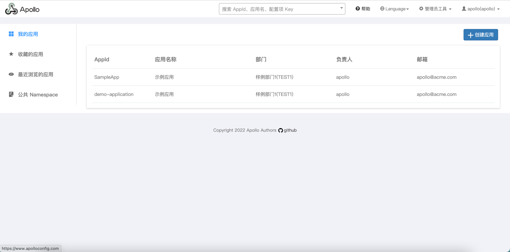

[TOC]

---

<h1 align="center">Apollo</h1>

> By：weimenghua  
> Date：2022.12.07  
> Description：Apollo 分布式配置管理中心

**参考资料**  
[Apollo 文档](https://www.apolloconfig.com/#/zh/README)  
[Apollo 源码](https://github.com/apolloconfig/apollo)


## 1. Apollo 简介

Apollo（阿波罗）是一款可靠的分布式配置管理中心，诞生于携程框架研发部，能够集中化管理应用不同环境、不同集群的配置，配置修改后能够实时推送到应用端，并且具备规范的权限、流程治理等特性，适用于微服务配置管理场景。  
服务端基于 Spring Boot 和 Spring Cloud 开发，打包后可以直接运行，不需要额外安装 Tomcat 等应用容器。  
Java 客户端不依赖任何框架，能够运行于所有 Java 运行时环境，同时对 Spring/Spring Boot 环境也有较好的支持。  
.Net 客户端不依赖任何框架，能够运行于所有.Net 运行时环境。


## 2. Apollo 安装

方式一  
[docker-compose 部署](https://www.apolloconfig.com/#/zh/deployment/quick-start-docker)
```
下载 docker-compose.yml 和 sql 文件夹到本地目录，如 docker-quick-start。
- docker-quick-start
  - docker-compose.yml
  - sql
    - apolloconfigdb.sql
    - apolloportaldb.sql
    
在 docker-quick-start 目录下执行 docker-compose up，第一次执行会触发下载镜像等操作，需要耐心等待一些时间。
后台运行：docker-compose up -d

docker exec -it apollo-db /bin/bash
mysql
show dbs;
use ApolloConfigDB;
show tables;
select * from App;
```

方式二
```
1、配置 sql
https://github.com/apolloconfig/apollo/tree/master/scripts/sql
select * from ApolloConfigDB.ServerConfig WHERE `key` = 'eureka.service.url';
修改 value 为实际 ip+port

2、拉取镜像
docker pull apolloconfig/apollo-portal:latest
docker pull apolloconfig/apollo-adminservice:latest
docker pull apolloconfig/apollo-configservice:latest

3、运行镜像
3.1、Apollo Config Service
docker run -d -p 8080:8080 \
-e SPRING_DATASOURCE_URL="jdbc:mysql://127.0.0.1:3306/ApolloConfigDB?characterEncoding=utf8" \
-e SPRING_DATASOURCE_USERNAME=root \
-e SPRING_DATASOURCE_PASSWORD=root \
-e "EUREKA_INSTANCE_PREFERIPADDRESS=true" \
-e "EUREKA_INSTANCE_IPADDRESS=127.0.0.1" \
-e "EUREKA_INSTANCE_NONSECUREPORT=8080" \
-e "EUREKA_INSTANCE_INSTANCEID=127.0.0.1:8080" \
-v /tmp/logs:/opt/logs  \
--name apollo-configservice apolloconfig/apollo-configservice

3.2、Apollo Admin Service
docker run -d -p 8090:8090 \
-e SPRING_DATASOURCE_URL="jdbc:mysql://127.0.0.1:3306/ApolloConfigDB?characterEncoding=utf8" \
-e SPRING_DATASOURCE_USERNAME=root \
-e SPRING_DATASOURCE_PASSWORD=root \
-e "EUREKA_INSTANCE_PREFERIPADDRESS=true" \
-e "EUREKA_INSTANCE_IPADDRESS=127.0.0.1" \
-e "EUREKA_INSTANCE_NONSECUREPORT=8090" \
-e "EUREKA_INSTANCE_INSTANCEID=127.0.0.1:8090" \
-v /tmp/logs:/opt/logs \
--name apollo-adminservice apolloconfig/apollo-adminservice

3.3、Apollo Portal
docker run -d -p 8070:8070 \
-e SPRING_DATASOURCE_URL="jdbc:mysql://127.0.0.1:3306/ApolloPortalDB?characterEncoding=utf8" \
-e SPRING_DATASOURCE_USERNAME=root \
-e SPRING_DATASOURCE_PASSWORD=root \
-e APOLLO_PORTAL_ENVS=pro \
-e PRO_META=http://127.0.0.1:8080 \
-v /tmp/logs:/opt/logs \
--name apollo-portal apolloconfig/apollo-portal

参数说明
SPRING_DATASOURCE_URL: 对应环境 ApolloConfigDB 的地址
SPRING_DATASOURCE_USERNAME: 对应环境 ApolloConfigDB 的用户名
SPRING_DATASOURCE_PASSWORD: 对应环境 ApolloConfigDB 的密码
APOLLO_PORTAL_ENVS(可选): 对应 ApolloPortalDB 中的 apollo.portal.envs 配置项，如果没有在数据库中配置的话，可以通过此环境参数配置
DEV_META/PRO_META(可选): 配置对应环境的 Meta Service 地址，以${ENV}_META 命名，需要注意的是如果配置了 ApolloPortalDB 中的 apollo.portal.meta.servers 配置，则以 apollo.portal.meta.servers 中的配置为准

4、测试
Apollo 访问地址： http://127.0.0.1:8070/signn
用户名/密码：apollo/admin

Eureka 访问地址：http://127.0.0.1:8080/

5、查看日志
docker logs -f apollo-configservice
docker logs -f apollo-adminservice
docker logs -f apollo-portal

6、删除
docker rm -f apollo-configservice
docker rm -f apollo-adminservice
docker rm -f apollo-portal

注：以上方式部署，访问页面会报错，暂未找到解决方式
```



## 3. Appllo 模块

四个核心模块及其主要功能

### ConfigService

提供配置获取接口
提供配置推送接口
服务于 Apollo 客户端

### AdminService

提供配置管理接口
提供配置修改发布接口
服务于管理界面 Portal

### Client

为应用获取配置，支持实时更新
通过 MetaServer 获取 ConfigService 的服务列表
使用客户端软负载 SLB 方式调用 ConfigService

### Portal

配置管理界面
通过 MetaServer 获取 AdminService 的服务列表
使用客户端软负载 SLB 方式调用 AdminService
三个辅助服务发现模块

### Eureka

用于服务发现和注册
Config/AdminService 注册实例并定期报心跳
和 ConfigService 住在一起部署

### MetaServer

Portal 通过域名访问 MetaServer 获取 AdminService 的地址列表
Client 通过域名访问 MetaServer 获取 ConfigService 的地址列表
相当于一个 Eureka Proxy
逻辑角色，和 ConfigService 住在一起部署

### NginxLB

和域名系统配合，协助 Portal 访问 MetaServer 获取 AdminService 地址列表
和域名系统配合，协助 Client 访问 MetaServer 获取 ConfigService 地址列表
和域名系统配合，协助用户访问 Portal 进行配置管理
