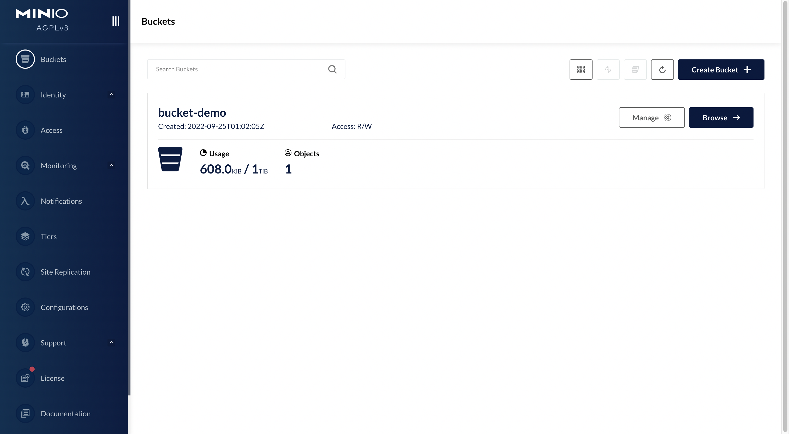

[TOC]

---

<h1 align="center">MinIO 文件存储</h1>

> By：weimenghua  
> Date：2022.10.2  
> Description：MinIO

**参考资料**  

[minio 官网](https://min.io/)  
[minio 文档](http://docs.minio.org.cn/docs/master/minio-monitoring-guide)

## 一、MinIO 简介

MinIO 是根据 GNU Affero 通用公共许可证 v3.0发布的高性能对象存储。它与 Amazon S3云存储服务兼容。使用 MinIO 构建用于机器学习，分析和应用程序数据工作负载的高性能基础架构。  
其设计的主要目标是作为私有云对象存储的标准方案。主要用于存储海量的图片，视频，文档等。非常适合于存储大容量非结构化的数据，例如图片、视频、日志文件、备份数据和容器/虚拟机镜像等，而一个对象文件可以是任意大小，从几 kb 到最大5T 不等。

## 二、MinIO 特点
- 高性能：作为高性能对象存储，在标准硬件条件下它能达到55GB/s 的读、35GG/s 的写速率
- 可扩容：不同 MinIO 集群可以组成联邦，并形成一个全局的命名空间，并跨越多个数据中心
- 云原生：容器化、基于 K8S 的编排、多租户支持
- Amazon S3兼容：Minio 使用 Amazon S3 v2 / v4 API。可以使用 Minio SDK，Minio Client，AWS SDK 和 AWS CLI 访问 Minio 服务器。
- 可对接后端存储: 除了 Minio 自己的文件系统，还支持 DAS、 JBODs、NAS、Google 云存储和 Azure Blob 存储。
- SDK 支持: 基于 Minio 轻量的特点，它得到类似 Java、Python 或 Go 等语言的 sdk 支持
- Lambda 计算: Minio 服务器通过其兼容 AWS SNS / SQS 的事件通知服务触发 Lambda 功能。支持的目标是消息队列，如 Kafka，NATS，AMQP，MQTT，Webhooks 以及 Elasticsearch，Redis，Postgres 和 MySQL 等数据库。
- 有操作页面
- 功能简单: 这一设计原则让 MinIO 不容易出错、更快启动
- 支持纠删码：MinIO 使用纠删码、Checksum 来防止硬件错误和静默数据污染。在最高冗余度配置下，即使丢失1/2的磁盘也能恢复数据
