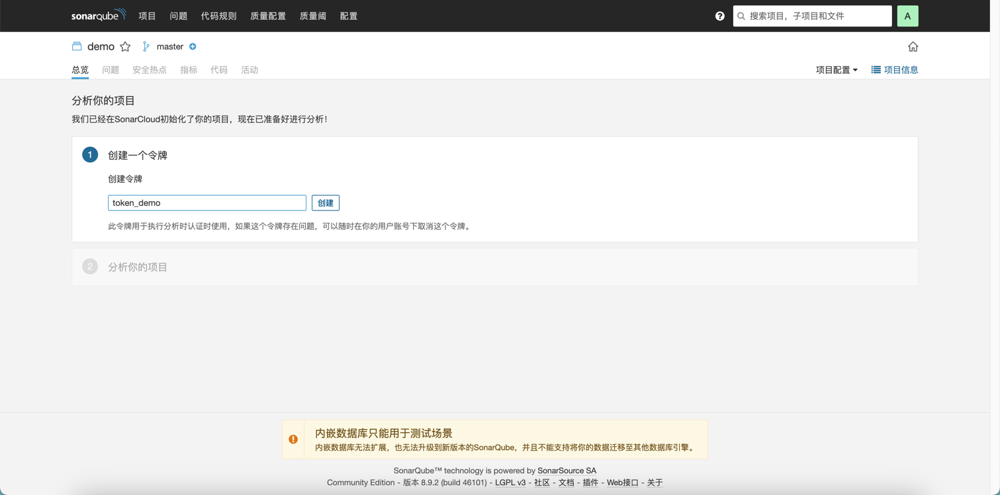
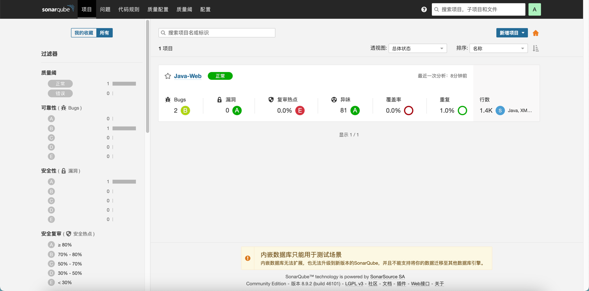

[TOC]

<h1 align="center">Sonar</h1>

> By：weimenghua  
> Date：2022.01.23  
> Description：Sonar 安全扫描 

**参考资料**  
[Sonar 官网](https://docs.sonarqube.org/latest/)  
[Sonar 源码](https://github.com/SonarSource/sonarqube)


### 1. Sonar 搭建

Docker 安装 Sonar  
[sonarqube](https://hub.docker.com/_/sonarqube)

```
运行容器
docker run -d \
--name sonarqube \ 
-p 9100:9000 \
sonarqube:8.9.2-community

未实践
docker run -d \
--name sonarqube  \
-e SONAR_ES_BOOTSTRAP_CHECKS_DISABLE=true \ 
-p 9100:9000 \
sonarqube:latest

访问地址 默认账号密码：admin/admin，更新账号密码为 admin/root
http://127.0.0.1:9100/
```


### 2. Sonar 使用

安装中文插件


新增项目


在项目下创建令牌



扫描 Java 项目的 Sonar 命令

```
mvn sonar:sonar \
  -Dsonar.projectKey=demo \
  -Dsonar.host.url=http://127.0.0.1:9100 \
  -Dsonar.login=347965ce925e65ee90aba980282455328a84f00d
```

扫描结果




### 3. Sonar 集成 Jenkins

1、安装 [SonarQube Scanner](https://plugins.jenkins.io/sonar) 插件

2、系统管理 > 系统 > SonarQube servers ，添加 Server URL 和 Server authotication token，Server authotication token 类型选择 Secret text，其中 token 获取参考【在项目下创建令牌】


3、系统管理 > 全局工具配置 > SonarQube Scanner，选择 SonarQube Scanner 版本


4、job 编译时增加：clean compile -U $SONAR_MAVEN_GOAL（待补充）