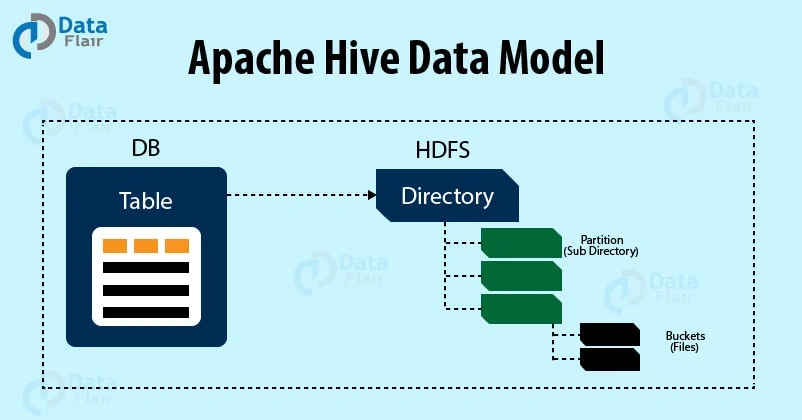
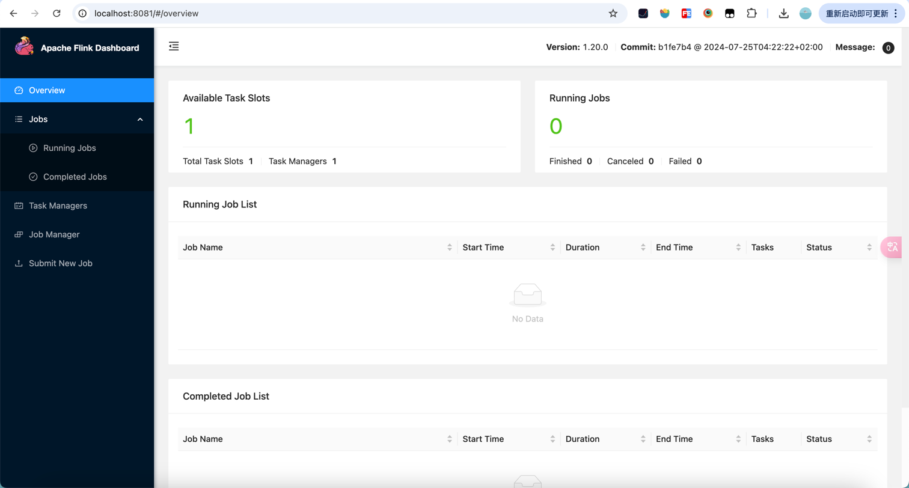

[TOC]

<h1 align="center">大数据</h1>

> By：weimenghua  
> Date：2023.11.14  
> Description：  

## 1. 简介

- Hadoop - 大数据解决方案
- Spark - 大数据计算框架
- Flink - 大数据实时分析框架
- Storm - 大数据实时分析框架
- Hive - 大数据仓库
- HBase - 大数据仓库

## 2. Hadoop

[Hadoop 教程](https://www.hadoopdoc.com/hadoop/hadoop-intro)

Hadoop 是一个分布式系统基础架构，现在被广泛地应用于大数据平台的开发，对处理海量数据，有着其他技术无可匹敌的优势。Google File System、MapReduce与BigTable被誉为分布式计算的三驾马车。Hadoop的基本架构的底层是 HDFS，上面运行的是 MapReduce/Tez/Spark，再往上封装的是 Pig 和 Hive！

Hadoop 只是一套工具的总称，它包含三部分：HDFS，Yarn，MapReduce，功能分别是分布式文件存储、资源调度和计算。

在 Hadoop 架构里面，master 节点上会运行一个叫做 namenode 的守护进程，每个 slave 节点上都会有 datanode 守护进程，两个进程都是属于HDFS 的。因此，slave 节点也叫做 datanode 节点。Namenode 主要用于存储元数据和管理 datanode 节点。而 datanode 则是真正存储数据和执行任务的地方。

Hadoop 主要有4个守护进程:

- NameNode：它是HDFS运行在Master节点守护进程。
- DataNode：它是 HDFS 运行在Slave节点守护进程。
- ResourceManager：它是 Yarn 运行在 Master 节点守护进程。
- NodeManager：它是 Yarn 运行在 Slave 节点的守护进程。

Hadoop 搭建

```text
运行容器
docker run -it sequenceiq/hadoop-docker:latest /etc/bootstrap.sh -bash

设置环境变量
export HADOOP_HOME=/usr/local/hadoop
export PATH=$PATH:$HADOOP_HOME/bin

检查版本
hadoop version

查看环境变量
which hadoop

启动 HDFS
hdfs namenode -format
start-dfs.sh
```

Hadoop 基础命令

```text
显示根目录 / 下的文件和子目录，绝对路径
hadoop fs -ls /

新建文件夹，绝对路径
hadoop fs -mkdir /hello

上传文件
hadoop fs -put hello.txt /hello/

下载文件
hadoop fs -get /hello/hello.txt

输出文件内容
hadoop fs -cat /hello/hello.txt
```

Hadoop WordCount

```text
hadoop jar $HADOOP_HOME/share/hadoop/mapreduce/hadoop-mapreduce-examples-2.7.0.jar wordcount /hello/hello.txt /output

hadoop fs -cat /output/part-r-00000
```

## 3. Spark

## 4. Hive

- [Hive 教程1](https://www.tutorialspoint.com/hive/index.htm)
- [Hive 教程2](https://www.gairuo.com/p/hive-sql-tutorial)
- [Hive 教程3](https://www.hadoopdoc.com/hive/hive-tutorial)
- [Hive SQL 示例](../../Database/HiveSet.sql)

### Hive 简介

Hive 是基于 Hadoop 的一个数据仓库工具。Hive 的数据存储在 Hadoop 一个分布式文件系统上，即 HDFS。

[Hive Data Model](https://data-flair.training/blogs/hive-data-model/) Hive 是一个基于 Hadoop 的开源数据仓库系统，主要用于对存储在 Hadoop 上的数据进行查询和分析。它可以处理结构化和半结构化数据。而 Hive 中的数据可以分成以下几类：

- 表
- 分区
- 桶




按数据的照粒度顺序，数据存储单元数据被组织为：

- 数据库 Databases
- 数据表 Tables
- 分区 Partitions
- 桶或簇 Buckets (or Clusters)

在 Hive 创建表的时候，Hive 将以默认的方式管理表数据，也就是说，Hive 会默认把数据存储到 `/user/hive/warehouse` 目录里面。

创建表类型

| **分类** | **类型**   | **描述**                                       | **字面量示例**                                               |
| -------- | ---------- | ---------------------------------------------- | ------------------------------------------------------------ |
| 原始类型 | BOOLEAN    | true/false                                     | TRUE                                                         |
|          | TINYINT    | 1字节的有符号整数 -128~127                     | 1Y                                                           |
|          | SMALLINT   | 2个字节的有符号整数，-32768~32767              | 1S                                                           |
|          | **INT**    | 4个字节的带符号整数                            | 1                                                            |
|          | BIGINT     | 8字节带符号整数                                | 1L                                                           |
|          | FLOAT      | 4字节单精度浮点数1.0                           |                                                              |
|          | DOUBLE     | 8字节双精度浮点数                              | 1.0                                                          |
|          | DEICIMAL   | 任意精度的带符号小数                           | 1.0                                                          |
|          | **STRING** | 字符串，变长                                   | “a”,’b’                                                      |
|          | VARCHAR    | 变长字符串                                     | “a”,’b’                                                      |
|          | CHAR       | 固定长度字符串                                 | “a”,’b’                                                      |
|          | BINARY     | 字节数组                                       | 无法表示                                                     |
|          | TIMESTAMP  | 时间戳，毫秒值精度                             | 122327493795                                                 |
|          | **DATE**   | 日期                                           | ‘2016-03-29’                                                 |
|          | INTERVAL   | 时间频率间隔                                   |                                                              |
| 复杂类型 | ARRAY      | 有序的的同类型的集合                           | array(1,2)                                                   |
|          | MAP        | key-value,key必须为原始类型，value可以任意类型 | map(‘a’,1,’b’,2)                                             |
|          | STRUCT     | 字段集合,类型可以不同                          | struct(‘1’,1,1.0), named_stract(‘col1’,’1’,’col2’,1,’clo3’,1.0) |
|          | UNION      | 在有限取值范围内的一个值                       | create_union(1,’a’,63)                                       |

### Hive SerDe

SerDe 是 Serializer/Deserializer 的缩写，即序列化和反序列化。

- 序列化是对象转换成字节序列的过程。
- 反序列化是字节序列转换成对象的过程。

表数据行的序列化和反序列化大概过程如下：

- HDFS 文件 ——> InputFileFormate ——> ——> 反序列化 ——> 数据行对象（Row object）
- 数据行对象（Row object）——> 序列化 ——> ——> OutputFileFormate ——> HDFS 文件

### Hive SQL 与 SQL

1. 结构化查询语言（SQL）：

SQL 是一种特定于领域的语言，用于编程，用于管理关系数据库管理系统（也称为 RDBMS）中的数据。它在处理结构化数据时也很有用，即包含实体和变量之间关系的数据。SQL是在数据库中存储、操作和检索数据的标准语言。

2. 配置单元查询语言（HiveQL）：

HiveQL 是一种用于 Hive 分析和处理元存储中结构化数据的查询语言。它与 SQL 非常相似，具有高度的可扩展性。它重用关系数据库世界中熟悉的概念，如表、行、列和模式，以简化学习。Hive 支持四种文件格式，即文本文件、序列文件、ORC 和 RC 文件（记录列文件）。

Hive 和 SQL 之间的主要区别：

- 架构：Hive 是一个用于数据分析的数据仓库项目；SQL是一种编程语言。不过，Hive通过一种名为HiveQL的编程语言（类似于SQL）执行数据分析。
- 设置：Hive 是一个基于开源软件程序 Hadoop 构建的数据仓库。
- 数据分析：Hive比SQL更有效地处理复杂数据，SQL适合不太复杂的数据集。

SQL 和 HiveQL 之间的区别：

| 对比项                 | SQL                                                          | HiveQL                                                       |
| ---------------------- | ------------------------------------------------------------ | ------------------------------------------------------------ |
| 表结构中的更新命令     | UPDATE, DELETE, INSERT                                       | UPDATE, DELETE, INSERT                                       |
| 管理方式               | 关系型数据                                                   | 数据结构                                                     |
| 事务处理               | 支持                                                         | 支持有限                                                     |
| 索引                   | 支持                                                         | 支持                                                         |
| 数据类型               | 它总共包含5种数据类型： Integral, floating-point, fixed-point, text and binary strings, temporal | 它总共包含9种数据类型： Boolean, integral, floating-point, fixed-point, text and binary strings, temporal, array, map, struct. |
| 函数                   | 大量内置函数                                                 | 大量内置函数                                                 |
| Mapreduce              | 不支持                                                       | 支持                                                         |
| 多表插入               | 不支持                                                       | 支持                                                         |
| Create table as Select | 不支持                                                       | 支持                                                         |
| Select 命令            | 支持                                                         | 支持使用SORT BY子句进行偏序，并使用LIMIT限制返回的行数       |
| Joins                  | 支持                                                         | Inner joins, outer joins, semi join, map joins, cross joins  |
| 子查询                 | 支持                                                         | 仅用于 FROM, WHERE, or HAVING clauses                        |
| 视图                   | 可以更新                                                     | 只读，不能更新                                               |

## 5. HBase

- [HBase 官方文档](https://hbase.apache.org/book.html)
- [HBase 官方文档翻译](https://www.w3cschool.cn/hbase_doc/)

### HBase 简介

HBase 是一个开源的、分布式的、版本化的 NoSQL 数据库（也即非关系型数据库），它利用 Hadoop 分布式文件系统（Hadoop Distributed File System，HDFS）提供分布式数据存储。与传统的关系型数据库类似，HBase 也以表的形式组织数据，表也由行和列组成；不同的是，HBase 有列族的概念，它将一列或者多列组织在一起，HBase 的每一个列都必须属于某个列族。  

### HBase 特点

- 大：一个表可以有上亿行，上百万列。
- 面向列：面向列表（簇）的存储和权限控制，列（簇）独立检索。
- 稀疏：对于为空（NULL）的列，并不占用存储空间，因此，表可以设计的非常稀疏。
- 无模式：每一行都有一个可以排序的主键和任意多的列，列可以根据需要动态增加，同一张表中不同的行可以有截然不同的列。
- 数据多版本：每个单元中的数据可以有多个版本，默认情况下，版本号自动分配，版本号就是单元格插入时的时间戳。
- 数据类型单一：HBase中的数据都是字符串，没有类型。

### HBase 和 HDFS

| HDFS                                     | HBase                                                        |
| ---------------------------------------- | ------------------------------------------------------------ |
| HDFS是适用于存储大文件的分布式文件系统。 | HBase是建立在HDFS之上的数据库。                              |
| HDFS不支持快速的单个记录查找。           | HBase为大型表提供快速查找。                                  |
| 它提供高延迟的批处理；没有批处理的概念。 | 它提供了数十亿条记录对单行的低延迟访问（随机访问）。         |
| 它仅提供数据的顺序访问。                 | HBase在内部使用哈希表并提供随机访问，并且将数据存储在索引的HDFS文件中，以加快查找速度。 |

### HBase 存储机制

HBase是一个面向列的数据库，在表中它由行排序。表模式定义只能列族，也就是键值对。一个表有多个列族以及每一个列族可以有任意数量的列。后续列的值连续地存储在磁盘上。表中的每个单元格值都具有时间戳。总之，在一个HBase：

- 表是行的集合。
- 行是列族的集合。
- 列族是列的集合。
- 列是键值对的集合。

HBase 模式例子


### HBase 安装

```text
docker run -d --name my_hbase harisekhon/hbase

docker exec -it my_hbase bash

键入 hbase shell 进入 shell 程序

键入 exit 命令退出 shell 程序

查看 HBase UI
http://localhost:16010
```

### HBase 表操作

Shell 数据定义语言

下面列举了HBase Shell支持的可以在表中操作的命令。

- create: 用于创建一个表。
- list: 用于列出HBase的所有表。
- disable: 用于禁用表。
- is_disabled: 用于验证表是否被禁用。
- enable: 用于启用一个表。
- is_enabled: 用于验证表是否已启用。
- describe: 用于提供了一个表的描述。
- alter: 用于改变一个表。
- exists: 用于验证表是否存在。
- drop: 用于从HBase中删除表。
- drop_all: 用于丢弃在命令中给出匹配“regex”的表。
- Java Admin API: 在此之前所有的上述命令，Java提供了一个通过API编程来管理实现DDL功能。在这个org.apache.hadoop.hbase.client包中有HBaseAdmin和HTableDescriptor 这两个重要的类提供DDL功能。

Shell 数据操作语言

- put: 用于把指定列在指定的行中单元格的值在一个特定的表。
- get: 用于取行或单元格的内容。
- delete:用于删除表中的单元格值。
- deleteall: 用于删除给定行的所有单元格。
- scan: 用于扫描并返回表数据。
- count: 用于计数并返回表中的行的数目。
- truncate: 用于禁用、删除和重新创建一个指定的表。
- Java client API: 在此之前所有上述命令，Java提供了一个客户端API来实现DML功能，CRUD（创建检索更新删除）操作更多的是通过编程，在org.apache.hadoop.hbase.client包下。 在此包HTable 的 Put和Get是重要的类。

HBase 基础操作

```text
获取HBase中所有表
list

查看系统上运行的服务器的详细信息
status

查看HBase系统版本
version

查看帮助文档
table_help

查看HBase用户
whoami
```

HBase 表报错

```text
创建表
create '<table name>','<column family>'

示例：创建名为emp的表，它有两个列族：personal data和professional data。
create 'emp', 'personal data', 'professional data'

禁用表
disable 'emp'

正则禁用表
disable_all 'emp.+'

查看表是否被禁用
is_disabled 'emp'

启用表
enable 'emp'

查看表是否被启用
is_enabled 'emp'

查看表数据
scan 'emp'

检查表是否存在
exists 'emp'

返回表的描述
describe 'emp'

更改列族的最大单元数
alter 'emp', NAME => 'personal data', VERSIONS => 5

设置只读
alter 'emp', READONLY

删除名为professional的列族
alter 'emp','delete'⇒'professional'

删除表之前需禁用 disable 'emp'
drop 'emp'

正则删除表
drop_all 't.*'
```

HBase 数据更新操作

```text
插入数据
put '<table name>','row1','<colfamily:colname>','<value>'
put 'emp','1','personal data:name','raju'
put 'emp','1','personal data:city','hyderahad'
put 'emp','1','personal data:designation','manager'
put 'emp','1','personal data:salary','50000'

create 'user','info','ship';

put 'user', '524382618264914241', 'info:name', 'zhangsan'
put 'user', '524382618264914241', 'info:age',30
put 'user', '524382618264914241', 'info:height',168
put 'user', '524382618264914241', 'info:weight',168
put 'user', '524382618264914241', 'info:phone','13212321424'
put 'user', '524382618264914241', 'ship:addr','beijing'
put 'user', '524382618264914241', 'ship:email','sina@sina.com'
put 'user', '524382618264914241', 'ship:salary',3000

put 'user', '224382618261914241', 'info:name', 'lisi'
put 'user', '224382618261914241', 'info:age',24
put 'user', '224382618261914241', 'info:height',158
put 'user', '224382618261914241', 'info:weight',128
put 'user', '224382618261914241', 'info:phone','13213921424'
put 'user', '224382618261914241', 'ship:addr','chengdu'
put 'user', '224382618261914241', 'ship:email','qq@sina.com'
put 'user', '224382618261914241', 'ship:salary',5000

查看数据
scan 'emp'

更新数据
put 'table name','row','Column family:column name','new value'
put 'emp','row1','personal:city','Delhi'

读取数据
get '<table name>','row1'
get 'emp', '1'

读取指定的列
get 'table name', 'rowid', {COLUMN ⇒ 'column family:column name'}
get 'emp','row1', {COLUMN => 'personal data:name'}

删除表格中的特定单元格
delete '<table name>', '<row>', '<column name>', '<time stamp>'
delete 'emp', '1', 'personal data:city'

删除表中的所有单元格
deleteall '<table name>', '<row>'
deleteall 'emp','1'
```

其它

```text
count 计数
count '<table name>'
count 'emp'

truncate 清空表
truncate 'table name'
truncate 'emp'

授权
R-表示读取特权。
W-表示写特权。
X-代表执行特权。
C-表示创建特权。
A-表示管理员特权。
grant <user> <permissions> [<table> [<column family> [<column; qualifier>]]
grant 'hadoopdoc', 'RWXCA'

回收权限
revoke <user>
revoke 'hadoopdoc'

列出特定表的所有权限
user_permission 'tablename'
user_permission 'emp'
```

## 6. Flink

[Flink 官方教程](https://nightlies.apache.org/flink/flink-docs-master/zh/docs/dev/table/sql/gettingstarted/)  
[Flink 下载](https://dist.apache.org/repos/dist/release/flink/)  
[Flink 源码](https://github.com/apache/flink)

### Flink 简介

Flink是一个框架和分布式处理引擎，用于对无界和有界数据流进行有状态计算。Flink被设计在所有常见的集群环境中运行，以内存执行速度和任意规模来执行计算。主要特性包括：批流一体化、精密的状态管理、事件时间支持以及精确一次的状态一致性保障等。Flink不仅可以运行在包括YARN、Mesos、Kubernetes在内的多种资源管理框架上，还支持在裸机集群上独立部署。在启用高可用选项的情况下，它不存在单点失效问题。

- 边界：无边界和有边界数据流，可以理解为数据的聚合策略或者条件；
- 状态：即执行顺序上是否存在依赖关系，即下次执行是否依赖上次结果；

### Flink 安装

前提：安装好 Java
wget https://dist.apache.org/repos/dist/release/flink/flink-1.20.0/flink-1.20.0-bin-scala_2.12.tgz
tar -zxvf flink-1.20.0-bin-scala_2.12.tgz

启动服务
./bin/start-cluster.sh

停止服务
./bin/stop-cluster.sh 

查看服务是否启动
jps

访问 web 页面
http://localhost:8081



使用 Flink CLI 提交作业

```text
./bin/flink run ./examples/batch/WordCount.jar
./bin/flink run ./examples/batch/WordCount.jar --input /path/to/some/text/data --output /path/to/result

./bin/flink run examples/streaming/WordCount.jar
```

通过查看日志来验证输出结果
tail log/flink-*-taskexecutor-*.out

待定
./bin/sql-client.sh

SELECT 'Hello World';
SHOW FUNCTIONS;

### 知识碎片

## 7. Storm

## 8. 知识碎片

Parquet

大数据列存标准格式 - Parquet

Parquet 是 Hadoop 生态圈中主流的列式存储格式，最早是由 Twitter 和 Cloudera 合作开发，2015 年 5 月从 Apache 孵化器里毕业成为 Apache 顶级项目。

有这样一句话流传：如果说 HDFS 是大数据时代文件系统的事实标准，Parquet 就是大数据时代存储格式的事实标准。

Python 读取 Parquet 文件

```text
import pyarrow.parquet as pq
# 读取Parquet文件
path = '/tmp/tmp.parquet'
table = pq.read_table(path)

    # 将Parquet文件转换为Pandas DataFrame对象
    df = table.to_pandas()

    # 打印DataFrame
    print(df)
```
