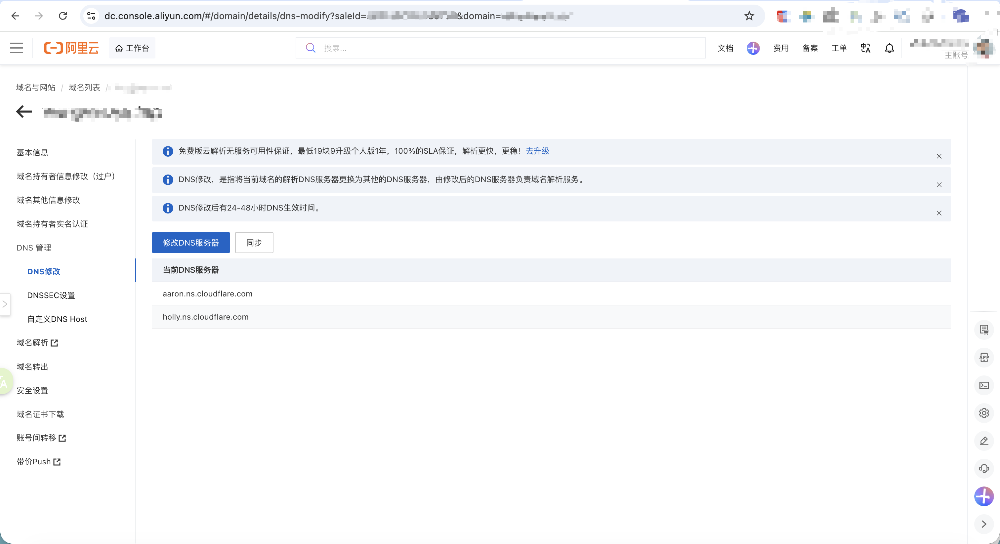

[TOC]

<h1 aligen="center">Cloudflare</h1>

> By：weimenghua   
> Date：2026.05.21  
> Description：  


## Cloudflare 简介


## Cloudflare 配置

```
# 安装依赖
npm install @opennextjs/cloudflare@latest && npm install -D wrangler@latest

# 切换到项目目录，读取项目里的 .nvmrc，切换到 Node 22。可将 Node 22 设为默认：`nvm alias default 22`
nvm use

# 显示 v22.x.x
node -v

# 登录 Cloudflare（首次登录即可）
npx wrangler login
```

### 本地环境变量

```bash
# Production secrets: Cloudflare Dashboard → Workers → example_project → Settings → Variables
# 编辑 .dev.vars
cp .dev.vars.example .dev.vars

NEXTJS_ENV=development

NEXT_PUBLIC_SUPABASE_URL=
SUPABASE_SERVICE_ROLE_KEY=
API_KEY=
NEXT_PUBLIC_API_KEY=
```

### 脚本说明

| 命令                   | 用途                                          |
| -------------------- | ------------------------------------------- |
| `npm run build`      | Vercel / 本地 Next 构建（Vercel 自动设置 `VERCEL=1`） |
| `npm run cf:build`   | 仅构建 Cloudflare 产物（`.open-next/`）            |
| `npm run cf:preview` | 本地 Workers 运行时预览                            |
| `npm run cf:deploy`  | 构建并部署到 Cloudflare                           |
| `npm run cf:typegen` | 生成 `cloudflare-env.d.ts` 类型                 |

日常开发仍用 `npm run dev`（走 Node `fs` 读 `public/`）；`npm run cf:preview` 走 Cloudflare ASSETS + 目录清单。二者已分开，互不影响。

cf:preview 是「构建 + 本地模拟线上」，不是热更新开发服务器；热更新请用 npm run dev

### Cloudflare Dashboard 配置生产变量

Workers & Pages → example_project → Settings → Variables and Secrets，添加：

- `NEXT_PUBLIC_SUPABASE_URL`
- `SUPABASE_SERVICE_ROLE_KEY`
- `API_KEY`
- `NEXT_PUBLIC_API_KEY`

### Cloudflare 绑定自定义域名

Workers & Pages → example_project → Settings → Domains & Routes → 添加 `example.com`、`www.example.com`。

### 阿里云域名 example.com 解析到 Cloudflare

Cloudflare 添加站点（Add a site） `example.com`，获取 NS 地址：aaron.ns.cloudflare.com 和 holly.ns.cloudflare.com。

进入[阿里云域名控制台](https://dc.console.aliyun.com/next/index#/domain/details/dns-modify?saleId=123456&domain=example.com) → 域名列表 > 进入所选域名获取点击管理 > DNS 管理 > 修改 DNS 服务器为 Cloudflare NS。(原 NS 地址：dns13.hichina.com、dns14.hichina.com)  



移除解析到 Vercel 的记录。

在 Vercel 项目中移除 `example.com` 自定义域名，避免冲突。

等待 DNS 生效（通常数分钟到数小时）。

回到 Cloudflare：Workers & Pages → 项目 example_project > Settings → Domains & Routes → Add 添加：example.com、www.example.com（可选）

Cloudflare 会自动加 DNS 记录（Type: Worker、Name: example.top、Content: example_project）NS 已切到 Cloudflare 后，一般不用再去阿里云填 A/CNAME。

[添加环境变量(可选)](https://dash.cloudflare.com/123456/workers/services/view/example_project/production/settings)：Workers → example_project → Settings → Variables and Secrets，与 Vercel 保持一致（Supabase、API_KEY 等）。
```
NEXT_PUBLIC_SUPABASE_URL：
NEXT_PUBLIC_SUPABASE_PUBLISHABLE_KEY：
SUPABASE_SERVICE_ROLE_KEY：
```

### 测试域名解析是否生效

```
ping example.com
nslookup example.top
```