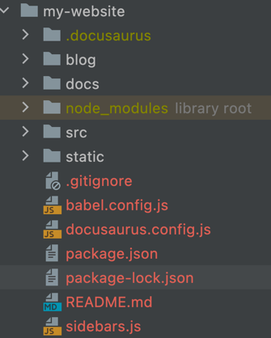

[TOC]

<h1 align="center">Docusaurus</h1>

> By：weimenghua  
> Date：2022.05.15  
> Description：Docusaurus 博客主题

参考资料  
[docusaurus 中文官网](https://www.docusaurus.cn)  
[docusaurus 英文官网](https://docusaurus.io)

## 1. 搭建教程

```text
npx @docusaurus/init@latest init [name] [template]  // 官方模板：classic
npx create-docusaurus@latest my-website classic

切换到项目目录
cd my-website

启动项目
npx docusaurus start
或者
npm start

访问地址
http://localhost:3000/
```

## 2. 详细教程

### 2. 目录说明

- blog - 文档，markdown 文件
- docs - 文档，markdown 文件
- src - 源代码文件
- static - 静态资源文件
- docusaurus.config.js - 配置这个站点的
- package.json - node.js 的工程配置文件
- sidebar.js - 配置文档页面侧边栏，用来定义文档的目录结构



### 2.2 详细配置

新建文档
在`docs`下新建目录`目录01`，在`目录01`下新建 `第一篇文档.md`。 内容如下：

```text
---
id: 文档 ID
title: 文档标题
author: weimenghua
---

<h1 align="center">第一篇文档标题</h1>

正文正文正文正文正文正文正文正文正文正文正文
```

字段说明

```text
id - 访问这个博客的 URL
title - 标题
author - 作者
author_title - 作者简短的自我介绍
author_image_url - 头像
tags - 博客标签, 数组形式
```


设置文档排序
在`REMADME.md`最上面添加：

```text
---
sidebar_position: 1
---
```

设置主页面
在 `docusaurus.config.js` 修改 config 配置如下：

```text
title: '知行合一',
tagline: '知识体系建设',
favicon: 'images/favicon.ico',
```

设置主页面2
在 `src/pages/index.js` 修改 5min 配置如下：
注释 `Docusaurus Tutorial - 5min ⏱️`

在 `src/components/HomepageFeatures/index.js` 修改 FeatureList 配置如下：
注释

设置 Github 部署
在 `docusaurus.config.js` 修改 config 配置如下：

```
url: 'https://iewiewiew.github.io',
baseUrl: '/',
organizationName: 'iewiewiew',
projectName: 'iewiewiew.github.io',
deploymentBranch: 'gh-pages',
```

设置忽略部署错误

```
onBrokenLinks: 'log',
onBrokenMarkdownLinks: 'log',

类型：'ignore' | 'log' | 'warn' | 'throw'
```

设置语言
在 `docusaurus.config.js` 修改 i18n 配置如下：

```
i18n: {
  defaultLocale: 'zh-Hans',
  locales: ['zh-Hans'],
},
```

设置编辑此页入口
在 `docusaurus.config.js` 修改 docs 和 blog 配置如下：
把 `editUrl` 注释

设置窗口 + 导航左侧 Logo

```
image: 'images/blog_images.png',  // 窗口 Logo
navbar: {
  title: 'wei',
  logo: {
     alt: 'My Site Logo',
     src: 'images/blog_images.png',  // 导航左侧 Logo
  },
}  
```

设置菜单
在 `docusaurus.config.js` 修改 items 配置如下：

```
最左侧目录
{
   type: 'docSidebar',
   sidebarId: 'tutorialSidebar',
   position: 'left',
   label: '目录',
},
          
本地目录（如不需要可注释）
{to: '/blog', label: 'Blog', position: 'left'},

外部链接
{
  href: "https://www.processon.com/view/6138112f1e085306ef9fe608",
  label: "技能图谱",
  position: "left",
},

Github 链接
{
   href: 'https://github.com/iewiewiew',
   label: 'GitHub',
   position: 'right',
},
```

设置底部
在 `docusaurus.config.js` 修改 footer 配置如下：
把`links`包含的内容注释掉

排除目录或者文件
在 `docusaurus.config.js` 修改 presets > docs 配置如下：

```
exclude: ['./Chaos/高可用测试用例模板.md', './Database/MongoDB/'],
```

清理文件
删除 blog、docs/tutorial-basics、docs/tutorial-extras、intro.md。

增加搜索功能 [Algolia](https://dashboard.algolia.com/account/application/new/configure?plan=v8.5-docsearch)

[完整配置](docusaurus.config.js)

### 2.3 站点部署

```
说明：<username> 是的 GitHub 用户名，<repository-name> 网站的存储库名称。
例子：<username>：iewiewiew，<repository-name>：iewiewiew.github.io
访问地址：https://iewiewiew.github.io/
```

```
1、在 github 新建仓库：<username>.github.io

2、在项目的主分支中添加 package.json 文件，并在其中添加以下内容：(似乎没用上？)
{
    "homepage": "https://<username>.github.io/<repository-name>/",
    "scripts": {
        "deploy": "USE_SSH=true npm run docusaurus deploy"
    }
}
原："deploy": "docusaurus deploy",

3、在终端中安装 gh-pages 和 cross-env：
cd my-website
npm install --save-dev gh-pages cross-env

4、在 Docusaurus 的配置文件 docusaurus.config.js 中添加以下内容：
url: 'https://iewiewiew.github.io',
baseUrl: '/',
organizationName: 'iewiewiew',
projectName: 'iewiewiew.github.io',
deploymentBranch: 'gh-pages',

5、运行以下命令进行构建：
npm run build

6、运行以下命令将网站部署到 GitHub Pages：
npm run deploy
或者
GIT_USER=iewiewiew npm run deploy // 不要用这个，需要输入密码，暂未找到原因

7、推送代码到 GitHub 主分支上并打开 GitHub 页面进行设置。进入项目的 Settings 页面，在 GitHub Pages 部分选择 gh-pages 分支和 / (root) 目录，保存后即可访问网站。
```


### 2.4 子模块

```
初始化子模块
cd my-website
git submodule init

添加子模块
git submodule add git@github.com:iewiewiew/wei-notebook.git docs

获取子模块最新状态 -f：强制更新
cd my-website
git submodule update --remote docs
git submodule update -f --remote docs

推送子模块的代码到远程仓库
cd my-website/docs
git add .
git commit -m "test"
git push origin master
```
