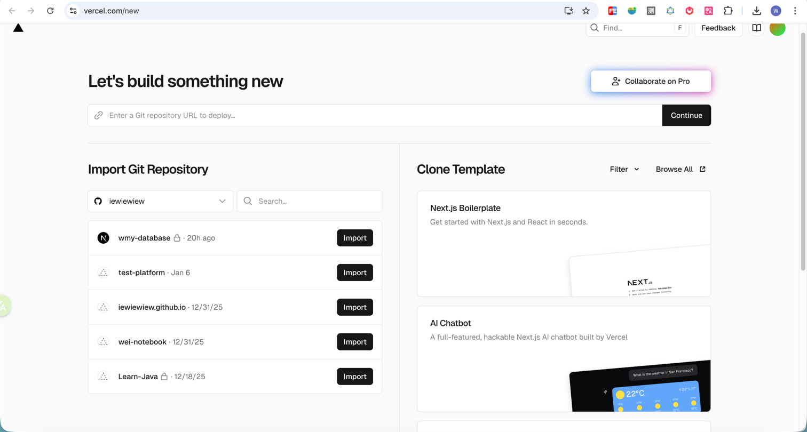
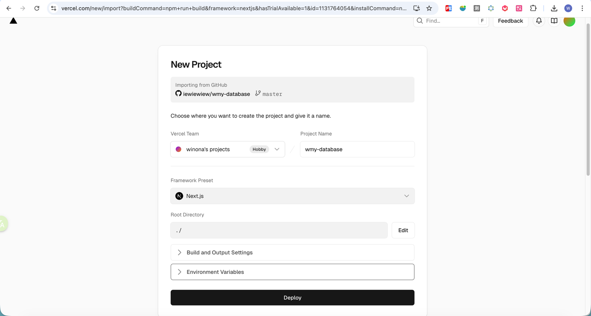
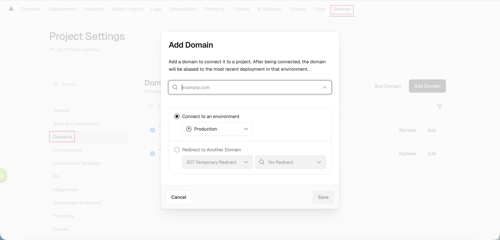
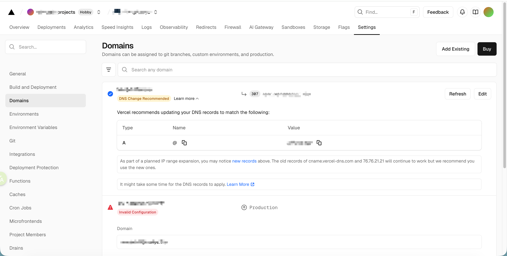
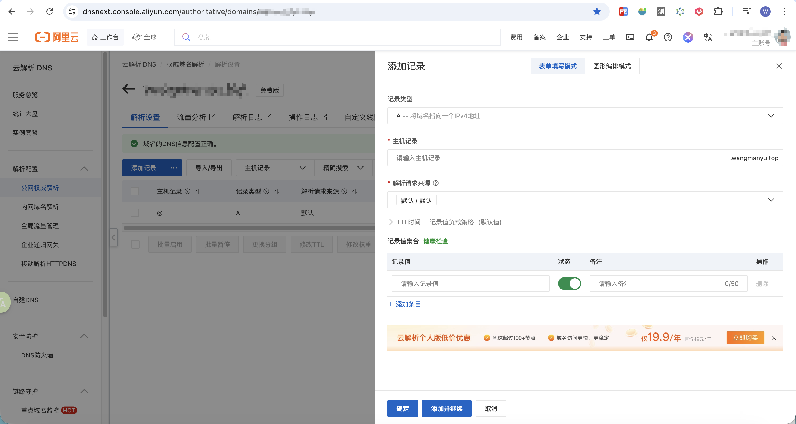

[TOC]

<h1 aligen="center">Vercel</h1>

> By：weimenghua   
> Date：2026.01.11  
> Description：  


## Vercel 简介

[Vercel 官网](https://vercel.com/home)

**Vercel** 是一个专注于前端开发的云平台，主要提供 **网站托管、无服务器函数（Serverless Functions） 和边缘网络（Edge Network）** 服务。它的核心目标是为开发者提供极简、高性能的前端应用部署体验。原生支持 **Next.js**（Vercel 由 Next.js 的创建者开发）、React、Vue、Svelte 等现代框架。


## Vercel 部署 Github 项目

首先[绑定 Github](https://vercel.com/account/settings/authentication)，然后[创建组织](https://vercel.com/account)，进入[新建项目](https://vercel.com/new)导入 GitHub 项目



选择 Deploy 部署项目




前提：在项目根目录创建 vercel.json

```json
{
  "buildCommand": "npm run build",
  "outputDirectory": "dist",
  "devCommand": "npm run dev",
  "installCommand": "npm install",
  "framework": "nextjs",
  "rewrites": [
    {
      "source": "/(.*)",
      "destination": "/index.html"
    }
  ]
}
```

@todo
GitHub Actions 集成


## 阿里云域名解析到 Vercel

[阿里云域名查询地址](https://wanwang.aliyun.com/domain/)

阿里云域名解析到 Vercel 地址？

进入项目域名设置页面：https://vercel.com/<项目地址>/<仓库地址>/settings/domains，在 Domains 添加域名，注意：不要重定向到 www.example.com





进入阿里云域名解析设置页面：https://dnsnext.console.aliyun.com/authoritative/domains/<域名>，添加记录：  
- 记录类型：A 或者 CNAME
- 主机记录：@
- 记录值：记录类型为 A 则填写 Vercel 的 IP，记录类型为 CNAME 则填写 cname.vercel-dns.com
- TTL：10分钟（默认）




## Vercel 配置

https://vercel.com/<项目地址>/<仓库地址>/settings/environments/production

NEXT_PUBLIC_SUPABASE_URL：123
NEXT_PUBLIC_SUPABASE_PUBLISHABLE_KEY：123
SUPABASE_SERVICE_ROLE_KEY：123


## 常见问题

**阿里云更新域名解析的 IP，为什么访问域名解析的还是之前的 IP？**  
原因：解析记录变更后，可能不会立即生效。因为各地网络运营商 dns 存在缓存，在缓存未到期时，是不会向云解析 DNS 请求最新的解析记录，而是直接将之前缓存的解析结果返回给访问者，所以需要等待运营商刷新本地缓存后，解析才会实际生效。解析生效时间主要取决于运营商DNS缓存的解析记录的TTL到期时间，预计最快10-30分钟左右生效。如进行过DNS服务器名称修改，则一般需要24-48小时左右生效。  
查看解析情况：  
dig example.com  
nslookup example.com

**在阿里云购买的域名，解析到京东云，需要在阿里云还是京东云备案？**  
答案：京东云，跟随服务器走，不跟域名走，谁提供服务器，谁负责备案审核。  

**在 GitHub 推送代码后，如何重新部署 Vercel？**
注意：vercel 的邮箱需要和 commit 邮箱保持一致！

```
# 安装 Vercel CLI
npm i -g vercel

# 登录
vercel login

# 重新部署生产环境
vercel --prod
```
