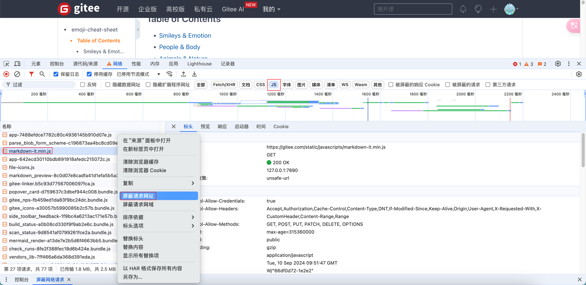

[TOC]

<h1 align="center">Chrome</h1>

> By：weimenghua  
> Date：2023.11.08  
> Description:  

## 1. Chrome 插件

- 沙拉划词
- 沉浸式翻译
- Ted Transcript Download：一键下载双语TED演讲稿PDF
- SEOquake：快速获取网站的关键SEO指标
- Infinity：新标签页
- OctoTree：GitHub浏览器扩展
- JSON Formatter：美化和格式化 JSON 数据以提高可读性的工具
- Mobile Simulator：是一款响应式设计测试工具，可模拟各种移动设备屏幕
- JetBrains Toolbox：直接从浏览器在 JetBrains IDE 中克隆并打开来自 GitHub、GitLab、Gitee 和 Bitbucket 的项目

## 2. Chrome 快捷键

- Ctrl + Shift + Tab 或 Ctrl + PgUp：Chrome 切换到上一个标签页
- Ctrl + N：打开新窗口。
- Ctrl + T：打开新标签页。
- Ctrl + Shift + N：在隐身模式下打开新窗口
- Ctrl + Shift + T：打开上一次关闭的标签页
- Ctrl + W 或 Ctrl + F4：Chrome 关闭当前标签页或弹出式窗口的快捷键：

谷歌chrome浏览器复制标签页的几种方法：

- 方法1、先按键 Ctrl+L 选定网址栏中的整个 URL（或用鼠标选定），之后再按 Alt+Enter，就能在新标签页中打开该 URL
- 方法2、按住 Alt 不放，按D（选定网址栏中的整个 URL）再按 Enter

## 3. Chrome 小技巧

1. 查看 Chrome 信息

- 查看版本：chrome://version/
- 查看浏览器信息：浏览器 F12 --> Console --> 输入代码 `navigator.appVersion` 后回车
- 浏览器内核版本检测：<https://liulanmi.com/labs/core.html>

2. Chrome 修改 Html 文件
  浏览器 F12 --> Console --> 输入代码 `document.body.contentEditable="true"` 后回车，这样就可以在浏览器页面修改数据了。修改后 `Ctrl+S`，弹框让选择保存路径。

3. Chrome 修改响应头响应内容
  F12 打开控制台 > 切换到网络 > 选择接口点击右键 > 选择替换标头/替换内容 > 选择文件夹并同意 > 切换到源代码/来源 > 编辑响应内容并保存 > 刷新页面重新请求 > 再次切换到网络可查看响应已经变更为自定义内容

4. 设置弱网
  F12 打开控制台 > 切换到网络 > 切换已停用节流模式为 3G/4G

5. Chrome 移动其安装位置踩坑  
  移动谷歌浏览器的安装位置后，如果在其它应用会出现找不到程序的情况，需执行以下命令：  
  `mklink "C:\Program Files (x86)\Google\Chrome" "D:\software\Google\Chrome"`

6. Chrome 分屏
  浏览器访问：chrome://flags/，Split View 设置为 Enabled，重启浏览器，在需要分屏的标签页右键选择分屏

## 4. Chrome 搜索技巧

- 准确搜索：今天天气
- 使用引号来强制完全匹配所有字符: "今天天气"
- 排除搜索：今天天气 -百科
- 指定网站搜索：今天天气 site:baidu.com

下划线 (_)：Google 将下划线连接的单词视为一个单词。例如，web_site 会被视为 website。
连字符 (-)：连字符将两个或多个词分开，Google 会将其视为单独的词。例如，web-site 会被分解为 web 和 site。
例子：his_is_a_single_word、This-is-a-sentence-with-multiple-words。

## 5. 知识碎片

[火狐浏览器下载](https://ftp.mozilla.org/pub/firefox/releases/)

Mac Chrome 最新版本无法切换语言？
可能是不兼容，解决：打开系统偏好设置 --> 语言和地区 --> App --> 点击添加 Chrome，设置语言

在谷歌无痕模式下，搜索内容需要进行人机身份验证，主要是为了区分真实用户和自动化机器人，防止自动化脚本或恶意程序进行大量搜索或恶意活动，例如垃圾邮件发送或恶意登录。

屏蔽请求网址，屏蔽某些 js 资源：右键 > 检查 > 网络 > JS > 选择某一 js 右键 > 屏蔽请求网址

