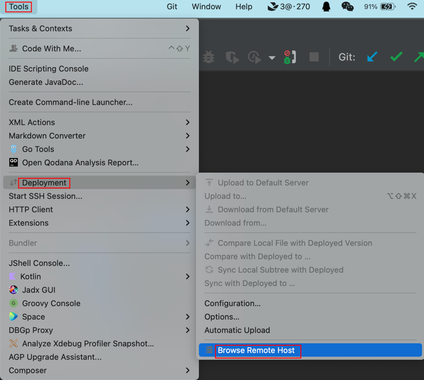

[TOC]

<h1 align="center">IDEA</h1>

> By：weimenghua  
> Date：2022.09.18   
> Description：IDEA


## 1. 常用设置

添加模板：

File > Settings > Editor > File and Code Templates > Includes > File Header 添加如下模板：

```
/**
  *@author          wmh
  *@time            ${YEAR}-${MONTH}-${DAY} ${TIME}
  *@description
  */
```

File > Settings > Editor > File and Code Templates > Files > 添加如下模板 (Extension: sh)：

```
#!/bin/bash

#-----------------------------------------------------------------------------
# author: wmh
# 脚本说明:
#-----------------------------------------------------------------------------
```

设置导航栏字体大小： 
IntelliJ IDEA > Settings > Appearance & Behavior > Appearance > 设置 size 大小并应用

自动导包(Auto Import)  
设置步骤：Settings→Editor→General→Auto Import  
勾选：  
Add unambiguous imports on the fly：快速添加明确的导入。  
Optimize imports on the fly：快速优化导入，优化的意思即自动帮助删除无用的导入。  


## 2. 快捷键

- 左移：tab + shift
- 右移：tab
- 上移：shift + alt + 向上方向键
- 下移：shift + alt + 向下方向键
- 批量选择列：option + 鼠标从上往下移动
- 跳转到对应行：command + L
- 快速查找文件：command + shift + L
- 快速查找文件内容：command + shift + F
- 回到上一个文件：command + option + 左箭头
- 关闭当前活动窗口：command + w
- 从历史中粘贴：command + shift + v
- 双击 Shift/左下角上箭头，输入文件名称搜索文件
- 四指向内收调出应用控制台


## 3. 插件管理

[插件下载地址](https://plugins.jetbrains.com/)

- File Expander：查看 jar 包
- GitToolBox：查看项目提交情况
- Translation：翻译
- arthas idea：Java 在线诊断工具
- Search In Repository：查看 jar 包的 maven/gradle 的坐标
- Zoolytic：查看 zookeeper 节点数据, 合适：ip:port(一般2181)
- Git Commit Template：commit 规范
- RestfulToolkit：RestfulToolkit 提供了一套 RESTful 服务开发辅助工具集, 根据 URI 的部分信息来查找对应的 Controller 中方法
- Json Paser：json 格式化工具
- GsonFormatPlus：一款能根据 JSON 字符串自动生成实体类的插件，支持 Lombok。在实体类名称后面右键，Generate > GsonFormatPlus。
- CloudToolkit：SpringBoot 应用自动化部署神器。
- Squaretest：自动生成单元测试的插件。
- Alibaba Java Coding Guidelines：阿里巴巴 Java 开发规约插件
- Rainbow Brackets：彩虹括号
- Database Navigator：数据库管理系统。因为和 IDEA 2022.1.3 版本不兼容，使用 Fork 版本：DatabaseHelper，使用结论是不如 DataGrip
- CSV Editor：CSV 插件
- Cool Request：接口测试插件
- [通义零码](https://tongyi.aliyun.com/lingma/)  
- [Bito](https://bito.ai/)
- [CodeGeeX](https://codegeex.cn/)
- Apipost-Helper-2.0：接口测试
- Database Navigator：数据库管理工具（注：在 Settings > Data Editor > Fetch timeout 可设置超时时间）
- Redis 需要 license 才能用
- JMeter 需要 license 才能用
- Money never sleeps：查看股票行情
- Stocks：查看股票行情
- PDF Viewer：查看 PDF
- maven-search


## 4. 知识碎片

1. 解决 js 文件爆红问题？  
去掉 eslint 校验，File > Strings > Languages & Framworks > JavaScript > Code Quality Tools > ESLint，选择 Disable ESLint。

2. Settings 路径：IntelliJ IDEA > Preferences

3. IDEA 批量去掉空行
command + R 调出替换框，勾选正则模式 Regex（.*图标），在条件框中输入正则：^\s*\n (匹配以0个或 n个\s 空白符起首的换行\n)

4. properties 文件中文乱码
File > Settings > Editor > File Encodings，修改编码模式为 UTF-8

5. 连接 sftp
Tools > Deployment > Browse Remote Host



6. 从新在侧边栏打开插件图标
   View > Tool Windows

7. 快速将当前活动编辑器与剪贴板中的内容进行比较
   View → Compare with Clipboard

8. 清理 IntelliJ IDEA 中已删除项目的缓存
- Windows：C:\Users\<用户名>\.IntelliJIdea<版本号>\system
- macOS：~/Library/Caches/IntelliJIdea<版本号>
- Linux：~/.cache/IntelliJIdea<版本号>

9. 设置远程环境运行
   点击视图上方 Edit Configurations，选择 Run on remote 机器


10. 指定义 java_error_in_idea.hprof 路径
Help > Edit Custom VM Options... > idea.vmoptions
```
-XX:ErrorFile=$USER_HOME/software/tmp/java_error_in_idea_%p.log
-XX:HeapDumpPath=$USER_HOME/software/tmp/java_error_in_idea.hprof
```

11. 删除 .idea 目录后重新导入模块：File > Project Structure > Project Settings > Modules > Import Module > 选择任一模块进行导入即可
把普通文件夹变成模块，同上操作

12. Java 文件添加依赖后有时候没生效，可在 Maven 插件点击圈圈刷新一下。

13. 在 IDEA 无法跳转到对应方法，原因是没有添加模块，添加为模块即可。

14. 重启之后会出现已删除的项目，暴力解决：删除配置 /Users/menghuawei/Library/Application Support/JetBrains/IdeaIC2024.2，风险：会删除 IDEA 所有配置


