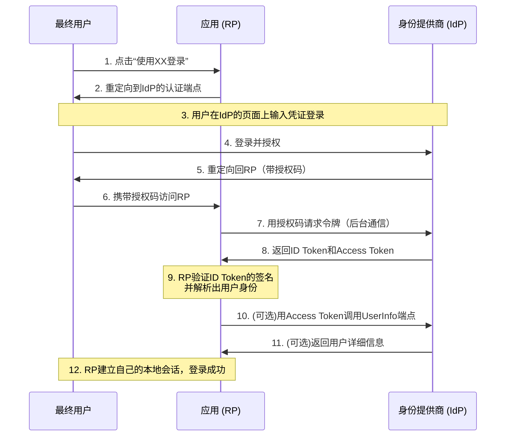

**[TOC]

<h1 align="center">LDAP</h1>

> By：weimenghua  
> Date：2026.06.07  
> Description：


## 1. LDAP 简介

LDAP（Lightweight Directory Access Protocol，轻型目录访问协议）是一种用于访问和管理目录服务的协议。它是一种客户端-服务器协议，旨在帮助组织存储、组织和检索信息，如用户身份验证、地址簿、组织结构等。  
可以将LDAP想象为一种电话簿或黄页目录的网络版。LDAP服务器充当目录服务的中心，存储着大量的数据。而客户端（应用程序、工具或其他系统）可以通过LDAP协议与服务器通信，以读取、修改或搜索存储在目录中的信息。  
LDAP的目录结构采用了树状层次结构，类似于文件系统的文件夹结构。每个目录项（条目）都有一个唯一的标识符（称为DN，Distinguished Name），用于在整个目录中唯一标识该项。每个目录项可以包含各种属性（例如姓名、电子邮件地址、电话号码等），这些属性用于描述目录项的特征。

LDAP的一些常见用途包括：
- 用户身份验证：LDAP可用于验证用户凭据，例如用户名和密码。应用程序可以通过LDAP查询用户存储在目录中的凭据，以进行身份验证和授权操作。
- 地址簿和联系人管理：LDAP可用于存储和查找联系人信息，如电子邮件地址、电话号码和组织结构。它可以用作集中式的企业通讯录，供员工搜索和访问联系人信息。
- 组织结构管理：LDAP可用于存储和管理组织结构信息，如部门、团队和员工关系。它可以帮助组织建立和维护组织结构的层次关系，并支持对组织结构进行动态更改和搜索。

LDAP具有以下特点：
- 轻量级：相对于传统的目录服务协议（如X.500），LDAP更轻量级，更适用于互联网环境和资源受限的设备。
- 分布式：LDAP支持分布式目录服务，允许将目录数据分布在多个LDAP服务器上，并在需要时进行跨服务器查询和操作。
- 开放标准：LDAP是一个开放的标准协议，被广泛应用于各种操作系统、应用程序和设备。它使用TCP/IP协议栈进行通信，并支持加密和安全认证功能。

总而言之，LDAP是一种用于访问和管理目录服务的协议，它提供了一种灵活且可扩展的方式来组织和检索信息。通过LDAP，您可以构建集中式的身份验证系统、联系人管理系统和组织架构管理系统，以满足各种组织的需求。	  								通过把 LDAP目录作为系统集成中的一个重要环节，可以简化员工在企业内部查询信息的步骤，甚至连主要的数据源都可以放在任何地方。

LDAP 数据模型  
- 条目（Entry）：目录中的基本单位，类似于数据库中的记录。通常对LDAP的添加、删除、更改、检索都是以条目为基本对象的。
- 属性（Attribute）：条目的组成部分，包含类型和一个或多个值。每个条目都可以有很多属性（Attribute），例如人都有姓名、地址、电话等属性。每个属性都有名称及对应的值，属性值可以有单个、多个，例如一个人有多个邮箱。
- 对象类（ObjectClass）：定义条目必须或可能包含哪些属性。对象类是属性的集合，LDAP预想了很多人员组织机构中常见的对象，并将其封装成对象类。比如人员（person）含有姓（sn）、名（cn）、电话(telephoneNumber)、密码(userPassword)等属性，单位职工(organizationalPerson)是人员(person)的继承类，除了上述属性之外还含有职务（title）、邮政编码（postalCode）、通信地址(postalAddress)等属性。
- DN（Distinguished Name）：唯一标识条目的名称

| 术语 | 说明                                                         |
| ---- | ------------------------------------------------------------ |
| ou   | 全称 Organization Unit，组织单位，即容器对象。               |
| dc   | 全称 Domain Component，域名的部分，格式是将完整的域名分成几部分。 |
| sn   | 全称 Surname，姓。                                           |
| cn   | 全称 Common Name，公共名称。                                 |
| dn   | 全称 Distinguished Name，唯一标识名。                        |
| uid  | 全称 User ID，用户ID。                                       |
| rdn  | 全称 Relative dn，相对辨别名，类似文件系统中的相对路径。     |


## 2. LDAP 运用

安装 OpenLDAP
```
镜像地址
https://docker.aityp.com/s/docker.io

运行 OpenLDAP 容器
docker run --name my-openldap \
-p 389:389 -p 636:636 \
-e LDAP_ORGANISATION="My Company" \
-e LDAP_DOMAIN="mycompany.com" \
-e LDAP_ADMIN_PASSWORD="adminpassword" \
--detach swr.cn-north-4.myhuaweicloud.com/ddn-k8s/docker.io/osixia/openldap:stable

安装 LDAP 客户端工具
sudo apt-get install ldap-utils slapd

# 匿名查询（如果允许）
ldapsearch -x -H ldap://localhost -b dc=mycompany,dc=com

# 管理员查询
ldapsearch -x -H ldap://localhost -b dc=mycompany,dc=com -D "cn=admin,dc=mycompany,dc=com" -w adminpassword
```

安装 phpldapadmin 客户端
```
支持 HTTP
docker run --name phpldapadmin \
  --link my-openldap:ldap-host \
  -p 8899:80 \
  -e PHPLDAPADMIN_HTTPS=false \
  -e PHPLDAPADMIN_LDAP_HOSTS=ldap-host \
  --detach swr.cn-north-4.myhuaweicloud.com/ddn-k8s/docker.io/osixia/phpldapadmin:latest
  
支持 HTTPS
docker run --name phpldapadmin \
--link my-openldap:ldap-host \
-p 6443:443 \
-e PHPLDAPADMIN_LDAP_HOSTS=ldap-host \
--detach swr.cn-north-4.myhuaweicloud.com/ddn-k8s/docker.io/osixia/phpldapadmin:latest

打开浏览器访问：https://localhost:8899

登录信息：
登录 DN: cn=admin,dc=mycompany,dc=com
密码: adminpassword
```

添加组织单元(OU)   
创建 [add_ou.ldif](add_ou.ldif) 文件  
执行添加：ldapadd -x -H ldap://localhost -D "cn=admin,dc=mycompany,dc=com" -w adminpassword -f add_ou.ldif

添加用户  
创建 [add_user.ldif](add_user.ldif) 文件（注意：{SSHA}hashedpassword 只是示例，实际部署时需要生成真实的密码哈希：slappasswd -s "mypassword123"，值为：{SSHA}SkR4rnxedPmVnV65RCBPirXG7fmex1Jp）
执行添加：ldapadd -x -H ldap://localhost -D "cn=admin,dc=mycompany,dc=com" -w adminpassword -f add_user.ldif

修改用户属性  
创建 [modify_user.ldif](modify_user.ldif) 文件  
执行修改：ldapmodify -x -H ldap://localhost -D "cn=admin,dc=mycompany,dc=com" -w adminpassword -f modify_user.ldif

删除条目  
ldapdelete -x -H ldap://localhost -D "cn=admin,dc=mycompany,dc=com" -w adminpassword "uid=john,ou=users,dc=mycompany,dc=com"**


## OIDC

[理解 OIDC 流程](https://old-docs.authing.cn/authentication/oidc/understand-oidc.html)  
[OIDC 与 OAuth2.0 综述](https://docs.authing.cn/v2/concepts/oidc/oidc-overview.html)  
[OIDC Debugger](https://oidcdebugger.com/)  

OIDC (OpenID Connect) 是一个建立在 OAuth 2.0 授权框架之上的身份认证协议。它让应用程序（称为依赖方）能够通过一个可信的授权服务器（称为身份提供商）来验证最终用户的身份，并获取该用户的基本 profile 信息。

OIDC 的核心组件  
- 最终用户 (End-User)： 想要登录应用的人。
- 依赖方 (Relying Party, RP)： 就是你想要登录的那个网站或应用（例如：知乎、B站）。
- 身份提供商 (Identity Provider, IdP)： 负责存储和管理用户身份，进行认证，并颁发令牌的可信服务（例如：微信、Google、Microsoft Entra ID）。

一个简化的 OIDC 认证流程（授权码流程，最常用）如下：



[GitLab 应用配置地址](https://gitlab.com/oauth/applications)  
- authorization_endpoint：https://gitlab.com/oauth/authorize
- token_endpoint：https://gitlab.com/oauth/token
- userinfo_endpoint：https://gitlab.com/oauth/userinfo
- jwks_uri：https://gitlab.com/oauth/discovery/keys
- scopes_supported：GitLab OIDC 支持的权限范围（scopes）列表

[GitHub 应用配置地址](https://github.com/settings/developers)  
- Client ID	在注册的 OAuth App 页面获取
- Client Secret	在注册 OAuth App 时获取（仅显示一次）
- Issuer：https://token.actions.githubusercontent.com (对于 GitHub Actions) 或 GitHub OIDC 服务标识	通常不似传统 OIDC 提供商那样提供标准的 .well-known 配置端点。
- Authorization Endpoint：https://github.com/login/oauth/authorize
- Token Endpoint：https://github.com/login/oauth/access_token	
- UserInfo Endpoint：https://api.github.com/user (需携带访问令牌)	获取经过认证的用户基本信息（如 login, id, name, avatar_url 等）。
- Scopes：user, user:email 等