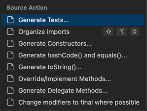

[TOC]

<h1 align="center">VSCode</h1>

> By：weimenghua  
> Date：2024.10.17  
> Description：VSCode


## 配置

设置自动保存：左下角设置 > 搜索栏搜索：Auto Save > 选择 afterDelay > 再选择设置 100 毫秒自动保存

键盘快捷键编辑器：菜单下的 Code > Settings > 键盘快捷键 或使用命令 首选项: 打开键盘快捷键 (⌘K ⌘S) 来打开此编辑器。  

在编辑模式下某些字母打不出来，是因为该字母是快捷键，修改快捷键为其它即可。

配置文件路径：~/Library/Application Support/Code/User/settings.json，command + p 输入 settings.json 可直接打开

开启自动补全代码  
- `editor.tabCompletion: on`：启用Tab键来进行代码的自动补全。
- `editor.quickSuggestions: true`：开启自动显示建议。

command + , 打开设置，输入：window.zoomLevel，设置窗口字体大小


## 插件

- GitLens：管理 Git 仓库
- Indent Rainbow：通过为不同缩进级别的代码行使用不同的颜色
- Git supercharged：在编辑器中查看每一行代码的提交历史和作者信息
- Postcode：接口测试
- Decompiler：反编译 Jar 包，在 Jar 目录右键选择 Decompile（注：在社区版 VSCode 没生效）
- Language Support for Java(TM) by Red Hat：Java
- Debugger for Java：Java
- Java Test Runner：Java
- Maven for Java：Java
- Java Dependency Viewer：Java
- Stockbar、韭菜盒子：查看股票行情
- markdownlint：Markdown 语法检测
- vscode-pdf：查看 pdf 文件
- GitHub Copilot
- Codex
- JSON Crack：是一款免费的开源数据可视化应用程序，能够将JSON、YAML、XML、CSV等数据格式可视化为交互式图形。在线地址：https://jsoncrack.com/editor。


## 快捷键  

- 切换两个 Tab：Ctrl + Tab （注：不是 Command）
- 返回上一个光标：Option + Command + ⬅️（左箭头）
- 向下复制当前：Shift + Option + ⬇️（下箭头）
- 运行 Java 程序：Fn + F5
- 向下复制：Shift + Option + ↓
- 格式化文件：Shift + Option + F
- 打开 Terminal：Command + J


## 安装 VS Code CLI

Cmd+Shift+P (Mac) 打开命令面板，输入：shell command

```bash
# 使用绝对路径
/Applications/Visual\ Studio\ Code.app/Contents/Resources/app/bin/code --help

# 直接使用
code --help
code --list-extensions
code --add-mcp '{"name":"playwright","command":"npx","args":["@playwright/mcp@latest"]}'
```


## 自定义 Java 模板

自定义 Java 模板1  
Cmd + Shift + P（Mac）打开命令面板。  
输入并选择 Preferences: Configure User Snippets。  
选择 Java 以创建或编辑 Java 代码片段文件。

1、安装 vscode-fileheader 插件  
2、配置 setting.json

```text
"fileheader.Author": "wmh",
"fileheader.LastModifiedBy": "wmh"
```

3、使用 control + option + i 即可在文件顶部生成

```text
/*
 * @Author: wmh 
 * @Date: 2024-11-05 10:14:30 
 * @Last Modified by:   wmh 
 * @Last Modified time: 2024-11-05 10:14:30 
 */
```

自定义 Java 模板2  
Code > Preferences > Configure Snippets > 选择 Java 文件添加如下内容，新建 Java 文件之后输入 javaBaseClass 并且按 Tab 即可自动生成模板内容

```json
{
 "javaClass-template": {
        "prefix": "javaBaseClass",
        "body": [
            "package $1;",
            "",
            "/*",
            "* Author: wmh",
            "* Description: $2",
            "* Date: ${CURRENT_YEAR}-${CURRENT_MONTH}-${CURRENT_DATE} ${CURRENT_HOUR}:${CURRENT_MINUTE}:${CURRENT_SECOND}",
            "*/",
            "public class ${TM_FILENAME_BASE}{",
            "",
            "",
            "}",
        ],
        "description": "my vscode javaClassTemplate"
    }
}
```


## 知识碎片

格式化 json 文件：粘贴要格式化的 json 数据到 json 文件，右键格式化

Java 文件快速生成快捷键：在空白处右键 > 选择 Source Action > 选择相应操作



问题：vscode 编辑 vue 文件，如何设置标签代码不要换行，保持为一行？  

方案一：配置 Vetur 插件  
command + j 输入: vetur.format.defaultFormatter.html，将下拉框的选项从默认值改为 js-beautify-html  
command + p 输入: settings.json 可直接打开  
使用 Vetur + js-beautify-html 的配置示例：
```
{
  "vetur.format.defaultFormatter.html": "js-beautify-html",
  "vetur.format.defaultFormatterOptions": {
    "js-beautify-html": {
      "wrap_attributes": "auto", // 或 "aligned-multiple"
      "wrap_line_length": 0, // 或者设置为一个较大的数值，如240
      "end_with_newline": false
    }
  }
}
```
wrap_attributes的常见选项有："auto"（根据长度自动决定），"force"（全部换行），"force-aligned"（换行并对齐），"force-expand-multiline"（多行属性展开并对齐），以及false（所有属性不换行）

方案二：

在项目根目录添加文件 .prettierrc
```
{
  "semi": false,
  "singleQuote": true,
  "tabWidth": 2,
  "useTabs": false,
  "trailingComma": "none",
  "printWidth": 200,
  "htmlWhitespaceSensitivity": "ignore",
  "singleAttributePerLine": false,
  "vueIndentScriptAndStyle": false,
  "endOfLine": "lf"
}
```

sttings.json
```
{
   "editor.formatOnSave": true,
   "editor.defaultFormatter": "esbenp.prettier-vscode",
}
```

注意重启 vscode
格式化当前文件： 按 Shift+Option+F（Mac）或 Shift+Alt+F（Windows/Linux）或右键选择 "Format Document"
格式化所有 Vue 文件： 按 Cmd+Shift+P，输入 "Format All Files in Workspace"