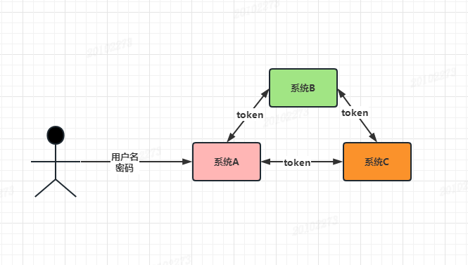
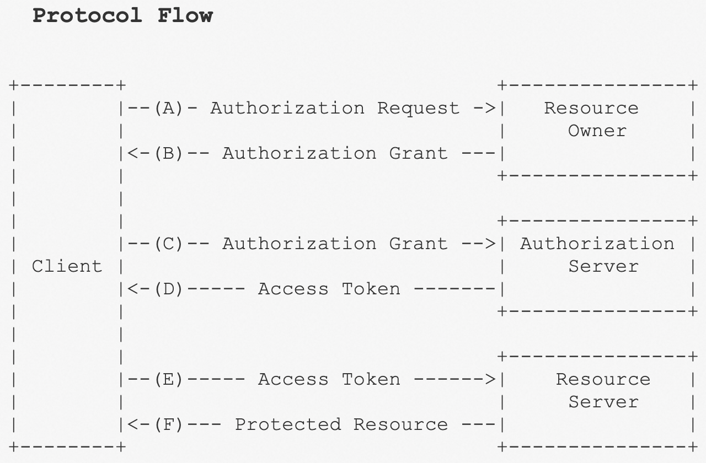

[TOC]

<h1 align="center">技术知识碎片</h1>

> By：weimenghua  
> Date：2026.06.07  
> Description：


## 微服务类型或 SOA 类型

[既然有了 HTTP，为什么还要 RPC？](https://mp.weixin.qq.com/s/aUOAiVqdUjJ5rwhPBBbhoQ)

微服务（Microservices）和面向服务架构（Service-Oriented Architecture，SOA）都是软件架构的设计范式，用于构建分布式系统。它们具有一些共同之处，但也有一些区别。

微服务（Microservices）是一种架构风格，将一个大型应用程序拆分为一组小型、自治的服务，这些服务可以独立开发、部署和扩展。每个微服务都专注于执行特定的业务功能，并通过明确定义的接口进行通信。这些微服务可以使用不同的编程语言、技术栈和数据存储技术。每个微服务可以独立部署，并且可以通过轻量级的通信机制（如 RESTful API、消息队列等）进行交互。微服务架构强调服务的自治性、可独立部署性、可伸缩性和容错性。

面向服务架构（Service-Oriented Architecture，SOA）是一种软件架构风格，旨在通过将应用程序划分为一组松散耦合的服务来实现系统的灵活性和可重用性。在 SOA 中，服务是可重用的功能单元，通过明确定义的接口和协议进行通信。SOA 强调服务的可重用性、互操作性和组合性，以支持企业级系统的构建和集成。SOA 中的服务可以通过不同的通信机制（如 SOAP、Web Services、消息队列等）进行交互。

区别：

- 规模和复杂性：微服务通常关注于构建小型、自治的服务，每个服务专注于一个具体的业务功能。SOA 更多关注于构建大型企业级系统，服务的规模和复杂性可能更大。
- 技术栈和部署：微服务允许使用不同的技术栈和数据存储技术，每个微服务可以独立部署。SOA 通常更加标准化，使用统一的技术栈和协议，服务通常部署在中央的服务容器中。
- 服务自治性：微服务更强调服务的自治性，每个服务可以独立开发、部署和扩展。SOA 中的服务通常由中央组织或团队管理和控制。


## 服务中台

服务中台是一种将企业的业务系统进行模块化、服务化和资源共享的架构模式。抽取业务共性，抽象沉淀。中台的出现是为前台(业务层)提供服务。


## Restful

Restful web service 是一种常见的 rest 应用，统一用于命名遵循 rest 风格的 web 服务。Restful 服务是一种 ROA（Resource-Oriented Architecture，面向资源的架构）。举一个例子就可以理解了：

Restful 出现之前的 HTTP 接口：

- http://127.0.0.1/user/query   GET  根据用户 id 查询用户数据
- http://127.0.0.1/user/save    POST 新增用户
- http://127.0.0.1/user/update  POST 修改用户信息
- http://127.0.0.1/user/delete  GET/POST 删除用户信息

Restful 式 HTTP 接口:

- http://127.0.0.1/user  GET  根据用户 id 查询用户数据
- http://127.0.0.1/user  POST 新增用户
- http://127.0.0.1/user  PUT 修改用户信息
- http://127.0.0.1/user  DELETE 删除用户信息


## SSO

单点登录（SSO）是一种认证机制，允许用户使用一组凭据（例如用户名和密码）登录到多个相关应用程序或系统，而无需为每个应用程序输入凭据。通过实现SSO，用户只需进行一次登录，然后可以无缝地访问其他应用程序，而无需再次输入凭据。

单点登录（Single Sign-On，SSO）是一种身份验证服务，允许用户使用单个标识来登录多个应用程序或系统。如下图所示，用户只需要用户名/密码登陆一次就可以访问系统A、系统B和系统C。

在实施SSO时，通常使用一些标准和协议，如SAML（Security Assertion Markup Language）、OAuth（Open Authorization）和OpenID Connect等。这些协议提供了在身份提供者和应用程序之间安全传输身份信息和令牌的机制。

一个常见的SSO例子是企业内部的应用程序集成。假设一个大型企业有多个内部系统，如电子邮件、人力资源管理系统、客户关系管理系统和文档共享平台等。在传统的登录方式下，员工需要为每个系统输入不同的用户名和密码。通过实施SSO，员工只需进行一次登录，然后可以访问所有与SSO集成的应用程序，而无需再次输入凭据。




## OAuth 2.0

[OAuth 2.0 参考资料](https://www.rfcreader.com/#rfc6749)  
[OAuth 2.0 参考资料2](https://www.ruanyifeng.com/blog/2019/04/oauth_design.html)

名词定义

- （1） Third-party application：第三方应用程序，本文中又称"客户端"（client），即上一节例子中的"云冲印"。
- （2）HTTP service：HTTP服务提供商，本文中简称"服务提供商"，即上一节例子中的Google。
- （3）Resource Owner：资源所有者，本文中又称"用户"（user）。
- （4）User Agent：用户代理，本文中就是指浏览器。
- （5）Authorization server：认证服务器，即服务提供商专门用来处理认证的服务器。
- （6）Resource server：资源服务器，即服务提供商存放用户生成的资源的服务器。它与认证服务器，可以是同一台服务器，也可以是不同的服务器。

运行流程



- （A）用户打开客户端以后，客户端要求用户给予授权。
- （B）用户同意给予客户端授权。
- （C）客户端使用上一步获得的授权，向认证服务器申请令牌。
- （D）认证服务器对客户端进行认证以后，确认无误，同意发放令牌。
- （E）客户端使用令牌，向资源服务器申请获取资源。
- （F）资源服务器确认令牌无误，同意向客户端开放资源。

## RBAC

角色控制访问权限 RBAC（Role-Based Access Control）是一种访问控制的方法，它基于用户的角色来管理对资源的访问。在 RBAC 中，权限分配和管理是基于角色的，而不是直接关联到个别用户。以下是 RBAC 的一些关键概念和组成部分：

- 角色（Role）：角色是一组权限的集合，通常代表了用户在组织中的职能或身份。例如，一个角色可以是“管理员”、“编辑者”、“审计员”等。
- 用户（User）：RBAC 中的用户指的是系统中的实际用户或者其他实体，他们被分配到一个或多个角色中。
- 权限（Permission）：权限是指对资源进行的操作，比如读取、写入、删除等。这些权限通常被分配给角色。
- 授权（Authorization）：授权是指根据用户的角色来确定其对资源的访问权限。

RBAC 的基本思想是将用户的权限分配给角色，然后将角色分配给用户。这种模型简化了权限管理，降低了复杂性，并提高了安全性，因为权限的管理集中在角色上，而不是分散在每个用户上。


## 硬编码

硬编码（Hard coding）是指在程序或系统中直接使用具体的数值或参数，而不是使用变量或可配置的选项。它是一种将数据或逻辑直接嵌入到代码中的做法，而不是通过更灵活的方式进行配置或修改。

示例

```
def calculate_circle_area():
radius = 5  # 硬编码的半径值
area = 3.14159 * radius * radius
return area

print(calculate_circle_area())  # 输出：78.53975
```


## 内网穿透

[内网穿透工具](https://natapp.cn/)

内网穿透是一种将位于局域网内的计算机或设备暴露到公共网络中的技术。它可以让外部网络中的用户通过互联网访问位于内部网络的设备，而无需直接连接到内部网络。

通常情况下，内网设备无法直接从公共网络中访问，因为它们被路由器或防火墙等网络设备保护在局域网内部。但是，通过使用内网穿透技术，可以建立一个安全的通道，将公共网络的请求转发到内网设备上。


## 逆向工程

逆向工程（Reverse Engineering）是指通过分析和研究已有的产品、系统或软件，从而推导出其设计、功能和工作原理的过程。逆向工程通常用于研究和理解他人的产品或系统，以及解决与该产品或系统相关的问题。


## DCMP

Distributed Configuration Management Platform ---- (分布式配置管理平台)。专注于各种「分布式系统配置管理」的「通用组件」和「通用平台」, 提供统一的「配置管理服务」。


## SMTP

1、SMTP服务器需要身份验证  
2、如果是设置POP3和SMTP的SSL加密方式，则端口如下：  
1）POP3服务器（端口995）
2）SMTP服务器（端口465或587）


## 透传

透传，即透明传输（pass-through），指的是在通讯中不管传输的业务内容如何，只负责将传输的内容由源地址传输到目的地址，而不对业务数据内容做任何改变。


## 点对点

点对点（P2P）模式：在点对点模式中，消息发送者将消息发送到一个具体的队列中，消息接收者从该队列中接收并处理消息。这种模式下，每个消息只有一个接收者，确保消息的可靠传递和处理。点对点模式的特点包括：可靠性：每条消息只有一个接收者，确保消息不会丢失或被其他接收者处理。


## 马赛克不可逆的原理

不可逆的原因：信息丢失  
图像处理中的“不可逆”指的是从处理后的图像中无法完全恢复原始图像。马赛克不可逆的原因主要是因为信息在降采样过程中被丢弃，而这些丢弃的信息是不可恢复的。具体来说：

像素值丢失： 原始图像中每个像素的具体颜色值被替换为一个聚合值（如平均值）。  
多对一映射： 不同的像素组合可能会产生相同的聚合值。例如，多个不同的颜色组合可能会有相同的平均值，因此无法从聚合值反推出原始像素值。  
细节无从恢复： 小区域内的细节纹理、图案等被抹平，导致图像中原本包含的高频信息（如边缘、噪声等）消失。

WebP 格式，是由谷歌开发的一种旨在加快图片加载速度的图片格式，特点是图片占存储空间更小，其图片压缩的体积大约只有 JPEG 格式的三分之二。


## SDK 和API

SDK（Software Development Kit）和 API（Application Programming Interface）是软件开发中两个核心概念，它们密切相关但角色不同。以下是它们的区别和联系：

| **特性**     | **SDK（软件开发工具包）**                  | **API（应用程序接口）**                            |
| :----------- | :----------------------------------------- | :------------------------------------------------- |
| **本质**     | 一套**工具集合**（代码库、文档、示例等）。 | 一组**预定义的规则**（接口），用于通信或功能调用。 |
| **作用**     | 提供开发**完整功能**所需的全部资源。       | 提供**特定功能或数据**的访问权限。                 |
| **包含关系** | **可能包含多个API**，还附带其他工具。      | 通常是SDK的一部分，或独立存在。                    |


## 2FA

双因素验证（2FA，Two-Factor Authentication）是一种增强账户安全性的身份验证方法，要求用户提供两种不同类型的凭证才能访问账户或服务。它的核心目的是通过多一层保护，降低因密码泄露导致的安全风险。
2FA 的工作原理
第一因素（你知道的东西）  
通常是密码、PIN 码等。  
第二因素（你拥有的东西或你的特征）  
物理设备：如手机（接收短信/验证码）、硬件令牌（YubiKey）、认证应用（Google Authenticator）。  
生物特征：指纹、面部识别、虹膜扫描等。  
只有同时通过两种因素的验证，用户才能登录账户。  


## 边缘计算

边缘计算是为应用开发者和服务提供商在网络的边缘侧提供云服务和 IT 环境服务；目标是在靠近数据输入或用户的地方提供计算、存储和网络带宽。

边缘运算（英语：Edge computing），又译为边缘计算，是一种分布式运算的架构，将应用程序、数据资料与服务的运算，由网络中心节点，移往网络逻辑上的边缘节点来处理[1]。边缘运算将原本完全由中心节点处理大型服务加以分解，切割成更小与更容易管理的部分，分散到边缘节点去处理。边缘节点更接近于用户终端设备，可以加快资料的处理与发送速度，减少延迟。在这种架构下，资料的分析与知识的产生，更接近于数据资料的来源，因此更适合处理大数据。


## 上下文

上下文 = 语境。

上下文（Context）是软件工程中一个非常重要的概念，它定义了软件系统中软件元素之间的关系。上下文是软件系统中软件元素的集合，它定义了软件系统中软件元素之间的关系。软件系统中的软件元素包括：模块、过程、函数、类、对象、变量、常量、数据结构、算法、接口、组件、包、模块、子系统、系统、系统部件、系统服务、系统接口、系统组件、系统部件、系统服务、系统接口、系统组件、系统。

在语言学里，语意学（semantics）不包含语境（context），语用学（pragmatics）则考虑到语境对语意的影响。

在编程中，也就是一些编程构件（如函数）需要考虑到当时的编译／运行环境，才能理解它的语意／运行结果。


## 幂等性

一个数据，或者一个请求，重复来多次，得确保对应的数据是不会改变的，不能出错。


## 分布式锁

在分布式系统环境下，用来控制多个进程（这些进程可能在不同的机器上）对共享资源进行独占式访问的一种锁机制。  
分布式锁的本质是，在一个所有分布式进程都能访问的外部公共存储中，通过某种方式“占个坑”，谁占到坑，谁就获得了锁。这个“公共存储”可以是：Redis、ZooKeeper、Etcd、数据库。


## 集群

集群（cluster）是指在多台不同的服务器中部署相同应用或服务模块，构成一个集群，通过负载均衡设备对外提供服务。


浏览器的本地存储空间和会话存储空间的区别？