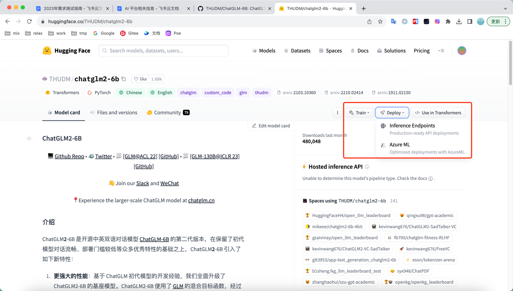

[TOC]

<h1 align="center">AI 产品</h1>

> By：weimenghua  
> Date：2023.08.13  
> Description：  

**参考资料**
[awesome-mlops](https://github.com/kelvins/awesome-mlops)


- [MidJourney](https://www.midjourney.com/)，需要先注册 [Discord](https://discord.com/)
- [GitHub Copilot](https://docs.github.com/zh/copilot/quickstart)
- [ChatGPT](https://chat.openai.com/)
- [Huggingface](https://huggingface.co/)
- [Prompt](https://www.promptingguide.ai/zh)
- [Perplexity](https://www.perplexity.ai/)


ChatGPT插件：Sider

[Transformers 是由 Hugging Face 开发的一个 NLP 包](https://transformers.run/)


### Huggingface

```
git lfs install
git clone https://huggingface.co/iew/wei-demo-001

git lfs install
git clone git@hf.co:iew/wei-demo-001

GIT_LFS_SKIP_SMUDGE=1

只下载模型实现
GIT_LFS_SKIP_SMUDGE=1 git clone https://huggingface.co/THUDM/chatglm-6b
```

训练、部署



[ChatGLM-6B](https://huggingface.co/THUDM/chatglm-6b) 是一个开源的、支持中英双语问答的对话语言模型  

[chatglm](https://www.chatglm.cn/)