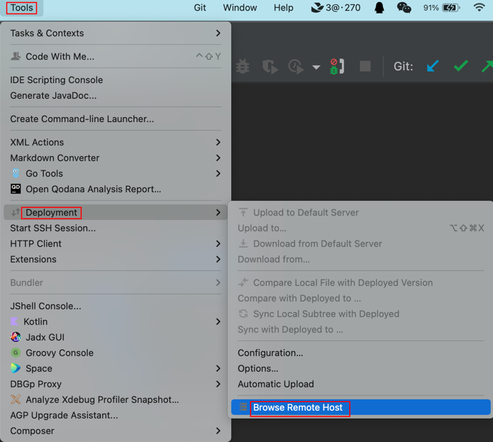

[TOC]

--- 

<h1 align="center">IDEA</h1>

> By：weimenghua  
> Date：2022.09.18   
> Description：IDEA

1、添加模板
File > Settings > Editor > File and Code Templates > Includes > File Header 添加如下模板：
```
/**
  *@author          wmh
  *@time            ${YEAR}-${MONTH}-${DAY} ${TIME}
  *@description
  */
```

File > Settings > Editor > File and Code Templates > Files > 添加如下模板 (Extension: sh)
```
#!/bin/bash

#-----------------------------------------------------------------------------
# author: wmh
# 脚本说明:
#-----------------------------------------------------------------------------
```

2、快捷键
- 左移：tab+shift
- 右移：tab
- 上移：shift+alt+向上方向键
- 下移：shift+alt+向下方向键
- 批量选择列：option+鼠标从上往下移动
- 跳转到对应行：command + L
- 快速查找文件：command + shift + L
- 快速查找文件内容：command + shift + F


3、插件
[插件下载地址](https://plugins.jetbrains.com/)

- File Expander：查看 jar 包
- GitToolBox：查看项目提交情况
- Translation：翻译
- arthas idea：Java 在线诊断工具
- Search In Repository：查看 jar 包的 maven/gradle 的坐标
- Zoolytic：查看 zookeeper 节点数据, 合适：ip:port(一般2181)
- Git Commit Template：commit 规范
- RestfulToolkit：RestfulToolkit 提供了一套 RESTful 服务开发辅助工具集, 根据 URI 的部分信息来查找对应的 Controller 中方法
- Json Paser：json 格式化工具
- GsonFormatPlus：一款能根据 JSON 字符串自动生成实体类的插件，支持 Lombok。在实体类名称后面右键，Generate > GsonFormatPlus。
- CloudToolkit：SpringBoot 应用自动化部署神器。
- Squaretest：自动生成单元测试的插件。
- Alibaba Java Coding Guidelines：阿里巴巴 Java 开发规约插件
- Rainbow Brackets：彩虹括号
- Database Navigator：数据库管理系统。因为和 IDEA 2022.1.3 版本不兼容，使用 Fork 版本：DatabaseHelper，使用结论是不如 DataGrip
- CSV Editor：CSV 插件


4、解决 js 文件爆红问题？  
去掉 eslint 校验，File > Strings > Languages & Framworks > JavaScript > Code Quality Tools > ESLint，选择 Disable ESLint。


5、Settings 路径：IntelliJ IDEA > Preferences


6、IDEA 批量去掉空行
command + R 调出替换框，勾选正则模式 Regex（.*图标），在条件框中输入正则：^\s*\n (匹配以0个或 n个\s 空白符起首的换行\n)

7、properties 文件中文乱码
File > Settings > File Encodings
修改编码模式为 UTF-8

8、连接 sftp
Tools > Deployment > Browse Remote Host


9、从新在侧边栏打开插件图标
View > Tool Windows

