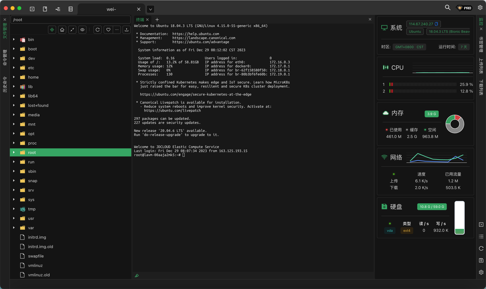

[TOC]

<h1 align="center">Mac</h1>

> By：weimenghua  
> Date：2023.05.23  
> Descrition：Mac 使用技巧 


### 快捷键

- Command+⬆️+# 截全屏
- Command+⬆️+$/4截取选择区域
- Command+⬆️+% 录屏
- command+H 隐藏在运行窗口
- Command+W 关闭所有程序
- Command+tab 在应用程序间切换
- Command+⬆+. 展示隐藏文件
- 选择多列  
  Option + 按住鼠标左键往上下拖拽  
  Option + 按住触控板 + 按住触控板往上下拖拽 


### Homebrew
**参考资料**  
[Homebrew 官网](https://brew.sh/)  
[Homebrew 源码](https://github.com/Homebrew)

1、简介  
Homebrew formula 是Homebrew 包管理器的一种形式，它是一种简单的脚本或模板，用于在 Homebrew 中安装软件包。Homebrew formula 包含有关软件包的信息，例如软件包的名称、版本、来源、依赖关系和安装过程等。

2、安装
```
/bin/bash -c "$(curl -fsSL https://raw.githubusercontent.com/Homebrew/install/HEAD/install.sh)"
```

```
安装软件包
brew install <package>

卸载软件包
brew uninstall <package>

更新已安装的软件包
brew update

搜索软件包
brew search <keyword>

查看已安装的软件包
brew list

显示软件包信息：
brew info <package>

查看软件包依赖关系brew deps python
brew deps <package>
```

3、formula
Homebrew formula 的地址在 Homebrew 官方 GitHub 仓库中，官方仓库的地址是 https://github.com/Homebrew/homebrew-core。  
在 homebrew-core 仓库中，所有的 formula 文件都存储在 Formula 目录下。你可以使用以下命令在本地查看 Homebrew 的 formula：

```
cd $(brew --repo)/Library/Taps/homebrew/homebrew-core/Formula/
ls
```

Brew 安装软件

```
brew install mysql-client

echo 'export PATH="/opt/homebrew/opt/mysql-client/bin:$PATH"' >> ~/.zshrc
mysqldump --version
```

1. 视频下载 [you-get](https://you-get.org/)

```
安装
brew install you-get
pip install you-get

例子
you-get 'https://www.youtube.com/watch?v=jNQXAC9IVRw'
```


### 系统设置

1. 找到 /etc/hosts 文件  
   访达 > 上方导航栏前往 > 前往文件夹 > 输入 /etc/ 按回车

2. 设置 > 通用 > 隔空投送与接力

3. 右键共享发送文件到微信
   设置方式：隐私与安全性-扩展-共享-发送到微信
4. 开启自启
   系统设置 > 通用 > 登录项


### Mac 工具

1. [hosts 管理工具](https://www.macupdate.com/app/mac/61913/hosts/download)
2. switchhosts  
   [switchhosts 官网](https://switchhosts.vercel.app/zh)  
   [switchhosts 下载](https://github.com/oldj/SwitchHosts/releases)
3. [Parallels Desktop 虚拟机](https://www.parallels.com/products/desktop/) 
4. [multipass 快速创建 ubuntu 虚拟机](https://multipass.run/)
5. iBar-强大的菜单栏图标管理工具


### Mac 下载软件

- [macked](https://macked.app/)
- [macwl](https://www.macwl.com/)


### 查看 Mac 信息
1. 查看操作系统版本：左上角苹果图标 > 关于本机 > 操作系统版本
2. 查看设备序列号：左上角苹果图标 > 关于本机 > 序列号
3. 查看硬盘序列号：启动台搜索【系统信息】> 点击硬件 > 硬件UUID
4. 查看 Mac 地址：ifconfig | grep "ether"  / ifconfig en0 | grep "ether"
5. 查看操作系统的更新时间：softwareupdate --history --all


### 知识碎片

1. Darwin
   [Darwin](https://en.wikipedia.org/wiki/Darwin_(operating_system)) 是指苹果公司所开发的操作系统内核，它是 macOS 和 iOS 等操作系统的基础。Darwin 内核是一个开源项目，它基于类似于 BSD 的 UNIX 系统，并经过苹果公司的修改和优化。

2. IDEA 终端美化（注：不要轻易实践...）

   ```
   cat /etc/shells
   chsh -s /bin/zsh
   chsh -s /bin/bash
   
   git clone git://github.com/robbyrussell/oh-my-zsh.git ~/.oh-my-zsh
   wget https://github.com/robbyrussell/oh-my-zsh/raw/master/tools/install.sh -O - | sh
   
   cd ~/.oh-my-zsh/custom/plugins
   rm -rf ~/.oh-my-zsh
   rm -rf ~/.zshrc.pre-oh-my-zsh
   uninstall_oh_my_zsh
   
   brew install autojump
   brew uninstall autojump
   
   pip install powerline-status
   pip uninstall powerline-status
   ```

[Xterminal SSH 终端](https://www.terminal.icu/)



[WindTerm SSH 终端](https://github.com/kingToolbox/WindTerm/releases)

Mac 安装 nvm  
curl -o- https://raw.githubusercontent.com/nvm-sh/nvm/v0.39.0/install.sh | bash

在 win 启动 JMeter 报错
'\\Mac\Home\Downloads\package\apache-jmeter-5.5\apache-jmeter-5.5\bin'
用作为当前目录的以上路径启动了 CMD.EXE。
UNC 路径不受支持。默认值设为 Windows 目录。
Not able to find Java executable or version. Please check your Java installation.
errorlevel=2
请按任意键继续. . .

问题：Mac 声音突然变小
解决：把企业微信、微信这些可能发生过语音通话的 app 关闭

Mac clashx 如何在 proxy 添加白名单：  
vim ~/.config/clash/proxyIgnoreList.plist 
```
<?xml version="1.0" encoding="UTF-8"?>
<!DOCTYPE plist PUBLIC "-//Apple//DTD PLIST 1.0//EN" "http://www.apple.com/DTDs/PropertyList-1.0.dtd">
<plist version="1.0">
<array>
	<string>192.168.0.0/16</string>
	<string>10.0.0.0/8</string>
	<string>172.16.0.0/12</string>
	<string>127.0.0.1</string>
	<string>localhost</string>
	<string>*.local</string>
	<string>*.crashlytics.com</string>
</array>
</plist>
```
cp /Users/menghuawei/IdeaProjects/my-project/wei-notebook/.tmp/proxyIgnoreList.plist ~/.config/clash/proxyIgnoreList.plist
