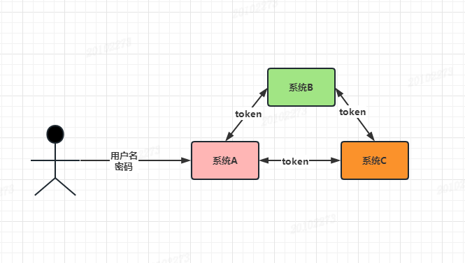

[TOC]

<h1 align="center">知识碎片 定时整理</h1>

> By：weimenghua  
> Date：2023.10.13  
> Description：


## 多租户

多租户（Multi-tenancy）是一种软件架构和部署模式，允许单个实例的应用程序同时为多个租户提供服务。租户是指使用该应用程序的一个组织或用户群体。

在多租户架构中，应用程序可以为每个租户提供独立的环境，以便他们可以自定义和管理其数据、配置和安全性需求，而不影响其他租户。这种架构通常会利用虚拟化技术和容器化技术等手段来隔离每个租户，从而确保各租户之间的数据和业务逻辑完全独立。

多租户架构可以提高应用程序的可伸缩性和资源利用率，并降低了成本和复杂性。它广泛应用于软件即服务（SaaS）和云计算领域，例如在在线视频流媒体、电子商务、社交媒体和协同办公等应用程序中都有大量的多租户实现。

需要注意的是，多租户架构也带来了一些挑战，如如何保证数据安全性、如何处理跨租户的共享资源和如何进行有效的租户管理等问题。因此，在设计和实现多租户系统时，需要认真考虑这些挑战并采取相应的措施来解决。


## TMPL 模板

TMPL是一种模板文件格式，全称为Template Markup Language。它是一种用于定义和生成文本文件的标记语言。TMPL文件通常包含占位符和指令，用于在生成文件时插入动态内容或执行特定的操作。TMPL文件可以用于生成各种类型的文本文件，如网页、配置文件、邮件等。


## toml 文件

conf.toml 是一种配置文件格式，它使用 TOML (Tom's Obvious, Minimal Language) 语言编写。TOML 是一种易于阅读和编写的配置文件语言，旨在成为 INI 文件的现代替代品。与 INI 文件不同，TOML 具有更强的表达能力，支持多级键、数组、嵌套表等功能，同时保持了简洁性和易读性。TOML 的语法规则比较简单，常用的数据类型包括字符串、整数、浮点数、布尔值和日期时间等。TOML 的文件扩展名通常为 .toml。

例子
```
# This is a TOML configuration file

[server]
host = "example.com"
port = 80
enabled = true

[database]
server = "db.example.com"
port = 5432
username = "admin"
password = "password123"
database = "exampledb"
```

## example.yml.tmpl 读取 example.toml 的示例


## 微服务类型或 SOA 类型

[既然有了 HTTP，为什么还要 RPC？](https://mp.weixin.qq.com/s/aUOAiVqdUjJ5rwhPBBbhoQ)

微服务（Microservices）和面向服务架构（Service-Oriented Architecture，SOA）都是软件架构的设计范式，用于构建分布式系统。它们具有一些共同之处，但也有一些区别。

微服务（Microservices）是一种架构风格，将一个大型应用程序拆分为一组小型、自治的服务，这些服务可以独立开发、部署和扩展。每个微服务都专注于执行特定的业务功能，并通过明确定义的接口进行通信。这些微服务可以使用不同的编程语言、技术栈和数据存储技术。每个微服务可以独立部署，并且可以通过轻量级的通信机制（如 RESTful API、消息队列等）进行交互。微服务架构强调服务的自治性、可独立部署性、可伸缩性和容错性。

面向服务架构（Service-Oriented Architecture，SOA）是一种软件架构风格，旨在通过将应用程序划分为一组松散耦合的服务来实现系统的灵活性和可重用性。在 SOA 中，服务是可重用的功能单元，通过明确定义的接口和协议进行通信。SOA 强调服务的可重用性、互操作性和组合性，以支持企业级系统的构建和集成。SOA 中的服务可以通过不同的通信机制（如 SOAP、Web Services、消息队列等）进行交互。

区别：  
- 规模和复杂性：微服务通常关注于构建小型、自治的服务，每个服务专注于一个具体的业务功能。SOA 更多关注于构建大型企业级系统，服务的规模和复杂性可能更大。  
- 技术栈和部署：微服务允许使用不同的技术栈和数据存储技术，每个微服务可以独立部署。SOA 通常更加标准化，使用统一的技术栈和协议，服务通常部署在中央的服务容器中。  
- 服务自治性：微服务更强调服务的自治性，每个服务可以独立开发、部署和扩展。SOA 中的服务通常由中央组织或团队管理和控制。  


### 服务中台

服务中台是一种将企业的业务系统进行模块化、服务化和资源共享的架构模式。抽取业务共性，抽象沉淀。中台的出现是为前台(业务层)提供服务。


## Restful

Restful web service 是一种常见的 rest 应用，统一用于命名遵循 rest 风格的 web 服务。Restful 服务是一种 ROA（Resource-Oriented Architecture，面向资源的架构）。举一个例子就可以理解了：

Restful 出现之前的 HTTP 接口：
- http://127.0.0.1/user/query   GET  根据用户 id 查询用户数据
- http://127.0.0.1/user/save    POST 新增用户
- http://127.0.0.1/user/update  POST 修改用户信息
- http://127.0.0.1/user/delete  GET/POST 删除用户信息

Restful 式 HTTP 接口:
- http://127.0.0.1/user  GET  根据用户 id 查询用户数据
- http://127.0.0.1/user  POST 新增用户
- http://127.0.0.1/user  PUT 修改用户信息
- http://127.0.0.1/user  DELETE 删除用户信息


## SSO

单点登录（SSO）是一种认证机制，允许用户使用一组凭据（例如用户名和密码）登录到多个相关应用程序或系统，而无需为每个应用程序输入凭据。通过实现SSO，用户只需进行一次登录，然后可以无缝地访问其他应用程序，而无需再次输入凭据。

单点登录（Single Sign-On，SSO）是一种身份验证服务，允许用户使用单个标识来登录多个应用程序或系统。如下图所示，用户只需要用户名/密码登陆一次就可以访问系统A、系统B和系统C。

在实施SSO时，通常使用一些标准和协议，如SAML（Security Assertion Markup Language）、OAuth（Open Authorization）和OpenID Connect等。这些协议提供了在身份提供者和应用程序之间安全传输身份信息和令牌的机制。

一个常见的SSO例子是企业内部的应用程序集成。假设一个大型企业有多个内部系统，如电子邮件、人力资源管理系统、客户关系管理系统和文档共享平台等。在传统的登录方式下，员工需要为每个系统输入不同的用户名和密码。通过实施SSO，员工只需进行一次登录，然后可以访问所有与SSO集成的应用程序，而无需再次输入凭据。




## Citrix Workspace 应用程序

[Citrix Workspace 说明文档](https://docs.citrix.com/zh-cn/citrix-workspace-app.html)  
[Citrix Workspace Mac 下载地址](https://www.citrix.com/downloads/workspace-app/mac/workspace-app-for-mac-native-support-for-silicon-mac.html)

Citrix Workspace 应用程序提供对最终用户保持工作效率所需的所有资源的即时、安全和无缝访问。这包括访问虚拟桌面、虚拟应用程序、Web 和 SaaS 应用程序，以及嵌入式浏览和单点登录（从任何位置和任何设备）等功能。


## 边缘计算

边缘计算是为应用开发者和服务提供商在网络的边缘侧提供云服务和 IT 环境服务；目标是在靠近数据输入或用户的地方提供计算、存储和网络带宽。

边缘运算（英语：Edge computing），又译为边缘计算，是一种分布式运算的架构，将应用程序、数据资料与服务的运算，由网络中心节点，移往网络逻辑上的边缘节点来处理[1]。边缘运算将原本完全由中心节点处理大型服务加以分解，切割成更小与更容易管理的部分，分散到边缘节点去处理。边缘节点更接近于用户终端设备，可以加快资料的处理与发送速度，减少延迟。在这种架构下，资料的分析与知识的产生，更接近于数据资料的来源，因此更适合处理大数据。


## 上下文

上下文 = 语境。

上下文（Context）是软件工程中一个非常重要的概念，它定义了软件系统中软件元素之间的关系。上下文是软件系统中软件元素的集合，它定义了软件系统中软件元素之间的关系。软件系统中的软件元素包括：模块、过程、函数、类、对象、变量、常量、数据结构、算法、接口、组件、包、模块、子系统、系统、系统部件、系统服务、系统接口、系统组件、系统部件、系统服务、系统接口、系统组件、系统。

在语言学里，语意学（semantics）不包含语境（context），语用学（pragmatics）则考虑到语境对语意的影响。

在编程中，也就是一些编程构件（如函数）需要考虑到当时的编译／运行环境，才能理解它的语意／运行结果。


## SOP 标准作业程序

SOP=Standard Operating Procedure  
即“标准作业程序”，是一套指导工作流程和操作步骤的详细指南。可以把工作、学习和生活中遇到的某一件事流程拆解成固定的执行步骤。


### RBAC

角色控制访问权限 RBAC（Role-Based Access Control）是一种访问控制的方法，它基于用户的角色来管理对资源的访问。在 RBAC 中，权限分配和管理是基于角色的，而不是直接关联到个别用户。以下是 RBAC 的一些关键概念和组成部分：

- 角色（Role）：角色是一组权限的集合，通常代表了用户在组织中的职能或身份。例如，一个角色可以是“管理员”、“编辑者”、“审计员”等。
- 用户（User）：RBAC 中的用户指的是系统中的实际用户或者其他实体，他们被分配到一个或多个角色中。
- 权限（Permission）：权限是指对资源进行的操作，比如读取、写入、删除等。这些权限通常被分配给角色。
- 授权（Authorization）：授权是指根据用户的角色来确定其对资源的访问权限。

RBAC 的基本思想是将用户的权限分配给角色，然后将角色分配给用户。这种模型简化了权限管理，降低了复杂性，并提高了安全性，因为权限的管理集中在角色上，而不是分散在每个用户上。


### LDAP

LDAP（Lightweight Directory Access Protocol）：基于 X.500 标准的轻量级目录访问协议。

LDAP（轻型目录访问协议）是一种用于访问和管理目录服务的协议。它是一种客户端-服务器协议，旨在帮助组织存储、组织和检索信息，如用户身份验证、地址簿、组织结构等。

可以将LDAP想象为一种电话簿或黄页目录的网络版。LDAP服务器充当目录服务的中心，存储着大量的数据。而客户端（应用程序、工具或其他系统）可以通过LDAP协议与服务器通信，以读取、修改或搜索存储在目录中的信息。

LDAP的目录结构采用了树状层次结构，类似于文件系统的文件夹结构。每个目录项（条目）都有一个唯一的标识符（称为DN，Distinguished Name），用于在整个目录中唯一标识该项。每个目录项可以包含各种属性（例如姓名、电子邮件地址、电话号码等），这些属性用于描述目录项的特征。

LDAP的一些常见用途包括：
- 用户身份验证：LDAP可用于验证用户凭据，例如用户名和密码。应用程序可以通过LDAP查询用户存储在目录中的凭据，以进行身份验证和授权操作。
- 地址簿和联系人管理：LDAP可用于存储和查找联系人信息，如电子邮件地址、电话号码和组织结构。它可以用作集中式的企业通讯录，供员工搜索和访问联系人信息。
- 组织结构管理：LDAP可用于存储和管理组织结构信息，如部门、团队和员工关系。它可以帮助组织建立和维护组织结构的层次关系，并支持对组织结构进行动态更改和搜索。

LDAP具有以下特点：
- 轻量级：相对于传统的目录服务协议（如X.500），LDAP更轻量级，更适用于互联网环境和资源受限的设备。
- 分布式：LDAP支持分布式目录服务，允许将目录数据分布在多个LDAP服务器上，并在需要时进行跨服务器查询和操作。
- 开放标准：LDAP是一个开放的标准协议，被广泛应用于各种操作系统、应用程序和设备。它使用TCP/IP协议栈进行通信，并支持加密和安全认证功能。

总而言之，LDAP是一种用于访问和管理目录服务的协议，它提供了一种灵活且可扩展的方式来组织和检索信息。通过LDAP，您可以构建集中式的身份验证系统、联系人管理系统和组织架构管理系统，以满足各种组织的需求。	  								通过把 LDAP目录作为系统集成中的一个重要环节，可以简化员工在企业内部查询信息的步骤，甚至连主要的数据源都可以放在任何地方。


### 生成临时邮箱网站

http://24mail.chacuo.net/


### 硬编码

硬编码（Hard coding）是指在程序或系统中直接使用具体的数值或参数，而不是使用变量或可配置的选项。它是一种将数据或逻辑直接嵌入到代码中的做法，而不是通过更灵活的方式进行配置或修改。

示例
```
def calculate_circle_area():
radius = 5  # 硬编码的半径值
area = 3.14159 * radius * radius
return area

print(calculate_circle_area())  # 输出：78.53975
```


###  StackEdit 浏览器内 Markdown 笔记利器

https://stackedit.cn/


### Json 工具

[jsoncrack](https://jsoncrack.com/editor)

[Github 源码](https://github.com/AykutSarac/jsoncrack.com)


### 防火墙工具 待研究

[SafeLine](https://github.com/chaitin/SafeLine)


### 内网穿透

[内网穿透工具](https://natapp.cn/)

内网穿透是一种将位于局域网内的计算机或设备暴露到公共网络中的技术。它可以让外部网络中的用户通过互联网访问位于内部网络的设备，而无需直接连接到内部网络。

通常情况下，内网设备无法直接从公共网络中访问，因为它们被路由器或防火墙等网络设备保护在局域网内部。但是，通过使用内网穿透技术，可以建立一个安全的通道，将公共网络的请求转发到内网设备上。


### 逆向工程

逆向工程（Reverse Engineering）是指通过分析和研究已有的产品、系统或软件，从而推导出其设计、功能和工作原理的过程。逆向工程通常用于研究和理解他人的产品或系统，以及解决与该产品或系统相关的问题。


### DCMP

Distributed Configuration Management Platform ---- (分布式配置管理平台)。专注于各种「分布式系统配置管理」的「通用组件」和「通用平台」, 提供统一的「配置管理服务」。


### SMTP

1、SMTP服务器需要身份验证  
2、如果是设置POP3和SMTP的SSL加密方式，则端口如下：  
    1）POP3服务器（端口995）
    2）SMTP服务器（端口465或587）


### 透传

透传，即透明传输（pass-through），指的是在通讯中不管传输的业务内容如何，只负责将传输的内容由源地址传输到目的地址，而不对业务数据内容做任何改变。


### SBOM

软件物料清单（SBOM Software Bill of Materials）指软件成分列表，列出了软件组件、有关这些组件的信息以及它们之间的依赖关系。SBOM可以简单地理解为软件的配料清单。  
SBOM是一系列专门应用于软件的元数据。关键信息包括组件名称、许可证信息、版本号和供应商。


### Lua

Lua是一种轻量级、高效、可嵌入的脚本编程语言。它具有简单的语法、动态类型、自动内存管理和良好的扩展性。Lua最初由巴西里约热内卢天主教大学（Pontifical Catholic University of Rio de Janeiro）的一个研究小组开发，并于1993年发布。

Lua的设计目标之一是作为扩展和嵌入式脚本语言使用。它可以轻松地嵌入到其他应用程序中，作为其扩展脚本语言，提供灵活的自定义和脚本化能力。因此，Lua被广泛应用于游戏开发、嵌入式系统、脚本插件、图形界面和其他需要脚本化的领域。

通过与Lua的集成，Nginx可以使用Lua脚本来自定义请求处理、访问控制、重定向、响应处理和其他高级功能。这种集成提供了更大的灵活性和可编程性，使开发人员能够通过编写Lua脚本来定制和扩展Nginx的行为。


### httpstat 

httpstat是一个基于命令行的工具，用于在终端中展示HTTP请求的详细统计信息。它以可视化和易读的方式显示了HTTP请求的各个阶段的性能数据，如DNS解析、TCP连接、TLS握手、发送请求、服务器处理、接收响应等。

```
pip install httpstat
httpstat <url>
httpstat www.gitee.com
```


### 网站 cookie 同意

当访问网站时，有些网站会在用户首次访问时显示一个弹出窗口或横幅，要求用户同意使用Cookie

- 改善网站性能和功能：使用Cookie可以帮助网站收集关于用户行为和偏好的信息。这些数据可以用于改进网站的性能、功能和用户体验。例如，通过分析Cookie数据，网站可以了解哪些页面受欢迎，哪些功能需要改进等。
- 广告定向和跟踪：某些Cookie用于提供定向广告和广告跟踪。当您同意使用Cookie时，网站可以根据您的兴趣和行为提供与您相关的广告，从而提供更有针对性的广告体验。
- 合规性和法律要求：许多国家和地区要求网站在收集和使用用户数据时获得明确的同意。同意使用Cookie可以帮助网站遵守相关的隐私和数据保护法律，确保合规性。

[霍尼韦尔的 cookie 声明](https://www.honeywell.com/us/en/cookie-notice#language3/)


## 版本号
版本号：
V（Version）：即版本，通常用数字表示版本号。(如:EVEREST Ultimate v4.20.1188 Beta )
Build：用数字或日期标示版本号的一种方式。(如:VeryCD eMule v0.48a Build 071112)
SP：Service Pack，升级包。(如:Windows XP SP 2/Vista SP 1)

授权和功能划分：
Trial：试用版，通常都有时间限制，有些试用版软件还在功能上做了一定的限制。可注册或购买成为正式版
Unregistered：未注册版，通常没有时间限制，在功能上相对于正式版做了一定的限制。可注册或购买成为正式版。
Demo：演示版，仅仅集成了正式版中的几个功能，不能升级成正式版。
Lite：精简版。
Full version：完整版，属于正式版。

语言划分：
SC：Simplified Chinese简体中文版。
CN ： 简体中文版
GBK：简体中文汉字内码扩展规范版。
TC：Traditional Chinese繁体中文版。
CHT ： 繁体中文版
BIG5：繁体中文大五码版。
EN ： 英文版
Multilanguage ： 多语言版
UTF8：Unicode Transformation Format 8 bit，对现有的中文系统不是好的解决方案。

开发阶段划分：
α（Alpha）版：内测版，内部交流或者专业测试人员测试用。Bug较多，普通用户最好不要安装。
β（Beta）版：公测版，专业爱好者大规模测试用，存在一些缺陷，该版本也不适合一般用户安装。
γ（Gamma）版：相当成熟的测试版，与即将发行的正式版相差无几。
RC版：Release Candidate。
RC 版。是 Release Candidate 的缩写，意思是发布倒计时，候选版本，处于Gamma阶段，该版本已经完成全部功能并清除大部分的 BUG。到了这个阶段只会除BUG，不会对软件做任何大的更改。从Alpha到Beta再到Gamma是改进的先后关系，但RC1、RC2往往是取舍关系。
Final：正式版。

其他版本
Enhance ：增强版或者加强版 属于正式版1
Free ：自由版
Release ：发行版 有时间限制
Upgrade ：升级版
Retail  ：零售版
Cardware ：属共享软件的一种，只要给作者回复一封电邮或明信片即可。（有的作者并由此提供注册码等），目前这种形式已不多见。/ S
Plus ：属增强版，不过这种大部分是在程序界面及多媒体功能上增强。
Preview ：预览版
Corporation & Enterprise ：企业版
Standard ：标准版
Mini ：迷你版也叫精简版只有最基本的功能
Premium ： 贵价版
Professional ： 专业版
Express ： 特别版
Deluxe ： 豪华版
Regged ： 已注册版
Rip ：是指从原版文件（一般是指光盘或光盘镜像文件）直接将有用的内容（核心内容）分离出来，剔除无用的文档，例如PDF说明文件啊，视频演示啊之类的东西，也可以算做是精简版吧…但主要内容功能是一点也不能缺少的！另：DVDrip是指将视频和音频直接从DVD光盘里以文件方式分离出来。
RTM 版 ：这基本就是最终的版本，英文是 Release To Manufactur，意思是发布到生产商。
Original Equipment Manufacturer (OEM)
You may license products through an Original Equipment Manufacturer  (OEM). These products, such as Windows operating systems, come installed  when you purchase a new computer.
OEM软件是给电脑生产厂的版本，无需多说。

Full Packaged Product (FPP)/Retail
Physical, shrink-wrapped boxes of licensed product that can be purchased  in a local retail store or any local software retailer.
FPP就是零售版（盒装软件），这种产品的光盘的卷标都带有"FPP"字样，比如英文WXP Pro的FPP版本的光盘卷标就是WXPFPP_EN，其中 WX表示是Windows XP，P是Professional（H是Home），FPP表明是零售版本，EN是表明是英语。获得途径除了在商店购买之外，某些MSDN用户也可以得到。
Volume Licensing for Organizations (VLO)
You may enjoy potentially significant savings by acquiring multiple  product licenses. Depending on the size and type of your organization.
团体批量许可证（大量采购授权合约），这是为团体购买而制定的一种优惠方式。这种产品的光盘的卷标都带有"VOL"字样，取"Volume"前3个字母，以表明是批量，比如英文WXP Pro的VOL版本的光盘卷标就是WXPVOL_EN，其中WX表示是Windows XP，P是 Professional（VOL没有Home版本），VOL表明是团体批量许可证版本，EN是表明是英语。获得途径主要是集团购买，某些MSDN用户也可以得到。

LITE的意思是精简版，就是比收费版少了一些东西。