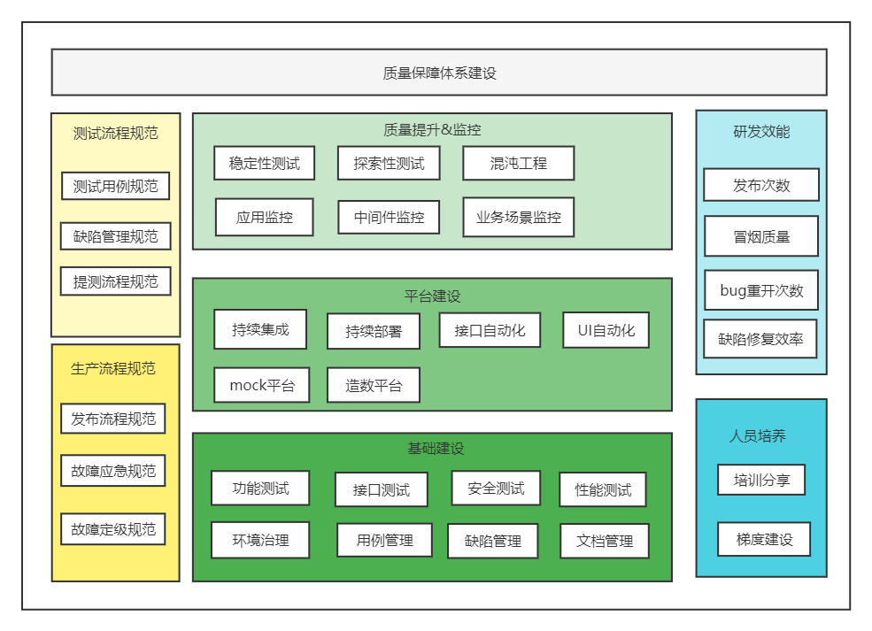
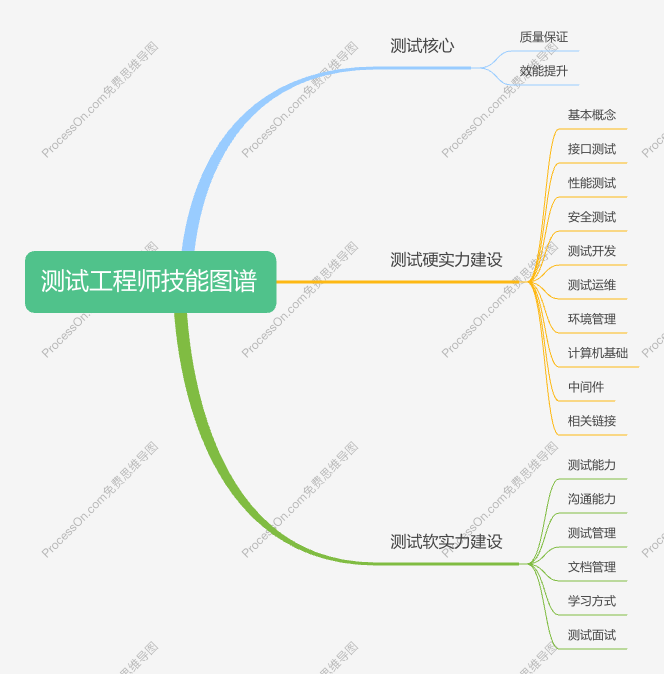

[TOC]

<h1 align = "center">知行合一</h1>

知识体系建设

笔者是一个软件测试工程师，俗称 "点工"，测试业务包含：法律催收、融资担保、信贷风控、DveOps 流水线、代码托管等，朝着质量保障，效能提升的方向前进，不止测试。

业内业余爱好都喜欢做笔记，把学到 + 理解 + 实践记录下来，部分内容非原创，大部分有备注参考资料，或者来源 ChatGPT，最终目标是形成知识体系，详细可查看[博客地址](https://iewiewiew.github.io/docs/)。

## :sunny: 1、项目简介

- wei-notebook
  项目说明：包含 Ansible，MySQL，Docker，Git，Jenkins，JMeter，Linux，Shell，Pipeline，中间件：Dubbo、 Kafka、Nginx、Nodejs、Redis、RocketMQ、Zookeeper 等总结。
  - <https://github.com/iewiewiew/wei-notebook.git>
  - <https://gitee.com/iewiewiew/wei-notebook.git>
- Learn-Java
  项目说明：Java 和前端项目，包含 Java 基础，SpringBoot，React，Vue，TypeScript 等。
  - <https://github.com/iewiewiew/Learn-Java.git>
  - <https://gitee.com/iewiewiew/Learn-Java.git>
- Learn-Python
  项目说明：Python 项目，包含 Python 基础，cypress，pytest，robotframework，selenium，unitest 等测试框架。
  - <https://github.com/iewiewiew/Learn-Python.git>
  - <https://gitee.com/iewiewiew/Learn-Python.git>
- Learn-Go
  项目说明：Go 项目。
  - <https://github.com/iewiewiew/Learn-Go.git>
  - <https://gitee.com/iewiewiew/Learn-Go.git>

## :earth_asia: 2、质量保障体系建设

- 在线地址：[质量保障体系建设](https://www.processon.com/view/link/62526ac61efad407891c5dd5)
- 本地文件：[质量保障体系建设](./docs/质量保障体系建设.pdf)

## :frog: 3、测试工程师技能图谱

- 在线地址：[测试工程师技能图谱](https://www.processon.com/view/link/615eae81e0b34d06f3dcdf4b)  
- 本地文件：[测试工程师技能图谱](./docs/测试工程师技能图谱.xmind)

