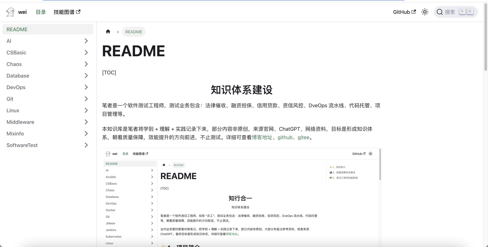
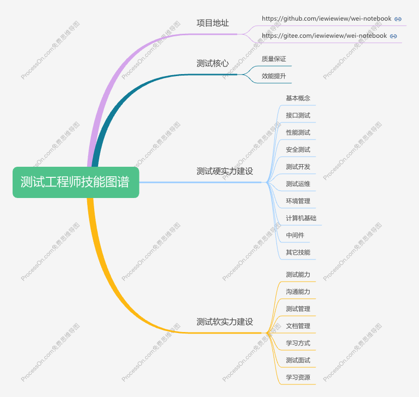

[TOC]

<h1 align = "center">知识体系建设</h1>

笔者是一个软件测试工程师，测试业务包含：法律催收、融资担保、信用贷款、资信风控、DveOps 流水线、代码托管、项目管理等。

本知识库是笔者将学到 + 理解 + 实践记录下来，部分内容非原创，来源官网、ChatGPT、网络资料，目标是形成知识体系，朝着质量保障，效能提升的方向前进，不止测试。详细可查看[博客地址](https://iewiewiew.github.io/docs/)、[GitHub](https://github.com/iewiewiew/wei-notebook.git)、[Gitee](https://gitee.com/iewiewiew/wei-notebook.git)。

[质量保障体系建设](https://www.processon.com/view/link/62526ac61efad407891c5dd5)

[测试工程师技能图谱](https://www.processon.com/view/6138112f1e085306ef9fe608)  

