[TOC]

<h1 align="center">JMeter</h1>

> By：weimenghua  
> Date：2022.09.18  
> Description：JMeter 接口测试

**参考资料**  
[JMeter 源码](https://github.com/apache/jmeter)


## 1. 环境搭建

### 1.1 安装 JDK+JMeter+Ant

1. 安装软件

1.1 安装 JDK

```
https://www.oracle.com/java/technologies/downloads/#java8
tar -zxvf jdk-8u351-linux-x64.tar.gz
```

1.2 安装 Ant
```
wget --no-check-certificate https://dlcdn.apache.org//ant/binaries/apache-ant-1.9.16-bin.tar.gz && tar -zxvf apache-ant-1.9.16-bin.tar.gz
```

1.3 安装 JMeter

[JMeter 下载地址](https://jmeter.apache.org/download_jmeter.cgi)  
[JMeter 下载地址2](https://dlcdn.apache.org//jmeter/binaries/)

```
wget --no-check-certificate https://dlcdn.apache.org//jmeter/binaries/apache-jmeter-5.5.tgz && tar -zxvf apache-jmeter-5.5.tgz
```

2. 配置环境变量
```
踩坑：执行以下命令时识别不了$，需转义
cat /etc/profile

cat >> /etc/profile << EOF
export JAVA_HOME=/root/software/jdk1.8.0_351
export ANT_HOME=/root/software/apache-ant-1.9.16
export JMETER_HOME=/root/software/apache-jmeter-5.5
export PATH=$JAVA_HOME/bin:$JMETER_HOME/bin:$ANT_HOME/bin:$PATH
export CLASSPATH=.:$JAVA_HOME/jre/lib/rt.jar:$JAVA_HOME/lib/dt.jar:$JAVA_HOME/lib/tools.jar:$JMETER_HOME/lib/ext/ApacheJMeter_core.jar:$JMETER_HOME/lib/jorphan.jar
EOF

export PATH=\$JAVA_HOME/bin:\$JMETER_HOME/bin:\$ANT_HOME/bin:\$PATH
export CLASSPATH=.:\$JAVA_HOME/jre/lib/rt.jar:\$JAVA_HOME/lib/dt.jar:\$JAVA_HOME/lib/tools.jar:\$JMETER_HOME/lib/ext/ApacheJMeter_core.jar:\$JMETER_HOME/lib/jorphan.jar

source /etc/profile
```

3. 检查

3.1、查看 jdk 安装位置
```
java -verbose
```

3.2、查看环境变量
```
echo $JAVA_HOME
echo $ANT_HOME
echo $JMETER_HOME
```

3.3、查看应用版本
```
java -version
ant -version
jmeter -v
```

### 1.2 配置 JMeter+Ant

1. 将 JMeter 的 extras 目录下的 ant-jmeter-1.1.1.jar 文件复制到 Ant 安装目录的 lib 目录下
```
cp /root/software/apache-jmeter-5.5/extras/ant-jmeter-1.1.1.jar /root/software/apache-ant-1.9.16/lib/
检查：ls /root/software/apache-ant-1.9.16/lib/ |grep jmeter
```

2. 将 JMeter 的 lib 目录下，把 serializer-2.7.2.jar、xalan-2.7.2.jar 文件复制到 Ant 的 lib 目录下
```
cp /root/software/apache-jmeter-5.5/lib/serializer-2.7.2.jar /root/software/apache-ant-1.9.16/lib/
检查：ls /root/software/apache-ant-1.9.16/lib/ |grep serializer

cp /root/software/apache-jmeter-5.5/lib/xalan-2.7.2.jar /root/software/apache-ant-1.9.16/lib/
检查：ls /root/software/apache-ant-1.9.16/lib/ |grep xalan
```

3. 在网站上下载 commons-email.jar、activation-1.1.1.jar、javax.mail.jar 包，复制到 Ant 安装目录的 lib 目录下
```
https://commons.apache.org/proper/commons-email/download_email.cgi
http://www.java2s.com/Code/Jar/a/Downloadactivation111jar.htm
https://github.com/javaee/javamail/releases/download/JAVAMAIL-1_6_2/javax.mail.jar
```

4. 将有一个 jmeter.results.shanhe.me.xsl 模版下载并放到 JMeter 下的 extras 目录下
```
原：/root/software/apache-jmeter-5.5/extras/jmeter-results-detail-report_21.xsl
检查：ls /root/software/apache-jmeter-5.5/extras |grep shanhe
```

5. 修改 jmeter.properties
```
vim /root/software/apache-jmeter-5.5/bin/jmeter.properties
jmeter.save.saveservice.output_format=xml
jmeter.save.saveservice.response_data=true //展示响应数据
jmeter.save.saveservice.samplerData=true
```

6. 配置 build.xml
```
在 JMeter 的目录下新建目录 testcase，在 testcase 新建 build.xml 文件，新建 html、jtl、script 目录，将 jmx 脚本放到 script 目录下
cd /root/software/apache-jmeter-5.5/testcase && ant
cd /root/software/apache-jmeter-5.5/testcase && ant -buildfile linux-build.xml
```

### 1.3 执行 JMeter 脚本

```
jmeter -n -t [jmx file] -l [results file] -e -o [Path to web report folder]
jmeter -n -t /root/software/demo.jmx -l result.jtl -e -o /root/software/report/`date +%Y%m%d%H%M%S`/
本机：/Users/menghuawei/software/apache-jmeter-5.5/bin/jmeter -n -t JMeter 集合.jmx

踩坑
报错1:
An error occurred: Error in NonGUIDriver Problem loading XML from:'/root/software/demo.jmx'. 
Cause:
CannotResolveClassException: kg.apc.jmeter.vizualizers.CorrectedResultCollector

解决1:
下载地址：https://jmeter-plugins.org/install/Install/，将 jmeter-plugins-manager-1.7.jar 复制到 Jmeter 的 Lib 目录下面的 ext 目录下面，然后重新启动。好像没用？然后我把压测报告的结果树删除就可以了。
```

### 1.4 搭建 JMeter 分布式集群

修改/root/software/apache-jmeter-5.5/bin/jmeter.properties
控制机 master 配置
```
1、server.rmi.ssl.disable=true 
2、server_port=1099   
3、remote_hosts=127.0.0.1,127.0.0.2:1099,127.0.0.3:1099
```

压力机 slave 配置
```
1、server.rmi.ssl.disable=true    
2、server_port=1099 						该端口配合主机的 remote_hots 端口           
3、server.rmi.localport:1009 	该端口对应压力机启动的端口，最好将该端口同 server_port 端口设置为同一端口
```

启动 master-jmeter
```
/root/software/apache-jmeter-5.5/bin/jmeter-server
```

启动 master-slave
```
/root/software/apache-jmeter-5.5/bin/jmeter-server -Djava.rml.server.hostname=127.0.0.2
/root/software/apache-jmeter-5.5/bin/jmeter-server -Djava.rml.server.hostname=127.0.0.3
```

修改/root/software/apache-jmeter-5.5/bin/jmeter-server （替换为实际的 ip 地址）
```
RMI_HOST_DEF=-Djava.rmi.server.hostname=127.0.0.1
RMI_HOST_DEF=-Djava.rmi.server.hostname=127.0.0.2
RMI_HOST_DEF=-Djava.rmi.server.hostname=127.0.0.3
```

master 执行非 gui 执行命令：jmeter -n -t test.jmx -r -l result.jtl -e -o report_dir/report_name 
```
jmeter -n -t [jmx file] -l [results file] -e -o [Path to web report folder]
-n   非 gui 运行
-t   test.jmx  指定运行文件
-r   启动所有 slave 节点的机器
-R   127.0.0.1,127.0.0.2  指定 slave 节点机器启动
-l   result.jtl  指定 jtl 信息存储文件名
-e   运行完成后生产 html 报告
-o   report_dir/report_name 指定 html 报告存放位置且文件夹必须为空
-j   log/loger  指定 jmeter.log 存放位置
```

tips：
remote_hosts=127.0.0.1 若 master，作为压力机，需要删除 127.0.0.1改成本机 IP，本机的 port 也需要打开，并且 master 机器也要启动 jmeter-server  bin 目录下执行 ./jmeter-server

杀掉 JMeter 进程
```
ps -ef | grep jmeter | grep -v grep | awk '{ print $2 }' | xargs kill -9 
```

验证分布式集群搭建成功
假设有3台机器，设置并发数1，启动日志会输出启动3个

踩坑
报错：使用 java 远程启动 jmeter 服务报错，报错内容：Neither the JAVA_HOME nor the JRE_HOME environment variable is defined
解决：在 修改/root/software/apache-jmeter-5.5/bin/jmeter-server 顶部添加以下命令

```
export JAVA_HOME=/root/software/jdk1.8.0_351
export JRE_HOME=/root/software/jdk1.8.0_351/jre
```

### 1.5 JMeter 目录结构

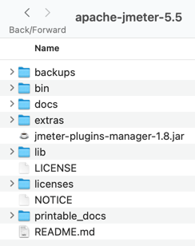

- bin 二进制文件目录，包括配置文件、启动文件、启动jar包、示例脚本。比如Windows和Linux系统的两个启动脚本
- docs API离线帮助文档。
- extras 辅助功能，可用于Ant、Jenkins集成。
- lib lib根目录下存放JMeter基础jar包，lib/ext目录下存放第三方或自定义扩展jar包。
- licenses 证书文本文件。
- printable_docs 离线帮助文档。
- LICENSE 证书说明。
- NOTICE 版权声明。
- README 简介。

### 1.6 JMeter 配置

jvm参数优化 不要超过物理内存的四分之一。jmeter/bin目录下，vi jmeter，修改HEAP的size大小，默认1024M，可以设置成2048M
HEAP="-Xms2g -Xmx2g -XX:MaxMetaspaceSize=256m"。

### 1.7 一键运行 JMX

[一键运行 JMX](https://github.com/iewiewiew/jmeter-test)


## 2. 组件教程

### 测试计划列表

目录结构：包括父节点和子节点。根节点是测试计划，子节点包含：线程组、配置元素、监听器、定时器、前置处理器、后置处理器、断言、测试片段。


### 测试组件列表


### 2.1 线程（用户）

进程和线程的关系：“进程是操作系统分配资源的最小单位，线程是程序执行的最小单位”。

JMeter 用户就是线程。

#### 2.1.1 基本线程组

- Thread Group----模拟用户数，每一个线程就相当于一个虚拟的用户
- setUp Thread Group----用于执行测试之前的初始化操作
- tearDown Thread Group----用于执行测试结束之后的回收工作

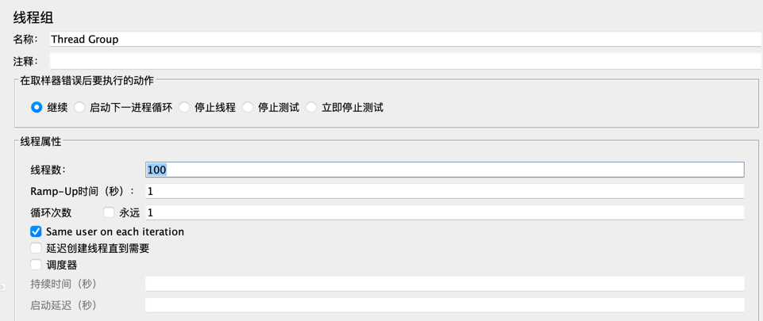

#### 2.1.2 性能相关线程组

注：需安装插件

- bzm - Arrivals Thread Group----到达线程组
- bzm - Concurrency Thread Group----阶梯控制线程数并发（推荐）
- bzm - Free-Form Arrivals Thread Group
- jp@gc - Stepping Thread Group----阶梯控制线程数并发（不推荐）
- jp@gc - Ultimate Thread Group----阶梯控制线程数并发（不推荐）

**1、线程组（Thread Group）**
- 线程数：${thread_count}
- 循环次数：${load_count}
- 持续时间(秒)：${load_time}
- 启动延迟(秒)：${delay_time}

怎样计算 Ramp-up period 时间？  
Ramp-up period 是指每个请求发生的总时间间隔，单位是秒。如果 Number of Threads 设置为5，而 Ramp-up period 是10，那么每个请求之间的间隔就是10／5，也就是2秒。Ramp-up period 设置为0，就是同时并发请求。

**2、阶梯控制线程数并发（bzm - Concurrency Thread Group）**
- 目标并发数：${target_num}  
- 加速时间：${ramp_up_time}  
- 加速步骤计数：${ramp_up_step_count}  
- 保持目标费率时间：${hold_time}

参数说明
- target concurrency：目标并发数
- ramp up time（min）：加速时间
- ramp-up steps count：加速步骤计数
- hold target rate time（min）：保持目标费率时间
- thread iterations limit：线程迭代次数限制
- log threads status into file：将线程状态记录到文件

举例
- 100个线程组，加速时间为5分钟，10个加速步骤，保持目标费率10分钟：
- 10个加速步骤，每步10个线程组；
- 5分钟/10步=0.5，每步0.5分钟；即每0.5分钟加载十个线程组，直到达到100个；
- 达到100个线程组之后，所有这些线程组将继续运行，加压十分钟。


- 一个线程组内的多个请求是顺序执行的
- 不同线程组内的请求是并行执行的


### 2.2 组件


#### 取样器
1. 正则表达式提取器
   Cookie 示例

```
Set-Cookie: XXL_JOB_LOGIN_IDENTITY=7b226964223a312c22757365726e616d65223a2261646d696e222c2270617373776f7264223a226531306164633339343962613539616262653536653035376632306638383365222c22726f6c65223a312c227065726d697373696f6e223a6e756c6c7d;
```

正则表达式：Set-Cookie: (.*);Path=/;HttpOnly
注意1：如果 cookie 前面带着空格，则正则里面也加一个空格即可
注意2：把 HTTP Cookie 管理器放到请求的上面而不是里面（迷惑？）
添加 DeBug Sampler 查看是否提取成功

正则表达式提取器：右键添加 --> 后置处理器 --> 正则表达式处理器

正则表达式为："token":"(.+?)"   /  TOKEN:(.+?)"}  （token 表示 key 名）
模板：$1$

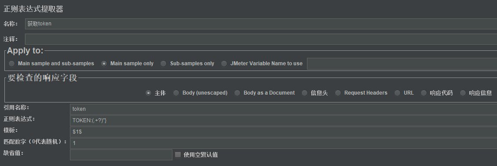

2. JSON 提取器

**1、添加 JSON 提取器**

1、添加 JSON 提取器
在线程组右键 > 添加 > 后置处理器 > JSON 提取器 （注：JSON 提取器要放在需要提取响应的接口后面）

2、JSON 提取器参数说明
- Names of created variables：这是提取值后存储的变量名，用于后面的引用
- JSON Path expressions：JSON path 表达式，详细看下方
- Match No.（0 for Random）：0随机；n 取第几个匹配值；-1匹配所有，后续引用用 变量名_N 取第 N 个值
- Default Values：可以给 error 也可以给0，根据情况调整

**2、JSON path 表达式**

JSON 串 []表示对象组成的数组，{}表示对象。
例如要获取 id，可写$.data.id，$表示根元素，然后一级级属性往下去找，先找到 data，再往下子节点找到 id；也可写$..id，直接从根元素去递归查找到 id；如果只有1级目录，直接$.msg 即可；获取 token 同理。
可设置查看格式为 JSON Path Tester，在下方进行 JSON 路径表达式测试。

**3、JSON path 提取多个值**

JSON 路径表达式，分号隔开。  
注意：下面所有参数都得是\**;\**的格式，否则会出现越界的报错！

```
data[-1] ：获取所有数据
$data.data[-1].initTransNo

提取多个值
比如要提取 items 列表里所有的 friendId
$..friendId
$..[*].friendId
$.data.items[*].friendId
```

测试 JSON 提取器

在查看结果树页面，选择某一条测试结果，切换选择到 JSON Path Tester，在 JSON Path Expression 中输入提取规则，例如：$.data[*].displayName 即可查看结果

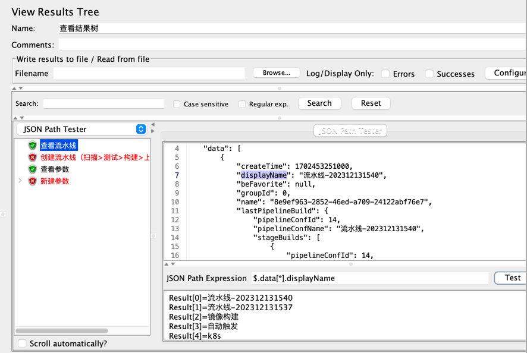

3. OS 进程取样器 
   返回码0表示成功，1表示失败，128也是表示失败（1和128的区别是？）

4. SSH Command

在选项 > Plugins Manager 搜索 SSH 插件进行安装并重启 JMeter
在线程组右键 > 添加取样器 > 选择 SSH Command，填写 Hostname、Port、User Name、Password 等信息

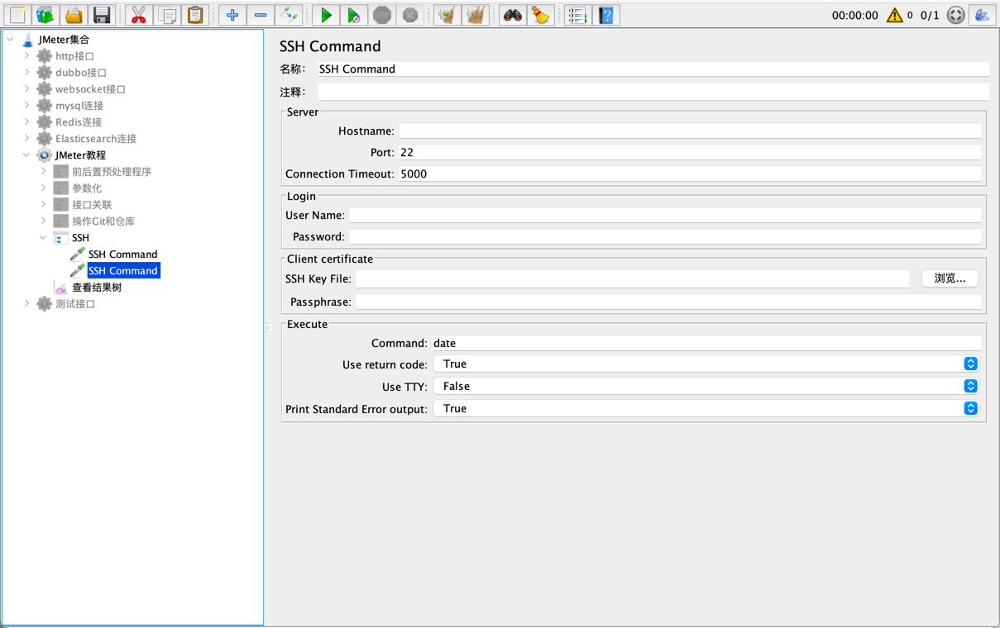


#### 逻辑控制器

1. Include控制器

添加Include控制器，选择测试计划，可使用相对路径或者绝对路径，下面的例子 baidu.jmx 是一个测试片段。


2. IF 控制器

右键添加 > 逻辑控制器 > 如果（If）控制器，注意勾选2个方框  
判断 true 或者 false，可用做判断上一个请求是否成功来决定是否走下一个请求  
${__groovy('${title}'=='张三',)}  

注意：  
1、条件判断语句若是字符串，则需要用引号包围参数，如："user" == "test001"；  
2、If Controller 之下的请求才会受到 If 控制器的约束，若是平级则不会受约束，因此建议将业务请求放在 If 控制器之下进行测试。

3. 吞吐量控制器（Throughput Controller） 

参数说明
- Total Executions（执行总次数，N 为整数）
- Percent executions（执行百分比，N 为1-100整数）
- Per User ：是否针对每个用户，在线程数为1的情况下，勾不勾选，执行效果一样
- Per User：表示是否要在每个线程组上单独应用控制器的设置。比如说，如果在
- Total executions 模式下填写了50的吞吐量，
勾选了 Per User，那么控制器的子元件会执行线程数 * 50次；
不勾选 Per User，那么控制器的子元件会执行50次。
百分比模式下的执行次数：线程数循环次数（N/100）

踩坑：设置的总数必须是可以除出整数的，如果除不尽就会报错。

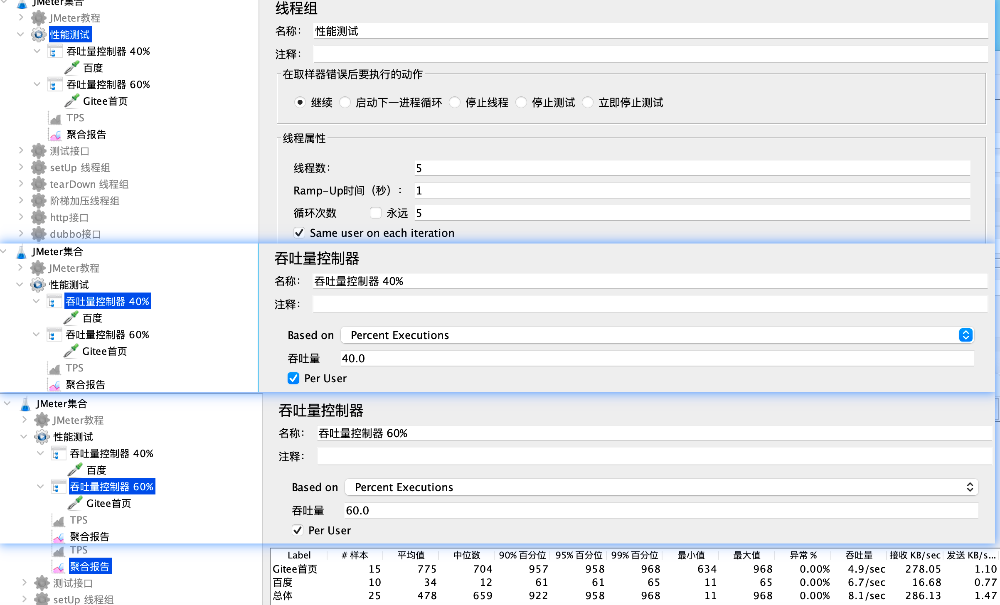

4. 权重控制器（Weighted Switch Controller）  

搜索：Weighted Switch Controller

注意：在权重控制器下添加请求，此页面自动加载请求列表；设置线程组循环次数，权重才有效（感觉不太合理？）

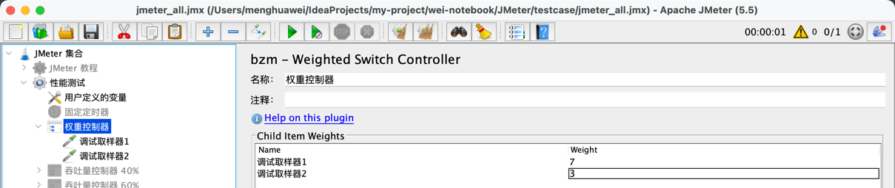

5. 临界部分控制器

临界部分控制器确保其子元素（取样器/控制器等）每次只允许一个线程执行，不允许并行执行，功能类似同步锁。（按顺序执行）


#### 前后置处理器

**JMeter 预 & 后置处理程序 Beanshell**

**1、beanshell 是什么**

JMeter BeanShell 是 JMeter 中的一个组件，用于在测试计划中添加 BeanShell 脚本。BeanShell 脚本可以在 JMeter 中用于许多不同的任务，例如动态生成测试数据、计算测试结果、修改请求参数等。

BeanShell 组件允许用户编写 BeanShell 脚本，并在测试计划中使用这些脚本。用户可以通过预处理器、后处理器、断言、监听器等组件来指定 BeanShell 脚本的执行方式。

**beanshell 的使用场景**

- 操作变量
- 操作属性
- 自定义函数
- 引用外部 java 文件
- 引用外部 class 文件
- 引用外部 Jar 包
- 其它用法(接受参数， log 等)

**2、预处理程序 beanshell**

1. 添加 jar 包：在测试计划右键 --> 添加目录或 jar 包到 ClassPath

2. 添加 BeanShell 预处理程序  /  BeanShell 后置处理程序

```
import encryption;  //import 加密解密的类

encryption e = new encryption();
String name = e.add("我是原始入参"); //入参
log.info(name); //打印日志

vars.put("parameter",name);//需要使用该命令，把加密后的参数放到 parameter 中，供发起请求后使用。
```

3. 将 parameter 作为参数传给 idCardNo

**3、后置处理程序 beanshell**

```
import org.apache.jmeter.samplers.SampleResult;
// 获取取样器结果
SampleResult result = ctx.getPreviousResult();
// 获取请求头
String RequestHeaders = result.getRequestHeaders();
// 获取响应头
String ResponseHeaders = result.getResponseHeaders();
// 获取响应码
String responseCode = result.getResponseCode();
// 获取响应数据
String responseData = result.getResponseDataAsString();
// 获取 url
URL url = result.getURL();
log.info("请求头：" + RequestHeaders);
log.info("响应头：" + ResponseHeaders);
log.info("响应码：" + responseCode);
log.info("响应体：" + responseData);
```

**4、在 beanshell 里生成随机数**

```
String[] str= new String[]{"张三", "李四", "王五"};
Random random = new Random();
int i = random.nextInt(str.length);
vars.put("str",str[i]);
log.info("随机字符:" + str[i])
```

**5、beanshell 引入 java 类**

```
注：可使用
注：IDEA 打 jar 包时一定要有个 main 方法的 java 类，这个 main 方法可以是只有一个输出语句就行
注：有时 new 一个对象出来不可行(迷惑)

addClassPath("D:\\software\\IdeaProjects\\wei-notebook\\jmeter\\jar 包\\java-generator.jar");

import cn.binarywang.tools.generator.*;
import cn.binarywang.tools.generator.bank.BankCardNumberGenerator;

String generatedName = ChineseNameGenerator.getInstance().generate();
vars.put("generatedName",generatedName);
log.info("姓名：" + generatedName);

String generatedName2 = ChineseNameGenerator.getInstance().generateOdd();
vars.put("generatedName2",generatedName2);        
log.info("姓名2：" + generatedName2);

String idCard=ChineseIDCardNumberGenerator.getInstance().generate();
vars.put("idCard",idCard);
log.info("身份证：" + idCard);

String generatedMobileNum= ChineseMobileNumberGenerator.getInstance().generate();
vars.put("generatedMobileNum",generatedMobileNum);
log.info("手机号：" + generatedMobileNum);

String generatedEmail= EmailAddressGenerator.getInstance().generate();
vars.put("generatedEmail",generatedEmail);
log.info("邮箱：" + generatedEmail);

String bankCardNo= BankCardNumberGenerator.getInstance().generate();
vars.put("bankCardNo",bankCardNo);
log.info("银行卡号：" + bankCardNo);

String generatedAddress= ChineseAddressGenerator.getInstance().generate();
vars.put("generatedAddress",generatedAddress);
log.info("地址：" + generatedAddress);

String issueOrg=ChineseIDCardNumberGenerator.generateIssueOrg();
vars.put("issueOrg",issueOrg);
log.info("机关：" + issueOrg);
```


#### 定时器

**1、固定定时器**
JMeter 中的定时器类似于 loadrunner 中的 pacing 值和 think_time。
1、定时器是在每个 sampler（采样器）之前执行的，而不是之后
2、定时器是有作用域的；当执行一个 sampler 之前时，所有当前作用域内的定时器都会被执行。且所有的 sampler 执行前都会执行定时器
3、如果希望定时器仅应用于其中一个 sampler，则把该定时器作为子节点加入
常用的定时器
1、固定定时器：设置一个固定的延迟时间，单位 ms
2、同步定时器（synchronizing timer）：在该定时器处，使线程等待，一直到指定的线程个数达到后，再一起释放。可以在瞬间制造出很大的压力。它和 loadrunner 的集合点差不多的功能
3、常量控制器：可以控制每分钟 tps 的总量，限制最高
2、吞吐量整形定时器（jp@gc - Throughput Shaping Timer）
参数说明：
Start RPS ：开始运行 RPS，开始后马上加载此数量的请求。
End RPS ：结束时 RPS， 以此数为 RPS 最高控制点，目标是不超过此值，一般来说会在此值附近浮动。
Duration,sec： 线程运行时长。
Per User
若勾选，每个线程会单独计算执行频率
若不勾选（默认），所有线程统一计算执行频率


#### 监听器

踩坑：三个监听器取其一，否则会出现后面的监听器拿不到数据的情况。
**1、每秒事务数（jp@gc - Transactions per Second）**
TPS：每秒事务数，监控整体趋势、实时平均值走向、稳定性。

**2、单位时间内活动的线程数（jp@gc - Active Threads Over Time）**
阶梯加压线程组需要和 Active Threads Over Time(单位时间内活动的线程数)结合起来，这样能看到动态的阶梯加压效果。

**3、事务响应时间（jp@gc - Response Times Over Time）**
TRT：事务响应时间，监控查看响应时间的实时平均值、整体响应时间走向等。

**4、聚合报告**

- Label：每个 JMeter 的 element（例如 HTTP Request）都有一个 Name 属性，这里显示的就是 Name 属性的值
- Samples：请求数——表示这次测试中一共发出了多少个请求，如果模拟10个用户，每个用户迭代10次，那么这里显示100
- Average：平均响应时间——默认情况下是单个 Request 的平均响应时间，当使用了 Transaction Controller 时，以 Transaction 为单位显示平均响应时间
- Median：中位数，也就是 50％ 用户的响应时间
- 90% Line：90％ 用户的响应时间
- Min：最小响应时间
- Max：最大响应时间
- Error%：错误率——错误请求数/请求总数
- Throughput：吞吐量——默认情况下表示每秒完成的请求数（Request per Second），当使用了 Transaction Controller 时，也可以表示类似 LoadRunner 的 Transaction per Second 数
- KB/Sec：每秒从服务器端接收到的数据量，相当于 LoadRunner 中的 Throughput/Sec
一般而言，性能测试中我们需要重点关注的数据有：#Samples 请求数，Average 平均响应时间，Min 最小响应时间，Max 最大响应时间，Error% 错误率及 Throughput 吞吐量。


#### 断言

响应断言


JSON断言


## 3. 使用教程

### 命令规范

压测执行相关参数通过定义 JMeter 属性
在 JMeter 的“用户定义的变量”中定义变量 total_tps（表示混合压测总 TPS）  

- 变量名：total_tps 
-  变量值：${__P(p_total_tps,)} 注意：此处的属性名根据命令行传入名称填写,在执行压测时使用如下命令将参数传入，
  `jmeter -n -t test.jmx -Jp_total_tps=50`


### 参数化

在测试计划添加全局变量


工具 > 函数助手

- CSV文件读取：${_CSVRead(/tmp/a.text,0,)}
- 随机数：${_Random(1,100,)}
- 随机字符串：${_RandomString(8,abcd,)}
- 时间戳 ${_time(,)} 格式yyy-MM-dd HH:mm:ss
- 生成唯一UUID:${_UUID} 全局不重复的字符串

添加随机数变量： ${__Random(1,100,var_name)}

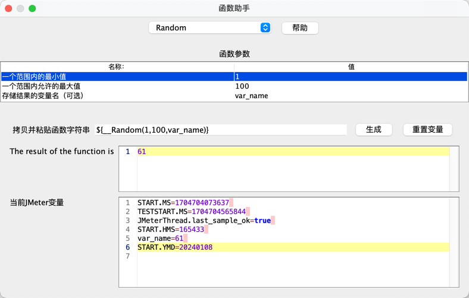


### 连接数据库

1、JMeter 连接 MySQL

**1.1、导入 JDBC 驱动包**  
在测试计划（Test Plan）下面把 jdbc 驱动包导入。  
MySQL5.7 导入版本： [mysql-connector-java-5.1.38.jar](jar/mysql-connector-java-5.1.38.jar)  
MySQL8 导入版本：[mysql-connector-java-8.0.19.jar](jar/mysql-connector-java-8.0.19.jar)

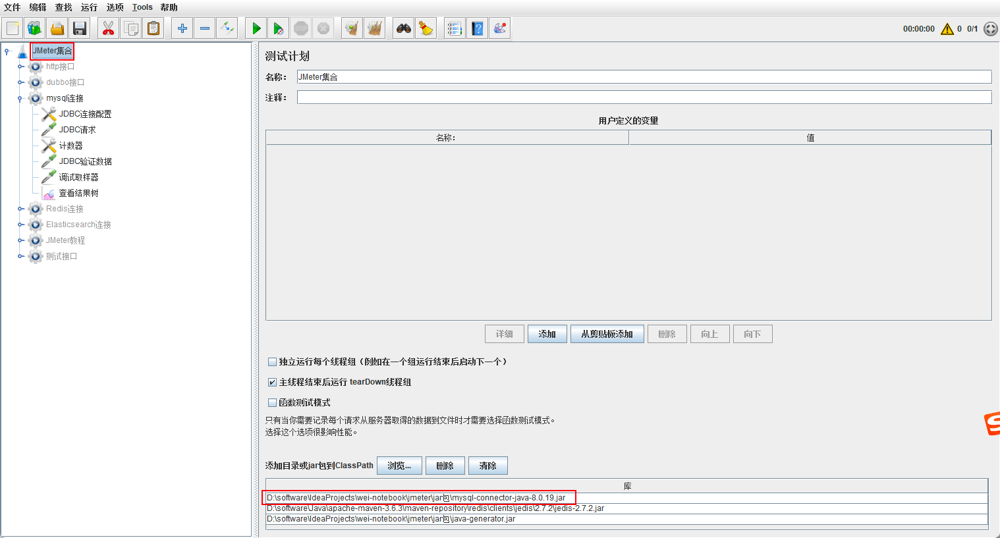

**1.2、添加 JDBC 连接配置**
线程组下添加一个配置元件 JDBC Connection Configuration。

```
1、Variable Name for created pool：自定义参数，在 JDBC Request 中会用到；

2、Database URL：jdbc:mysql://127.0.0.1:3306/dbname?allowMultiQueries=true&useUnicode=true&serverTimezone=GMT；
参数说明
allowMultiQueries=true：一次性执行多个 SQL 语句，每个 SQL 语句以分号（;）隔开，且 QueryType 一定要选择 Callable statement；
useUnicode=true：解决中文乱码输入问题；
serverTimezone=UTC：UTC 是统一标准世界时间，若不添加，查询时间参数可能会报错；

3、JDBC Driver Class：com.mysql.jdbc.Driver 或者 com.mysql.cj.jdbc.Driver；
注意：如果 mysql 版本是8.x 的，驱动类是：com.mysql.cj.jdbc.Driver；

4、Username：数据库用户名；

5、Password：数据库密码；
```


**1.3、添加 JDBC 请求**
添加一个 Sampler：JDBC Request，加个调试取样器和察看结果树。
注：JDBC Connection Configuration 和 JDBC Request 的 Variable 保持一致。

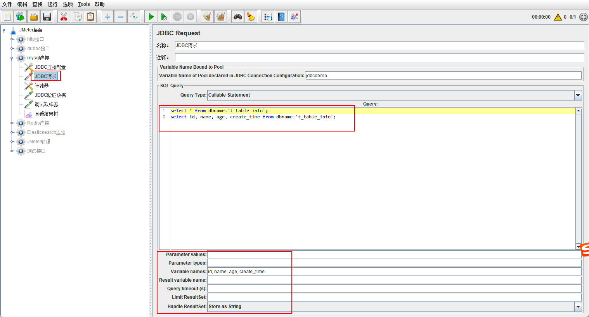

```
# 查询 SQL
select * from dbname.`t_table_info`;
select id, name, age, create_time from dbname.`t_table_info`;

# 变量名
id, name, age, create_time
```

**1.4、计数器**

```
# 计数器
Starting value：1
递增：1
Maxinum value：${id_#}  # 获取数据最大条数
引用名称：index  # 设置一个计数器变量，用于后面循环获取数据
```


可在线程组里面的循环次数添加数据总条数，以此来循环获取数据库所有数据。


**1.5、JDBC 验证数据**

```
{
    "id":"${__V(id_${index},)}",
    "name":"${__V(name_${index},)}",
    "age":"${__V(age_${index},)}",
    "create_time":"${__V(create_time_${index},)}"
}
```

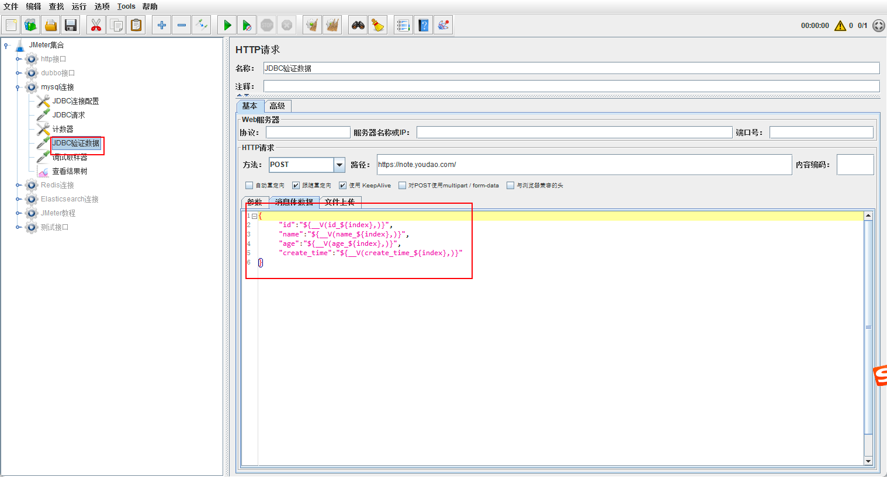

**1.6、调试取样器**


**2、JMeter 连接 PostgreSQL**

[JDBC PostgreSQL 驱动下载](https://jdbc.postgresql.org/download/)

与【JMeter 连接 MySQL】类似，区别如下：
```
1、Database URL：jdbc:postgresql://127.0.0.1:5432/postgres

2、JDBC Driver class：org.postgresql.Driver
```

**3、JMeter 连接 Redis（2023.03.14实践未成功）**

[JMeter 插件下载地址](https://jmeter-plugins.org/install/Install/)

[](jar/jmeter-plugins-manager-1.8.jar)

由于 jmeter 本身并没有带有 Redis 的测试入口，我们需要去安装 Redis 插件。  
首先，我们下载 jmeter-plugins-manager-1.6.jar 文件，放到 jmeter 的 lib 的 ext 文件夹中，然后重启 jmeter。  
然后，在`选项`菜单下，点击`plugin manager`，打开插件管理弹窗，选择`Available Plugins`，在搜索框中，输入 Redis。  
然后，选中`Redis Data Set`，点击`Apply Changes and Restart JMeter`带自动下载后重启 jmeter。  
然后，在 jmeter 的线程组上右键，添加 > 配置元件 > jp@gc - Redis Data Set。


### 读取 csv 文件

1、添加 CSV 数据文件设置

在线程组右键 > 添加 > 配置元件 > CSV 数据文件设置

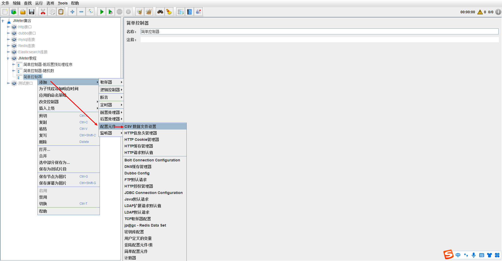

2、CSV 配置

- 文件名：CSV 文件路径
- 文件编码：UTF-8
- 变量名称：CSV 表头
- 忽略首行：True False
- 分割符：英文逗号


### 测试 Dubbo 接口

**参考资料**  
[dubbo 插件常见问题](https://github.com/thubbo/jmeter-plugins-for-apache-dubbo/wiki/FAQ)

**插件配置**

[jmeter-plugins-for-apache-dubbo 下载地址](https://github.com/thubbo/jmeter-plugins-for-apache-dubbo/releases)  

将下载压缩包解压后，将 dist 文件夹下的 `jmeter-plugins-dubbo-x.x.x-jar-with-dependencies` 放置到 /jmeter/lib/ext 下，重启 JMeter 即可。注意：当前脚本需要 2.7.4.1 版本的依赖包。

**基本参数**

dubbo 参数：
zookeeper IP:port
接口+方法+参数(paramType 即方法参数，paramValue 即参数值)

**具体例子 **  
zk 地址：127.0.0.1:2181  
接口：test1/com.demo.api.service.ProjectInfoService 接口方法：listByPage  
参数：com.demo.api.dto.req.ProjectInfoReq 参数值：{ "capCode": "demo" }  #注意：如果 value 是数字，也要看类型，如果是字符串则需要加双引号，否则会报错

如何找接口：  
先在代码里面找到 xxxService，再找到对应的方法，方法里面就是参数，通过 IDEA 点击进去，一般是 req 或者 String，  
注意:获取的是 req 整个包路径，参数就是 req 里面的参数

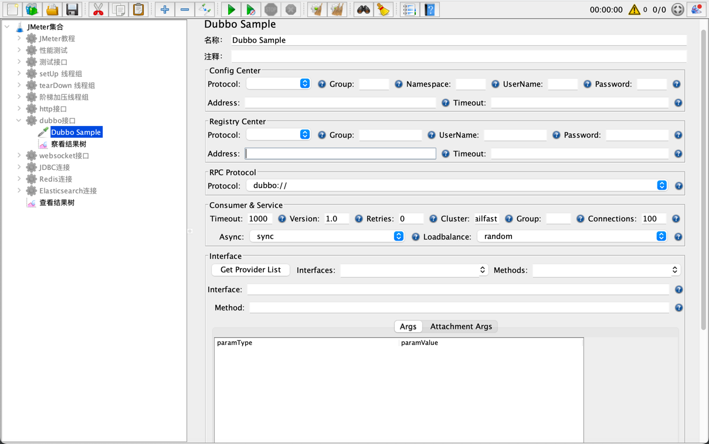

各参数说明如下：
- Protocol：注册协议，包括 zookeeper、multicast、Redis、simple；
- Address：注册地址，dubbo 服务的 IP+Port：
  ①、当使用 zk，address 填入 zk 地址，集群地址使用"，"分隔；
  ②、使用 dubbo 直连，address 填写直连地址和服务端口；
- Protocol：使用的 dubbo 协议，包括 dubbo、rmi、hessian、webservice、memcached、redis，根据自己的协议类型选择对应的选项即可；
- Timeout：请求超时时间，单位 ms，根据 dubbo 具体配置填写；
- Version：版本，dubbo 不同版本之间差异较大，不同版本之间不能互相调用，这里指定 dubbo 版本，是为了方便识别和说明；
- Retries：异常重试次数（类似这种分布式服务通信框架，大多都有重试机制，是为了保证事务成功率）；
- Cluster：集群类型，包括 failover、failfast、failsafe、failback、failking；
- Group：组类型，如果有的话，根据配置填写即可；
- Connections：连接数，同上，根据配置填写；
- Async：服务处理类型，包括 sync（同步）、async（异步），根据配置填写；
- Loadbalance：负载均衡策略，包括 random（随机）、roundrobin（轮询）、leastactive（最少活跃数）、consistenthash（一致性哈希）；
- Interface：接口名（因为 dubbo 服务大多是开发根据规范自行命名的，因此这里需要填写完整的接口名+包名）；
- Method：当前接口下的方法名，按照开发提供的 API 文档填写即可；
- Args：接口报文，根据 API 文档填写，如上图所示，添加输入行，输入对应的参数类型和值即可（参数类型和值如何定义填写，请参考上面的链接）；
  ①、paramType：参数支持任何类型，包装类直接使用 java.lang 下的包装类，小类型使用：int、float、shot、double、long、byte、boolean、char，自定义类使用类完全名称；
  ②、paramValue：基础包装类和基础小类型直接使用值，例如：int 为1，boolean 为 true 等，自定义类与 List 或者 Map 等使用 json 格式数据；

**注意点**

调用 dubbo 接口时需要确保调用平台(consumer)和服务提供平台（provider）网络是联调的，光是能连接到注册中心（zookeeper）是不够的，因为注册中心只是告诉调用者提供者的地址而已。  
检测端口是否开放：telnet ip 端口，举例：telnet 127.0.0.1 20880（可在 dubbo-admin 查看端口），ls 查看接口


### 函数

**1、JMeter 函数助手**

Tools --> 函数助手对话框（注：一般在选项，但是我的 JMeter 在 Tools）

**2、JMeter 函数**

```
随机生成1到100之间的数值
${__Random(1,100,)}

根据字符串"哈哈嘻嘻呵呵啦啦"随机取3个字符
${__RandomString(3,哈哈嘻嘻呵呵啦啦,)}
```

在 beanshell 里面获取随机数

```
String[] str= new String[]{"张三", "李四", "王五"};
Random random = new Random();
int i = random.nextInt(str.length);
vars.put("str",str[i]);
log.info("随机字符:" + str[i])
```

### 上传文件

1、勾选对 POST 使用 multipart/form-data

2、参数：具体接口的参数

3、文件名称：上传文件的路径

4、参数名称：具体接口的参数，一般是 file

5、MIME 类型：multipart/form-data

### 下载文件

在下载文件接口后面添加 beanshell

```
import java.io.*;

byte[] result = prev.getResponseData(); //这个是获取到请求返回的数据，prev是获取上个请求的返回

String file_name = "/.tmp/artifact_BUILD_ARTIFACT.tar.gz"; //代表存放文件的位置和文件名

File file = new File(file_name);

FileOutputStream out = new FileOutputStream(file);

out.write(result);

out.close();
```

### 生成 CSV 测试报告

注：csv 需要写绝对路径

```
/Users/menghuawei/software/apache-jmeter-5.5/bin/jmeter -n -t jmeter_all.jmx -l result.jtl -e -o `date +%Y%m%d%H%M%S` -Jcsv.output.dir=/Users/menghuawei/IdeaProjects/my-project/wei-notebook/.tmp/tmp
```

### 非 GUI 执行

1. 非 GUI 执行添加参数

```
添加 beanshell 后置处理器
${__setProperty(demo1,"demo1",False)};
${__setProperty(demo2,${demo2},False)}; 

引用变量
${__P(demo1)} ${__P(demo2)}

执行 jmx 时候传参
${__P(url,)}

举例
/Users/menghuawei/software/apache-jmeter-5.5/bin/jmeter -n -t jmeter_demo.jmx \
-l result.jtl -e -o `date +%Y%m%d%H%M%S` \
-Jurl=http://www.666.com
```

2. 调试脚本

把 bin/jmeter.properties 的 jmeter.save.saveservice.output_format=xml 配置为 xml 格式，将集群全部的 /bin/下的 jmeter.properties 文件，搜索 mode=Standard 并打开，若不打开，则集群模式下不会返回具体的详细信息。执行命令 jmeter -n -t demo.jmx -l result.jtl  直接导出 result.jtl， 在 jmeter 的 gui 模式下，导入查看结果树进行错误信息的查看。

### 二次开发

**开发步骤**
- 创建 Maven 项目：使用 IDEA 创建一个 Maven 项目
- 添加依赖：在项目的 pom.xml 中依赖 ApacheJMeter_java、ApacheJMeter_core，注意与使用的 JMeter 版本保持一致，依赖见附件
- 自定义函数：
- 添加自定义函数，继承 AbstractFunction 类，并覆写其4个方法
- execute 方法：添加插件逻辑
- getReferenceKey 方法：返回自定义名称函数，用于在 JMeter 中调用
- setParameters 方法：获取传递的参数
- getArgumentDesc：返回参数描述
- 注意，自定义函数必须在*.functions 包下
- 打包：使用 Maven 工具将插件打包成.jar 文件，在项目下的 target 目录中
- 发布：将打包的.jar 文件拷贝到 JMeter 安装目录的 lib/ext 目录中
- 重启 JMeter：重新启动 JMeter，此时就可以 JMeter 中使用.jar 包中自定义的函数

添加依赖
```
<dependencies>
    <dependency>
        <groupId>org.apache.jmeter</groupId>
        <artifactId>ApacheJMeter_core</artifactId>
        <version>5.3</version>
    </dependency>

    <dependency>
        <groupId>org.apache.jmeter</groupId>
        <artifactId>ApacheJMeter_java</artifactId>
        <version>5.3</version>
    </dependency>
</dependencies>
```


## 4. 知识碎片

1、问题一

```
执行 jmeter -n -t demo.jmx 报错：main ERROR Unable to locate appender "jmeter-log" for logger config "root"
原因：<Jmeter 安装目录>/bin/log4j2.xml 的日志目录错误
错误：<File name="jmeter-log" fileName="/software/apache-jmeter-5.5/bin" append="false">
正确：<File name="jmeter-log" fileName="/software/apache-jmeter-5.5/bin/jmeter.log" append="false">
```

2、问题二  
设置线程组的持续时间时，循环次数勾永远（循环次数和持续时间，谁先结束就以谁为准）
设置循环次数，就会非常非常慢，为啥？

3、问题三
使用 Nginx 代理访问 JMeter 测试报告，浏览器也会有缓存，清空缓存或者使用无痕浏览器访问即可。

4、查看结果树生成CSV指定相对路径无效
可以使用相对路径名或绝对路径名来指定文件名。相对路径是相对于当前工作目录（默认为 bin/目录）解析的。JMeter 还支持相对于包含当前测试计划（JMX 文件）的目录的路径。如果路径名以~/开头（或 jmeter.save.saveservice.base_prefix JMeter 属性中的任何内容），则假定该路径是相对于 JMX 文件位置的。

5、不同的csv内容字段名称不能相同，否则后面引用变量都是第一个

6、File > Merge 合并测试计划


swagger 转换为 jmeter

swagger 文件
https://gitee.com/api/v5/doc_json?from=file

下载 swagger 转 jmeter 文件工具包
wget https://repo1.maven.org/maven2/org/openapitools/openapi-generator-cli/5.3.0/openapi-generator-cli-5.3.0.jar -O openapi-generator-cli.jar

转换 swagger.json 到 jmeter.jmx 文件

java -jar openapi-generator-cli.jar generate -i FeHelper-20240719180245.json -g jmeter --skip-validate-spec
java -jar openapi-generator-cli.jar generate -i gitee.postman_collection.json -g jmeter --skip-validate-spec

Mac 执行 Jmeter 脚本自动闪退 
```
# Failed to write core dump. Core dumps have been disabled. To enable core dumping, try "ulimit -c unlimited" before starting Java again /Users/menghuawei/software/apache-jmeter-5.5/bin/jmeter: line 200: 49141 Abort trap: 6           "$JAVA_HOME/bin/java" $ARGS $JVM_ARGS $JMETER_OPTS -jar "$PRGDIR/ApacheJMeter.jar" "$@"
```

解决：
增大 Java CodeCache 大小，修改 bin/jmeter 脚本：
```
HEAP="-Xms1g -Xmx2g -XX:MaxMetaspaceSize=512m"
JVM_ARGS="-XX:ReservedCodeCacheSize=256m"
```

Mac 环境执行 JMeter 脚本报错如下，已经在 bin/jmeter 脚本加入：JVM_ARGS="-XX:+UnlockExperimentalVMOptions -XX:+UseG1GC -XX:ReservedCodeCacheSize=256m"
仍未解决，如何解决此问题？
```
Error: VM option 'UseG1GC' is experimental and must be enabled via -XX:+UnlockExperimentalVMOptions.
Error: Could not create the Java Virtual Machine.
Error: A fatal exception has occurred. Program will exit.
```
原因：通常是由于 JMeter 使用的 Java 版本不支持所配置的 JVM 参数
解决：安装更高版本的 java
```
brew install openjdk@11
export JAVA_HOME=$(/usr/libexec/java_home -v 11)
export PATH="$JAVA_HOME/bin:$PATH"
java -version
which java
```
