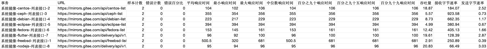
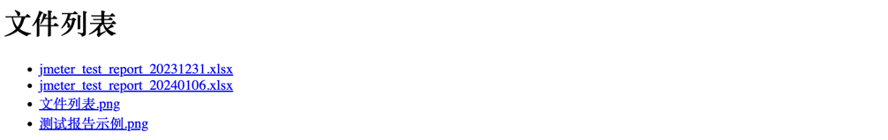

[TOC]

<h1 align="center">JMeter 压测说明文档</h1>

相关文档
- [Gitee 开源镜像站](https://mirrors.gitee.com/#/artifacts/home)


### 1. 使用教程

1. 克隆[仓库](https://github.com/iewiewiew/wei-notebook)   
```
git clone https://github.com/iewiewiew/wei-notebook.git
```

2. 替换参数  

注：当前仓库路径：`/root/jmeter-test`，部分地方不能用家目录以及相对路径，故当前脚本路径固定，执行以下命令替换脚本路径（重要）

- 替换本地文件参数
```
sed -i.bak 's/\/root\/jmeter-test/\/your_dir\/jmeter-test/g' script/*
sed -i.bak 's/\/root\/jmeter-test/\/your_dir\/jmeter-test/g' dockerfile/*
```

- 替换 JMX 参数
```
替换线程数
sed -i.bak 's/num_threads">1/num_threads">2/g' testcase/*.jmx

sed -i.bak 's/ThreadGroup.scheduler">false/ThreadGroup.scheduler">true/g' testcase/*.jmx

替换持续时间
sed -i.bak 's/ThreadGroup.duration">/ThreadGroup.duration">2/g' testcase/*.jmx

sed -i.bak 's/<stringProp name="LoopController.loops">1<\/stringProp>/<intProp name="LoopController.loops">-1<\/intProp>/g' testcase/*.jmx
```

3. 执行脚本
```
cd jmeter-test/script && chmod u+x start.sh && bash start.sh

注：根据本机环境使用 bash start.sh 或者 ./start.sh

后台执行：nohup ./start.sh > output.log 2>&1 &
```

4. 测试报告地址
```
/root/jmeter-test/result/jmeter_test_report_yyyymmdd.xlsx
```

[下载示例测试报告](./result/jmeter_test_report_$(date +%Y%m%d).xlsx)



[下载测试报告](http://127.0.0.1:8888)




### 2. 详细说明

1. 构建 JMeter 镜像

```
docker build --no-cache -t jmeter-test:latest -f Dockerfile-JMeter .
```

2. 运行 JMeter 容器

```
运行容器
docker run -it -d --name mirrors -v /root/jmeter-test:/root/jmeter-test jmeter-test

查看 JMeter 是否可用
docker exec -it jmeter-test sh -c 'jmeter -v'
```

3. 执行 JMX 脚本

```
进入容器执行脚本
docker exec -it jmeter-test sh
jmeter -n -t /root/jmeter-test/testcase/jmeter-test-all.jmx -l /root/jmeter-test/result/all/result.jtl -e -o /root/jmeter-test/result/aa/

在宿主机执行容器内脚本
docker exec -it jmeter-test sh -c "jmeter -n -t /root/jmeter-test/testcase/jmeter-test-all.jmx -l /root/jmeter-test/result/all/result.jtl -e -o /root/jmeter-test/result/all/"
```

4. 运行 Nginx 容器

```
docker run -it -d --name nginx -p 9999:80 -v /root/jmeter-test/nginx/html:/usr/share/nginx/html nginx:latest
```

5. 生成测试报告

- script/jmeter_report.py 处理报告  
  1. statistics.json 转换成 statistics.xlsx
  2. 读取 JMX 获取交易和 URL 写入 CSV
  3. 合并 Excel 和 CSV 生成单个报告
  4. 合并多个 Execl 生成最终测试报告

- 构建处理测试测试报告镜像  

```
docker build --no-cache -t report:latest -f Dockerfile-Report .
```

- 运行处理测试报告容器  

```
docker run -it -d --name jmeter-report -p 8888:8888 -v /root/jmeter-test:/root/jmeter-test jmeter-report:latest
```

- 查看测试报告

```
/root/jmeter-test/result/jmeter_test_report_$(date +%Y%m%d).xlsx
```

- 单独处理下载报告

```
docker build --no-cache -t download:latest -f dockerfile/Dockerfile-Download .
docker run -it -d --name download -p 8888:8888 -v /root/jmeter-test/result:/root/jmeter-test/result download:latest
```

- 发送测试报告到邮箱

```
python /root/jmeter-test/script/jmeter_report_email.py
```


### 3. 知识碎片

1. 查看报告返回 403

报错：`*13 directory index of "/usr/share/nginx/html/" is forbidden`
解决方式：重启 nginx，原因未知

2. 构建镜像卡住

报错
```
=> [2/4] RUN apk add --no-cache bash wget                                                                                                                                                                3327.8s
=> => # fetch http://dl-cdn.alpinelinux.org/alpine/v3.9/main/x86_64/APKINDEX.tar.gz
```
解决方式：在 Dockerfile 增加镜像源
```
RUN echo "https://mirrors.tuna.tsinghua.edu.cn/alpine/v3.9/main" > /etc/apk/repositories
```

3. 当前用户非 root，在容器中执行 JMX 脚本脚本写入文件为 root

解决方式：在 Dockerfile 增加用户切换
```
RUN addgroup -g 993 git
RUN adduser -D -u 996 -G git git

USER git
```

在 Dockerfile 增加配置文件
`COPY config/reportgenerator.properties /apache-jmeter-5.5/bin/`

4. 执行 JMX 报错

```
java.lang.OutOfMemoryError: Java heap space
```

解决：在 bin/jmeter 脚本修改配置 `: "${HEAP:="-Xms1g -Xmx1g -XX:MaxMetaspaceSize=1g"}"`

5. 运行 JMeter 容器报错

```
Java HotSpot(TM) 64-Bit Server VM warning: INFO: os::commit_memory(0x00007f16a8405000, 12288, 0) failed; error='Cannot allocate memory' (errno=12)
```

在 config/jmeter `: "${HEAP:="-Xms1g -Xmx1g -XX:MaxMetaspaceSize=1g"}"` 不能超过宿主机内存

6. 在容器内可访问 html，在浏览器访问 html 报 502

当app.run()中的host参数设置为0.0.0.0时，Flask应用程序将绑定到所有可用的网络接口，使其可以从容器外部访问。

7. 执行 nohup ./start.sh > output.log 2>&1 & 报错 the input device is not a TTY，直接执行 ./start.sh 正常。

报错 "the input device is not a TTY" 表明在执行 `docker exec` 命令时，终端无法识别输入设备为 TTY（终端）。 这是因为在 `docker exec` 命令中使用了 `-it` 参数，它要求命令在一个交互式的终端（TTY）中运行。然而，当使用 `nohup` 命令将脚本放入后台执行时，终端会断开连接，因此无法提供一个交互式的 TTY。 要解决这个问题，可以尝试在 `docker exec` 命令中移除 `-it` 参数，改为使用 `-t` 参数来指定不分配伪终端（pseudo-TTY）。

8. 使用 ${BASE_PATH}/nginx/html 没有挂载成功，原因未知
docker run -it -d --name nginx -p 9999:80 -v /root/jmeter-test/nginx/html:/usr/share/nginx/html nginx:latest

9. 定时任务（使用宿主机 JMeter 环境）

crontab -e

设置任务 4 月 8 号 下午 6 点 30 分执行
30 18 8 4 * nohup /root/jmeter-test/start.sh > /root/jmeter-test/output.log 2>&1 &

ctrl + o  > enter > ctrl + x

查看当前用户的定时任务列表
crontab -l

删除定时任务
crontab -r

踩坑：用 crontab 定时执行 start.sh，start.sh 里面有指定 jmeter 的命令，提示：jmeter command no fund，实际上 jemter 命令是有的，同时报错：Neither the JAVA_HOME nor the JRE_HOME environment variable is defined
At least one of these environment variable is needed to run this program

解决：crontab -e 添加遗下变量，start.sh 脚本使用 jmeter 绝对路径

JAVA_HOME=/root/jmeter-test/package/jdk1.8.0_141
JRE_HOME=/root/jmeter-test/package/jdk1.8.0_141/jre
JMETER_HOME=/root/jmeter-test/package/apache-jmeter-5.5

10. 检查磁盘和缓存大小

```
du -h

free -m

sync
echo 1 > /proc/sys/vm/drop_caches
echo 2 > /proc/sys/vm/drop_caches
echo 3 > /proc/sys/vm/drop_caches
```