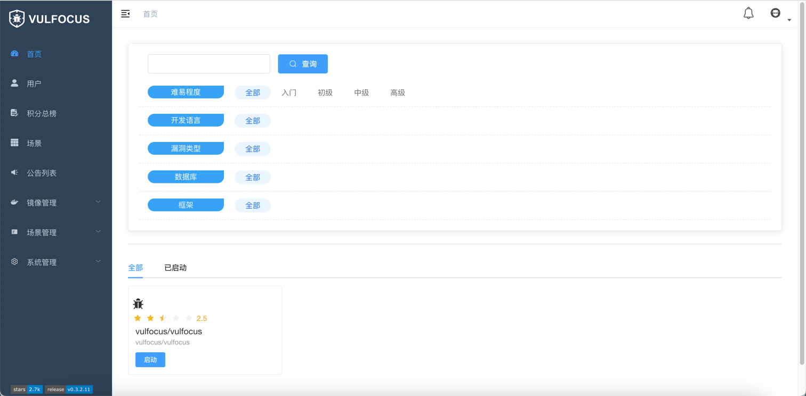

[TOC]


<h1 align="center">Vulfocus</h1>

> By：weimenghua  
> Date：2023.05.30  
> Description：Vulfocus 靶场

**参考资料**  
[Vulfocus 官网](https://fofapro.github.io/vulfocus/)  
[Vulfocus 的 docker 仓库](https://hub.docker.com/u/vulfocus) 


## [一、认识 Vulfocus](https://fofapro.github.io/vulfocus/#/?id=认识-vulfocus)
因为 Vulfocus 一个漏洞集成平台，所以可以无限向里添加漏洞环境没有限制，前提是你的内存足够大。因为漏洞环境是 docker 镜像的原因每次重新启动漏洞环境都会还原，不用出现你会对环境造成破坏下次无法启动的现象。


## 二、Vulfocus 搭建

```
运行容器
docker run -d \
-p 80:80 \
-v /var/run/docker.sock:/var/run/docker.sock \
-e VUL_IP=127.0.0.1 \
vulfocus/vulfocus

访问地址 账号密码：admin/admin
http://127.0.0.1
```



