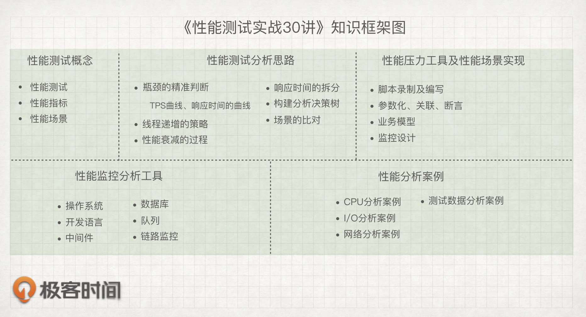
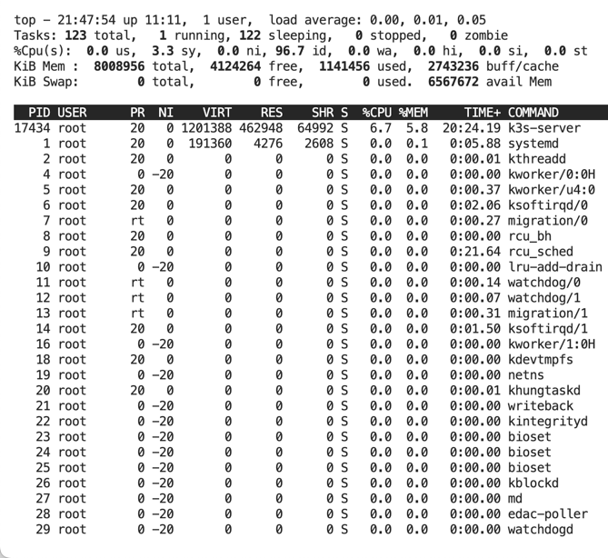

[TOC]

<h1 align="center">性能测试</h1>

> By：weimenghua  
> Date：2023.05.31  
> Description：性能测试

**参考资料**  
[说透性能测试](https://learn.lianglianglee.com/%E4%B8%93%E6%A0%8F/%E8%AF%B4%E9%80%8F%E6%80%A7%E8%83%BD%E6%B5%8B%E8%AF%95)  
[《性能测试实战30讲》](https://time.geekbang.org/column/intro/100042501)  
[《老张的求知思考世界》性能测试系列](https://mp.weixin.qq.com/s/RyxDqVEiOnG4HNlU8NKJww)

## 1. 前言



1. 为什么要做性能测试  
通过工具模拟高并发场景，观察系统各项性能指标，检验系统的响应能力，稳定性是否满足预期，定位性能瓶颈，并给出优化方案。
- 检验系统是否能处理预期情况下的请求数量；
- 检验系统是否能处理非预期情况下的请求数量；
- 检验系统是否能在预期和非预期的情况下保持稳定；

2. “性能测试”不仅仅包括测试，还包括分析和调优。  
性能领域要求的专业技能并不少，发展的宽度和深度完全取决于你自己的意愿。你可以选择只做一个写脚本的工程师，也可以选择成为一个性能调优的专家。从技术范围上说，测试工具、操作系统、开发语言、实现架构、数据库、网络、存储、部署架构等，都是你需要掌握的内容。

## 2. 性能测试流程

1. 性能需求调研  
客户能接受的响应时间，每日单交易处理能力，系统资源利用率，系统环境搭建方式、并发用户数、日交易数量等。

2. 确定业务模型  
根据需求调研，分析哪些交易是每日需要处理使用的功能，哪些交易是月底或者年底需要批量处理，来划分测试交易的等级。

3. 确定测试方案  
测试方案的目的是确定此次系统测试的目的，定义一个性能测试的入口准则，出口准则，并确定测试的交易业务模型、业务指标、测试模型、测试指标，以及发起测试的测试策略、执行策略、监控分析策略、以及测试内容、测试环境、工具、数据、脚本的准备、测试风险策略等。参考：[性能测试方案模板](03.性能测试方案模板.md)

4. 确定测试计划  
制定测试计划的目的是为了约束测试各个活动的起止时间，为性能测试的准备、执行、分析与报告、总结等环节给出合理时间估算。

5. 建立测试环境  
建立测试环境主要是在需求调研后根据实际上线系统环境的网络拓扑结构搭建模拟测试环境，准备测试数据等。

6. 准备测试工具、脚本及测试数据  
根据分析系统架构模式对自动化测试工具选型、对脚本的录制调试以及测试系统存量数据的准备。

7. 准备测试监控工具  
在性能测试的开始前，需要配置完成监控工具，用于监控每个虚拟用户的状态，及时采集交易的响应时间、吞吐量，以及各主机的CPU、I/O和内存等硬件资源利用率信息。

## 3. 性能测试概念

1. 单交易基准测试  
1个用户运行10分钟或者迭代100次；解决可能存在的关联问题和参数化问题。  
VU数：1  
延迟设置：无  
场景加压策略：一次性加压  
场景减压策略：运行完结束  
场景运行时间：100次迭代  

2. 单交易负载测试（梯度拐点加压找并发拐点）  
用户逐渐增加，运行15-30分钟；验证脚本中可能的多线程同步问题。  
VU数：梯度  
延迟设置：无  
场景加压策略：逐渐加压  
场景减压策略：全部退出  
场景运行时间：15分钟  
目标：查找接口最大并发用户数，记录接口在各梯度压力下性能表现  
（执行方案：阶梯加压，每个梯度执行时间120秒，查找在合理资源使用率、满足响应时间阈值要求下的并发拐点）

策略：
- 使用线程组插件jp@gc - Stepping Thread Group 或 jp@gc - Ultimate Thread Group 进行阶梯发压，找到达到拐点的最大并发用户数
- 每个梯度压测时间大于60s，便于观察该梯度数据（每个梯度120s）

拐点特征：
- TPS趋于平稳，或出现下降
- 响应时间超过阈值(简单<100ms，一般<200ms，复杂<300ms)
- Pod资源超限（CPU<=80%，DB CPU<=80%， 内存<=80%）
- 出现交易失败激增

拐点查找方法：  
逐步逼近法(推荐)    
先设定一个预估值进行测试，观察系统的响应情况，然后增加一定的数量，观察系统的变化，直到系统超出我们所预估的值。  
比如，在并发测试的时候，我们先预估设置并发用户为2000，然后以200的速度递增，检查系统的响应时间是否小与3秒，从而找出并发测试的系统拐点，数据如下：  
设置并发数为5000的时候，系统响应时间为3.14秒，超出了可接受范围，不继续增加了，在5000到4800中寻找一个中间值4900进行测试，测试结果为2.94秒，仍旧在可接受的范围之内，寻找4900与5000中的中间点4950进行测试，得到2.99这个结果，非常接近3了，且两次测量值的间隔在50之内（4950-5900=50）

3. 混合压力测试（容量测试）  
执行不同组的TPS，一般为3组，获取TPS、响应时间、资源利用率等随负载变化的趋势  
VU数：根据TPS来计算虚拟用户数  
延迟设置：按设计的思考时间和延迟进行设置  
场景加压策略：逐渐加压（如：每1秒钟增加5个VU）  
场景减压策略：运行完结束  
场景运行时间：1小时  
注：最优的TPS（最优可能是CPU使用率接近指标的最大TPS，如：应用服务器CPU使用率接近60%）。

4. 稳定性测试  
一般是选择最大TPS的80%，长时间持续运行，测试其稳定性，运行8个小时（12个小时、24个小时等）。
VU数：根据TPS来计算虚拟用户数  
延迟设置：按设计的思考时间和延迟进行设置  
场景加压策略：逐渐加压（如：每1秒增加2个VU）  
场景减压策略： 运行完结束  
场景运行时间：8小时  

5. 可恢复性测试   
多台服务器，通过宕掉服务器和再启动服务器检验可恢复性，场景选择几支典型的交易。如果服务器有重连机制，TPS-VU图会随着用户数的稳定，TPS趋于平稳，停止服务器后，TPS下降为0笔/秒，重启服务之后TPS恢复到先前并保持平稳。
VU数：10  
延迟设置：无  
场景加压策略：一次性加压  
场景减压策略： 运行完结束  
场景运行时间：30分钟  

## 4. 性能测试指标

[一文搞清楚，QPS、TPS、并发用户数、吞吐量](https://mp.weixin.qq.com/s/M4WNumSFfKVvp-fjAJG8kg)

1. 吞吐量

在了解qps、tps、rt、并发数之前，首先我们应该明确一个系统的吞吐量到底代表什么含义，一般来说，系统吞吐量指的是系统的抗压、负载能力，代表一个系统每秒钟能承受的最大用户访问量。
一个系统的吞吐量通常由qps（tps）、并发数来决定，每个系统对这两个值都有一个相对极限值，只要某一项达到最大值，系统的吞吐量就上不去了。

2. QPS

Queries Per Second，每秒查询数，即是每秒能够响应的查询次数，注意这里的查询是指用户发出请求到服务器做出响应成功的次数，简单理解可以认为查询=请求request。
qps=每秒钟request数量

3. TPS

Transactions Per Second 的缩写，每秒处理的事务数。一个事务是指一个客户机向服务器发送请求然后服务器做出反应的过程。客户机在发送请求时开始计时，收到服务器响应后结束计时，以此来计算使用的时间和完成的事务个数。
针对单接口而言，TPS可以认为是等价于QPS的，比如访问一个页面/index.html，是一个TPS，而访问/index.html页面可能请求了3次服务器比如css、js、index接口，产生了3个QPS。
tps=每秒钟事务数量

4. RT 

Response Time缩写，简单理解为系统从输入到输出的时间间隔，宽泛的来说，他代表从客户端发起请求到服务端接受到请求并响应所有数据的时间差。一般取平均响应时间。

5. 并发数  

简而言之，系统能同时处理的请求/事务数量。

6. 前端性能指标

- 响应时间：用户视角最优先关注的指标
- 258原则：  
  - 2s以内，很满意  
  - 5s，一般  
  - 8s，无法接受  
  - 前端相应时间：  
  - 前端资源加载渲染的时间  
  - 前后端交互的时间  
  - 前端将后端查询的数据，在页面呈现出来  
  - 网络连接时间：  
  - connect time-连接时间：请求发出到服务端接收到，中间的网络时间  
  - latency-延迟：网络连接时间+服务处理返回的时间  
  - 服务段处理时间=latency - connect time**  

计算公式
TPS = 总tps / （24*3600）

不同层级需要关注的性能指标

| **监控分层**   | **常见关注指标**                                |
| -------------- | ----------------------------------------------- |
| **网络**       | 带宽是否足够、是否有丢包延迟                    |
| **网关**       | 负载均衡                                        |
| **服务层**     | TPS/ART/99RT/Error%/Load/异常/垃圾回收/通信协议 |
| **中间件**     | 超时/线程池/缓存命中/消费速率&消息积压/批处理   |
| **持久化存储** | 锁/索引/慢SQL/命中率                            |
| **硬件服务器** | CPU%/Memory%/Net Work/Disk IO                   |
| **操作系统**   | Swap/内核参数/文件句柄/IO调度                   |

## 5. 性能测试监控

[性能测试监控](./02.性能测试监控.md)

命令行监控  
**1. load average**

```text
load average: 0.12, 0.06, 0.06

三个数字都是代表进程队列的长度，从左到右分别表示一分钟、 五分钟和十五分钟的数据，数字越小压力值就越低，数字越大则压力越高。
负载数值 / CPU 核数在 0.00~1.00 之间表示正常，理想值也是在 0.7 以内。
```

**2. CPU 状态**
```
%Cpu(s):  1.2 us,  0.7 sy,  0.0 ni, 98.1 id,  0.0 wa,  0.0 hi,  0.0 si,  0.0 st

us 列显示了用户进程所花费 CPU 时间的百分比。这个数值越高，说明用户进程消耗的 CPU 时间越多，可以用来分析代码中的 CPU 消耗热点。
sy 列表示系统进程消耗的 CPU 时间百分比。
ni 列表示改变优先级的进程占用 CPU 的百分比。
id 列表示 CPU 处于空闲状态的时间百分比。
wa 列显示了 I/O 等待所占用的 CPU 时间的百分比，这里 wa 的参考值为 0.5，如果长期高于这个参考值，需要注意是否存在磁盘瓶颈。
hi 列表示硬件中断占用 CPU 时间百分比。
si 列表示软件中断占用 CPU 时间百分比。
st 列表示当系统运行在虚拟机中时，当前虚拟机在等待 CPU 为它服务的时间。
```



中间件监控内容及行业标准

- 线程数最小设置50和最大设置200比较合适。
- JDBC最小设置50和最大设置200比较合适。
- JVM最小堆大小和最大堆大小分别设置1024M比较合适。

数据库性能指标

- SQL：执行SQL耗时
- 吞吐量：每秒事务次数（TPS），每秒查询次数（QPS）
- 锁：锁等待次数和锁等待时间
- 命中率：索引缓冲区命中率、线程缓存命中率、表缓存命中率、查询缓存命中率等

## 6. 性能测试分析

参考资料：[性能测试TPS上不去问题分析，思路整理](https://mp.weixin.qq.com/s/BSL-G0mcb6ZG8SuOFXhEOw)

- 网络带宽：当你模拟大量用户发起请求的时候，单位时间内传递的数据包过大，超过了带宽的传输能力，造成网络资源竞争，间接的就导致了服务器接收的请求数达不到服务器的处理能力上限，tps值自然就不会上升。
- 连接池：连接池一般主要有两种，应用服务器连接池配置 和 数据库连接池配置，配置太小，连接数被占满了，新的连接只能等待，tps值也就自然不会再上升。
- 垃圾回收机制：JVM的垃圾回收GC都是基于算法的，如果新生代的Eden和Survivor区频繁的进行Minor GC， 老年代的full GC也回收频繁，那么对TPS就会有影响，因为垃圾回收本身占用一定的资源。
- 数据库配置：对数据库进行的读、写数据操作时，连接数、库表索引、读写分离、数据库主从方案等都有关系
- 通信连接机制：通信连接我们常见的有 串行、并行、长连接、管道连接等
- 硬件资源：服务器硬件资源消耗过高，服务器处理不过来，tps也就上不去了
- 压力机：用jmeter做性能测试，一台机器并不能无上限的虚拟并发用户，想要高并发，可能机器根本虚拟不出预期的用户数，服务器tps自然也就不会上升。
- 压测脚本：我们都知道，性能测试，脚本是一方面，还要有性能场景设计，如果脚本+场景设计不合理，也不会达到预期的效果。
- 业务逻辑：如果被测系统业务耦合度非常高，一个功能相当于在测试整个系统了，这样的系统，tps也高不起来。
- 系统架构：现在比较常见的都是在服务器上会增加缓存机制，缓存的服务器配置、命中率、缓存穿透、缓存过期等等，都会影响性能结果。

排查思路

1. 检查硬件资源
   CPU使用率
   内存使用率

2. 网络状况分析
   宽带带宽
   网络延迟

3. 数据库性能排查
   数据库连接数
   数据库查询优化
