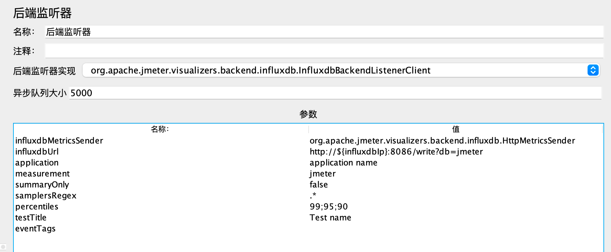
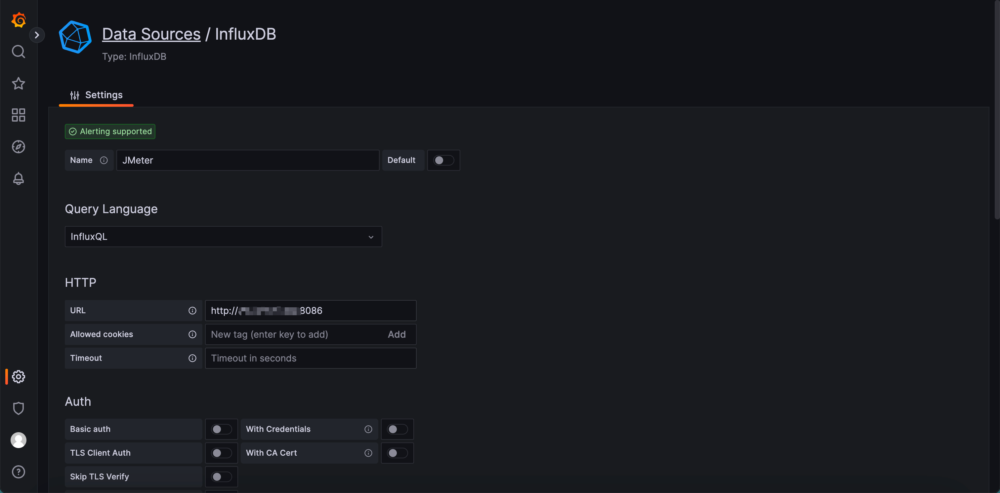
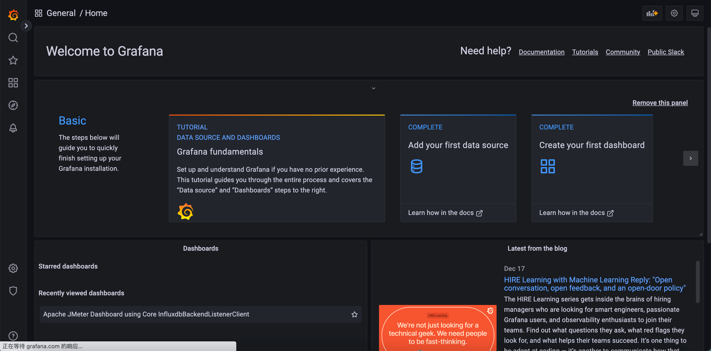
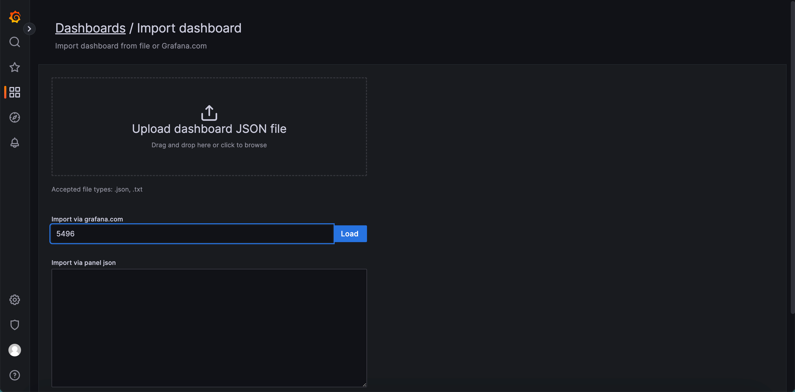
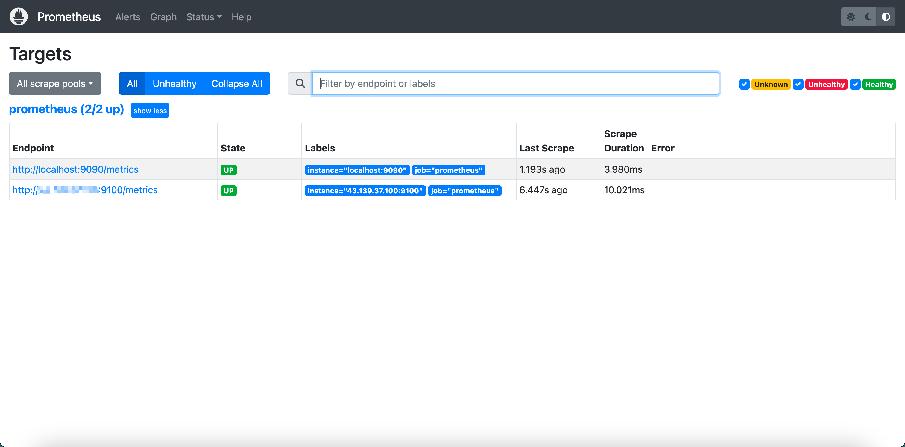
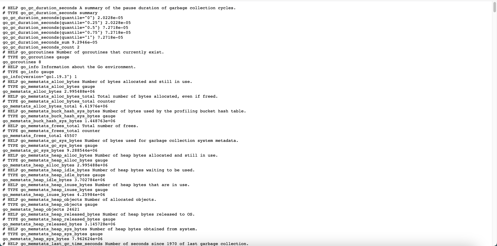

[TOC]

<h1 align="center">性能测试监控</h1>

> By：weimenghua  
> Date：2023.06.02  
> Description：  


## 1. JMeter+InfluxDB+Grafana

- JMeter 压测工具
- InfluxDB 时序数据库，采集 JMeter 压测数据
- Grafana 展示来自 InfluxDB 的数据


[基于 Docker 一键安装监控环境](../../DevOps/Docker/script/install_monitor.sh)

### 1.1 JMeter

**配置【后端监听器】1.x 版本**  
用户定义的变量：`influxdbIp 127.0.0.1`  
后端监听器实现：`org.apache.jmeter.visualizers.backend.influxdb.InfluxdbBackendListenerClient` （注：一定要选择这个）  
influxdbUrl：`http://${influxdbIp}:8086/write?db=jmeter`



**配置【后端监听器】2.x 版本（未实践成功）**  
influxdbUrl：`http://${influxdbIp}:8086/api/v2/write?org=my-org&bucket=jmeter`  
API TOKEN：`HCj4as6ooKLCQX2uvZqrk4LQQTTqTpzb-u1f7PAE3fKQ9YYg7fVp-uFhK5mq1v-P72luDCvJWAs2KXR-WsYVnQ==`  

### 1.2 InfluxDB

[InfluxDB 官网](https://www.influxdata.com/)  
[InfluxDB 可视化页面](http://127.0.0.1:8083)  
[InfluxDB API 端口](http://127.0.0.1:8086/) 



**进入容器操作数据**

```
docker exec -it influxdb bash
influx

插件用户
show users;

创建用户
create user "root" with password 'root' with all privileges;

创建数据库
create database jmeter;

查看数据库
show databases;

切换数据库
use jmeter;

查看表
show measurements;

插入表数据
insert jmeter,key=age value="18";

查看表数据
select * from jmeter;
```

**API 操作数据**

- 创建数据库（POST）：`http://127.0.0.1:8086/query?q=CREATE+DATABASE+%22jmeter%22&db=jmeter`
- 查看数据库： `http://127.0.0.1:8086/query?q=SHOW+DATABASES&db=jmeter`
- 查看表数据： `http://127.0.0.1:8086/query?q=select+*+from+jmeter&db=jmeter`

### 1.3 Grafana

**Grafana 页面**  
访问地址：`http://127.0.0.1:3000/login`  admin / admin



**Grafana 配置**  
配置数据源  
点击左下【设置】> 点击【Configuration】 >  切换到【Data sources】 > 点击【Add data sources】 >  点击【InfluxDB】> 配置如下参数 > 点击【Save & test】  
1、Name：JMeter  
2、HTTP URL：`http://127.0.0.1:8086`  
3、Database：jmeter  


配置仪表盘  
点击左上【仪表盘】图标  >  点击【+ Import】 >  在【Import via grafana.com】输入【5496】> 点击【Load】 > 在 DB name 选择【InfluxDB】数据源 > 点击【Import】  
[JMeter 模板 ID](https://grafana.com/grafana/dashboards/5496-apache-jmeter-dashboard-by-ubikloadpack/) ：5496  



**JMeter 仪表盘**


## 2. Prometheus+Node-Exporter+Grafana

### 2.1 Prometheus

访问地址：http://127.0.0.1:9090/  
在 Target 查看监控数据源：http://127.0.0.1:9090/targets?search=  
在 prometheus.yml 配置 xxx-exporter 的地址  



### 2.2 Node-Exporter

Node-Exporter 页面访问地址：http://127.0.0.1:9100/metrics



### 2.3 Grafana

**Grafana 配置**  
配置数据源
点击左下【设置】> 点击【Configuration】 >  切换到【Data sources】 > 点击【Add data sources】 >  点击【Prometheus】> 配置如下参数 > 点击【Save & test】  
URL：http://127.0.0.1:9090/


**配置仪表盘**
点击左上【仪表盘】图标  >  点击【+ Import】 >  在【Import via grafana.com】输入【[Node-Exporter 模板 ID](https://grafana.com/grafana/dashboards/11074-node-exporter-for-prometheus-dashboard-en-v20201010/)
11074】> 点击【Load】 > 在 VictoriaMetrics 选择【Prometheus】数据源 > 点击【Import】


## 3. Telegraf+Grafana

### 3.1 Telegraf

[Telegraf 源码](https://github.com/telegraf)  
[Telegraf 下载1](https://portal.influxdata.com/downloads/)  
[Telegraf 下载2](https://www.influxdata.com/time-series-platform/telegraf/)  

```
# 获取镜像
docker pull telegraf:alpine

# 获取配置
docker run --rm telegraf:alpine telegraf config > /root/telegraf/telegraf.conf

# 修改配置文件
参考下方 telegraf.conf 配置

# 创建数据库
CREATE DATABASE telegraf

# 启动容器，监控容器宿主机
docker run -d --name=telegraf \
-p 8125:8125/udp \
-v /root/telegraf/telegraf.conf:/etc/telegraf/telegraf.conf:ro \
-v /:/hostfs:ro \
-e HOST_ETC=/hostfs/etc \
-e HOST_PROC=/hostfs/proc \
-e HOST_SYS=/hostfs/sys \
-e HOST_VAR=/hostfs/var \
-e HOST_RUN=/hostfs/run \
-e HOST_MOUNT_PREFIX=/hostfs \
telegraf:alpine
telegraf.conf
[[outputs.influxdb]]
urls = ["http://influxdb:8086"] # influxdb > 具体的 IP 地址
database = "telegraf"
exclude_database_tag = true
username = ""
password = ""

[[inputs.statsd]]
max_tcp_connections = 250
tcp_keep_alive = false
service_address = ":8125"
delete_gauges = true
delete_counters = true
delete_sets = true
delete_timings = true
percentiles = [90.0]
metric_separator = "."
parse_data_dog_tags = false
datadog_extensions = false
allowed_pending_messages = 10000
percentile_limit = 1000
tagexclude = ["metric_type"]
fielddrop = ["count", "stddev", "sum"]

[[inputs.mem]]
fieldpass = ["used_percent", "total"]

[[inputs.disk]]
fieldpass = ["used_percent", "total"]
```

### 3.2 Grafana

Grafana 模板 ID：1443  
Grafana 模板 ID：5955


## 4. 知识碎片

### kube-prometheus

[kube-prometheus](https://github.com/prometheus-operator/kube-prometheus)

[ClickVisual 是一个轻量级的开源日志查询、分析、报警的可视化平台](https://clickvisual.net/zh/clickvisual/)