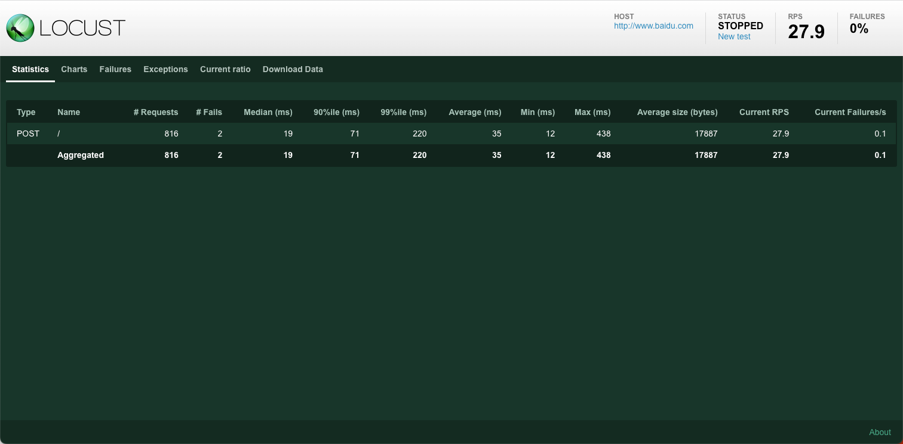

[TOC]

<h1 align="center">Locust 压力测试</h1>

> By：weimenghua  
> Date：2023.05.29.  
> Description：

**参考资料**  
[Locust 官网](https://www.locust.io/)  
[Locust 源码](https://github.com/locustio/locust)


## 一、Locust 简介

Locust 是一种易于使用、可编写脚本且可扩展的性能测试工具。您可以在常规 Python 代码中定义用户的行为，而不是受限于 UI 或仅伪装成真实代码的领域特定语言。这使得 Locust 可以无限扩展并且对开发人员非常友好。


## 二、Locust 用法

**安装 Locust**

```
pip install locust

查看是否安装成功
locust -h
```

**Locust 示例**

```
from locust import HttpUser, between, task

class WebsiteUser(HttpUser):
    wait_time = between(5, 15)

    def on_start(self):
        self.client.post("/login", {
            "username": "test_user",
            "password": ""
        })
    
    @task
    def index(self):
        self.client.get("/")
        self.client.get("/static/assets.js")
        
    @task
    def about(self):
        self.client.get("/about/")
```

**参数说明**  
@task(3)单次执行的次数，可以理解是循环次数，数值越大执行的次数越多。不写默认1次。

**执行脚本**

```
locust -f locustfile.py

locust -f locustfile.py --logfile = locustfile.log
```

**Locust 页面**   
访问地址：http://127.0.0.1:8089/

- Number of users：设置模拟用户数。（并发）
- Spawn rate ：每秒产生（启动）的虚拟用户数。（递增数）
- Host：host 地址。

**查看报告**



