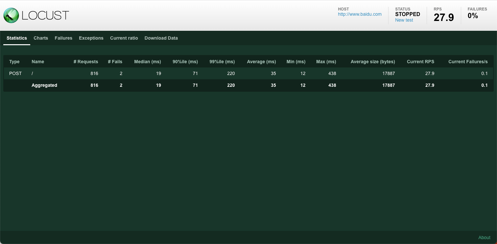
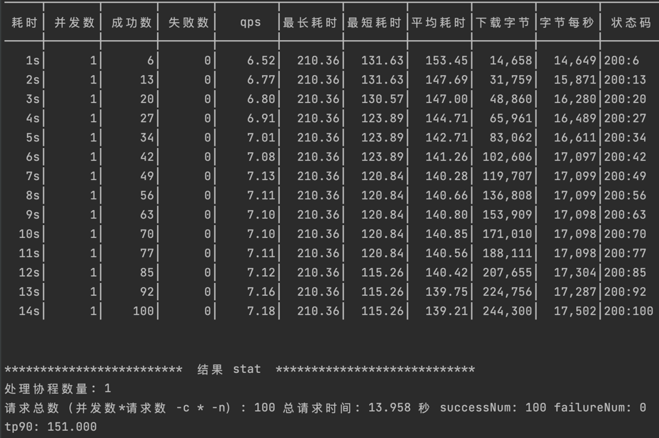

[TOC]

<h1 align="center">压力测试工具</h1>

> By：weimenghua  
> Date：2023.05.29.  
> Description：

**参考资料**  
[Locust 官网](https://www.locust.io/)  
[Locust 源码](https://github.com/locustio/locust)


## 1. JMeter

[JMeter 接口测试](../JMeter/JMeter.md)


## 2. Locust

### 2.1 Locust 简介

Locust 是一种易于使用、可编写脚本且可扩展的性能测试工具。您可以在常规 Python 代码中定义用户的行为，而不是受限于 UI 或仅伪装成真实代码的领域特定语言。这使得 Locust 可以无限扩展并且对开发人员非常友好。

### 2.2 Locust 用法

**安装 Locust**

```
pip install locust

查看是否安装成功
locust -h
```

**Locust 示例**

```
from locust import HttpUser, between, task

class WebsiteUser(HttpUser):
    wait_time = between(5, 15)

    def on_start(self):
        self.client.post("/login", {
            "username": "test_user",
            "password": ""
        })
    
    @task
    def index(self):
        self.client.get("/")
        self.client.get("/static/assets.js")
        
    @task
    def about(self):
        self.client.get("/about/")
```

**参数说明**  
@task(3)单次执行的次数，可以理解是循环次数，数值越大执行的次数越多。不写默认1次。

**执行脚本**

```
locust -f locustfile.py

locust -f locustfile.py --logfile = locustfile.log
```

**Locust 页面**   
访问地址：http://127.0.0.1:8089/

- Number of users：设置模拟用户数。（并发）
- Spawn rate ：每秒产生（启动）的虚拟用户数。（递增数）
- Host：host 地址。

**查看报告**




## 3. go-stress-testing

[go-stress-testing](https://github.com/link1st/go-stress-testing)

go 实现的压测工具，每个用户用一个协程的方式模拟，最大限度的利用 CPU 资源。

参数说明: 

- -c 表示并发数
- -n 每个并发执行请求的次数，总请求的次数 = 并发数 * 每个并发执行请求的次数
- -u 需要压测的地址

执行示例

```
./go-stress-testing-mac -c 1 -n 100 -u https://www.baidu.com/
```

压测结果展示



执行示例2
```
# 查看用法
./go-stress-testing-mac

# 使用请求百度页面
./go-stress-testing-mac -c 1 -n 100 -u https://www.baidu.com/

# 使用debug模式请求百度页面
./go-stress-testing-mac -c 1 -n 1 -d true -u https://www.baidu.com/

# 使用 curl文件(文件在curl目录下) 的方式请求
./go-stress-testing-mac -c 1 -n 1 -p curl/baidu.curl.txt

# 压测webSocket连接
./go-stress-testing-mac -c 10 -n 10 -u ws://127.0.0.1:8089/acc
```


## 4. ab

使用 Homebrew 安装 Apache HTTP 服务器
```bash
brew install httpd
```

在 Linux 环境安装
```bash
yum -y install httpd
apt -y install apache2-utils
```

检查 ab 工具是否已安装
```bash
ab -V
```

使用 ab 工具测试 Apache HTTP 服务器
```bash
-n 100表示请求总数为100
-c 10表示并发用户数为10
ab -n 100 -c 10 http://localhost:80

ab -n 10 -c 1 "http://baidu.com/"
```

参数说明：
- -n：指定请求的总数。
- -c：指定并发的请求数。
- -s timeout：指定每个请求的超时时间，默认是30秒。
- -k：启用HTTP KeepAlive功能，即在一个HTTP会话中执行多个请求。默认时，不启用KeepAlive功能。
- http://localhost:80：指定要测试的 URL。

输出内容：
- Complete requests：成功获取返回的请求数量
- Concurrency Level：测试中使用并发客户端数量，即并发数
- Time taken for tests：处理完成所有请求的时间
- Requests per second：每秒处理请求的数量，即（请求数量 / 处理时间）的值
- Time per request：每个请求的平均处理时间。存在两个值，第一个值：并发数 * 处理时间 * 1000 / 总请求数量；第二个值：处理时间 * 1000 / 总请求数量
