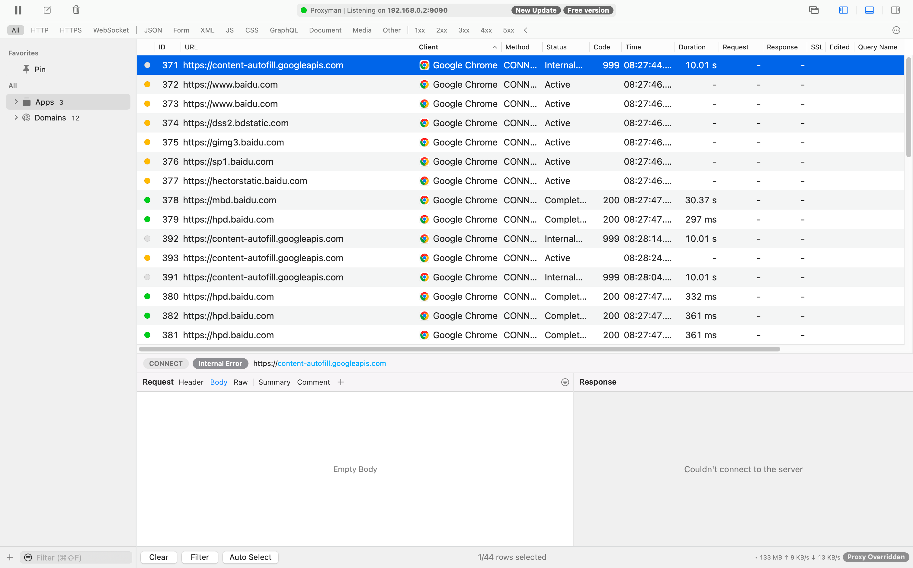
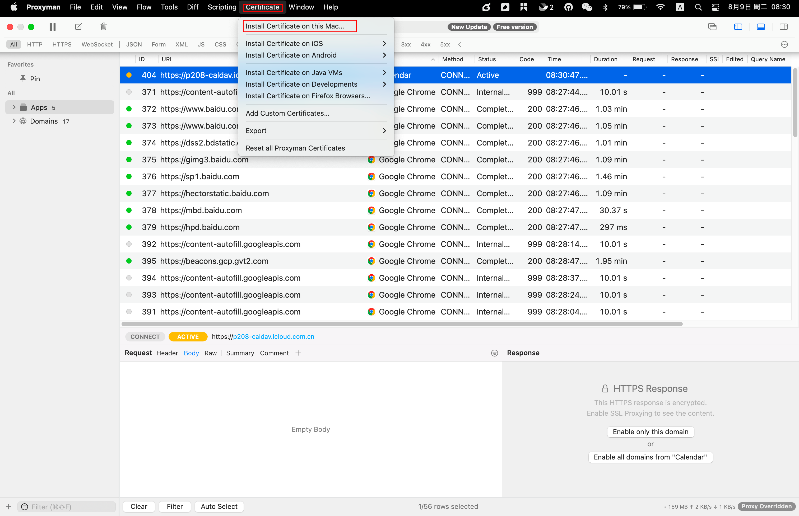
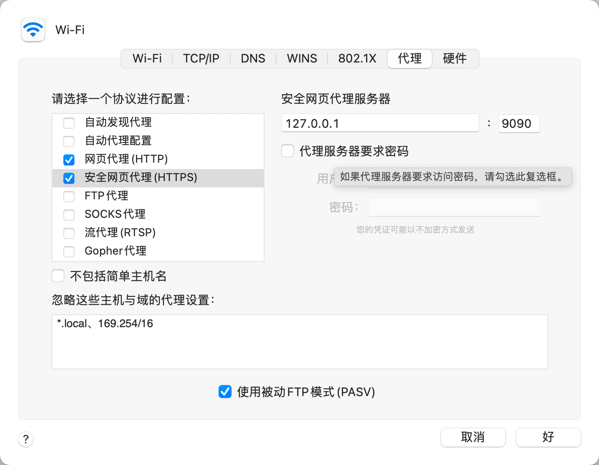
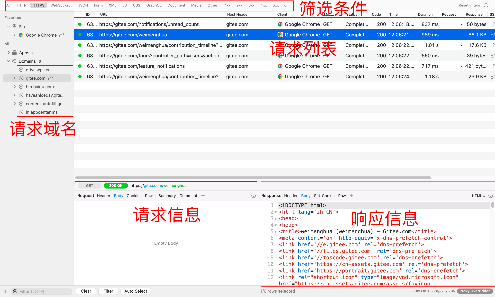

[TOC]

<h1 align="center">抓包测试</h1>

> By：weimenghua  
> Date：2023.05.29  
> Description：抓包测试  

@todo：手机 抓包
## 一、Proxyman 抓包
### 1、Proxyman 简介
Proxyman 是一个原生的高性能 macOS 端的抓包工具，它使开发或测试人员能够轻松地捕获、检查和操作 HTTP 或HTTPS 请求/响应。

### 2、Proxyman 安装

**1、安装 Proxyman**  
首先从[官网](https://proxyman.io/)下载并安装。
双击并打开 Proxyman，界面如下：

**2、安装证书**  
根据 Mac，iOS，Android 等不同平台安装证书：
举例：Certificate >Install Certificate on this Mac...

**3、配置代理**  
系统偏好设置 > 网络 > 高级 > 代理 进行代理配置：127.0.0.1: 9090。
Proxyman 默认的端口是9090，可以根据实际需要抓包的协议进行配置，如：HTTP 和HTTPS。

### 3、Proxyman 使用
主要分为5大块，可以看到页面非常清爽。
1. 筛选条件：过滤条件。
2. 请求域名：可以点击域名进行筛选。
3. 请求列表
4. 请求信息
5. 响应信息

